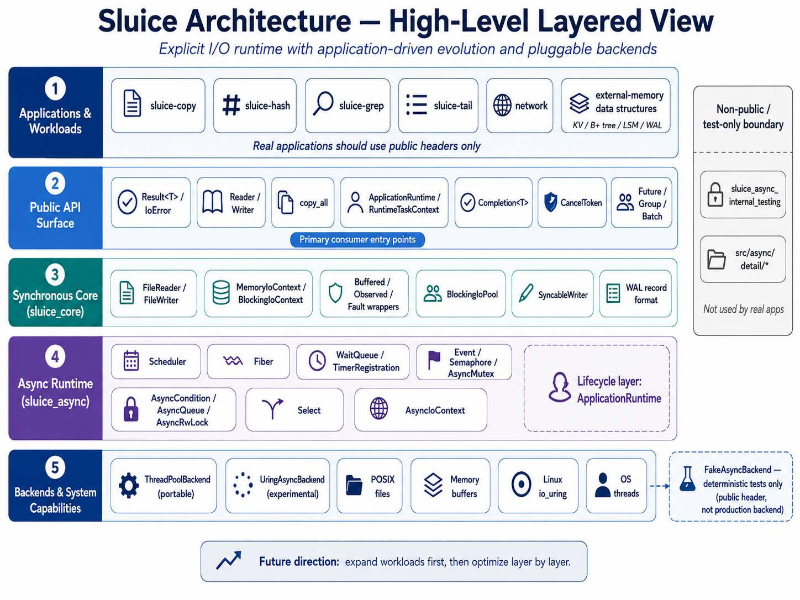

# Sluice

Sluice is an experimental C++20 explicit-I/O runtime: application code states
**what** I/O it wants through backend-neutral public APIs, and pluggable
backends decide **how** each operation executes.

[中文说明](README.zh-CN.md)



*In the diagram, `network` and `external-memory data structures` are future
workload directions, not implemented capability. `ThreadPoolBackend (portable)`
describes its `std::thread` / no-liburing implementation strategy, not completed
cross-platform validation — see [Project status](#project-status).*

## What is Sluice?

Two C++20 libraries built around one idea: application I/O intent should not
be coupled to backend execution.

- **`sluice_core`** — the synchronous core. `Result<T>` / `IoError` error
  model, `Reader` / `Writer` interfaces with buffered, fault-injecting, and
  observing wrappers, `copy_all`, POSIX file and positional I/O, durability
  (`sync_data` / `sync_all`), a WAL record format, and the bounded
  `BlockingIoPool` helper.
- **`sluice_async`** — the opt-in async runtime. An M:N fiber `Scheduler`,
  cooperative synchronization primitives (`Event`, `Semaphore`, `AsyncMutex`,
  `AsyncCondition`, `AsyncQueue`, `AsyncRwLock`, `Select`), cancellation
  primitives, `Future` / `Group` / `Batch`, and the explicit-I/O layer:
  caller-owned `Completion<T>` operations, `ThreadPoolBackend`, and the
  `ApplicationRuntime` lifecycle layer.

I/O failures are represented as values (`Result<T>` / `IoError`) rather than
being reported through the I/O API as exceptions. Ordinary C++ exceptions
from value construction, allocation, or user code remain ordinary C++
exceptions. The design is inspired by Zig's `std.Io`, adapted to C++20 idioms
— it is not a port.

## Why explicit I/O?

```text
Application code expresses I/O intent
        ↓
Public Sluice API owns the operation semantics
        ↓
The backend decides how the operation executes
```

- **Backend-neutral surface** — replacing `ThreadPoolBackend` with another
  compatible backend does not require rewriting the operation-level application
  logic.
- **Explicit operations** — reads, writes, and syncs are positional op
  descriptors submitted through public APIs.
- **Explicit results** — every operation resolves to a caller-owned
  `Completion<T>` / `Result<T>`; I/O failure is a value you handle.
- **Caller-owned buffers** — buffers and Completions stay alive and
  address-stable for the documented request lifetime.
- **Cooperative cancellation** — cancellation is explicit and cooperative; a
  real syscall result is never rewritten into "canceled".
- **Bounded resources** — request capacity, worker counts, and queue depths
  are explicit bounds, not accidental growth.

The same ask-versus-execute split drives testing: `MemoryIoContext` and
`FakeAsyncBackend` give deterministic in-memory and fault-injection tests
without a filesystem or a mock framework.

## Quick start

Current validation is Linux/WSL-centric. You need
[xmake](https://xmake.io) and a C++20 compiler (Clang recommended). The
synchronous core is POSIX-oriented and contains macOS-compatible code paths,
but broader non-Linux portability evidence is still incomplete.

```bash
git clone https://github.com/jnhu76/Sluice.git
cd Sluice
xmake f -m release -y
xmake build sluice-copy        # or: sluice-hash, sluice-grep, sluice-tail
```

### Synchronous core

```cpp
// In-memory round trip: no filesystem, no setup.
#include <sluice/memory_io_context.hpp>
#include <sluice/copy.hpp>

#include <cstddef>
#include <cstdio>
#include <string_view>
#include <vector>

std::vector<std::byte> to_bytes(std::string_view s) {
    const auto* p = reinterpret_cast<const std::byte*>(s.data());
    return {p, p + s.size()};
}

int main() {
    sluice::MemoryIoContext ctx;
    ctx.seed("input.txt", to_bytes("hello world"));

    auto r = ctx.open_reader("input.txt");
    auto w = ctx.open_writer("output.txt");
    if (!r.has_value() || !w.has_value()) return 1;

    auto copied = sluice::copy_all(*r.value(), *w.value());
    if (!copied.has_value()) return 2;

    auto bytes = static_cast<sluice::MemoryWriter&>(*w.value()).take();
    std::printf("copied %llu bytes: %.*s\n",
                static_cast<unsigned long long>(copied.value()),
                int(bytes.size()),
                reinterpret_cast<const char*>(bytes.data()));
}
```

### Asynchronous runtime

```cpp
// A runtime task writes a file through the real backend, then clean shutdown.
#include <sluice/async/application_runtime.hpp>
#include <sluice/async/threadpool_backend.hpp>

#include <fcntl.h>
#include <unistd.h>

#include <cstddef>
#include <cstdio>
#include <memory>

int main() {
    using namespace sluice::async;

    RuntimeBuilder builder;
    builder.backend(std::make_unique<ThreadPoolBackend>()).workers(1);
    auto built = builder.build();
    if (!built.has_value()) return 1;
    ApplicationRuntime& rt = *built.value();

    if (!rt.start().has_value()) return 2;

    int fd = ::open("/tmp/sluice-quickstart.txt",
                    O_WRONLY | O_CREAT | O_TRUNC, 0644);
    if (fd < 0) {
        (void)rt.shutdown();
        return 3;
    }

    auto task = rt.submit([fd](RuntimeTaskContext& ctx) {
        static constexpr char msg[] = "hello explicit I/O\n";
        Completion<std::size_t> done;
        if (!ctx.submit_write(WriteOp{fd,
                                      reinterpret_cast<const std::byte*>(msg),
                                      sizeof msg - 1, /*offset=*/0},
                              done)
                 .has_value())
            return;
        (void)ctx.await_completion(done);  // task suspends until the op is ready
        auto n = done.result();            // Result<std::size_t>: I/O errors are values
        if (n.has_value()) std::printf("wrote %zu bytes\n", n.value());
    });
    if (!task.has_value()) {
        ::close(fd);
        (void)rt.shutdown();
        return 4;
    }

    rt.request_stop();
    auto drained = rt.drain();
    if (!drained.has_value()) {
        (void)rt.shutdown();
        ::close(fd);
        return 5;
    }

    auto joined = rt.join();
    ::close(fd);
    if (!joined.has_value()) return 6;
    return 0;
}
```

More runnable programs under [examples/](examples/) — for example
`examples/runtime_acceptance.cpp` exercises the full runtime lifecycle against
public headers only.

## What you can build today

Real applications, built only on Sluice public headers (no test seams, no
private source includes):

- [`sluice-copy`](apps/sluice-copy/README.md) — bounded asynchronous safe file
  copy (temp file + atomic rename, optional durability)
- [`sluice-hash`](apps/sluice-hash/README.md) — bounded streaming SHA-256
- [`sluice-grep`](apps/sluice-grep/README.md) — bounded streaming literal search
- [`sluice-tail`](apps/sluice-tail/README.md) — backward last-N scan + follow
  mode with clean Ctrl-C cancellation

The application track includes measured performance, memory bounds, sanitizer
evidence, and comparisons with system tools — see
[docs/applications/file-tools-findings.md](docs/applications/file-tools-findings.md).

## Backends

- `ThreadPoolBackend` — the default real backend: a fixed pool of persistent
  blocking-I/O workers implemented with `std::thread`; it has no liburing
  dependency.
- `UringAsyncBackend` — experimental Linux io_uring; build-gated behind
  `--with-liburing`, off by default.
- `FakeAsyncBackend` — a deterministic testing backend for exact, scripted
  completion behavior.

Backend internals, conformance evidence, and the io_uring runbook live under
[docs/architecture/](docs/architecture/) and [docs/verification/](docs/verification/).

## Project status

- **Reference baseline:** `v0.0.1` — the explicit-I/O product surface frozen
  for the six-domain audit campaign: synchronous core, async scheduler and
  fiber runtime, synchronization primitives, the backend set, and the first
  real applications (copy / hash / grep / tail). See #227.
- **Development continues on master** beyond the tag — see the
  [roadmap](docs/roadmap/README.md).
- **Experimental:** `UringAsyncBackend` — real-liburing validation evidence
  remains environment-dependent.
- **Not implemented:** networking and external-memory data structures
  (KV / B+ tree / LSM). They are future workload directions — evidence
  generators for API pressure, not current capability — see
  [docs/applications/README.md](docs/applications/README.md).

Sluice is research-quality experimental software: platform support is
Linux-centric (x86_64 for the fiber scheduler), and no performance claims are
made beyond the measured application evidence.

## Documentation

- [Developer documentation hub](docs/README.md) — how Sluice works and how to
  change it
- [Architecture overview](docs/architecture/overview.md)
- [API reference (canonical, English)](docs/reference/api.md)
- [Reference index](docs/reference/README.md) — includes the Chinese companion
  reference and its synchronization rules
- [Applications: what real workloads taught us](docs/applications/README.md)
- [Verification matrix](docs/verification/README.md) — sanitizers,
  deterministic causal tests, formal models
- [Roadmap](docs/roadmap/README.md) · [Changelog](docs/changelog.md)

## License

Sluice is licensed under the [MIT License](LICENSE).
