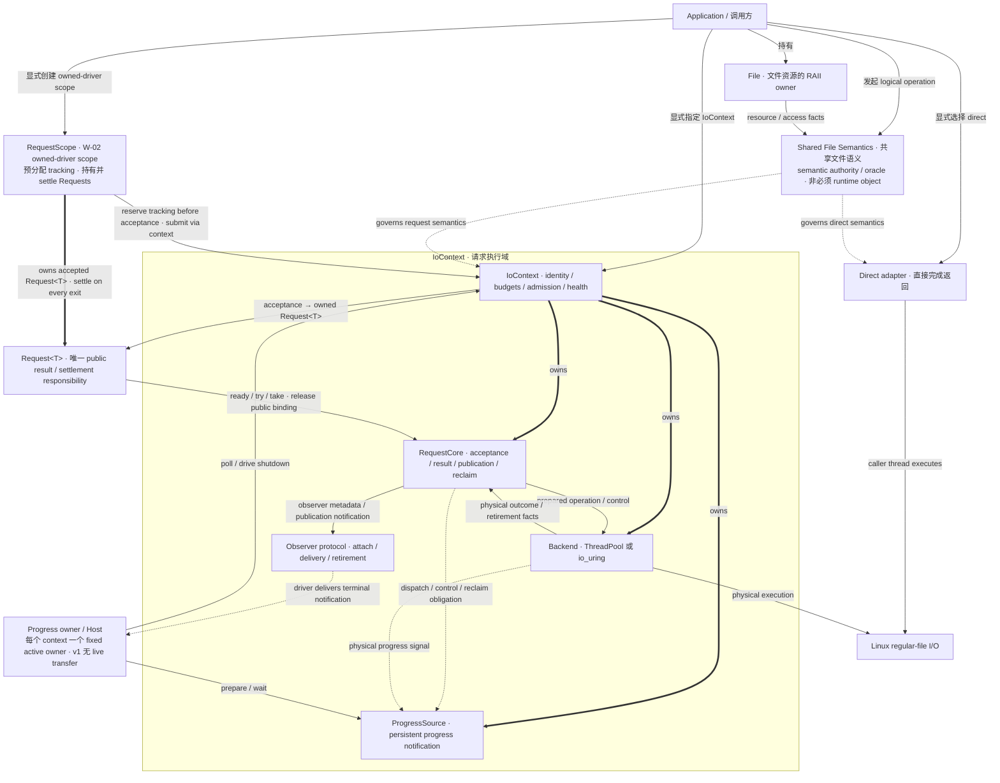

# Sluice

Sluice is a C++20 explicit file-I/O library, converging toward one File contract,
explicit direct/request execution, and optional I/O control-flow hosts.

[中文说明](README.zh-CN.md)

## Design authority

**[Sluice v1 Architecture and Contract Reference](docs/explicit-io-v1-final-decision.md)**
is the sole normative root for the v1 target. It defines the vocabulary, File
semantics, invocation forms, request and observer lifetime, progress, shutdown,
threading, resource bounds and acceptance criteria.

ADRs derive implementation choices from its requirement IDs. Code establishes
current behavior; tests and models establish scoped evidence. None independently
changes the target contract.

- [v1 conformance ledger](docs/roadmap/v1-conformance.md) — implementation gaps,
  phase gates and evidence; adopting the specification does not certify the code.
- [AGENTS.md](AGENTS.md) — repository working rules.
- [Current-code architecture snapshot](docs/architecture.md) — dated historical
  implementation view, not a v1 target diagram.
- [Retained research conclusions](research/RESULTS.md) — rationale and evidence.

The principles remain: minimal necessary semantics, clear boundaries, explicit
authority, named bounds, replaceable execution and minimum justified mechanism.

## Target architecture

A canonical `File` owns the native resource and access facts. Shared operation
semantics apply to direct completed-return calls, explicit outstanding requests,
and supported host-completed calls.

Direct execution needs no request table or runtime. An explicit `IoContext`
owns a bounded RequestCore, backend and progress source; a move-only Request
represents outstanding responsibility. Scheduler/Fiber, when supported, is an
optional host above that core. Backend code does not route Scheduler waiters.

Request publication, result consumption and slot reclamation are separate.
Wait cancellation does not end a buffer borrow. Execution shutdown retains
unconsumed results, and context destruction requires public bindings to be gone.
See the root specification for the complete contracts and Linux v1 scope.

The diagram below is an informative view of the adopted v1-r3 architecture. It
mirrors `ARCH-01` / `ARCH-02` / `HOST-02` / `PROG`; if wording here ever differs
from the root specification, the root specification wins.



## Current implementation and convergence

The retained baseline contains canonical File/blocking operations, caller-owned
Completion APIs, AsyncIoContext, ThreadPool/io_uring backends and runtime machinery.
Those existing components do not by themselves satisfy the new target. Migration
and evidence follow phases A–G in the root and the new conformance ledger.

The previous mission, ADR-0001/0002, visual companion and
[old conformance roadmap](docs/roadmap/explicit-file-conformance.md) are superseded
as v1 authorities. Their earlier CLOSED/CONFORMANT claims apply only to the
baselines and contracts they originally examined.

## Applications

- [sluice-copy](apps/sluice-copy/README.md)
- [sluice-hash](apps/sluice-hash/README.md)
- [sluice-grep](apps/sluice-grep/README.md)
- [sluice-tail](apps/sluice-tail/README.md)

## Build

Sluice uses [Xmake](https://xmake.io) and requires a C++20 compiler.

```bash
git clone https://github.com/jnhu76/Sluice.git
cd Sluice
xmake f -m release -y
xmake
```

`xmake.lua` and `xmake/` define the targets that currently exist. A successful
build is not evidence that every v1 target configuration has been implemented.

## License

Sluice is licensed under the [MIT License](LICENSE).
