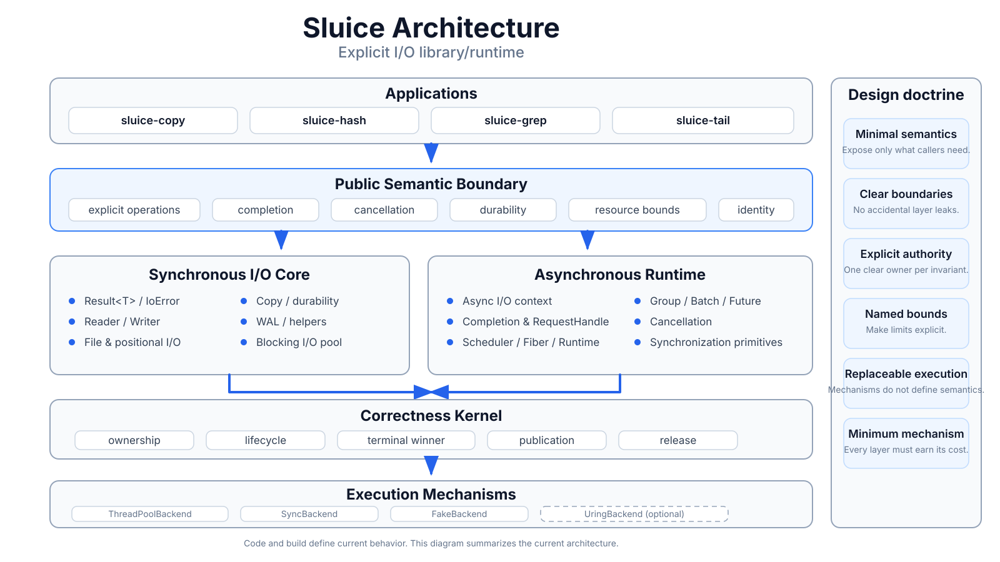

# Sluice

Sluice 是一个 C++20 显式 I/O library/runtime。

它的目标是：**只暴露保持可观察 I/O 语义、正确性与真实资源边界所必需的信息；语义授权必须显式，执行机制与执行策略保持局部、可替换，并且只保留已经证明有价值的机制。**

[English](README.md)

## 项目宗旨

Sluice 的长期原则来自现有研究结论：

> **语义最少，边界清晰，权威显式，资源有界，执行可换，机制最小。**

```text
Minimal semantics.
Clear boundaries.
Explicit authority.
Named bounds.
Replaceable execution.
Minimum mechanism.
```

- [`docs/mission.md`](docs/mission.md) —— 冻结的规范性项目宗旨。
- [`docs/adr/0001-explicit-io-design-doctrine.md`](docs/adr/0001-explicit-io-design-doctrine.md) —— 研究结论支持的显式 I/O 设计准则。
- [`docs/adr/0002-explicit-file-api-architecture.md`](docs/adr/0002-explicit-file-api-architecture.md) —— 冻结 File-centric API 语义与可替换 execution 架构；当前实现如何处置等待审计。
- [`research/RESULTS.md`](research/RESULTS.md) —— 当前保留的研究证据与结论。

## 架构一览

<p align="center">
  
</p>

这张图只负责压缩展示当前实现形态。当前代码“现在是什么”以代码与构建定义为准；项目“应该遵守什么边界”以 mission 与 ADR 为准。特别地，当前 `sluice_core` / `sluice_async` 的 build 拆分不再被解释为两套长期独立的 I/O 语义；ADR-0002 冻结共享的 Explicit File contract，并把 Blocking / ThreadPool / io_uring 定义为可替换 execution。

## 研究已经冻结的设计护栏

现有研究不支持“更多显式信息自然带来更多 generic control / specialization / performance”的项目级假设。

长期保持：

```text
resource identity != fixed-resource optimization authority
operation grouping != fused / atomic admission authority
backend capability != semantic authority
hint / information != authority
```

Copy 研究表明，显式 composed operation 可以成为合法 transformation boundary，但一个 thin local branch 已足以表达得到证明的能力，generic capability framework 没有被赚到。

Batch 研究表明，知道 operations 属于同一 Batch 不等于获得 group-admission authority。

性能研究同样要求把 semantic contract 与 execution policy 分开：alignment、chunk size、queue depth、worker count、backend mechanism 等可以显著影响性能，但不能因为 benchmark 结果就自动升级成 public semantics。

## 当前实现

当前代码包含同步 I/O core 和可选异步 runtime。

这只是当前实现与构建形态的描述，不代表长期语义上存在两个独立 I/O 世界。ADR-0002 规定的目标是：File resource/state 与 canonical file-operation semantics 共享，而 Blocking、ThreadPool、io_uring 是可替换 execution；它们不同的阻塞、outstanding lifetime、cancellation 与资源成本仍必须保持显式。

同步部分提供 `Result<T>` / `IoError`、Reader/Writer 风格 I/O、文件与 positional I/O、copy helper、durability 操作及相关工具。

异步部分包含显式 operation、caller-owned completion、有界 request state、scheduler/runtime、取消、同步设施和 backend execution。

这些实现细节将在后续架构审计中按以下类别重新判断：

```text
SEMANTIC_CONTRACT
CORRECTNESS_AUTHORITY
RESOURCE_BOUND
BACKEND_CAPABILITY
EXECUTION_POLICY
HINT / OBSERVATION
LEGACY / UNJUSTIFIED
```

一个 abstraction 是否继续存在，取决于它实际定义了什么语义、正确性、资源边界或真实执行价值，而不是“架构完整”。

## 应用

- [`sluice-copy`](apps/sluice-copy/README.md)
- [`sluice-hash`](apps/sluice-hash/README.md)
- [`sluice-grep`](apps/sluice-grep/README.md)
- [`sluice-tail`](apps/sluice-tail/README.md)

## 构建

Sluice 使用 [Xmake](https://xmake.io)，需要 C++20 编译器。

```bash
git clone https://github.com/jnhu76/Sluice.git
cd Sluice
xmake f -m release -y
xmake
```

当前可用 target 以 `xmake.lua` 和 `xmake/` 为准。

## 文档

- [`docs/mission.md`](docs/mission.md) —— 项目宗旨。
- [`docs/adr/0001-explicit-io-design-doctrine.md`](docs/adr/0001-explicit-io-design-doctrine.md) —— 研究结论对应的显式 I/O 设计准则。
- [`docs/adr/0002-explicit-file-api-architecture.md`](docs/adr/0002-explicit-file-api-architecture.md) —— 规范性的 File API 与 execution 架构；实现迁移等待基于 master 的审计。
- `docs/architecture.md` —— 从当前代码推导出的架构快照。
- [`research/RESULTS.md`](research/RESULTS.md) —— 保留的研究结论。

## License

Sluice 使用 [MIT License](LICENSE)。
