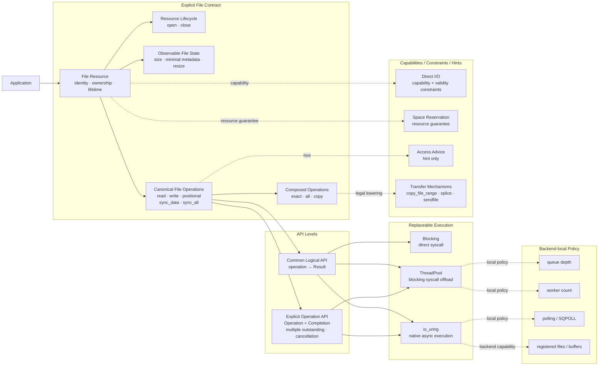
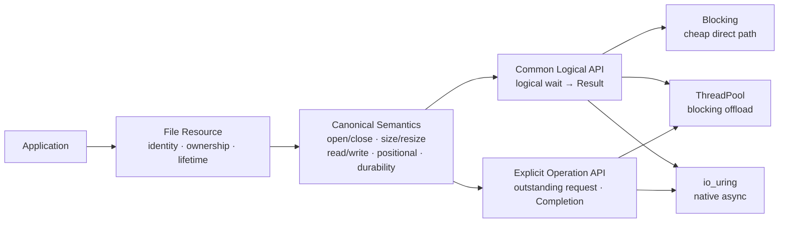
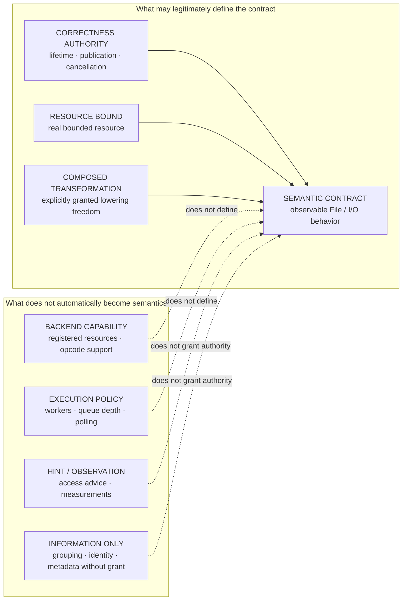

# ADR-0002 Visual Companion — Explicit File Architecture Views

- **Status**: Visual companion to [`0002-explicit-file-api-architecture.md`](0002-explicit-file-api-architecture.md)
- **Authority**: No new decision. If this file ever conflicts with ADR-0002 text, ADR-0002 wins.
- **Purpose**: Keep one complete architecture map and add two reduced views that make the same normative structure easier to read on GitHub.

The three diagrams are intentionally redundant:

1. **All-in-one** — complete relationship map;
2. **Semantic spine** — the main File → Operation → API → Execution chain;
3. **Boundary discipline** — what may inform implementation but must not silently become semantic authority.

---

## View A — All-in-one architecture



Read this diagram as five responsibility bands:

> **File contract → API level → execution**, with capability/constraint/hint information beside the contract and backend-local policy beside execution.

The side bands may influence lowering and validation, but they do not redefine the canonical File semantics.

---

## View B — Semantic spine

This is the diagram to use when explaining what Sluice I/O *is*.



Normative reading:

```text
File is the resource root.
Operations own semantics.
API level owns initiation/lifetime visibility.
Execution owns mechanism.
```

Therefore:

```text
sync semantics != a separate I/O world
async semantics != raw-fd semantics
build target != semantic boundary
```

Blocking remains first-class and may take the shortest valid syscall path. The explicit-operation layer exists only when the caller truly needs outstanding-request authority, cancellation, request identity, completion ownership, or bounded admission.

---

## View C — Boundary discipline

This is the diagram to use when reviewing whether a new field, optimization, backend feature, or abstraction belongs in the public API.



The governing inequalities remain:

```text
resource identity != fixed-resource optimization authority
operation grouping != fused / atomic admission authority
backend capability != semantic authority
hint / information != authority
benchmark result != public semantic contract
```

Examples:

- `size` / `resize`: semantic File state;
- request capacity: named resource bound when saturation is caller-visible;
- Direct I/O alignment: capability + validity constraint, not a generic performance hint;
- `fadvise`: hint only;
- registered files / buffers and SQPOLL: backend capability / execution policy;
- `copy_file_range` / `splice` / `sendfile`: possible lowering mechanisms beneath an explicit Copy transformation boundary, not automatically public primitive operations.

---

## Review rule

When a proposed Sluice concept cannot be placed cleanly on one of these three views, do not create a generic framework to make it fit.

Instead ask:

1. What observable behavior does it define?
2. What correctness authority does it own?
3. What real bounded resource does it name?
4. What transformation does it explicitly authorize?
5. Or is it merely capability, policy, hint, or information?

If none of the first four answers is supported, the concept has not earned Core/public semantic status.
