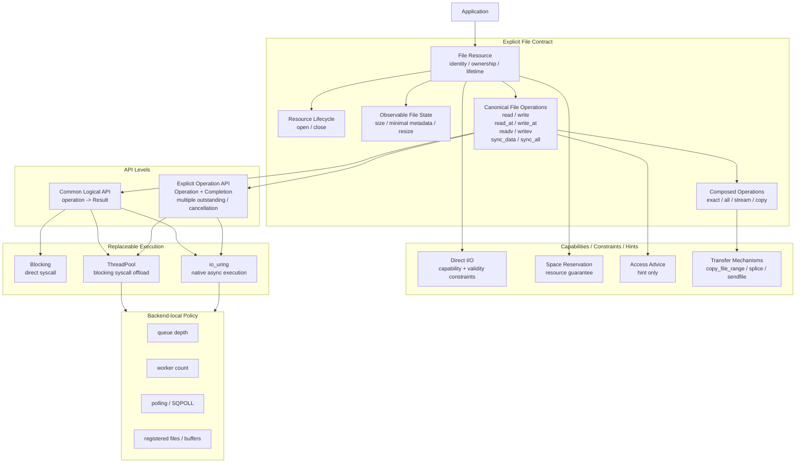

# ADR-0002：Explicit File API 与执行架构

- **状态**：Accepted / Architecture Frozen
- **范围**：Sluice 的文件 I/O 公共语义、API 分层与执行模型
- **基线**：`master`（本 ADR 起草时为 `baa6c91ce240b0890bfb3e6c12e917ba619be700`）
- **上位约束**：[`0001-explicit-io-design-doctrine.md`](0001-explicit-io-design-doctrine.md)、[`../mission.md`](../mission.md)
- **实现处置**：Pending master-based architecture-gap audit

## Context

Sluice 当前实现历史上形成了两个近乎独立的文件 I/O 世界：

1. 同步 core 以 `Reader` / `Writer` / `FileReader` / `FileWriter` / `IoContext` 表达同步文件与字节流 I/O；
2. async runtime 以 `ReadOp` / `WriteOp` / `SyncDataOp` / `SyncAllOp`、`Completion`、`AsyncIoContext` 与 backend 表达异步 operation lifecycle。

两者共享 `Result<T>` / `IoError`，但没有共享统一的 File resource contract。同步侧已经拥有 sequential、positional、vectored 与 durability 能力；异步侧则围绕裸 `fd + buffer + length + offset` 建立 admission / completion / cancellation / bounded-request machinery。

应用层仍直接使用部分 POSIX 文件生命周期、metadata 与 namespace 操作，因此当前实现更接近：

```text
sync utility surface
+
async request runtime
+
application POSIX escape
```

而不是统一的 Explicit File architecture。

ADR-0001 已经冻结：

- resource identity / lifetime 可以是必要 semantic fact；
- Read / Write / durability 等 observable I/O effect 可以进入 semantic contract；
- accepted / completion / cancellation / deadline / reuse 等 async semantics 必须在需要时显式；
- real resource bounds 必须命名；
- backend capability、execution policy、hint 不得反向定义公共语义；
- execution 必须可替换；
- generalized framework 必须由证据赚到。

本 ADR 不扩大这些原则，而是把它们落实为一个明确的 File-centric API architecture。

---

## Decision

Sluice 的 canonical 文件 I/O 架构冻结为：

> **File 是资源与文件语义的根；open/close、observable file state、read/write/positioned/vector/durability 是围绕 File 的 canonical semantics；Blocking、ThreadPool 与 io_uring 是这些语义的可替换 execution，而不是三套不同的 I/O contract。**

同步与异步共享：

```text
resource model
operation semantics
error semantics
short-I/O / EOF semantics
durability semantics
```

但不强行共享会隐藏以下事实的 initiation syntax：

```text
will this call block the current thread?
does it create an outstanding request?
how long must File/buffer stay alive?
is cancellation meaningful?
which bounded resource is consumed?
```

因此固定：

> **共享 operation semantics，不隐藏 execution semantics。**

Sluice 继续遵守：

> **语义最少，边界清晰，权威显式，资源有界，执行可换，机制最小。**

---

## 1. Normative architecture



该图是 **normative architecture**。

后续 C++ 类型名、namespace、文件布局与 build target 可以变化，但 responsibility boundary 不得倒置。

特别地：

```text
build artifact != semantic world
backend capability != public semantic authority
```

---

## 2. File 是 canonical resource root

Sluice 不再把“同步 File”与“异步 fd”视为两个独立资源模型。

规范关系：

```text
File Resource
    -> identity
    -> ownership
    -> lifetime
    -> access capability
    -> observable state
    -> legal operations
```

`File` 的具体 C++ 名称仍可由实现设计决定，但 **semantic owner 已冻结**。

### 2.1 Naked OS fd 不是 canonical public resource contract

底层 backend 当然可以使用 native fd。

但 public/canonical operation 不应只用：

```text
fd + raw pointer + length + offset
```

来表达文件资源身份。

原因不是为了面向对象，而是为了让以下事实拥有明确 owner：

- close authority；
- move / ownership；
- outstanding-operation lifetime；
- access capability；
- file-state operations；
- backend lowering。

如果保留 `native_handle()` escape hatch，它是 interop mechanism，不是 canonical File semantic API。

### 2.2 Access direction 不等于 resource identity

`readable` / `writable` / `read-write` 是 File 打开后的 access contract，不应天然产生两个彼此独立的 resource identity 类型。

因此当前 `FileReader` / `FileWriter` 的能力可以保留，但这两个 class 本身没有自动 survival right。

后续审计可以得到：

```text
KEEP
CONVERGE
REPLACE
```

但不能因为它们已经存在就预设结论。

---

## 3. Open / close 是 Resource Lifecycle semantics

### 3.1 Minimum open contract

Sluice 的最小 File-open 语义必须能够明确表达三个独立轴：

```text
Access
    read_only
    write_only
    read_write

Existence
    open_existing
    create_if_missing
    create_new

InitialContents
    preserve
    truncate
```

规范约束：

- `create_new`：目标已存在必须失败；
- `truncate`：是 caller-visible destructive semantic，不能隐藏在“打开 writer”的默认构造语义里；
- `truncate` 仅对可写 access 合法；
- 普通 `open_existing` 不应因为调用者想写就自动 truncate；
- backend 可以用不同 syscall/opcode 实现，但不能改变这些 observable semantics。

本 ADR **不**自动把以下项目纳入 minimum open contract：

```text
append
permission/mode surface
O_NOFOLLOW
O_SYNC / O_DSYNC
direct I/O
filesystem-specific flags
```

它们等待审计或独立 research evidence。

### 3.2 Close contract

`close` 是显式 resource-release operation，并且可以报告错误。

最低语义：

1. File ownership 只能被释放一次；
2. `close()` 返回后，该 File object 不再代表一个 open resource——无论底层 close 是否报告错误；
3. 不允许因为 close 错误而在同一 File object 上重复关闭一个可能已经被 OS 回收/复用的 native handle；
4. destructor 可以 best-effort close，但无法可靠向 caller 返回 close error；需要观察 close failure 的 caller 必须显式调用 `close()`。

本 ADR 不授权全局 handle registry 或 shared ownership framework。

---

## 4. File state 是 observable semantic surface

最低 File-state semantic surface 冻结为：

```text
size
resize
minimal metadata required for file/resource correctness
```

### 4.1 `size`

`size` 是 observable resource fact，不是 optimization hint。

### 4.2 `resize`

`resize(new_size)` 改变 observable file state，因此属于 semantic mutation，而不是 backend capability。

不同 execution 可以分别映射到 blocking syscall、ThreadPool offload、io_uring opcode；机制差异不得改变语义。

### 4.3 Minimal metadata only

Sluice 不冻结一个大而全的 `Metadata` framework。

允许进入 Core 的 metadata 必须由真实 correctness / File semantics 证明，例如：

```text
file kind / regular-file classification
same-file identity relation
size
```

permissions、timestamps、owner、filesystem detail 等不得因为 POSIX、Boost、Zig 存在就自动获得 Core 地位。

---

## 5. Canonical file operations

Sluice 的 file-data semantic vocabulary 冻结为：

```text
sequential read
sequential write

positional read
positional write

vectored read
vectored write

sync_data
sync_all
```

### 5.1 Sequential vs positional

二者是不同的 observable contract。

Sequential operation 可以依赖/推进 logical file position；positional operation 的 offset 是 operation semantics 的组成部分，并且不应通过隐藏的 seek+read/write 模拟出错误的 shared-offset behavior。

### 5.2 Short I/O / EOF

同一 canonical operation 在 Blocking / ThreadPool / io_uring execution 下必须共享同一 short-I/O 与 EOF contract。

Backend 不能重新定义：

```text
what zero bytes means
whether partial progress is returned
when EOF is an error for exact/all composition
```

### 5.3 Vectored I/O

Vectored I/O 是 canonical operation capability，不是“同步层专属性能 helper”。

如果后续审计保留 vectored semantics，则 async execution 必须被评价为：

```text
SUPPORTED
MISSING
OUT_OF_SCOPE
```

不能长期把 sync vector 与 async scalar 当成两套独立 semantic worlds。

### 5.4 Durability

`sync_data` 与 `sync_all` 是 caller-visible durability semantics。

实现可以是：

```text
fdatasync / fsync
ThreadPool offload
io_uring fsync
```

但机制不得改变 contract。

per-operation durability（例如 `RWF_DSYNC` / `RWF_SYNC`）尚未在本 ADR 中获得 public authorization。

---

## 6. Two API levels

Sluice 允许两个 API 层次，但两者必须服务于同一 canonical File semantics。

### 6.1 Common logical API

普通 application 不应被迫管理：

```text
RequestArena
generation
Completion FSM
RequestHandle
backend wait source
```

Common API 的逻辑 contract 是：

> 发起一个明确 File operation，并在当前 execution model 下逻辑地等待其结果。

概念示意：

```cpp
Result<std::size_t> read(File&, Bytes);
Result<std::size_t> read_at(File&, uint64_t offset, Bytes);
Result<std::size_t> write(File&, ConstBytes);
Result<std::size_t> write_at(File&, uint64_t offset, ConstBytes);
Result<void> sync_data(File&);
Result<void> sync_all(File&);
```

这里冻结的是 **semantic shape**，不是最终 C++ spelling。

Blocking execution 可以直接 syscall。

Evented execution 可以：

```text
submit
-> suspend current task/fiber
-> completion
-> resume
-> return Result
```

因此 common logical API 不要求普通 caller 支付 explicit-request API 的概念成本。

### 6.2 Explicit Operation API

只有当 caller 真正需要以下 authority 时，才下降到低层 explicit-operation surface：

```text
multiple outstanding operations
explicit admission
explicit completion ownership
request identity
cancellation
pipeline
bounded request lifecycle
```

概念示意：

```cpp
Completion<std::size_t> c;
submit(ReadAt{file, offset, buffer}, c);
```

同样，这不是最终 C++ spelling。

低层 operation 的 **canonical resource reference 必须指向 File semantics**；backend 内部可以 lowering 为 native fd，但裸 fd 不再拥有 public semantic authority。

### 6.3 Common API 与 Explicit API 不得互相伪装

禁止：

```cpp
file.read(...); // runtime 静默猜测 direct blocking / pool / uring
```

如果这种猜测会改变：

- caller thread 是否 block；
- 是否建立 outstanding request；
- cancellation 是否存在；
- File / buffer lifetime；
- 是否消耗 bounded request capacity。

则 execution boundary 必须保持显式。

---

## 7. Lifetime contract

### 7.1 Common logical operation

对于一个逻辑上同步返回 `Result<T>` 的 common operation，File 与 buffer 必须至少存活到该调用返回。

如果 evented implementation 在内部 suspend/resume，这不能把额外手动 lifetime bookkeeping 泄漏给普通 caller。

### 7.2 Explicit outstanding operation

对于低层 explicit submit，在没有额外 pinning contract 之前：

> **caller 必须保证 File resource 与参与 I/O 的 buffer 在该 operation 完成并进入允许复用的状态前保持有效。**

如果未来要让 runtime 自动 pin File/buffer，则必须用独立 correctness / usability evidence 赚到该机制。

不得因为 async lifetime 困难就预先引入：

```text
shared_ptr<FileState>
global resource registry
universal handle manager
generic capability graph
```

---

## 8. Replaceable execution

规范模型：

```text
canonical file operation
        |
        +-- Blocking: direct syscall
        |
        +-- ThreadPool: blocking syscall offload
        |
        +-- io_uring: native async mechanism
```

### 8.1 Blocking 是 first-class execution

Blocking 不是 async runtime 的降级版。

普通 blocking operation 应允许最短合法路径，不要求经过：

```text
Completion
RequestArena
Scheduler
Fiber
```

这既符合 Minimum mechanism，也避免为低并发 workload 支付固定 async machinery 成本。

### 8.2 ThreadPool

ThreadPool 是执行 blocking syscall 的一种 offload mechanism。

以下默认属于 resource configuration / execution policy：

```text
worker count
dispatch strategy
queue depth
```

如果某个 capacity 饱和会形成 caller-visible admission result，则该独立 bound 必须被明确命名；但这不把所有性能参数升级成 public File semantics。

### 8.3 io_uring

io_uring 是 execution backend，不是 semantic authority。

```text
kernel opcode exists
    !=
Sluice public API must exist
```

只有 canonical semantic operation 已经被 Sluice 授权后，才讨论 io_uring 是否实现它。

### 8.4 Build artifacts != semantic worlds

`sluice_core` 与 `sluice_async` 可以继续作为不同 build targets。

但 link/build 模块化不拥有 semantic authority，不能再被解释成长期存在的：

```text
sync file semantics
vs
async file semantics
```

---

## 9. Async correctness authority remains explicit

本 ADR 不弱化 async runtime 中真正由 correctness 与 named bounds 赚到的事实。

如果 operation 以 outstanding async request 形式存在，则以下仍是合法 correctness/resource concerns：

```text
admission
request capacity
request identity / generation
terminalization
publication
cancellation
deadline
wait / wake
buffer lifetime
reuse
```

特别保持：

```text
backend terminalization
    !=
public completion publication
```

但是当前具体 machinery 并没有自动 survival right。

后续审计要分别判断：

```text
KEEP
CONVERGE
DELETE
```

---

## 10. Capability / constraint / hint boundaries

不得把以下能力塞进一个 generic `CapabilitySet` / `IoOptions` / planner framework。

每项必须单独赚钱。

### 10.1 Direct I/O

若采用 Direct I/O，它属于：

```text
FILE / BACKEND CAPABILITY
+
CALLER-VISIBLE VALIDITY CONSTRAINT
```

原因是它可能约束：

```text
buffer alignment
offset alignment
length alignment
```

Direct I/O 因此不是普通 hint。

如果 caller 请求 `direct_required`，实现不得静默回退 buffered I/O。

是否产品化 direct mode 与 alignment-query API，等待独立 audit/research。

### 10.2 Space reservation / preallocation

若采用，归类为：

```text
RESOURCE GUARANTEE / RESOURCE BOUND
```

而不只是性能 hint。

Public API 不应直接复制 `fallocate()` flags；只能从真实 resource contract 推导最小语义。

### 10.3 Access advice

sequential/random/will-need/dont-need 类信息只属于：

```text
HINT
```

Hint 不得授权改变 observable I/O semantics。

### 10.4 Registered files / buffers / polling

默认属于：

```text
BACKEND_CAPABILITY
EXECUTION_POLICY
```

包括：

```text
registered files
registered buffers
provided buffers
SQPOLL / polling mode
```

它们不进入 File semantic contract。

### 10.5 NOWAIT / HIPRI / per-op durability

本 ADR 不授权这些成为 generic flags surface。

每项需要分别证明：

```text
observable semantic value
resource value
backend support
application evidence
```

---

## 11. Composition and transformation boundaries

`read_exact` / `write_all` / stream / copy 属于 primitive operations 之上的 composition。

Composition 可以获得额外 transformation authority，但必须局部且由 contract 明确授予。

### 11.1 Copy

Copy 是已经被 ADR-0001 接受的有限正例。

当 Copy contract 允许时，implementation 可以局部选择：

```text
read/write loop
vectored I/O
copy_file_range
sendfile
splice
filesystem-specific fast path
```

这些 mechanism 不因此分别成为高层 public File operations。

继续保持：

> **thin local mechanism 足够时，不构造 generic capability framework。**

---

## 12. Semantic categories

后续每个 public/Core 概念必须首先归入：

```text
SEMANTIC_CONTRACT
CORRECTNESS_AUTHORITY
RESOURCE_BOUND
BACKEND_CAPABILITY
EXECUTION_POLICY
HINT / OBSERVATION
COMPOSED_TRANSFORMATION
```

不得由 class 位置、namespace、build target 或“已经写了很多代码”决定类别。

---

## 13. What this ADR deliberately does NOT decide

本 ADR 已冻结 File/API/execution architecture，但**故意不决定 master 中现有 abstraction 的最终命运**。

以下等待 master-based architecture-gap audit：

- `FileReader` / `FileWriter`：KEEP、CONVERGE 还是 REPLACE；
- `Reader` / `Writer` 是否继续作为 canonical byte-stream composition layer；
- `IoContext` 当前返回 `unique_ptr<Reader/Writer>` 是否发生 capability erasure；
- `BlockingIoContext` 是否仍有 owner；
- `BlockingIoPool` 是否拥有独立 execution owner，还是与 async ThreadPool 重复；
- `Buffered*` 是否有 product owner；
- `MemoryIoContext` / `Fault*` / `Observed*` 是 test/observation、public capability 还是无 owner；
- `WAL` 属于 Core、consumer/workload，还是应移出；
- `Batch` / `Future` / `Group` 哪些仍与 File I/O architecture 有关；
- current async `ReadOp` / `WriteOp` 如何从 raw fd representation 收敛到 canonical File resource；
- `RequestHandle` / stats / synthetic backend 等 surface 的最终处置；
- direct I/O / preallocation / fadvise / zero-copy / NOWAIT 等是否获得产品化证据；
- append、permission/mode、directory resource、rename/remove 等是否由真实 app correctness 赚到 Core 地位。

这些问题不能由本 ADR 偷偷预判。

---

## 14. Audit contract

后续审计必须从本 ADR 的 capability tree 出发，而不是从现有 class tree 出发。

最终 verdict 只允许：

```text
KEEP
CONVERGE
ADD_MINIMAL
DELETE
RESEARCH
OUT_OF_SCOPE
```

### KEEP

拥有明确 architecture owner，且当前 mechanism 已是足够小的实现。

### CONVERGE

能力正确，但存在：

```text
representation split
semantic duplication
authority duplication
wrong layer
```

### ADD_MINIMAL

本 ADR 明确需要但 master 缺失；只能增加满足 contract 的最小机制。

### DELETE

必须证明：

```text
no architecture owner
+
no correctness/resource authority
+
no legitimate product/test/build role
+
removal preserves retained contracts
```

零 consumer 单独不足以 DELETE。

### RESEARCH

可能有价值，但尚未获得 Core/public survival right。

### OUT_OF_SCOPE

即使 Zig / Boost / OS 支持，也不属于当前 Sluice。

禁止使用 `TECHNICAL_DEBT` 作为 architecture verdict。

---

## 15. Consistency with ADR-0001

本 ADR 是 ADR-0001 的具体化，不替代或削弱其约束。

| ADR-0001 | ADR-0002 |
| --- | --- |
| Minimal semantics | File surface 仅冻结 resource lifecycle、observable state、canonical I/O semantics 与必要 async facts |
| Clear boundaries | semantic / correctness / bound / capability / policy / hint 分层 |
| Explicit authority | File identity、group、hint 不自动授权 transformation |
| Named bounds | outstanding request/admission 等真实有限资源继续显式 |
| Replaceable execution | Blocking / ThreadPool / io_uring 实现同一 canonical File semantics |
| Minimum mechanism | 不预建 generic capability / lifetime / planner framework |

ADR-0001 关于 fixed-file、Copy、Batch 与 benchmark-to-API 的结论全部继续有效。

---

## 16. Consistency with mission.md

`mission.md` 已明确允许 Sluice 表达：

- observable I/O effect；
- resource identity / lifetime；
- buffer participation / lifetime；
- completion / cancellation / deadline；
- durability；
- real resource bounds；
- explicitly granted composition / transformation contract。

ADR-0002 的 File Resource、open/close、canonical operations、durability、async correctness 与 composition 均落在这些已冻结范围内。

同时继续保持：

```text
backend capability != semantic authority
execution policy != semantic core by default
hint / information != authority
```

因此本 ADR 不要求修改 mission。

---

## 17. Consistency with README / README.zh-CN

README 当前描述：

```text
current codebase contains a synchronous I/O core
and an opt-in asynchronous runtime
```

该描述是 current implementation/build shape，不是 normative semantic split。

本 ADR 明确：

> `sluice_core` / `sluice_async` 可以继续作为 build modules，但 long-term File semantics 由统一 Explicit File Contract 定义。

README 在本 ADR 分支只增加 ADR-0002 链接并澄清上述区别；不提前把尚未完成的 implementation migration 描述成现状。

---

## 18. Rejected alternatives

### A. 保持 sync core 与 async runtime 两套长期独立语义

拒绝。

它会造成 File state、vectored I/O、durability、lifetime 等能力漂移，并把 app POSIX escape 固化为第三套资源语义。

### B. 一个万能 API 静默选择 blocking / pool / io_uring

拒绝。

当 execution 选择改变 blocking、outstanding lifetime、cancellation、buffer lifetime 或 bounded-resource consumption 时，boundary 必须显式。

### C. 所有用户直接使用 Completion / RequestHandle

拒绝。

只有需要 explicit outstanding authority 的 caller 才应支付这层概念与机制成本。

### D. 复制 Zig / Boost 的完整 feature surface

拒绝。

外部库是设计证据与反例来源，不是 parity checklist。

### E. generic CapabilitySet / universal IoOptions / optimizer planner

拒绝。

它会提前支付 generalized framework 成本，并混淆 semantic / capability / policy / hint。

### F. 因 io_uring 有 opcode 就扩充 public API

拒绝。

Mechanism availability 不创建 semantic authority。

---

## Consequences

采用本 ADR 后：

1. Sluice 的文件 I/O architecture root 从“sync core + async runtime”提升为统一 **Explicit File Contract**；
2. `open/close/size/resize` 与 canonical data/durability operations 获得明确 semantic owner；
3. Blocking 与 async 不再拥有两套独立 File semantics；
4. Blocking 保持 first-class cheap execution path；
5. explicit Operation/Completion 保留为需要 outstanding authority 的低层 API，而不是强迫所有 caller 使用；
6. async correctness 与 named bounds 继续保留其独立价值；
7. current classes 与 current async machinery 都失去“因为存在所以必须活”的默认资格；
8. 后续审计优先寻找 `CONVERGE`，而不是追求删除 LOC 或 Zig/Boost feature parity；
9. Direct I/O、preallocation、advice、zero-copy、registered resources、polling 等必须继续单独赚钱；
10. implementation migration 必须小步、可逆、逐项证明。

---

## Follow-up gate

下一步只允许执行：

> **基于当前 `master` 的 IO architecture-gap audit。**

审计必须回答：

```text
符合 ADR-0001 + ADR-0002 的 Sluice 需要哪些最小能力？
master 已经正确拥有多少？
哪些应该 KEEP？
哪些应该 CONVERGE？
哪些必须 ADD_MINIMAL？
哪些没有 owner 应 DELETE？
哪些仍应 RESEARCH？
哪些明确 OUT_OF_SCOPE？
```

在审计报告完成并人工 review 前：

- 不因本 ADR 自动重写 public API；
- 不自动恢复测试；
- 不进行证明性删除；
- 不自动补齐 Zig / Boost feature；
- 不自动 wiring io_uring；
- 不 merge implementation changes。
