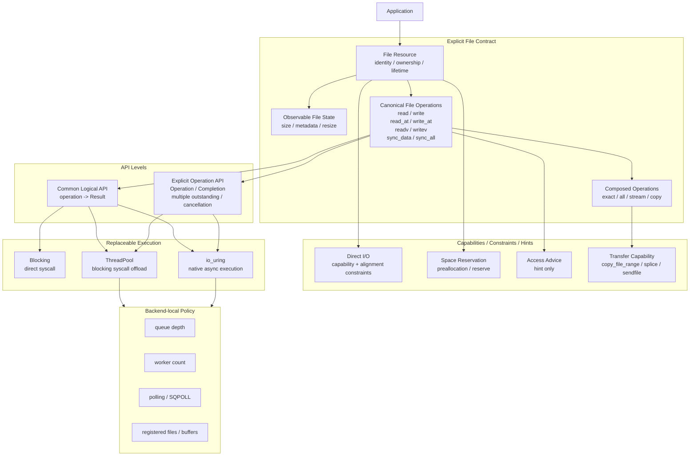

# ADR-0002：Explicit File API 与执行架构

- **状态**：Accepted / Architecture Frozen
- **范围**：Sluice 的文件 I/O 公共语义、API 分层与执行模型
- **基线**：`master`（本 ADR 起草时为 `baa6c91ce240b0890bfb3e6c12e917ba619be700`）
- **上位约束**：[`0001-explicit-io-design-doctrine.md`](0001-explicit-io-design-doctrine.md)、[`../mission.md`](../mission.md)
- **实现处置**：Pending architecture-gap audit

## Context

Sluice 当前实现历史上形成了两个近乎独立的文件 I/O 世界：

1. 同步 core 以 `Reader` / `Writer` / `FileReader` / `FileWriter` / `IoContext` 等抽象表达同步文件与字节流 I/O；
2. async runtime 以 `ReadOp` / `WriteOp` / `SyncDataOp` / `SyncAllOp`、`Completion`、`AsyncIoContext` 与 backend 表达异步 operation lifecycle。

这两个世界共享 `Result<T>` / `IoError`，但没有共享统一的 File resource contract。同步侧已经拥有 sequential、positional、vectored 与 durability 能力；异步侧则围绕裸 `fd + buffer + length + offset` 建立了更强的 admission / completion / cancellation / resource-bound machinery。

应用层又存在直接 POSIX 文件生命周期与 namespace 操作，因此当前实现更接近：

```text
sync utility surface
+
async request runtime
+
application POSIX escape
```

而不是一棵统一的 Explicit File architecture。

ADR-0001 已经冻结：

- resource identity / lifetime 可以是必要 semantic fact；
- Read / Write / durability 等 observable I/O effect 可以进入 semantic contract；
- accepted / completion / cancellation / deadline / reuse 等 async semantics 必须在需要时显式；
- real resource bounds 必须命名；
- backend capability、execution policy、hint 不得反向定义公共语义；
- execution 必须可替换；
- generalized framework 必须由证据赚到。

因此，本 ADR 不扩大 ADR-0001 的宗旨，而是把这些原则落实为一个具体的 File-centric API 架构。

## Decision

Sluice 的 canonical I/O 架构冻结为：

> **File 是资源与语义的根；read/write/positioned/vector/durability 等是围绕 File 的 canonical operations；Blocking、ThreadPool 与 io_uring 是这些 operation 的可替换 execution，而不是三套不同的 I/O 语义。**

同步与异步共享 **resource model 与 operation semantics**，但不强行共享会隐藏阻塞、outstanding lifetime、cancellation 或资源成本的调用形态。

Sluice 继续坚持：

> **语义最少，边界清晰，权威显式，资源有界，执行可换，机制最小。**

---

## 1. Canonical architecture



该图是 normative architecture。后续实现可以采用不同 C++ 类型名与文件布局，但不得违反图中 responsibility boundary。

---

## 2. File 是 canonical resource root

Sluice 不再把“同步 File”与“异步 fd”视为两个独立资源模型。

规范性关系是：

```text
File Resource
    -> identity
    -> ownership
    -> lifetime
    -> observable state
    -> legal operations
```

`File` 的具体 C++ 名称、内部表示、是否拆分轻量 handle/view，以及现有 `FileReader` / `FileWriter` 如何迁移，由后续审计决定；本 ADR 只冻结 semantic owner。

### 2.1 Resource identity

文件 operation 必须有明确 resource identity。

但：

```text
resource identity
    !=
fixed-file / registered-file optimization authority
```

File identity 只授权正确性与 resource/lifetime contract 所需行为；是否注册到 io_uring、是否缓存 native handle、是否使用 fixed-file table 属于 backend capability / execution policy。

### 2.2 Ownership 与 lifetime

File resource 必须能区分至少以下问题：

- 谁负责 close；
- move 后谁继续拥有 resource；
- operation outstanding 时 File 与 underlying resource 必须存活多久；
- borrowed/native handle 是否存在，以及它是否拥有 close authority。

本 ADR 不预先授权 `shared_ptr<FileState>`、global registry、handle manager 或其它通用 lifetime framework。

优先采用能够满足 contract 的最小机制。

### 2.3 Access direction 不等于 resource identity

`readable` / `writable` / `read-write` 是打开后的 capability / access contract，不应天然要求建立两个彼此独立的 resource identity 类型。

因此，当前 `FileReader` / `FileWriter` 的存在不自动成为未来 canonical model；它们的能力可能保留，而 representation 可以在审计后收敛。

---

## 3. File state 是 observable semantic surface

只有调用者必须观察或依赖的文件状态才进入 File semantic surface。

第一层 canonical candidates 为：

```text
size
minimal metadata required for resource/file correctness
resize
```

### 3.1 `size`

`size` 是 observable resource fact，而不是 optimization hint。

### 3.2 `resize`

`resize` 改变 observable file state，因此属于 semantic mutation，而不是 backend capability。

### 3.3 Metadata

不冻结一个“大而全 Metadata 对象”。

后续只允许按真实需求增加最小 metadata，例如：

- regular-file classification；
- file identity relation（若用于 same-file correctness）；
- size。

permission、timestamps、filesystem-specific metadata 等不得因为 POSIX / Zig / Boost 提供就自动进入 Core。

---

## 4. Canonical file operations

Sluice 的 file-data semantic vocabulary 以 operation 而不是 execution backend 为中心。

核心 operation 候选冻结为：

```text
sequential read
sequential write

positional read
positional write

vectored read
vectored write

sync_data
sync_all
```

后续审计必须判断哪些已经由 current master 正确实现，哪些 representation 应收敛，哪些 execution path 缺失。

### 4.1 Short I/O / EOF

Blocking、ThreadPool 与 io_uring 对同一 canonical operation 必须保持同一 observable short-I/O / EOF contract。

Backend 不能因机制不同重新定义 semantic result。

### 4.2 Positional I/O

Offset 是 positional operation 的语义组成部分，而不是 backend-specific field。

### 4.3 Vectored I/O

Vectored I/O 如果保留，是 canonical operation capability，而不是同步层专属优化。

是否为 async execution 补齐 readv/writev 必须由后续 capability audit 决定，但不得长期以“sync 有 vector、async 只有 scalar”作为两套不同语义体系来解释。

### 4.4 Durability

`sync_data` 与 `sync_all` 是 caller-visible durability contract。

具体使用 `fdatasync`、`fsync`、`IORING_OP_FSYNC` 或 worker offload 属于 execution mechanism。

per-operation durability（例如 `RWF_DSYNC` / `RWF_SYNC`）尚未获得 public semantic authorization，留给研究。

---

## 5. Sync 与 async：统一语义，不隐藏 execution

本 ADR 明确拒绝两种极端。

### 5.1 拒绝“两套 I/O 语义”

不再接受：

```text
sync File API
    与
async raw-fd API
```

长期各自独立演化。

Blocking、ThreadPool、io_uring 必须围绕同一 canonical File operation semantics。

### 5.2 拒绝“万能自动执行 API”

也不接受：

```cpp
file.read(...); // runtime 隐式猜测 blocking / pool / io_uring
```

如果这种 API 会隐藏：

- 是否可能阻塞调用线程；
- 是否建立 outstanding request；
- buffer 必须存活多久；
- 是否可 cancellation；
- 是否消耗有限 request capacity；

则它违反 Clear boundaries 与 Explicit authority。

因此：

> **共享 operation semantics，不强迫共享 initiation semantics。**

---

## 6. Two API levels

Sluice 允许两个不同层次的 API，但两者必须服务于同一 canonical operation contract。

### 6.1 Common logical API

普通 application 不应被迫直接管理 request state machine、generation 或 Completion。

Common API 的逻辑语义是：

> 发起一个明确的 file operation，并在当前 execution model 下逻辑地等待结果。

概念上：

```text
io.read_at(file, offset, buffer)
    -> Result<size_t>
```

具体 C++ spelling 由后续设计决定。

Blocking implementation 可以直接 syscall；evented execution 可以 submit + suspend current task + resume。

因此 common API 不能要求所有调用者承担 async runtime 的固定成本。

### 6.2 Explicit Operation API

当 caller 确实需要以下能力时，允许下降到低层 explicit-operation surface：

```text
multiple outstanding operations
explicit admission
explicit completion ownership
request identity
cancellation
pipeline
backend-visible bounded request lifecycle
```

此层可以包含 `Operation` / `Completion` 等概念。

但：

> 低层 explicit operation 的存在，不授权 generic control framework。

尤其现有 Batch 不因“operations 属于一个 group”而自动获得 fused / atomic admission authority；ADR-0001 的 Batch 限制继续有效。

---

## 7. Replaceable execution

execution 是 semantic contract 的实现维度。

目标模型：

```text
canonical file operation
        |
        +-- Blocking: direct syscall
        |
        +-- ThreadPool: blocking syscall offload
        |
        +-- io_uring: native async mechanism
```

### 7.1 Blocking 是 first-class execution

同步 blocking path 不是 async runtime 的降级版，也不是历史 fallback。

只要 workload 不需要 outstanding concurrency，Blocking execution 应允许最短、最低固定成本的合法路径。

因此，Sluice 不要求普通 blocking operation 经过 Completion、RequestArena、Scheduler 或 Fiber。

### 7.2 ThreadPool

ThreadPool 是执行 blocking syscall 的一种 async/offload mechanism。

worker count、dispatch strategy、queue depth 等默认属于 resource configuration / execution policy，而不是 File semantics。

### 7.3 io_uring

io_uring 是 execution backend，不是 semantic authority。

Linux 支持某个 opcode，不意味着 Sluice 必须新增对应 public API。

io_uring path 只有在 canonical operation 已被 Sluice 语义授权后，才需要回答 backend support。

### 7.4 Build artifacts != semantic worlds

`sluice_core` 与 `sluice_async` 可以继续作为独立 build targets。

但这种 link/build 拆分不得被解释为：

```text
core semantics
vs
async semantics
```

Build modularity 不拥有 semantic authority。

---

## 8. Capability / constraint / hint boundaries

以下能力不得混入一个 generic `IoOptions` / capability framework。

每项独立获得存在资格。

### 8.1 Direct I/O

Direct I/O 若被采用，归类为：

```text
BACKEND / FILE CAPABILITY
+
RESOURCE / VALIDITY CONSTRAINT
```

原因是 direct I/O 会引入 caller-visible alignment / legality constraints。

它不是普通 performance hint。

若 caller 要求 `direct_required`，implementation 不得静默降级为 buffered I/O。

是否公开 direct mode、alignment query、buffer abstraction，由后续 research/audit 决定。

### 8.2 Space reservation / preallocation

空间预留若被采用，归类为：

```text
RESOURCE GUARANTEE / RESOURCE BOUND
```

而不只是 performance optimization。

Public API 不应直接复制 `fallocate()` flags；只允许从真实 semantic/resource need 推导最小 contract。

### 8.3 Access advice

例如 sequential/random/will-need/dont-need 一类建议只能归类为：

```text
HINT
```

Hint 不得授权重排或改变 observable I/O semantics。

### 8.4 Registered files / buffers / SQPOLL

默认归类为：

```text
BACKEND_CAPABILITY / EXECUTION_POLICY
```

不进入 File semantic contract。

### 8.5 NOWAIT / HIPRI / per-op durability

这些能力不在本 ADR 中获得 public authorization。

后续必须分别研究其 observable semantic、resource value 与 backend availability，不能合并成 generic flags surface。

---

## 9. Composition and transformation boundaries

`read_exact` / `write_all` / stream / copy 属于 primitive operations 之上的 composition。

Composition 可以在明确 contract 下获得 transformation authority，但 authority 必须局部、具体。

### 9.1 Copy

Copy 可以成为合法 transformation boundary。

在 contract 允许时，implementation 可以选择：

```text
read/write loop
vectored I/O
copy_file_range
sendfile
splice
filesystem-specific fast path
```

但这些 mechanism 不应分别自动成为高层 File API。

ADR-0001 的结论继续适用：

> thin local mechanism 足够时，不构造 generic capability framework。

---

## 10. Async correctness authority remains explicit

本 ADR 不弱化 async runtime 已经需要的 correctness responsibilities。

如果 operation 以 outstanding async request 形式存在，则以下事实继续拥有明确 correctness authority：

```text
admission
request capacity
request identity / generation
terminalization
publication
cancellation
wait / wake
buffer lifetime
reuse
```

这些事实的价值来自正确性与真实 resource bounds，而不是“显式信息越多越好”。

特别保持：

```text
backend terminalization
    !=
public Completion publication
```

如果审计证明某些当前 mechanism 是实现这一 contract 的最小必要机制，则 KEEP；否则允许 CONVERGE / SIMPLIFY / DELETE。

---

## 11. API semantic categories

后续每个 public/Core 概念必须首先归入一个主要类别：

```text
SEMANTIC_CONTRACT
CORRECTNESS_AUTHORITY
RESOURCE_BOUND
BACKEND_CAPABILITY
EXECUTION_POLICY
HINT / OBSERVATION
COMPOSED_TRANSFORMATION
```

不得以 class 位置或 namespace 决定类别。

---

## 12. What this ADR does NOT decide

本 ADR 冻结 architecture 与 semantic ownership，但**故意不决定当前实现的最终命运**。

以下问题等待基于 `master` 的 architecture-gap audit：

- `FileReader` / `FileWriter` 是否保留、合并、重写或替代；
- `Reader` / `Writer` 是否继续作为 canonical byte-stream abstraction；
- `IoContext` 当前返回 `unique_ptr<Reader/Writer>` 的能力擦除是否需要重构；
- `BlockingIoContext` 是否保留；
- `BlockingIoPool` 是否拥有独立 architecture owner；
- `Buffered*` 是否有真实 product owner；
- `MemoryIoContext` / `Fault*` / `Observed*` 是否仅 test/observation 或应删除；
- `WAL` 是否属于 Core 或 workload/consumer；
- 当前 Batch / Future / Group 中哪些属于 File I/O architecture；
- async `ReadOp` / `WriteOp` 是否继续携带 raw fd，或应引用统一 File resource representation；
- `RequestHandle` / stats / synthetic backend 等现有 surface 的最终处置；
- direct I/O / preallocation / fadvise / zero-copy copy / NOWAIT 等是否获得产品化证据。

这些问题不得由本 ADR 的 architecture direction 偷偷预判。

---

## 13. Audit contract

后续 `master` 审计必须从本 ADR 的 capability tree 出发，而不是从现有 class tree 出发。

每个当前 abstraction 最终只能进入：

```text
KEEP
CONVERGE
ADD_MINIMAL
DELETE
RESEARCH
OUT_OF_SCOPE
```

其中：

### KEEP

拥有明确 architecture owner，且当前 mechanism 已足够小。

### CONVERGE

能力正确，但 representation split、semantic duplication、authority duplication 或 layer placement 错误。

### ADD_MINIMAL

架构明确要求而 master 缺失；只能增加满足 contract 的最小机制。

### DELETE

无 architecture owner、无 correctness/resource responsibility、无合法 product/test/build role，且删除不损失 retained contract。

### RESEARCH

潜在价值存在，但尚未获得 public/Core survival right。

### OUT_OF_SCOPE

外部库可能拥有，但当前 Sluice mission 不需要。

禁止使用 `TECHNICAL_DEBT` 作为 architecture verdict。

---

## 14. Consistency with ADR-0001

本 ADR 是 ADR-0001 的具体化，不替代或削弱其约束。

一致关系如下：

| ADR-0001 原则 | ADR-0002 落地 |
| --- | --- |
| Minimal semantics | File contract 只保留 observable state、canonical operations 与必要 lifetime/resource facts |
| Clear boundaries | File semantics / correctness / bounds / capability / policy / hint 分层 |
| Explicit authority | File identity、group、hint 不自动授予 transformation authority |
| Named bounds | async request/admission 等真实有限资源继续显式 |
| Replaceable execution | Blocking / ThreadPool / io_uring 实现同一 canonical operations |
| Minimum mechanism | 不预建 generic capability / lifetime / planner framework |

ADR-0001 中关于 Copy、Batch、fixed-file、benchmark-to-API 的限制全部继续有效。

---

## 15. Consistency with mission.md

`mission.md` 已明确允许 Sluice 表达：

- observable I/O effect；
- resource identity / lifetime；
- buffer participation / lifetime；
- completion / cancellation / deadline；
- durability；
- real resource bounds；
- explicitly granted composition / transformation contract。

本 ADR 的 File Resource、canonical operations、durability、async correctness 与 composition 均落在这些已冻结范围内。

本 ADR 同样保持：

```text
backend capability != semantic authority
execution policy != semantic core by default
hint / information != authority
```

因此无需修改 mission。

---

## 16. Consistency with README / README.zh-CN

README 当前描述：

```text
current codebase contains a synchronous I/O core
and an opt-in asynchronous runtime
```

该表述是 current implementation description，不是 normative semantic split。

本 ADR 明确：

> 当前 `sluice_core` / `sluice_async` build 结构可以继续存在，但未来 architecture audit 应以统一 File semantic contract + replaceable execution 来评价它们。

因此 README 当前描述与本 ADR 不冲突。

后续若 architecture audit 导致 public API 或 product description 实际变化，再单独更新 README；本 ADR 阶段不提前修改 current-implementation prose。

---

## 17. Rejected alternatives

### A. 保持 sync core 与 async runtime 两套长期独立语义

拒绝。

它会导致 File state、vectored I/O、durability、lifetime 等能力重复或漂移，并让 app POSIX escape 成为永久第三套资源语义。

### B. 把所有操作都塞进一个自动选择 backend 的 `File::read()`

拒绝。

如果 execution choice 会改变 blocking、outstanding lifetime、cancellation、buffer lifetime 或 resource consumption，就必须保持调用边界清晰。

### C. 所有用户都直接使用 Completion / RequestHandle

拒绝。

低层 explicit lifecycle 只应由需要其 authority 的 caller 支付概念与运行时成本。

### D. 复制 Zig / Boost 的完整 feature surface

拒绝。

它们是设计证据与反例来源，不是 Sluice 的 parity checklist。

### E. 用 generic CapabilitySet / IoOptions / Planner 统一所有差异

拒绝。

这会提前支付 generalized framework 成本，并混淆 semantic、capability、policy、hint。

### F. 因 io_uring 支持 opcode 就扩充 public API

拒绝。

Mechanism availability 不创建 semantic authority。

---

## Consequences

采用本 ADR 后：

1. Sluice 的 I/O architecture root 从“sync core + async runtime”提升为统一的 **Explicit File Contract**；
2. Blocking 与 async 不再拥有两套独立 file semantics；
3. Blocking 保持 first-class cheap execution path；
4. async correctness / named bounds 继续保留其独立价值；
5. current classes 失去“因为已经存在所以应该活”的默认资格；
6. 同样，current async machinery 也失去“因为复杂且已实现所以应该活”的默认资格；
7. 后续审计应优先发现 `CONVERGE`，而不是追求删除 LOC 或 feature parity；
8. 新能力必须按 semantic / correctness / resource / capability / policy / hint 单独赚钱；
9. Direct I/O、preallocation、advice、zero-copy、registered resources 等仍需独立 research evidence；
10. implementation migration 必须小步、可逆、逐项证明，不能借本 ADR 发起大重构。

## Follow-up gate

下一步只允许执行：

> **基于当前 `master` 的 IO architecture-gap audit。**

该审计应回答：

```text
符合 ADR-0001 + ADR-0002 的 Sluice 需要哪些最小能力？
master 已经正确拥有多少？
哪些应该 KEEP？
哪些应该 CONVERGE？
哪些必须 ADD_MINIMAL？
哪些没有 owner 应 DELETE？
哪些仍应 RESEARCH？
哪些明确 OUT_OF_SCOPE？
```

在审计报告完成并人工 review 前：

- 不因本 ADR 自动重写 public API；
- 不自动恢复测试；
- 不进行证明性删除；
- 不自动补齐 Zig / Boost feature；
- 不自动 wiring io_uring；
- 不 merge implementation changes。
