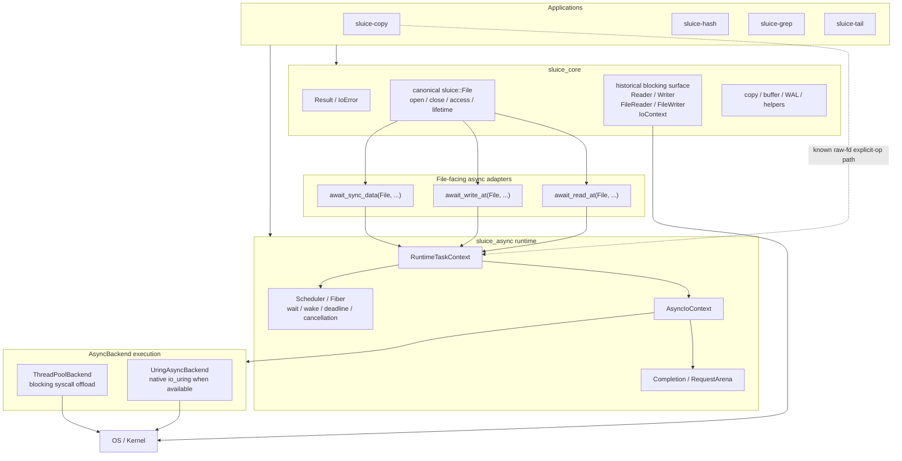

# Sluice 当前架构快照

- **Snapshot baseline**: `master @ d965abffeb3afbe83d5f1bb1ea896fc9b7e6e9a8`
- **Authority**: 本文只描述当前代码，不定义规范。规范性边界见 [`ADR-0001`](adr/0001-explicit-io-design-doctrine.md) 与 [`ADR-0002`](adr/0002-explicit-file-api-architecture.md)。
- **Conformance tracking**: [`docs/roadmap/explicit-file-conformance.md`](roadmap/explicit-file-conformance.md)。

如果本文与代码不一致，以代码为准；如果本文与 ADR 冲突，以 ADR 为准。

---

## 1. 当前系统不是“两套长期 I/O 语义”

仓库仍保留两个 build target：

```text
sluice_core
sluice_async
```

但这只是 build / implementation shape。

当前代码已经开始从历史上的：

```text
blocking Reader / Writer / FileReader / FileWriter
+
async raw fd + Operation + Completion
+
application POSIX escape
```

向 ADR-0002 冻结的统一模型收敛：

```text
canonical File resource
        ↓
canonical operation semantics
        ↓
explicit initiation / execution choice
        ↓
replaceable execution
```

`File` 不携带 blocking / async mode，也不选择 ThreadPool / io_uring backend。

---

## 2. 当前顶层图



这张图故意同时画出：

1. 已经成立的 canonical `File` spine；
2. 仍未完成收敛的 historical blocking surface；
3. app 中仍存在的 canonical-boundary bypass。

它们不能被一张“理想图”掩盖。

---

## 3. Canonical `File` resource

当前 `include/sluice/file_resource.hpp` 定义：

```text
FileAccess
    read_only
    write_only
    read_write

FileExistence
    open_existing
    create_if_missing
    create_new

FileInitialContents
    preserve
    truncate
```

`sluice::File` 当前拥有：

```text
native resource ownership
move-only lifetime
close authority
open / closed state
access contract
native_handle() interop escape
```

没有：

```text
blocking flag
async flag
backend pointer
worker count
queue policy
```

这与 ADR-0002 的责任边界一致。

### 3.1 当前已经 canonicalized 的 File-facing operations

`include/sluice/async/file.hpp` 当前提供：

```text
await_read_at
await_write_at
await_sync_data
```

三者都以 `File` 作为 public semantic resource，再通过既有 `RuntimeTaskContext` 提交到 async execution seam。

当前成立的 vertical slice：

```text
File::open
    ↓
await_read_at / await_write_at
    ↓
caller observes completion
    ↓
await_sync_data
    ↓
File::close
```

Read / Write / SyncData 的落地没有要求 Scheduler、Completion、RequestArena 获得 File semantic authority。

---

## 4. Blocking surface：机制存在，但 canonical convergence 尚未完成

`include/sluice/file.hpp` 仍存在历史 blocking resource classes：

```text
FileReader
FileWriter
```

它们目前各自持有 fd，并直接拥有：

```text
open / close
sequential read / write
positional read / write
vectored read / write
sync_data / sync_all
```

因此当前 blocking 世界的问题不是“缺少 syscall 能力”，而是：

> 同一批 File semantics 仍由第二套 resource owner 表达。

Roadmap 将其分类为 `CONVERGENCE_GAP`。

目标不是增加 `BlockingFile`，也不是给 `File` 增加 blocking mode；目标是让：

```text
File owns resource semantics
Blocking invocation owns blocking execution semantics
```

---

## 5. Async initiation 与 execution

当前 File-facing async adapter 使用：

```text
File
+ RuntimeTaskContext
+ caller-owned Completion<T>
```

因此当前 `await_*` surface 明确暴露了 evented / outstanding execution 成本；它不是一个会静默猜 execution 的万能 `file.read()`。

### 5.1 Runtime seam

当前主要链路：

```text
RuntimeTaskContext
    ↓
AsyncIoContext
    ↓
AsyncBackend
    ↓
Completion<T>
    ↓
Scheduler waiter / wake
    ↓
caller
```

runtime 负责的是：

```text
admission
request lifecycle
completion publication
wait / wake
cancellation relationship
deadline / scheduling
bounded outstanding state
```

runtime 不负责定义：

```text
what File is
whether a File operation is semantically legal
what SyncData means
which metadata durability belongs to SyncData
```

---

## 6. Execution backends

PR #334 删除 repository-provided synthetic `SyncBackend` / `FakeAsyncBackend` 后，当前生产 execution 只保留：

```text
ThreadPoolBackend
UringAsyncBackend
```

### 6.1 ThreadPoolBackend

它执行 blocking syscalls，但从 caller / runtime 的 execution model 看属于 async execution：

```text
caller submit
    ↓
outstanding request
    ↓
worker executes blocking syscall
    ↓
terminal / completion publication
```

所以：

```text
blocking syscall != Blocking execution model
```

### 6.2 UringAsyncBackend

io_uring 是 execution backend，不是 semantic authority。

有 liburing 时走真实 kernel async path；不可用构建必须诚实拒绝，不能伪造成功。

当前 roadmap 不把“全面启用/优化 io_uring”当成基础架构完成条件。

---

## 7. 当前 apps 与 canonical boundary

四个应用仍是架构真实性的重要 consumer：

```text
sluice-copy
sluice-hash
sluice-grep
sluice-tail
```

当前已知 `sluice-copy` pipeline 仍以：

```text
src_fd / dst_fd
    ↓
ReadOp / WriteOp / SyncDataOp / SyncAllOp
    ↓
RuntimeTaskContext
```

直接消费低层 async seam。

这不自动等于 bug：pipeline 可能确实需要 explicit outstanding authority。

但它必须被重新分类：

```text
required explicit-operation use
or
historical canonical-boundary bypass
```

因此 roadmap 要求先做全 apps consumer census，再逐个收敛，而不是一次性重写四个应用。

---

## 8. Tests 与 CI

当前仓库已经不是“无测试、无 CI”的旧基线。

`xmake/tests.lua` 当前登记四个 File 相关测试 target：

```text
file_resource_test
file_read_test
file_write_test
file_sync_data_test
```

这些测试分别保护 canonical File resource 与已经落地的 positional Read / Write / SyncData slices。

`.github/workflows/open-code-review.yml` 也已经存在。OpenCodeReview 是 advisory review surface：正常执行时发布 findings；工具自身失败不作为 correctness gate。

本文不把 AI review 当作 correctness authority；其 findings 仍需由代码/测试/ADR 独立裁决。

---

## 9. 当前 architecture gaps

以 `d965abff` 为基线，基础 Explicit File 架构尚未闭环的主要节点是：

```text
Blocking File surface convergence
App canonical-resource convergence
File size
File resize
Sequential canonical operations
SyncAll File-facing operation
Explicit low-level operation resource reference
Vectored operation decision / convergence
```

详细状态、依赖顺序与 PR gate 见：

[`docs/roadmap/explicit-file-conformance.md`](roadmap/explicit-file-conformance.md)

---

## 10. 文档责任

长期文档关系：

```text
mission
  ↓
ADR-0001 / ADR-0002       normative authority
  ↓
explicit-file-conformance roadmap
  ↓
this architecture snapshot current code reality
  ↓
README summaries
```

因此：

- ADR 回答“架构必须是什么”。
- Roadmap 回答“master 距离 ADR 还有哪些 gap”。
- 本文回答“master 现在实际上是什么”。
- README 只提供入口，不复制完整 contract。

任何实现 PR 如果改变上述现实，都必须检查 roadmap 与本 snapshot 是否需要同步；不能靠历史 issue / PR report 替代长期文档。
