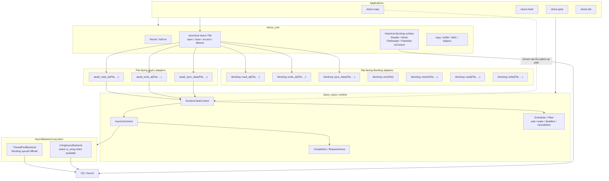

# Sluice 当前架构快照

- **Verified implementation baseline**: `4f77aed54e0bb2663b926335d5c090c2211d2577`
- **Authority**: 本文只描述当前代码，不定义规范。规范性边界见 [`ADR-0001`](adr/0001-explicit-io-design-doctrine.md) 与 [`ADR-0002`](adr/0002-explicit-file-api-architecture.md)。
- **Conformance tracking**: [`docs/roadmap/explicit-file-conformance.md`](roadmap/explicit-file-conformance.md)。

如果本文与代码不一致，以代码为准；如果本文与 ADR 冲突，以 ADR 为准。

---

## 1. 当前系统不是“两套长期 I/O 语义”

仓库仍保留两个 build target：

```text
sluice_core
sluice_async
```

但这只是 build / implementation shape。

当前代码已经开始从历史上的：

```text
blocking Reader / Writer / FileReader / FileWriter
+
async raw fd + Operation + Completion
+
application POSIX escape
```

向 ADR-0002 冻结的统一模型收敛：

```text
canonical File resource
        ↓
canonical operation semantics
        ↓
explicit initiation / execution choice
        ↓
replaceable execution
```

`File` 不携带 blocking / async mode，也不选择 ThreadPool / io_uring backend。

---

## 2. 当前顶层图



这张图故意同时画出：

1. 已经成立的 canonical `File` spine；
2. 仍未完成收敛的 historical blocking surface；
3. app 消费的两种现实：hash/grep/tail 走 canonical `File`；copy 的 source lifetime 走 canonical `File`，而其 pipeline 仍走已分类的 raw explicit-op path（A6 前保持，边界经 `native_handle()`）。

它们不能被一张“理想图”掩盖。

---

## 3. Canonical `File` resource

当前 `include/sluice/file_resource.hpp` 定义：

```text
FileAccess
    read_only
    write_only
    read_write

FileExistence
    open_existing
    create_if_missing
    create_new

FileInitialContents
    preserve
    truncate
```

`sluice::File` 当前拥有：

```text
native resource ownership
move-only lifetime
close authority
open / closed state
access contract
native_handle() interop escape
```

没有：

```text
blocking flag
async flag
backend pointer
worker count
queue policy
```

这与 ADR-0002 的责任边界一致。

### 3.1 当前已经 canonicalized 的 File-facing operations

`include/sluice/async/file.hpp` 当前提供：

```text
await_read_at
await_write_at
await_sync_data
```

三者都以 `File` 作为 public semantic resource，再通过既有 `RuntimeTaskContext` 提交到 async execution seam。

`include/sluice/blocking/file.hpp` 的 `sluice::blocking` 命名空间现在提供同一语义的显式 Blocking execution（实现位于 `src/blocking_file.cpp`）：

```text
blocking::read_at
blocking::write_at
blocking::sync_data
blocking::size
blocking::resize
blocking::read
blocking::write
```

Blocking path 不经过 RuntimeTaskContext、Completion 或 AsyncBackend；它直接对 caller 线程执行 syscall。

当前成立的 vertical slice：

```text
File::open
    ↓
blocking::read_at / blocking::write_at  |  await_read_at / await_write_at
    ↓                                          ↓
Result<T> (caller thread blocks)            caller observes completion
    ↓                                          ↓
blocking::sync_data  |  await_sync_data
    ↓
File::close
```

Read / Write / SyncData 的落地没有要求 Scheduler、Completion、RequestArena 获得 File semantic authority。

---

## 4. Blocking surface：canonical Blocking path 已落地，legacy surface 暂时保留

A1 在 `include/sluice/blocking/file.hpp`（实现 `src/blocking_file.cpp`）的 `sluice::blocking` 命名空间下增加了三个 canonical File-facing operation：

```text
blocking::read_at(File, uint64_t, span<byte>)       -> Result<size_t>
blocking::write_at(File, uint64_t, span<byte const>) -> Result<size_t>
blocking::sync_data(File)                            -> Result<void>
```

它们直接对 caller 线程执行 syscall，不经过 async runtime。这满足 ADR-0002 的要求：

```text
File owns resource semantics
Blocking invocation owns blocking execution semantics
```

`include/sluice/file.hpp` 中的历史 blocking resource classes（`FileReader` / `FileWriter`）仍暂时保留，拥有：

```text
open / close
sequential read / write
positional read / write
vectored read / write
sync_data / sync_all
```

这些 legacy class 仍构成一套历史平行的 resource surface，但已不再被视为 canonical resource identity；其删除/收敛将在后续 roadmap 节点（A2/A4/A7）单独裁决。A1 不删除它们。

---

## 5. Async initiation 与 execution

当前 File-facing async adapter 使用：

```text
File
+ RuntimeTaskContext
+ caller-owned Completion<T>
```

因此当前 `await_*` surface 明确暴露了 evented / outstanding execution 成本；它不是一个会静默猜 execution 的万能 `file.read()`。

### 5.1 Runtime seam

当前主要链路：

```text
RuntimeTaskContext
    ↓
AsyncIoContext
    ↓
AsyncBackend
    ↓
Completion<T>
    ↓
Scheduler waiter / wake
    ↓
caller
```

runtime 负责的是：

```text
admission
request lifecycle
completion publication
wait / wake
cancellation relationship
deadline / scheduling
bounded outstanding state
```

runtime 不负责定义：

```text
what File is
whether a File operation is semantically legal
what SyncData means
which metadata durability belongs to SyncData
```

---

## 6. Execution backends

PR #334 删除 repository-provided synthetic `SyncBackend` / `FakeAsyncBackend` 后，当前生产 execution 只保留：

```text
ThreadPoolBackend
UringAsyncBackend
```

### 6.1 ThreadPoolBackend

它执行 blocking syscalls，但从 caller / runtime 的 execution model 看属于 async execution：

```text
caller submit
    ↓
outstanding request
    ↓
worker executes blocking syscall
    ↓
terminal / completion publication
```

所以：

```text
blocking syscall != Blocking execution model
```

### 6.2 UringAsyncBackend

io_uring 是 execution backend，不是 semantic authority。

有 liburing 时走真实 kernel async path；不可用构建必须诚实拒绝，不能伪造成功。

当前 roadmap 不把“全面启用/优化 io_uring”当成基础架构完成条件。

---

## 7. 当前 apps 与 canonical boundary

四个应用仍是架构真实性的重要 consumer：

```text
sluice-copy
sluice-hash
sluice-grep
sluice-tail
```

A2 之后，hash / grep / tail 已经通过 canonical File surface 消费文件资源：

```text
File::open
    ↓
sluice::File 所有权（HashInput / GrepInput / TailEngine 持有）
    ↓
await_read_at(File, ...)
    ↓
File dtor / close authority
```

copy 的 source lifetime 同样由 canonical File 持有（outcome 持有 `sluice::File`，close 归 File authority）：

```text
File::open
    ↓
sluice::File 所有权（OpenCopyOutcome / SafeOpenOutcome 持有）
    ↓
native_handle() 只在 fstat 观察与 pipeline 实参边界读取
```

分类后的残余 escape（详见 [`docs/roadmap/explicit-file-app-consumer-census.md`](roadmap/explicit-file-app-consumer-census.md)）：

```text
hash / grep / tail main:
    ::fstat(File.native_handle()) regular-file check   REQUIRED_INTEROP

copy source metadata:
    ::fstat(File.native_handle()) kind 观测            REQUIRED_INTEROP
```

`sluice-copy` 的 explicit pipeline 仍以：

```text
src_fd / dst_fd
    ↓
ReadOp / WriteOp / SyncDataOp / SyncAllOp
    ↓
RuntimeTaskContext
```

直接消费低层 async seam。这是 explicit outstanding pipeline authority（ADR-0002 §6.2），不属于 style bypass；ownership 与 operation reference 分离：source lifetime 的 authority 是 canonical File，pipeline 在边界处经 `native_handle()` 引用同一资源，raw explicit-op resource reference 归 #346 / A6。其余 atomic-output namespace 操作已逐 concern 分类：destination special open（`O_NOFOLLOW`/mode 无法由 `FileOpen` 无损表达）与 open/same-file/kind 观测 → REQUIRED_INTEROP，SyncAll → #345 / A5，`ftruncate` → #346 / A6，mkstemp/rename/unlink/fchmod/dir fsync → OUT_OF_SCOPE_NAMESPACE_WORK。

---

## 8. Tests 与 CI

当前仓库已经不是“无测试、无 CI”的旧基线。

`xmake/tests.lua` 当前登记的 canonical File test surface（按职责分类）：

```text
resource:
  file_resource_test

async File-facing:
  file_read_test
  file_write_test
  file_sync_data_test

blocking File-facing:
  blocking_file_read_test
  blocking_file_write_test
  blocking_file_sync_data_test
  blocking_file_state_test
  blocking_file_sequential_test

shared validation helpers:
  io_validation_boundary_test

app canonical-resource consumption:
  app_hash_consumption_test
  app_grep_consumption_test
  app_tail_consumption_test
  app_copy_consumption_test
```

这些测试分别保护 canonical File resource 及其 observable state（size / resize）、已落地的 positional Read / Write / SyncData slices（evented 与 blocking 两种 initiation）与 blocking-only 的 sequential Read / Write slice、跨执行共享的 offset/length 边界规则，以及各迁移后 application consumer 对 canonical File resource ownership / File-facing operation boundary 的消费行为。

`.github/workflows/open-code-review.yml` 也已经存在。OpenCodeReview 是 advisory review surface：正常执行时发布 findings；工具自身失败不作为 correctness gate。

本文不把 AI review 当作 correctness authority；其 findings 仍需由代码/测试/ADR 独立裁决。

---

## 9. 当前 architecture gaps

以 `4f77aed5`（A2 + A3 + A4 implementation）为基线，基础 Explicit File 架构尚未闭环的主要节点是：

```text
SyncAll File-facing operation
Explicit low-level operation resource reference
Vectored operation decision / convergence
```

详细状态、依赖顺序与 PR gate 见：

[`docs/roadmap/explicit-file-conformance.md`](roadmap/explicit-file-conformance.md)

---

## 10. 文档责任

长期文档关系：

```text
mission
  ↓
ADR-0001 / ADR-0002       normative authority
  ↓
explicit-file-conformance roadmap
  ↓
this architecture snapshot current code reality
  ↓
README summaries
```

因此：

- ADR 回答“架构必须是什么”。
- Roadmap 回答“master 距离 ADR 还有哪些 gap”。
- 本文回答“master 现在实际上是什么”。
- README 只提供入口，不复制完整 contract。

任何实现 PR 如果改变上述现实，都必须检查 roadmap 与本 snapshot 是否需要同步；不能靠历史 issue / PR report 替代长期文档。
