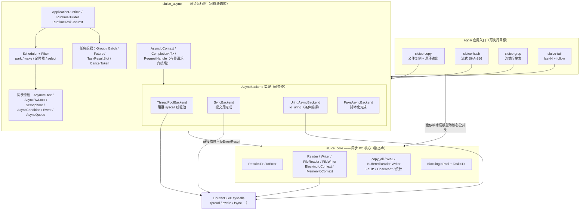
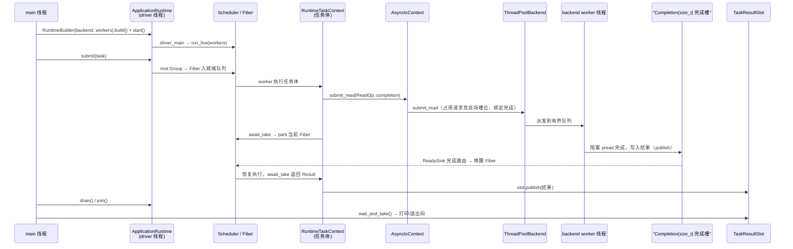

# Sluice 架构概览

本文从当前代码推导系统形态，描述"现在的系统是什么"。事实来源按优先级为：`include/`、`src/`、`apps/`、`xmake.lua` 与 `xmake/`。

## 1. 项目当前定位

Sluice 是一个 C++20 I/O 库，由两个静态库目标与四个应用组成：

- `sluice_core` —— 同步 I/O 核心：`Result<T>`/`IoError` 错误模型、Reader/Writer 字节流抽象、文件与位置 I/O、copy、WAL、缓冲与包装器、阻塞线程池。
- `sluice_async` —— 可选启用的异步运行时：显式操作提交、调用方持有的完成槽、有界请求状态、Fiber 调度器、同步原语、取消、以及可替换的后端执行（线程池 / 同步 / io_uring / 仿真）。
- `apps/` —— 四个命令行应用（copy / hash / grep / tail），只使用公共头文件与生产库，是公共 API 的真实消费者。

当前仓库是精简后的工程基线：只保留实现、应用与构建定义。测试、基准、示例、脚本、CI workflow、历史文档与形式化模型不在当前树中。

## 2. 仓库结构

| 路径 | 内容 |
| --- | --- |
| `include/sluice/` | 同步核心公共头（命名空间 `sluice`） |
| `include/sluice/async/` | 异步运行时公共头（命名空间 `sluice::async`），含 `detail/` 内部件 |
| `include/sluice/detail/`、`include/sluice/experimental/` | 核心层内部工具头；实验性 io_uring 头 |
| `src/` | `sluice_core` 实现（构建 glob 为 `src/*.cpp`，非递归） |
| `src/async/` | `sluice_async` 实现（构建 glob 为 `src/async/*.cpp`） |
| `src/experimental/` | 实验实现，当前不属于任何构建目标（见 §9） |
| `apps/sluice-copy` `apps/sluice-hash` `apps/sluice-grep` `apps/sluice-tail` | 应用，各自含 `main.cpp`、CLI 解析与任务模块及 README |
| `xmake.lua` + `xmake/libraries.lua` `xmake/apps.lua` `xmake/helpers.lua` | 构建定义：库、应用、共享辅助函数 |
| `research/RESULTS.md` | 仅保留研究结论 |
| 根目录 | `README.md` / `README.zh-CN.md` / `CONTEXT.md` / `AGENTS.md` / `CHANGELOG.md` / `LICENSE` / `.clang-format` / `.clang-tidy` / `lefthook.yml`；`.github/` 只含 issue/PR 模板与贡献指南，无 CI workflow |

构建目标一览（`xmake/`）：

| 目标 | 类型 | 默认构建 | 源 | 依赖 |
| --- | --- | --- | --- | --- |
| `sluice_core` | 静态库 | 是 | `src/*.cpp` | — |
| `sluice_async` | 静态库 | 否（opt-in） | `src/async/*.cpp` | `sluice_core` |
| `sluice-copy` / `sluice-hash` / `sluice-grep` / `sluice-tail` | 可执行 | 否（`xmake -g apps`） | 各 `apps/<name>/*.cpp` | `sluice_core` + `sluice_async` |

构建使用 C++20、`-Wall -Werror`；支持 debug/release/valgrind 模式与 asan/tsan/ubsan 策略开关及 `--hardened` 加固选项。`sluice_async` 在 Clang 前端额外启用 `-Wthread-safety`（线程安全注解，头文件中的 `SLUICE_CAPABILITY`/`SLUICE_GUARDED_BY` 宏在非 Clang 下退化为空）。`xmake/helpers.lua` 定义了单文件目标辅助函数 `sluice_one_file_target`，当前没有调用者（树中没有 test/example/bench 目标）。

## 3. 顶层组件图



两个库的关系：`sluice_async` 链接 `sluice_core`，二者共享 `IoError`/`Result` 错误模型；同步面不包含任何异步接口，异步能力整体是 opt-in 的独立库。

## 4. 公共接口层（include）

### 4.1 同步核心（`include/sluice/`，命名空间 `sluice`）

| 头 | 暴露内容 |
| --- | --- |
| `error.hpp` / `result.hpp` | `IoError`（11 个 `Code` + `os_errno`，`from_errno_value` 从 errno 映射）；`Result<T>`/`Result<void>` 与 `make_unexpected`。全库统一错误通道，无异常路径 |
| `reader.hpp` / `writer.hpp` / `iovec.hpp` | `Reader`（`read_some`/`read_exact`/`read_vec`/`read_vec_all`/`stream_to`）、`Writer`（`write_some`/`write_all`/`write_vec`/`write_all_vec`/`flush`）、`IoSlice`/`ConstIoSlice` |
| `sync.hpp` | `SyncableWriter`（`sync_data`/`sync_all` 持久化接口） |
| `file.hpp` | `FileReader`/`FileWriter`：顺序 + 位置 I/O（`read_at`/`write_at` 及向量版本）、fd 语义、打开错误延迟报告、可挂接统计 |
| `io_context.hpp` | `IoContext` 工厂接口（`open_reader`/`open_writer`）+ `BlockingIoContext` 实现 |
| `memory_io_context.hpp` / `fault.hpp` | `MemoryIoContext`（内存存储的 IoContext）；`MemoryReader`/`MemoryWriter`、`FaultPlan`/`FaultReader`/`FaultWriter` 故障注入包装 |
| `buffer.hpp` / `buffered_readable.hpp` | `BufferedReader`/`BufferedWriter`（调用方提供缓冲区，写侧析构断言无脏数据）；`BufferedReadable`（`peek_buffered`/`consume_buffered`） |
| `copy.hpp` / `copy_strategy.hpp` / `limit.hpp` | `copy_all` 家族；`CopyStrategy`（Auto/Scratch/BufferedFirst）+ `CopyDecision` 观测选择了哪条路径；`CopyLimit` 限量 |
| `wal.hpp` | WAL 记录读写：帧 = magic + payload + checksum；`WalWriter` 跟踪 written/flushed/durable LSN |
| `observed.hpp` / `measurement.hpp` | `ObservedReader`/`ObservedWriter` 统计包装；`SyscallStats`/`BufferStats`/`CopyStats`/`SyncStats`/`VectorStats`/`UringStats`/`AsyncStats` |
| `blocking_io_pool.hpp` | `BlockingIoPool`（固定深度阻塞线程池，`submit`/`try_submit` 返回 `Task<T>`，`wait_idle`/`shutdown`） |
| `detail/io_validation.hpp` / `detail/posix_retry.hpp` | off_t/长度校验（要求 64 位 LFS）；EINTR 重试 |
| `experimental/uring_io_context.hpp` / `uring_write_batch.hpp` | `UringIoContext`/`UringWriteBatch`（`SLUICE_HAS_LIBURING` 条件；当前构建未定义该宏，且实现不在任何构建目标中，见 §9） |

面向对象：任何需要同步文件/字节流 I/O、显式错误处理、syscall 级观测或故障注入的用户程序。

### 4.2 异步运行时（`include/sluice/async/`，命名空间 `sluice::async`）

按职责分组：

- **操作与完成**：`async_io_context.hpp` 定义四种操作（`ReadOp`/`WriteOp`/`SyncDataOp`/`SyncAllOp`，fd + 缓冲 + 位置）、后端接口 `AsyncBackend`（`submit_*`/`poll`/`wait_one`/`cancel`/`register_waiter`/`wait_source`/请求身份）、后端等待源接口 `BackendWaitSource`，以及门面 `AsyncIoContext`（持有后端，提供提交/轮询/等待/取消/请求状态查询）。`completion.hpp` 定义 `Completion<T>` —— 调用方持有的完成槽，带 idle→binding→outstanding→publishing→ready/resetting 状态机，违规生命周期直接 fail-fast。`request_handle.hpp` 提供 `RequestHandle` 请求身份（context/slot/generation）。
- **应用运行时**：`application_runtime.hpp` 的 `RuntimeBuilder`（选后端、worker 数）→ `ApplicationRuntime`（`start`/`submit`/`request_stop`/`drain`/`join`/`shutdown` 显式生命周期，内部驱动线程与状态机）；任务体收到 `RuntimeTaskContext`，提供 `submit_*`、`await_completion`、`cancel_waiter` 与 `cancel_token()`。
- **调度**：`scheduler.hpp`（`Scheduler`：Fiber 注册/派发、`run`/`run_live` 两种驱动循环、`await_completion_*`、等待队列 `await_wait`/`wake_wait_one`/`cancel_wait`、单调时钟与截止时间、select 准入）；`fiber.hpp` + `fiber_ctx.hpp`（`Fiber` 状态机 created→runnable→running→waiting→done；上下文切换为手写汇编，含 ASAN 协作支持）；`wait_node.hpp`/`wait_queue.hpp`（等待节点/队列）；`timer_registration.hpp`。
- **同步原语**（构建在 Scheduler 的 park/wake 之上）：`async_mutex.hpp`、`async_rwlock.hpp`、`semaphore.hpp`、`condition.hpp`、`event.hpp`、`async_queue.hpp`（带 park/超时/关闭语义的并发队列）、`select.hpp` + `select_fwd.hpp`（最多 8 臂，Event/Timer 两类 case）。另有运行时内部使用的 `mutex.hpp`/`lock_guard.hpp`/`thread_annotations.hpp`（std::mutex 薄包装 + Clang TSA 注解）。
- **任务组织与结果传递**：`group.hpp`（`Group::async`，绑定 Scheduler 时走 Fiber/evented 路径，否则走线程路径；`await`/`cancel`）、`batch.hpp`（`Batch` 多操作批量提交 + `await_one`/`next`）、`future.hpp`（`Future<T>`，等待策略可插拔）、`task_result.hpp`（`TaskResultSlot<T>`：运行时 worker 向调用线程搬运结果；`translate_task_exception` 把异常翻译为 `IoError`）、`cancel.hpp`（`CancelToken`/`CancelState`/`CancelGuard`）、`wait_policy.hpp`/`evented_wait_policy.hpp`。
- **便捷层**：`op_helpers.hpp`（`read_all`/`write_all`/`sync_*_all`——直接驱动 `AsyncIoContext` 的阻塞式循环）；`await_op_helpers.hpp`（`await_take`/`await_drain`/`await_read_once`/`await_read_fill`/`await_write_exact`——任务体内使用的 await 风格 helper）。
- **后端**：`threadpool_backend.hpp`（`ThreadPoolBackend`：worker 线程执行阻塞 syscall，内部有界派发队列与就绪等待源）、`sync_backend.hpp`（提交即在调用线程完成）、`uring_backend.hpp`（`UringAsyncBackend`，`SLUICE_HAS_LIBURING` 条件编译）、`fake_backend.hpp`（`FakeAsyncBackend`，脚本化/自动完成，供使用方模拟）。
- **`detail/` 内部件**：`request_arena.hpp`/`request_slot.hpp`/`request_key.hpp`/`submit_transaction.hpp`（有界请求槽位竞技场 + 提交事务）、`ready_sink.hpp`（`SynchronousReadySink` 完成路由接口）、`ready_wait_source.hpp`/`reference_ready_sink.hpp`/`uring_wait_source.hpp`、`queue_item.hpp`/`queue_port.hpp`（AsyncQueue 内部端口）、`select_port.hpp`/`select_registration.hpp`、`fail_fast.hpp`（不可恢复违规的终结点）、`mutex_test_seam.hpp`/`queue_test_seam.hpp`（`SLUICE_ASYNC_INTERNAL_TESTING` 宏门控的测试缝）。

## 5. 实现层（src）

### 5.1 同步核心（`src/*.cpp` → `sluice_core`）

- `io_context.cpp` —— `BlockingIoContext` 工厂，产出 `FileReader`/`FileWriter`。
- `file.cpp` —— POSIX 实现（open/read/write/pread/pwrite/fsync，EINTR 重试，统计挂钩）。
- `reader.cpp` / `writer.cpp` —— 接口默认成员与组合逻辑（`read_exact`、`stream_to`、`write_all`、向量回退等）。
- `buffer.cpp` / `copy.cpp` / `copy_strategy.cpp` —— 缓冲读写、`copy_all` 策略循环（buffered 快路径 / scratch 路径）。
- `wal.cpp` —— 帧编码/解码与校验和。
- `fault.cpp` / `observed.cpp` —— 包装器实现。
- `blocking_io_pool.cpp` —— 阻塞线程池（队列 + 条件变量 + `Task<T>` 状态）。
- `file_test_seams.hpp` —— 宏门控测试缝（默认不激活）。

### 5.2 异步运行时（`src/async/*.cpp` → `sluice_async`）

- `application_runtime.cpp` —— 生命周期状态机（Constructed→…→Stopped/Fatal）、驱动线程 `driver_main`（循环调用 `Scheduler::run_live`，配合 drain/epoch 逻辑）、任务准入与根组。
- `async_io_context.cpp` —— 门面转发、等待语义（split-wait 能力探测、有界 park）、测试缝。
- `scheduler.cpp` + `scheduler_{condition,event,mutex,park_wake,queue,rwlock,semaphore,timer}.cpp` —— 调度器主体按关注点分文件：worker 拓扑与 Fiber 派发、park/wake、等待队列、各原语、定时器。
- `fiber.cpp` / `fiber_ctx.cpp` —— Fiber 状态与汇编上下文切换。
- `select.cpp` / `select_event.cpp` / `select_timer.cpp` —— select 组合执行。
- `group.cpp` / `batch.cpp` / `cancel.cpp` —— 任务组织。
- `op_helpers.cpp` / `await_op_helpers.cpp` / `request_handle.cpp` —— 便捷层实现。
- `queue_port.cpp`（+ `queue_detail.hpp`）—— AsyncQueue 内部端口。
- `threadpool_backend.cpp` / `uring_backend.cpp` —— 后端实现；`uring_backend.cpp` 以 `SLUICE_HAS_LIBURING` 条件编译，无该宏时编译为不可用的降级实现。
- `fail_fast.cpp` / `wait_policy.cpp`、宏门控测试缝 TU（`mutex_test_seam.cpp`、`queue_test_seam.cpp`、`scheduler_fe2_test_seam.cpp`，编译进库但默认不激活）。

### 5.3 experimental（`src/experimental/`）

`uring_io_context.cpp` 与 `uring_write_batch.cpp` 存在于源码树，但 `xmake` 的 glob（`src/*.cpp`、`src/async/*.cpp`）均不覆盖该子目录，当前不属于任何构建目标。

## 6. apps 层

四个应用结构一致：`cli_parse`（参数解析）→ 任务模块 → `main.cpp`。共同运行模式：

```text
RuntimeBuilder().backend(ThreadPoolBackend).workers(n).build()
→ ApplicationRuntime::start() → submit(task) → drain()/join()
→ 任务结果经 TaskResultSlot 发布，main 取回并映射 IoError 为退出码
```

| 应用 | 职责 | 使用的核心能力 |
| --- | --- | --- |
| `sluice-copy` | 文件复制：顺序与有界流水线两种引擎（位置 `submit_read`/`submit_write` + `await_read_fill`/`await_write_exact`/`await_drain`），可选 `sync_data`/`sync_all`；`safe_output` 提供原子输出（目标目录临时文件 + rename + 目录持久化），`file_domain` 做同文件防护 | 异步面全部来自 `ApplicationRuntime`/`ThreadPoolBackend`/`await_op_helpers`/`task_result`；原子输出逻辑在应用侧 |
| `sluice-hash` | 多文件流式 SHA-256（自带 sha256 引擎），有界读循环 + 取消检查 | 同上 |
| `sluice-grep` | 多文件字面量行搜索（自带 matcher） | 同上 |
| `sluice-tail` | 有界 last-N 反向扫描 + follow 长驻模式；引擎显式 `start`/`request_stop`/`wait` 生命周期；CLI 用 sigwait 信号线程把 Ctrl-C 转为取消 | 同上，另用 `cancel_token` 长驻取消 |

值得注意：当前所有应用只消费异步面（`application_runtime`/`async_io_context`/`await_op_helpers`/`task_result`/`threadpool_backend`）加错误模型（`error`/`result`）；同步 Reader/Writer 面是独立的库表面，应用未直接使用。

## 7. 典型调用路径 / 运行时关系图

以 sluice-copy 的一次异步 `read` 为例（写与 sync 同构）：



同步面的路径则直接得多：调用方持有 `Reader`/`Writer`（如 `FileReader`/`BufferedReader`），`copy_all` 在调用线程上循环 `read_some`/`write_some` 直至 EOF 或限额，`Result` 即时返回；`BlockingIoPool` 可把阻塞操作挪到池线程并以 `Task<T>::get()` 汇合。

## 8. 当前架构判断

**系统形态**：一个"小型 I/O 库 + 可选异步运行时 + 应用"的三层结构，而非单一框架。核心抽象按重要性排序：

1. `Result<T>` / `IoError` —— 全库唯一错误通道（两个库共享）。
2. `Reader` / `Writer` —— 同步字节流接口，文件/内存/缓冲/包装器都实现它。
3. `AsyncBackend` —— 后端策略接口，四种实现（ThreadPool/Sync/Uring/Fake）可替换，`RuntimeBuilder` 注入。
4. `Completion<T>` —— 调用方持有的完成槽：所有权、状态机与 fail-fast 边界都在这里。
5. `ApplicationRuntime` / `RuntimeTaskContext` —— 应用进入运行时的唯一入口与任务内 API。
6. `Scheduler` / `Fiber` —— 协作式多 worker 调度（汇编上下文切换），等待即 park，完成经 ReadySink 路由唤醒。

**同步能力**（`sluice_core`）：Reader/Writer、文件与位置 I/O、copy、WAL、缓冲、内存/故障/观测包装、阻塞线程池。
**异步能力**（`sluice_async`）：显式操作 + 调用方完成槽、有界请求状态、Fiber 调度、同步原语与 select、Group/Batch/Future/取消、四种后端。

**当前主干与不在当前系统中的部分**：主干是上表中的库与应用。测试、基准、示例、脚本、CI workflow、历史文档、TLA+/形式化模型在当前树中不存在；`.github/` 只保留模板与贡献指南。

## 9. 已知边界

以下均为从当前代码与构建定义中直接观察到的事实：

- **无测试目标**：`xmake/helpers.lua` 的 `sluice_one_file_target` 存在但无调用者，树中没有 test/bench/example 目标；`src/` 与 `src/async/` 内的 `*_test_seams.*` 文件编译进库但由 `SLUICE_ASYNC_INTERNAL_TESTING` 宏门控，默认不激活。
- **文档重建中**：`docs/` 目前只有本文档。
- **experimental 未构建**：`src/experimental/*.cpp` 不被任何 glob 覆盖；`include/sluice/experimental/` 头文件公开，但其实现当前不编入任何库。
- **io_uring 默认不可用**：`SLUICE_HAS_LIBURING` 在 `xmake.lua`/`xmake/` 中没有定义点，`UringAsyncBackend` 在默认构建中编译为不可用的降级实现；源码保留了完整条件编译路径。
- **无 CI workflow**：`.github/` 只有 issue/PR 模板、`CONTRIBUTING.md` 与 `ISSUE_LIFECYCLE.md`。
- **平台假设**：实现使用 POSIX（`unistd.h`/`fcntl.h` 等），`detail/io_validation.hpp` 静态断言 64 位 `off_t`；Fiber 切换为手写汇编。当前代码事实面向 Linux/POSIX 环境。
