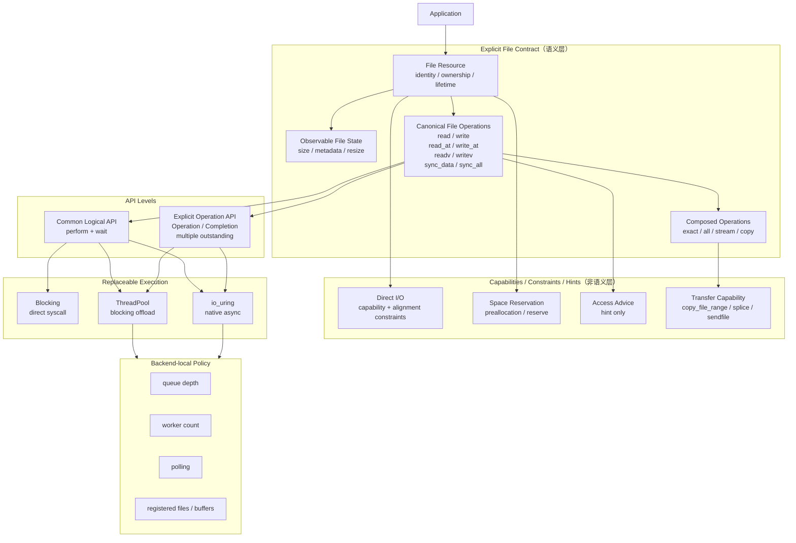

# SLUICE-IO-ARCH-GAP-AUDIT-1

> 状态：FROZEN — 等待人工 architecture review（verdict: IO_ARCH_GAP_AUDIT_COMPLETE）

```text
AUDIT_BASE_SHA = baa6c91ce240b0890bfb3e6c12e917ba619be700（审计时的 origin/master）
BRANCH_HEAD    = 7a9fc35f273debb0114b5ef7b8f84af1348c96f2（PR #324 merge 后 rebase；#324 为纯文档变更：
                 新增 docs/adr/0002*，零生产代码改动——本报告全部代码事实不受影响）
BRANCH   = audit/io-architecture-gap-1
WORKTREE = /home/hoo/Projects/Sluice
ZIG 源码 = .tmp/zig-bootstrap-0.17.0-dev.2056+79a9897cd/zig (0.17.0-dev.2056+79a9897cd，官方 bootstrap tarball，未提交)
```

审计权威顺序：`docs/mission.md` → frozen ADR（`docs/adr/0001` + **`docs/adr/0002` explicit File API**，后者在审计期间经 PR #324 冻结上 master，基线与本次审计相同）→ current master code → build graph → apps → `docs/architecture.md`（仅描述性）→ Zig 官方源码（对照证据）→ 历史 issue/PR（最后，仅 adversarial）。

> **与 ADR-0002 的关系**：本审计的能力冻结（Part I）在 ADR-0002 上 master 之前独立完成，二者结论一致（File 资源根 / open-close 生命周期 / 最小 state 面 / canonical 操作集 / 双 API 层 / 可替换执行）。ADR-0002 是 normative authority；本报告 Part I 的图与之为同一架构（差异仅 ADR-0002 将 open/close 显式为独立生命周期节点，见 Part I §1 注记）。Part III 各裁决按 ADR-0002 §14 的 verdict 词汇表给出，其 §13 待裁问题清单在 §P 逐项应答；对 ADR-0002 本体的对抗审计发现另见 §Q（供人工裁决）。

本任务不修改任何生产代码 / 公共 API / 测试；只产出分类与裁决。

---

# Part I — 冻结产物（在读取 include/ src/ apps/ 之前建立）

## 1. Normative target architecture

> **本节冻结于 ADR-0002 上 master 之前，内容与 ADR-0002 §1 的 normative 图一致**（差异仅节点切分：ADR-0002 将 open/close 显式为独立生命周期节点）。规范性以 ADR-0002 为准，本图作为审计推导的独立确认保留。

依据：mission 六原则 + ADR-0001（authority/bounds/replaceability/minimum mechanism）+ `docs/architecture.md` 快照（描述性、允许的冻结前输入）+ Zig std.Io（existence proof）；Zig 不作规范性依据。相对任务书模板的修订：

> **冻结时序披露**：图与 ledger 的结构在读取 `include/ src/ apps/ xmake` 之前冻结；下方修订注记中引用 master 代码事实（§4/§7/§8）的措辞是对抗评审修订时（读取代码之后）补强的论证，属事后强化而非冻结输入。冻结前的合法输入 = mission + ADR-0001 + architecture.md 快照 + Zig 源码。

1. `sync_data / sync_all` 保留为 durability 契约（Zig 只有单一 `sync`；Sluice 已有的拆分是更强的语义，不是缺陷）。
2. 显式操作层（multiple outstanding）与逻辑 API 层的关系由 Sluice 自身证据决定：唯一真实 multiple-outstanding 消费者（sluice-copy 流水线）只需要定位读写多 outstanding——**显式层只要求覆盖确需 multiple outstanding 的形态，不是"所有操作都必须有 Operation 形态"**（Zig 的 streaming-only 显式层是同一结论的另一存在性证明）。
3. 执行层三种形态中，blocking 直接调用是同步面的 initiation 基线（mission §5"执行可换"的语义面）；ThreadPool 与 io_uring 是可选执行机制。
4. 目录持久化（safe output 的 durability 边界）暂列为 composition 边界问题，不预判归入 File 还是 Dir。



## 2. Capability ledger（FROZEN）

每个能力按 mission 七问（observable behavior / correctness invariant / resource / transformation grant / backend? / policy? / deletion loss）审判。类别词汇表 = mission 六类 + COMPOSED_TRANSFORMATION。

### Resource

| ID | Capability | 冻结定义 |
| -- | ---------- | -------- |
| F01 | File identity | 打开的文件实例是一等命名值；操作附着于它；同一 identity 可在不同执行形态下使用 |
| F02 | ownership | 谁负责关闭 / 生命周期终结是显式契约 |
| F03 | borrowed vs owned handle | 借用 fd 与拥有 fd 必须可区分 |
| F04 | move semantics | 移动后源状态、句柄唯一性 |
| F05 | open | 打开/创建契约：flags→能力映射、错误报告时机（立即/延迟） |
| F06 | close | 关闭契约：错误报告、与 in-flight 操作的顺序 |
| F07 | resource lifetime vs outstanding ops | 文件关闭/销毁时 outstanding 操作的语义 |

### File state

| ID | Capability | 冻结定义 |
| -- | ---------- | -------- |
| F10 | size | 文件长度可观察 |
| F11 | metadata / regular-file identity | stat 类信息；regular file 判定 |
| F12 | resize | setLength/truncate 语义（含 exact final size） |
| F13 | permissions | chmod 类；仅在有真实 owner 时保留 |
| F14 | directory durability | 目录项持久化（rename/unlink 后的 fsync(dir)） |

### Data operation semantics

| ID | Capability | 冻结定义 |
| -- | ---------- | -------- |
| O01 | sequential read | 流式顺序读（共享游标或进程内游标） |
| O02 | sequential write | 流式顺序写 |
| O03 | positional read | 偏移读（不共享内核游标） |
| O04 | positional write | 偏移写 |
| O05 | vectored read | 多缓冲读（readv 形态） |
| O06 | vectored write | 多缓冲写（writev 形态，含 header/splat 变体归此） |
| O07 | exact / all composition | read_exact / write_all / positionalAll 的精确性契约 |
| O08 | EOF / short-I/O semantics | 0 字节、短读写、EOF 判定的统一规则 |

### Durability

| ID | Capability | 冻结定义 |
| -- | ---------- | -------- |
| D01 | sync_data | fdatasync 语义（数据持久化最小承诺） |
| D02 | sync_all | fsync 语义（数据+元数据） |
| D03 | directory durability | 同 F14 |
| D04 | per-operation durability | RWF_DSYNC/RWF_SYNC/ioring-fsync-per-op；默认 RESEARCH |

### Composition

| ID | Capability | 冻结定义 |
| -- | ---------- | -------- |
| C01 | stream | reader→writer 传输组合 |
| C02 | copy | 文件→文件整体传输（含 kernel-transfer 路径） |
| C03 | transformation authority | 组合边界授权哪些原本不合法的变换（如零拷贝替换读+写） |

### Async correctness

| ID | Capability | 冻结定义 |
| -- | ---------- | -------- |
| A01 | operation admission | 请求进入系统的规则与饱和行为 |
| A02 | multiple outstanding | 同一资源上并发未完成操作 |
| A03 | completion | 结果由谁写入、何时可观察 |
| A04 | terminalization | 操作恰好到达一次终态 |
| A05 | publication | 结果可见的顺序与 happens-before |
| A06 | request identity / generation | 槽位复用时的身份区分 |
| A07 | cancellation | 取消请求 + 可观察结局（canceled/completed/failed） |
| A08 | deadline | 等待/操作级超时的语义 |
| A09 | wait / wake | 阻塞方与唤醒方的显式契约 |
| A10 | buffer lifetime | 缓冲区参与期间的所有权规则 |

### Resource bounds

| ID | Capability | 冻结定义 |
| -- | ---------- | -------- |
| R01 | request capacity | 未完成请求总数上界 |
| R02 | dispatch capacity | 后端派发队列上界 |
| R03 | worker resources | 执行线程数上界 |
| R04 | buffer / in-flight budget | 缓冲/在途字节预算 |

### Execution

| ID | Capability | 冻结定义 |
| -- | ---------- | -------- |
| E01 | direct blocking syscall | 调用线程直接 syscall |
| E02 | blocking offload / ThreadPool | 阻塞操作移交池线程 |
| E03 | io_uring | 原生异步后端 |
| E04 | backend replaceability | 语义不绑定后端机制 |
| E05 | capability discovery | 探测+降级（如 sendfile 不可用自动回退） |

### Optimization candidates（仅为候选，无实现授权）

P01 direct I/O · P02 direct-I/O alignment · P03 preallocation/reserve · P04 access advice · P05 copy_file_range · P06 sendfile · P07 splice · P08 registered files · P09 registered buffers · P10 polling/SQPOLL · P11 NOWAIT · P12 HIPRI

---

# Part II — master 映射与对照审计

## 4. Sluice master 表面事实（映射输入）

来源：`include/sluice/`、`src/`、`apps/`、`xmake/`（BASE_SHA baa6c91c 全量读取）。

### 4.1 同步核心（sluice_core）

- `FileReader`/`FileWriter`：RAII 持有 fd；**两种硬编码 open 模式**（`O_RDONLY`；`O_WRONLY|O_CREAT|O_TRUNC` 0644，恒截断）；打开错误延迟报告（`open_error_`）；`close()` 返回 Result 但析构丢弃；`explicit FileReader(int fd)` 隐式接管所有权（无借用形态）。`src/file.cpp:66-72,308-315`。
- 操作面：`read_some/read_vec/read_at/read_vec_at/read_at_exact`；`write_some/write_vec/write_at/write_vec_at/write_at_all`；`sync_data`(fdatasync)/`sync_all`(fsync)（`SyncableWriter` 独立接口）。EOF 约定：`read_some` 返回 0；`read_at_exact` 返回 `eof` 错误。
- `IoContext` 工厂：`open_reader/open_writer` 返回 `unique_ptr<Reader>/unique_ptr<Writer>` —— positional/durability 能力被类型擦除；无法表达同一文件的双方向。唯一实现 `BlockingIoContext`（io_context.hpp:35）产出 FileReader/FileWriter；整个工厂面（含该类）树内零消费者。
- `Reader`/`Writer` 接口（2-3 个纯虚）；`copy_all`×5 + `CopyStrategy`(Auto/Scratch/BufferedFirst) + `CopyDecision` 观测；`CopyLimit` 命名界限。
- 其余：WAL、BufferedReader/Writer、BufferedReadable、MemoryIoContext、Fault 包装、Observed 统计、`BlockingIoPool`+`Task<T>`、experimental uring 对（公开头 + 不在任何构建目标）。

### 4.2 异步运行时（sluice_async）

- 操作值：`ReadOp/WriteOp = { int fd, buf, len, offset }`（**单缓冲、恒定位、无 vectored、无 streaming**）；`SyncDataOp/SyncAllOp = { fd }`。`async_io_context.hpp:19-36`。
- `Completion<T>` 六态状态机（idle/binding/outstanding/publishing/ready/resetting），违规 fail-fast，调用方持有，不可移动；生产提交全走 binding 路径（submit_transaction.hpp），claim 直达路径（idle→outstanding）零调用者；每次 publish 附带全局原子 `reap_seq` 递增（唯一读者是零消费者的 Batch）。`completion.hpp:178`。
- `RequestArena`：reserve→prepare→commit 提交事务；容量拒绝计数；`RequestHandle = {context, slot, generation}`；`request_state` 公共查询。
- `AsyncBackend` 接口 + 4 实现：`ThreadPoolBackend`（`ThreadPoolConfig{request_capacity=64, worker_count=4}`，BoundedDispatchQueue，pread/pwrite/fdatasync/fsync worker）；`UringAsyncBackend`（`SLUICE_HAS_LIBURING` 条件，默认编译为不可用降级实现）；`SyncBackend`/`FakeAsyncBackend`（RequestArena 合成，树内零消费者）。
- `ApplicationRuntime`/`RuntimeBuilder`（仅 backend + workers 两旋钮；注意 scheduler workers 与 backend worker_count 是**两个不同的"worker"资源**）；`RuntimeTaskContext`（submit_* + await_completion + cancel_token）。
- 调度：Scheduler/Fiber（手写汇编切换）、park/wake、timer、select、AsyncMutex/RwLock/Semaphore/Condition/Event/AsyncQueue。
- 组织：`Group`（ApplicationRuntime 内部使用 root_group_，双路径 threaded/evented）、`Batch`（零消费者）、`Future<T>`（仅被 Group 的 async_threaded 与 async_evented 两条路径内部使用；生产走 evented 路径——runtime 构造的是绑定 Scheduler 的 Group）、`CancelToken/CancelState/CancelGuard`（含 `CancelProtection` 枚举、acknowledge/rearm）。
- 便捷层：`op_helpers`（阻塞式 read_all/write_all/sync_*_all 直接驱动 AsyncIoContext）、`await_op_helpers`（await_take/drain/read_once/read_fill/write_exact）。

### 4.3 消费者事实（rg 全树验证）

- **四个 app 只消费**：`error.hpp`×11、`result.hpp`×6、`threadpool_backend`×6、`task_result`×4、`await_op_helpers`×4、`application_runtime`×4、`async_io_context`×3、`detail/posix_retry.hpp`×1（sluice-copy safe_output，已记录的内部依赖例外）。
- **同步表面在树内零消费者**：Reader/Writer/FileReader/FileWriter/copy/buffer/WAL/Memory/Fault/BlockingIoPool/IoContext 无任何 src/async 或 apps 引用（各自实现 TU 除外）。
- 零消费者机制：`Batch`、`BlockingIoPool`、WAL 全家、`MemoryIoContext`/`Fault*`、`BufferedReader/Writer`、`SyncBackend`、`FakeAsyncBackend`、`op_helpers`（4 app 只用 `await_op_helpers`）、`experimental/uring_*`、`helpers.lua` 的 `sluice_one_file_target`、`RequestHandle` 公共查询面（`submit_*_request`/`request_state`，仅内部转发层引用）、观测访问器面（arena_capacity 等）、Cancel 扩展族（acknowledge/rearm/Guard/Protection/check_cancel）、统计管道（AsyncStats 生产不 attach；syscall_count_ 仅测试缝读）。

## 5. Zig scorecard（Z01–Z20）

| ID | 维度 | Zig | 证据（0.17-dev 源码） | WHY IT MATTERS | Sluice 应否照抄 |
| -- | ---- | --: | --------------------- | -------------- | --------------- |
| Z01 | Resource model | 5 | `File={handle,nonblocking}` 值类型 + `io` 参数化；Threaded/Evented(Kqueue/Dispatch) 同一资源面（注意：无所有权强制、double-close 不可检测——该缺陷属 Z02 域；此分数是对"资源根在执行之上"的形态可行性证明，不是安全范本） | 资源根在执行形态之上是 H1 的 existence proof | LEARN_PRINCIPLE（学原则：资源不持有执行上下文；不抄 Zig 形态） |
| Z02 | Ownership/lifetime | 4 | 显式 close/closeMany；Group/Atomic 资源释放契约成文；无 RAII 但契约清晰 | lifetime 是 semantic contract | LEARN_PRINCIPLE；Sluice 用 C++ RAII 表达更强，不冲突 |
| Z03 | Operation coherence | 5 | **文件域**操作集在全部后端实现一致（Kqueue/Dispatch/Uring 的 dir*/net*/cancel 面含 TODO 桩）；单一错误分类学 | sync/async 共享语义、不同 initiation 的范本 | ADOPT_MINIMAL（收敛语义，不抄 vtable 形态） |
| Z04 | Streaming vs positional | 5 | 5 态回退状态机；缺省 positional（线程安全理由成文）；Unseekable 自动降级 | 形态选择是可观察语义 | LEARN_PRINCIPLE（缺省 positional + 显式 streaming） |
| Z05 | Vectored I/O | 5 | vectored 为默认原语（含 Operation 层 + header/splat） | 传输层最小完整形态 | Zig 形态观察（Sluice 侧：同步 vectored 是既有表面，随操作收敛保留；async vectored 归 RESEARCH——无 Sluice 消费者证据，不因"Zig 默认"而采纳） |
| Z06 | File state/metadata | 5 | stat/length/setLength/block_size/kind/timestamps | 文件可观察状态 | ADOPT_MINIMAL（length/stat/set_length 三个元素，各自由 Sluice 调用点独立证明，见 §L；Zig 的完整 Stat 面不采纳） |
| Z07 | Open/close contract | 4 | OpenFileOptions/CreateFileOptions 丰富错误分类；createFileAtomic；close 返回 void（错误被吞） | open 是能力准入点 | ADOPT_MINIMAL（options + 不截断默认；不抄全部标志） |
| Z08 | Durability | 3 | 仅 `File.sync`(fsync)；无 fdatasync 拆分、无目录持久化 | durability 语义完整性 | REJECT（Sluice 的 sync_data/sync_all 拆分更强，保留自己的） |
| Z09 | Blocking cheap path | 5 | Threaded operate=直接 syscall；`init_single_threaded` 纯阻塞 | 阻塞路径必须无机制税 | LEARN_PRINCIPLE（Sluice 已达成） |
| Z10 | Replaceable execution | 5 | 接口 + 4 实现一 api；`app(io)` 换后端 | 执行可换是边界纪律 | LEARN_PRINCIPLE（async 面已有；缺 File 根贯穿） |
| Z11 | Explicit low-level ops | 4 | Operation union 共 7 值（streaming file×2 + ioctl×1 + net×4）；Batch=caller storage；operateTimeout=1 元素 Batch | 显式层最小集 + 有界 | LEARN_PRINCIPLE（显式层只覆盖确需 multiple-outstanding 的形态） |
| Z12 | Cancellation | 4 | error 通道 + 取消点 + recancel + CancelProtection + checkCancel；Batch/Group/Future cancel 语义成文 | 取消是可观察语义 | LEARN_PRINCIPLE（Sluice 已有近似物；补语义成文即可） |
| Z13 | Deadline/timeout | 4 | Timeout(none/duration/deadline) 贯穿 await/operate/futex | 期限是语义 | RESEARCH（Sluice op 级无需求证据） |
| Z14 | Named bounds | 4 | async_limit（超限内联）/concurrent_limit（超限报错）独立命名 + Batch storage + Limit 类型 | 资源边界各自命名 | LEARN_PRINCIPLE（边界命名）。注意饱和语义不同：Zig=内联/报错，Sluice=arena 容量拒绝——各有形态，非"同等" |
| Z15 | Buffer lifetime | 4 | caller 缓冲按调用传递；Operation.Storage 持有期间明确 | 缓冲参与纪律 | LEARN_PRINCIPLE（Sluice borrow-metadata 已达） |
| Z16 | Composition | 4 | sendFile 接口级原语 + 运行时禁用降级 + Atomic 物化 | 组合边界授权变换 | RESEARCH（transfer 能力与 safe-output 库化均未挣得采纳授权，见 §N） |
| Z17 | Capability vs semantic separation | 4 | UseSendfile/UseCopyFileRange 原子开关 + `Unimplemented` 回退契约 | 能力不冒充语义 | LEARN_PRINCIPLE |
| Z18 | Execution-policy isolation | 4 | 旋钮全在 InitOptions/实现层，File API 无策略 | 策略局部 | LEARN_PRINCIPLE（Sluice 已达） |
| Z19 | Backend maturity | 3 | Threaded 成熟（阻塞路径可用）；Uring(fiber) 文件域可用；Kqueue/Dispatch/net 面含 TODO 桩；**整体为未发布 dev 重设计**（§3 快照警示） | 后端可证 | —（Sluice 差距在自身 uring 默认不可用；Zig 自身也非完成态） |
| Z20 | Application escape completeness | 4 | std 自身工具链是第一消费者；process/entropy/net 全在 Io 内 | app 完整性度量 | REJECT_FOR_SLUICE（Sluice app 域是文件；只补文件域缺口） |

### 5.1 Learn vs Copy 分类（§8 纪律）

```text
LEARN_PRINCIPLE（只学原则，不引入机制）:
  资源不持有执行上下文 / resource-above-execution（H1 原则，语言中性表述）
  共享操作语义 + 显式不同 initiation 形态（H2 原则）
  双层 API（common logical + explicit operation）（H3 原则）
  能力探测 + Unimplemented 显式回退（sendFile 模式）
  取消 = error 通道 + 取消点 + 保护域（Sluice 已有近似）

Zig 形态观察（不采纳为 Sluice 原则，因无 Sluice 侧证据或无应用点）:
  vectored 为默认传输原语（Sluice 同步面已有；async 形态归 RESEARCH）
  positional 缺省 + streaming 显式的回退关系（Zig 的 5 态 Reader/Writer
  机制形态；Sluice 侧无需该机制，positional 已是缺省事实）
  Batch 容量 = caller 提供的 storage（有界性由类型承载；Sluice 的 Batch
  已按 §M 裁决 DELETE，该机制形态在 Sluice 无应用点）
  async（可内联）vs concurrent（必须真并发）分离
  （Sluice 饱和语义=容量拒绝，与 Zig 内联/报错语义不同；
   该分离当前无 Sluice 应用点，仅作设计备选记录）

ADOPT_MINIMAL（本审计建议吸收的最小集，见 §L）:
  canonical File resource（identity/ownership/open-options/close 契约）
  file state 三个元素（length / stat / set_length——逐元素证据见 §L）
  open options（至少：不截断创建、只读/写/双方向）

RESEARCH_ONLY:
  copy_file_range/sendfile 传输能力（C02 升级）
  safe-output 组合边界库化（Atomic/renamePreserve 形态）
  op 级 deadline
  async vectored 操作形态
  preallocation / fadvise / NOWAIT / HIPRI / registered 资源 / SQPOLL / polling

REJECT_FOR_SLUICE:
  把 net/process/entropy/terminal/Progress 纳入 Io（域外）
  单一巨型 VTable 承载一切（含 Mutex/futex/sleep/random）的形态
  splat/header 写形态（无消费者）
  MemoryMap、文件锁、timestamps/owner/permissions 完整面
  Zig 的"File 无 RAII、错误延迟到调用点"策略（C++ RAII 是 Sluice 的表达优势）
  close 吞错误（void close）

OUT_OF_SCOPE: networking、process、entropy、Terminal、DeviceIoControl、
  Dir 作为完整路径域资源（walk/symlink/hardlink/chmod/chown/...）
```

## 6. Master-vs-Zig 对照评分（§12 强制表）

| Dimension | Zig | Sluice master | RAW GAP | MISSION-RELEVANT GAP | 说明 |
| --- | --: | ------------: | ------: | -------------------: | ---- |
| Resource model | 5 | 1 | 4 | **4** | master 无 canonical File 根；多种表示并存（FileReader/FileWriter、raw fd、app 手写 ScopedFd×3）。任务书核心问题，直接命中 mission"resource identity/lifetime" |
| Lifetime | 4 | 2 | 2 | **2** | async fd 生存期纯靠调用方约定；F07（fd 关闭 vs outstanding）无契约 |
| File state | 5 | 0 | 5 | **4** | 库内为 0；4/4 apps 用 ::fstat 逃逸。mission-relevant 低于 raw：apps 需要的只是 size/regular/dev/ino 四个事实 |
| Operation coherence | 5 | 2 | 3 | **3** | 两套操作词汇表 + EOF 约定分叉；错误模型共享是亮点 |
| Blocking cheap path | 5 | 4 | 1 | **1** | 同步核心=直接 syscall + Result，TAX-0 语义地板数据支持其便宜；扣分：工厂 unique_ptr 间接层 |
| Replaceable execution | 5 | 3 | 2 | **2** | AsyncBackend 注入已被 4 app 证明；uring 默认编译不可用；同步表面完全不在可换执行故事内 |
| Explicit low-level ops | 4 | 3 | 1 | **1** | Sluice 显式层更重但只覆盖 positional 单缓冲；Zig 更小但 streaming-only。各自取舍，差距不大 |
| Cancellation | 4 | 3 | 1 | **1** | 有效面 = CancelToken{request, is_requested}（tail 各停止检查点 + runtime 关停消费）；backend cancel、CancelState/acknowledge 扩展族零生产调用（§11）；语义成文度低于 Zig |
| Deadline | 4 | 2 | 2 | **1** | scheduler 等待级 deadline 存在；op 级无且无 app 需求证据 |
| Bounds | 4 | 4 | 0 | **0** | request_capacity/dispatch/worker 命名边界（机制真实、被准入路径消费）；注意：其观测访问器面（arena_capacity 等）当前零调用者（§11） |
| Vectored I/O | 5 | 2 | 3 | **2** | 同步 vectored 完整但零消费者；异步缺失；mission 值在"收敛操作集时补齐语义"，不在立即实现 async vectored |
| Composition | 4 | 3 | 1 | **1** | copy_all 语义 + 策略观测（研究挣得）；无 kernel-transfer 能力 |
| Backend maturity | 3 | 2 | 1 | **1** | 仅 ThreadPool 被证明；uring 降级；Sync/Fake 零消费者。Zig 侧 Z19=3：Threaded 文件域成熟，但整体为未发布 dev、Kqueue/Dispatch/net 面含 TODO 桩（§3 快照警示） |
| Capability separation | 4 | 3 | 1 | **1** | 内部探测面存在；CopyStrategy 作为公共 policy 枚举是轻微越界（观测已缓解；降级建议见 §K7） |
| App completeness | 4 | 1 | 3 | **3** | open/stat/close×4 app、mkstemp/rename/dir-fsync/truncate×1、fstat-poll×1 全部逃逸 |

**关键读法**：mission-relevant gap 最大的三行是 **Resource model (4)、App completeness (3)、File state (4)** —— 三者同源：没有 canonical File 根。Bounds 行为 0 证明"显式"并非全盘纸老虎（见 §I）。

## 7. File semantic split 分析（§13 Q1–Q5）

**Q1：同步/异步是否在表达同一 file operation 却用完全不同的资源表示？——是。**
`FileReader::read_at(offset, span)` 与 `ReadOp{fd, dst, len, offset}` 是同一语义操作（定位读），前者挂在方向对象上、后者是裸 fd 值。`FileWriter::sync_data()` 与 `SyncDataOp{fd}` 同理。两者无类型关联、无共享词汇、无相互约束。

**Q2：async 的 `fd + pointer + len + offset` 丢失了什么 File 级信息？**
1) 所有权与生存期（谁许诺 fd 在 outstanding 期间存活——F07 无契约）；2) 打开能力上下文（该 fd 以什么模式打开、允许什么操作——无法在提交点校验）；3) 打开错误的因果（open_error_ 机制在 async 面不存在）；4) 文件身份（apps 的 dev/ino 同文件判定只能绕过库做）；5) 可观察文件状态（size/kind 不可问）。

**Q3：`IoContext` 返回 `unique_ptr<Reader>/unique_ptr<Writer>` 是否擦除了能力？——是。**
positional（read_at/write_at）、vectored、durability（SyncableWriter 是独立接口）全部从工厂返回类型上消失；调用方必须知道具体类型并 downcast 才能取回。且工厂无法表达"同一文件双方向"（只能两次独立 open）。

**Q4：FileReader/FileWriter 是否把 ownership+direction+opset 绑成两个对象？——是。**
一个 O_RDWR fd 无法被两个对象共同持有（`FileReader(int fd)` 构造隐式接管所有权，包装借用 fd 会 double-close）；无截断保护（FileWriter 恒 O_TRUNC）；方向切换（Zig `moveToReader` 类场景）无表达。

**Q5：KEEP classes 还是 KEEP capability + CONVERGE representation？——后者。**
F/O/D 能力本身有 architecture owner（mission 的 semantic contract 清单），但 FileReader/FileWriter 作为"方向=对象"的表示与 raw-fd async 表示都不该成为 canonical 形态。裁决见 §K。

## 8. App escape 清单（§14）

| Escape | App | 为何需要 | 缺失的 Sluice 能力？ | Verdict |
| ------ | --- | -------- | -------------------- | ------- |
| ::open(O_RDONLY) + ::close | copy/hash/grep/tail | 获得读 fd 交给 async 层 | 库无跨执行形态的 File 资源（async 面只收裸 fd） | MISSING_RESOURCE_PRIMITIVE |
| ::fstat（size） | tail（反向扫描基线 + follow 增长检测；hash/grep 的读循环是 EOF 驱动，不用 size） | 需要文件长度 | F10 size | MISSING_SEMANTIC_PRIMITIVE |
| ::fstat（S_ISREG） | **4/4 apps**（hash/grep/tail/copy×2） | 拒绝非 regular 文件 | F11 metadata.kind | MISSING_SEMANTIC_PRIMITIVE |
| ::fstat（dev/ino） | copy（file_domain.cpp:64 fstat 对 dst；safe_output.cpp:77 以 ::stat 取 dst） | 同文件防护 | F11 metadata | MISSING_SEMANTIC_PRIMITIVE |
| ::fstat 轮询 + sleep_for | tail follow | 检测增长/截断 | 文件增长观察 | SHOULD_STAY_APP_LOCAL（当前无库级观察原语的需求授权；F10 stat 供轮询用） |
| ::ftruncate(dst,0) | copy `--no-atomic` 路径（atomic 是默认开启；main.cpp:120 在 atomic=off 分支） | 清空已有目标 | F12 resize | MISSING_SEMANTIC_PRIMITIVE（为何不能用 open(O_TRUNC) 替代：file_domain.cpp:50 刻意**不带** O_TRUNC 打开，以便 dev/ino 同文件防护在截断**之前**运行——O_TRUNC 在 open 点截断会先毁掉源文件。set_length 是唯一保住该顺序的形态） |
| ::mkstemp + ::fchmod | copy safe_output | 目标目录内临时文件 | Dir 域原语 | MISSING_RESOURCE_PRIMITIVE（但归 safe-output 组合裁决） |
| ::rename | copy safe_output | 原子物化 | 同上 | 同上 |
| ::open(dir)+::fsync(dir) | copy safe_output | 目录持久化（崩溃安全） | D03 directory durability | MISSING_SEMANTIC_PRIMITIVE（correctness 内容真实） |
| ::unlink | copy safe_output | 失败清理 | 同 safe-output 组合 | 同上 |
| ::sigwait 线程 | tail main | Ctrl-C → 取消 | 信号域 | OUT_OF_SCOPE |
| 手写 ScopedFd ×3 | copy（main.cpp:26 / file_domain.cpp:15 / safe_output.cpp:23，三个独立定义） | RAII fd | 库内无 app 可用的 fd 句柄 | MISSING_RESOURCE_PRIMITIVE（File 根缺失的症状） |
| 手动 offset/filled/written 记账 | copy 流水线 | 多 outstanding 定位读写 | 属显式层的正常调用方责任 | SHOULD_STAY_APP_LOCAL |
| TaskResultSlot 手动结果搬运 | 全部 apps | 任务→main 结果 | 已是库能力（task_result） | 非逃逸（正确消费） |

**"atomic/safe output 是否是 composition semantic boundary？"** —— 是：临时文件 + rename + 目录持久化构成一个崩溃安全物化契约，其观测语义（全部完成或全部不存在）跨越多个 POSIX 原语，apps 无法从现有库表面合法组装。但它属于 Dir/路径域，其最小库化形态（dir fsync + rename）依赖 File 根先落地 → 归 §N RESEARCH，不进本轮 ADD_MINIMAL。

## 9. 优化候选审判（§15）

| 候选 | OBSERVABLE VALUE | RESOURCE FACT | SEMANTIC CONSEQUENCE | 证据 | 裁决 |
| ---- | ---------------- | ------------- | -------------------- | ---- | ---- |
| P01/P02 direct I/O + DIOALIGN | 绕过 page cache 的延迟/确定性 | 真实（对齐约束） | 改变缓存语义 | ALIGN-E0：微基准有效、生产 copy 无因果收益；无 knob 被挣得 | RESEARCH |
| P03 fallocate | 预分配防碎片/加速顺序写 | 真实 | 非语义（空间预留） | 无 app 证据（copy 未要求） | RESEARCH |
| P04 fadvise | 缓存提示 | 真实 | hint only | tail 顺序读可受益但未测 | RESEARCH |
| P05 copy_file_range / P06 sendfile | in-kernel 传输省 CPU/拷贝 | 真实 | 合法变换边界（C02） | COPY-X0 capability BLOCKED（11×AA 门）；Zig 证明可实现且可降级；FAST'24 显示 copy-offload 是行业方向 | RESEARCH（C02 语义已 KEEP，传输能力未挣得） |
| P07 splice | 管道域传输 | 真实 | 同上 | 无消费者 | RESEARCH |
| P08/P09 registered files/buffers | 省每次提交的引用固定 | 真实 | backend-only | Zig std.Io 自己也不用；仅 uring 后端内部候选 | RESEARCH |
| P10 SQPOLL/polling | 高 QD 下省 syscall | 真实但强条件 | backend policy | **SYSTOR'22：单核 SQPOLL 崩溃至 13.7 KIOPS / 8ms 中位延迟；需 2×drive 核数配比** | RESEARCH（带强负证据警示） |
| P11 NOWAIT / P12 HIPRI | 非阻塞提交/轮询完成 | 真实 | admission 语义变化 | 无消费者；SYSTOR'22 显示轮换 completion 模式影响大 | RESEARCH |
| D04 per-op durability (RWF_DSYNC/SYNC) | 每 op 持久化意图 | 真实 | durability 语义扩展 | 无 app 证据 | RESEARCH |

**没有任何 P 候选获得 ADD_MINIMAL。** 依据：mission"Benchmark 结果不能直接扩张 API"+ RESULTS.md 优化守则 + 上述证据状态。

## 10. 论文现实检验（§16）

**SYSTOR'22（Didona et al.，libaio/SPDK/io_uring 系统研究）**：
- 教训 1：轮询机制不等价 —— SPDK 单线程统一用户态轮询最强；io_uring SQPOLL（iou+k）单核场景**崩溃一个数量级**（13.7 vs 171 KIOPS；内核轮询线程吃 ~50% CPU，中位延迟 8ms）。
- 教训 2：核数充足（2×drive）时 iou+k 逼近 SPDK（差 ~10-18%），但代价是双倍核。
- 教训 3：规模放大需 hybrid、scale-aware 选型；20 盘时 iou+k 跌到最差（比 libaio 低 5%）。
- libaio 恒 2 syscall/I/O；iou 收敛到 ~1.01（QD≥64）。
- **对 Sluice 的含义**：执行机制的优势是条件性的（CPU 预算、拓扑、QD），从不自动成立 → 支持"执行机制保持局部可替换、不进语义面"；P10 必须带 CPU 预算证据。

**FAST'24（Joshi et al.，I/O Passthru / io_uring_cmd）**：
- 通用抽象（block/file 层）既耗性能也**阻断能力传播**（zone-append、FDP placement hints、copy 命令、KV 长期无用户接口）。
- Passthru = "不在设备上再叠一层"，仍用 blk-mq 队列/tag/超时；不抽象设备上限（>64KB 需自拆）；per-I/O timeout；跳过调度器（NVMe 默认 none）。
- FIO 峰值 16-40% IOPS 优于 block path；双盘 10M vs 7.55M IOPS；单核 6M vs 4.4M。
- FS buffered I/O 在 DRAM 命中时可反超 passthru（Table 5）。
- **对 Sluice 的含义**："显式"只有在额外 capability/optimization freedom 真正穿透抽象时才产生性能价值 —— 支持 mission 的 authority 纪律，也说明 C02 传输能力是值得继续研究的真实自由度（但 COPY-X0 已示警能力门）。

对照推荐阅读（Demikernel SOSP'21 / Arrakis OSDI'14 / FlexSC OSDI'10）：一致结论是库级 I/O 的收益来自"控制面显式化 + 数据面零拷贝"的配对，单方面显式化不产生价值；不用于替 Sluice 决定 API。

## 11. Explicit-I/O 反纸老虎审计（§17）

| Explicit 信息 | master 暴露？ | 谁消费 | Correctness 值 | Resource 值 | Optimization 值 | 判定 |
| ------------- | ------------ | ------ | -------------- | ----------- | --------------- | ---- |
| offset | 是（op 字段 + read_at 参数） | copy/tail + 同步面 | REAL（定位正确性） | — | REAL（流水线并行） | REAL_SEMANTIC+OPT |
| buffer identity/lifetime | 是（borrow metadata + Completion 所有权规则） | 后端/reap 内部 | REAL（A10 纪律，fail-fast） | — | — | REAL_CORRECTNESS |
| file identity | 部分（sync 对象身份 / async 仅 fd） | apps 用 dev/ino 绕过 | REAL 需求、表示缺失 | — | — | PARTIAL |
| request identity/generation | 是（RequestHandle 三元组） | 内部槽复用=REAL；公共查询（request_state/submit_*_request）零消费者 | REAL（A06 槽复用安全） | — | — | 内部 REAL / 公共面 UNUSED |
| outstanding 状态 | 是（arena 状态机 + outstanding()） | 调度/reap | REAL（A02/A04） | REAL（准入） | — | REAL |
| completion 顺序号（reap_seq） | 是（每次 publish 全局原子递增） | 唯一读者 = 零消费者的 Batch::next（batch.cpp:114） | 无 | 无 | 无 | UNUSED（且有每次完成一次共享缓存行 RMW 的生产成本；随 Batch 一并裁决） |
| Completion claim 路径 | 是（try_claim/rollback_claim） | 零调用者（生产全走 binding 路径，submit_transaction.hpp:62-86） | 无 | — | — | UNUSED（死入口；六态 REAL 结论只覆盖 binding/publishing/resetting 实际路径） |
| 取消扩展族（CancelState/acknowledge/rearm/CancelGuard/CancelProtection/check_cancel） | 是（cancel.hpp） | 零调用者（仅 is_requested 被 4 app、request 被 runtime 消费） | 无 | — | — | UNUSED（A07 的有效面只有 CancelToken{request,is_requested}） |
| 观测访问器（arena_capacity/arena_slot_in_use/arena_capacity_rejections 三件组在 4 后端镜像定义；dispatch_occupancy/active_workers/high-water 仅 ThreadPoolBackend） | 是 | **零调用点**（src/apps 无任何调用） | 无 | 无（边界机制本身 REAL，见上行） | 无 | UNUSED / INFORMATION_ONLY |
| 统计管道（AsyncStats/SyscallStats/VectorStats/UringStats/Observed + syscall_count_ 每 syscall fetch_add） | 是 | AsyncStats 生产从不 attach（application_runtime.cpp:111 无 stats）；syscall_count_ 仅测试缝读取；UringStats 唯一消费者是 §M 待删的 experimental 对 | 无 | 无 | 无生产消费者 | UNUSED（syscall_count_ 是无生产读者的每 syscall 成本） |
| op_helpers（read_all 等直驱 AsyncIoContext） | 是 | 零消费者（4 app 只用 await_op_helpers） | — | — | — | UNUSED |
| operation type | 是（OperationKind） | 派发正确性 | REAL | — | — | REAL |
| durability intent | 是（sync_data/sync_all 拆分） | copy --sync 选项 | REAL（D01/D02 语义） | — | — | REAL |
| deadline | 部分（wait_one 有界 park；op 级无） | 无 app 消费 | 潜在 | — | — | PARTIAL（等待级够用） |
| cancellation | 是（CancelToken + backend cancel + Completion 终态） | tail 长驻停止 | REAL（A07） | — | — | REAL |
| group membership | 是（Group） | runtime 内部任务集 | REAL（生命周期归属） | — | — | REAL（未冒充 admission 权威——符合 ADR） |
| queue depth/capacity | 是（命名边界 + AC-1a 四访问器） | 观测 | — | REAL（R01/R02/R03） | 潜在 | REAL_RESOURCE |
| backend capability | 部分（内部探测） | 调度内部 | — | — | — | INFORMATION_ONLY（无公共冒充，健康） |
| access pattern | 否 | — | — | — | — | 未暴露（正确：无证据） |
| direct-I/O constraints | 否 | — | — | — | — | 未暴露（正确：RESEARCH 未挣得） |

**结论**：Sluice 的"显式"在 **async correctness 机制域（A01–A06/A09/A10）与资源边界机制域（R01–R03 的容量/派发/工人边界本身）是真实的**——有状态机、fail-fast 与真实消费路径；但同一域内也有成片的 UNUSED 表面（reap_seq、claim 路径、Cancel 扩展族、观测访问器、统计管道、op_helpers——§11 新增行）。**File 资源域是纸老虎**——fd 直通、无身份/生存期契约，apps 被迫回到 libc。显式信息没有冒充语义授权（无 fused admission、无 backend 能力上浮），这与 ADR-0001 的负结论一致。

---

# Part III — 最终裁决（§21 结构）

## A. Executive verdict

```text
What is Sluice today?
  一个"无 File 资源根"的双面库：同步面（Reader/Writer/copy，树内零消费者）
  + 异步面（显式操作/完成槽/有界请求/调度器，4 apps 真实消费），
  两者只共享错误模型；文件身份在库内不存在，存在于每个 app 的 ::open/::fstat 里。
What should Sluice become?
  以 canonical File resource（identity/lifetime/state）为根的显式 I/O 库：
  操作语义跨执行形态共享，initiation 显式分层（直接调用 vs 提交+完成槽），
  执行机制（blocking/pool/io_uring）局部可换，机制最小。
How far is master from that architecture?
  一个根的距离：F01–F07/F10–F12 全缺（mission-relevant gap：Resource 4 /
  File state 4 / App completeness 3），其余（bounds、async correctness、
  执行注入）已大致到位（gap 0–2）。ADR-0002 已在 master 冻结该目标
  （PR #324，纯文档），差距评估不变。
Where is explicit I/O already real?
  Completion 实际状态路径/fail-fast、RequestArena 有界准入、generation 身份、
  borrow 纪律、sync_data/sync_all 拆分、CancelToken 有效面、命名边界机制。
Where is it still a paper tiger?
  File 身份/生存期（fd 直通）、IoContext 能力擦除、方向=对象绑定、
  文件状态（全靠 app 逃逸），以及库内的 UNUSED 显式表面：
  RequestHandle 公共查询、reap_seq、claim 路径、Cancel 扩展族、
  观测访问器/统计管道、op_helpers、Batch。
```

## B. Mermaid target architecture

规范性图 = **ADR-0002 §1**（master 已冻结）；Part I §1 为本审计独立推导的同一架构图（差异仅 OPEN 生命周期节点切分，见其节首注记）。

## C. Zig std.Io scorecard

见 Part II §5（每行含 EVIDENCE / WHY / COPY?）。

## D. Sluice master scorecard

同维度评分（与 §6 表 Sluice 列一致）：Resource 1 / Lifetime 2 / File state 0 / Operation coherence 2 / Blocking cheap 4 / Replaceable exec 3 / Explicit ops 3 / Cancellation 3 / Deadline 2 / Bounds 4 / Vectored 2 / Composition 3 / Backend maturity 2 / Capability separation 3 / App completeness 1。
逐项证据见 §4 表面事实、§6 说明列与 §7–§9。

## E. Mission-adjusted gap

见 §6 表（RAW GAP 与 MISSION-RELEVANT GAP 分列）。摘要：最大缺口全部同源于 File 根缺失；networking/process 类 Zig 能力 mission-relevant gap = 0（§O）。

## F. Capability matrix（冻结 ledger 的完整映射）

> File 域各行（F01–F12、O01–O08、D01/D02）的 architecture owner 现可同时溯源到 ADR-0002 对应节（§2 资源根 / §3 生命周期 / §4 state / §5 操作 / §6 API 层 / §7 lifetime / §9 async correctness），下表 owner 列保留审计冻结时的 mission/ADR-0001 溯源，二者一致。**例外**：D03（目录持久化）归 safe-output 组合边界、D04 未获 ADR-0002 §5.4 授权，二者不在 ADR 溯源内。表中 `COMPOSED` = COMPOSED_TRANSFORMATION、`EXECUTION` = EXECUTION_POLICY（排版缩写）；Blocking/Pool/Uring 列 `n/a` = 该能力不存在于该形态，`—` = 不适用/无对应。

| ID | Capability | Architecture owner | Category | Required? | Zig | Sluice master | Blocking | Pool | Uring | App evidence | Verdict | Evidence |
| -- | ---------- | ------------------ | -------- | --------- | --: | ------------: | -------- | ---- | ----- | ------------ | ------- | -------- |
| F01 | File identity | mission §1 | SEMANTIC_CONTRACT | 是 | 有 | **无**（fd 直通） | n/a | n/a | n/a | 4/4 app ::open | ADD_MINIMAL | §4.2/§8 |
| F02 | ownership | mission §1 | SEMANTIC_CONTRACT | 是 | 显式 close | 部分（sync RAII / async 无契约） | 有 | 无 | 无 | app ScopedFd×3 | CONVERGE | §7 Q2 |
| F03 | borrowed vs owned | ADR §1（resource identity/lifetime） | SEMANTIC_CONTRACT | 是 | 无此区分（全显式 close） | 无（int fd 构造隐式接管） | — | — | — | — | CONVERGE | file.hpp:23 |
| F04 | move semantics | ADR §1 | SEMANTIC_CONTRACT | 是 | n/a（值类型） | 有（FileReader/Writer move-only） | 有 | n/a | n/a | — | KEEP（随 F01 重塑） | file.hpp:25 |
| F05 | open | mission §1 | SEMANTIC_CONTRACT | 是 | options 丰富 | 两种硬编码模式 | 有 | 无（app 自开） | 无 | 全 app 逃逸 | CONVERGE | file.cpp:68,311 |
| F06 | close | mission §1 | SEMANTIC_CONTRACT | 是 | void（吞错） | Result + dtor 丢弃 | 有 | 无 | 无 | app ::close | CONVERGE | file.cpp:74-88 |
| F07 | lifetime vs outstanding | ADR §1 | CORRECTNESS_AUTHORITY | 是 | fiber 模型内含 | **无契约** | n/a | n/a | n/a | — | ADD_MINIMAL（契约成文） | §7 Q2 |
| F10 | size | apps | SEMANTIC_CONTRACT | 是 | length() | **无** | n/a | n/a | n/a | tail（st_size ×2 处；hash/grep 不用 size） | ADD_MINIMAL | §8 |
| F11 | metadata/regular identity | apps | SEMANTIC_CONTRACT | 是 | stat() | **无** | n/a | n/a | n/a | S_ISREG 4/4 apps；dev/ino 仅 copy×2 | ADD_MINIMAL | §8 |
| F12 | resize | copy --no-atomic | SEMANTIC_CONTRACT | 是 | setLength() | **无** | n/a | n/a | n/a | copy main.cpp:120（ftruncate 在 --no-atomic 分支；不可由 open(O_TRUNC) 替代——同文件防护必须先于截断，见 §8） | ADD_MINIMAL | §8 |
| F13 | permissions | — | SEMANTIC_CONTRACT | 否 | chmod | 无 | — | — | — | copy fchmod(temp)（safe-output 域） | RESEARCH（随 safe-output） | §8 |
| F14/D03 | directory durability | safe-output | CORRECTNESS_AUTHORITY | 是（组合边界内） | **无**（Zig 也没有） | **无** | n/a | n/a | n/a | copy dir fsync | RESEARCH（先落 File 根） | §8/§9(Z08) |
| O01/O02 | 顺序读写 | mission §1 | SEMANTIC_CONTRACT | 是 | 有 | sync 有 / async 无 | 有 | — | — | hash/grep 顺序消费（经 await_read_once+自记账） | CONVERGE | §4.1/4.2 |
| O03/O04 | 定位读写 | mission §1 | SEMANTIC_CONTRACT | 是 | 有 | sync+async 都有（表示分叉） | 有 | 有 | 有 | copy/tail | CONVERGE | §7 Q1 |
| O05/O06 | vectored | mission §1（read/write effect 的传输形态） | SEMANTIC_CONTRACT | 同步面=是（既有表面，随收敛保留）；async 形态=未证 | 默认原语 | sync 有 / async 无 | 有 | 无 | 无 | 零直接消费者 | CONVERGE（既有同步表面收敛；async vectored RESEARCH） | §4 |
| O07 | exact/all 组合 | mission §1 | COMPOSED | 是 | 有 | read_exact/write_all/at_exact/at_all/read_fill | 有 | 有 | 有 | copy write_exact/fill | KEEP | await_op_helpers |
| O08 | EOF/short 语义 | mission §1 | SEMANTIC_CONTRACT | 是 | 0=EOF/EndOfStream | 0=EOF（read_some）/eof 错误（exact）/n==0（async） | 有 | 有 | 有 | 全 app | CONVERGE（成文统一） | §4.1 |
| D01/D02 | sync_data/sync_all | mission §1 | SEMANTIC_CONTRACT | 是 | 仅 sync_all | **双面都有**（强于 Zig） | 有 | 有 | 有 | copy --sync | KEEP | §4 |
| D04 | per-op durability | — | SEMANTIC_CONTRACT | 未证 | 部分（FSYNC opcode） | 无 | — | — | — | 无 | RESEARCH | §9 |
| C01 | stream | mission §1 | COMPOSED | 是 | stream()/sendFile | stream_to | 有 | — | — | 零（apps 用 op 层自建） | KEEP（能力）/CONVERGE（消费面） | copy.hpp |
| C02 | copy | mission §1 | COMPOSED | 是 | sendFile+降级 | copy_all+策略 | 有 | — | — | sluice-copy（经 async 自建，未用 copy_all） | KEEP 语义 / RESEARCH 传输能力 | §9 P05 |
| C03 | transformation authority | ADR §3 | COMPOSED | 是 | Unimplemented 回退契约 | CopyDecision 观测 | 有 | — | — | — | KEEP（研究挣得的 thin 形态） | ADR/COPY-X0 |
| A01 | admission | mission §4 | RESOURCE_BOUND | 是 | Batch storage | arena 容量拒绝 | n/a | 有 | 有 | — | KEEP | request_arena.hpp |
| A02 | multiple outstanding | mission §1 | SEMANTIC_CONTRACT | 是 | Batch | submit 多发 + 流水线 | n/a | 有 | 有 | copy pipeline | KEEP | copy_task.cpp |
| A03/A04/A05 | completion/terminal/publication | mission §1 | CORRECTNESS_AUTHORITY | 是 | Storage 三态 | Completion 六态 + 三阶段 reap | n/a | 有 | 有 | 全 app | KEEP | completion.hpp/§11 |
| A06 | request identity/generation | mission §1 | CORRECTNESS_AUTHORITY | 是 | index | RequestHandle 三元组（内部消费） | n/a | 有 | 有 | 公共查询零消费者 | KEEP 机制 / 公共查询面 UNUSED（§11） | §4.3 |
| A07 | cancellation | mission §1 | SEMANTIC_CONTRACT | 是 | error 通道+保护 | CancelToken{request,is_requested} 有真实消费者；CancelState/acknowledge/rearm/CancelGuard/Protection/check_cancel 零调用者 | n/a | 有 | 有 | tail is_requested；runtime request | KEEP 有效面 / 扩展族 UNUSED（§11） | cancel.hpp |
| A08 | deadline | mission §1 | SEMANTIC_CONTRACT | 部分 | Timeout union | 等待级有界 park；op 级无 | n/a | 有 | 有 | 无 op 级消费者 | KEEP（等待级）/RESEARCH（op 级） | §11 |
| A09 | wait/wake | mission §1 | CORRECTNESS_AUTHORITY | 是 | futex/Mode | Scheduler park/wake + wait_source | n/a | 有 | 有 | 全 app（经 await_*） | KEEP | scheduler |
| A10 | buffer lifetime | mission §1 | CORRECTNESS_AUTHORITY | 是 | caller 缓冲 | borrow metadata + fail-fast | 有 | 有 | 有 | — | KEEP | §11 |
| R01 | request capacity | mission §4 | RESOURCE_BOUND | 是 | Batch storage | request_capacity=64 命名+观测 | n/a | 有 | 有 | — | KEEP | ThreadPoolConfig |
| R02 | dispatch capacity | mission §4 | RESOURCE_BOUND | 是 | — | BoundedDispatchQueue | n/a | 有 | 有 | — | KEEP | §4.2 |
| R03 | worker resources | mission §4 | RESOURCE_BOUND | 是 | async/concurrent_limit | worker_count×2 处（scheduler+backend，语义未成文） | n/a | 有 | 有 | builder.workers | KEEP（成文两个 knob 的关系） | §4.2 |
| R04 | buffer budget | mission §4 | RESOURCE_BOUND | 未证 | — | 无 | — | — | — | — | RESEARCH | — |
| E01 | direct blocking | mission §5（经"执行可换"蕴含；mission 未点名 blocking 执行器） | EXECUTION | 部分（架构断言，非 mission 点名） | Threaded | 同步核心 | 有 | — | — | 零树内消费者 | KEEP（作为同步面 initiation 基线） | §4.1 |
| E02 | blocking offload | mission §5 | EXECUTION | 是 | 线程池 | ThreadPoolBackend + BlockingIoPool（双表示） | — | 有 | — | 4 apps（经 backend） | CONVERGE（BlockingIoPool 表示待裁） | §4.3 |
| E03 | io_uring | mission §5（可换性蕴含多后端，未点名 uring） | EXECUTION | 部分（架构断言） | Uring(fiber) | 降级实现（宏未定义） | — | — | 有条件 | 无 | RESEARCH（建成真实可用是后续工作） | §4.2 |
| E04 | backend replaceability | mission §5 | EXECUTION | 是 | 接口+4 实现 | AsyncBackend+builder | — | 有 | 有 | 4 apps | KEEP | §4.2 |
| E05 | capability discovery | mission §2 | BACKEND_CAPABILITY | 部分 | UseSendfile 开关 | split-wait 探测（内部） | — | 有 | 有 | — | KEEP（内部）/公共面 RESEARCH | §11 |
| P01–P12 | 优化候选 | — | BACKEND_CAPABILITY/EXECUTION_POLICY | 否 | 部分实现 | 无 | — | — | — | 无 | 全部 RESEARCH | §9 |

## G. File semantic split analysis

见 Part II §7（Q1–Q5 全答：是/五项丢失/是/是/KEEP capability + CONVERGE representation）。

## H. App escape inventory

见 Part II §8（13 项逃逸 + 1 项非逃逸说明 + safe-output 组合边界裁决）。

## I. Explicit-I/O value audit

见 Part II §11。分区结论：
```text
REAL      = async correctness 实际路径（A01–A06/A09/A10：binding/publishing/
            resetting 状态机、arena 准入、generation、borrow 纪律）、
            资源边界机制（R01–R03 容量/派发/工人）、durability 拆分、
            CancelToken 有效面（request/is_requested）、offset 语义
PARTIAL   = file identity（需求真、表示缺）、deadline（等待级有、op 级无）、
            backend capability（split-wait 探测有真实内部消费者；
            supports_request_identity 只喂给死表面）
UNUSED/PAPER_TIGER = RequestHandle 公共查询面、reap_seq、Completion claim 路径、
            Cancel 扩展族（State/acknowledge/rearm/Guard/Protection）、
            观测访问器面（AC-1a）、统计管道（AsyncStats/SyscallStats/
            UringStats/Observed + syscall_count_ 生产成本）、op_helpers、
            Batch（零消费者，§M）、IoContext 工厂的能力擦除
```

## J. KEEP

| Capability / mechanism | 类别 | 理由 |
| ---------------------- | ---- | ---- |
| `Result<T>`/`IoError` 错误模型 | SEMANTIC_CONTRACT | 两库+4 app 共同消费；observable behavior 明确 |
| 同步 Reader/Writer **能力**（O01–O08/D01/D02） | SEMANTIC_CONTRACT | mission 文件操作语义；**能力 KEEP、表示随 §K1 收敛（接口形态在 slice 2 裁决前留用）**；树内零消费者是事实而非删除理由（doctrine："零 consumer 单独不足以 DELETE"） |
| `copy_all` 家族 + CopyDecision 观测 | COMPOSED | 研究挣得的 thin 局部机制（ADR §6）；CopyStrategy 公共枚举降级建议见 §K7 |
| `Completion<T>` 六态 + fail-fast（实际路径） | CORRECTNESS_AUTHORITY | A03–A05 的唯一权威；claim 死入口随 Batch 裁决（§11） |
| `RequestArena` + 提交事务 + R01/R02/R03 边界机制 | RESOURCE_BOUND | 命名边界被准入路径消费；**观测访问器面除外**（零调用者，§11） |
| `AsyncBackend` + `ThreadPoolBackend` | EXECUTION | E02/E04 已被 4 app 证明 |
| `ApplicationRuntime`/`RuntimeTaskContext`/`task_result` | 入口/结果传递 | 4 app 的真实消费面 |
| Scheduler/Fiber/park-wake/timer（runtime 内部机制） | CORRECTNESS_AUTHORITY（A09） | await 层的机制基础，被 runtime/后端真实消费；**其上的公共原语面（AsyncMutex/RwLock/Semaphore/Condition/AsyncQueue/Event/Select/Future）零 app 消费者，归 §N 裁决** |
| `CancelToken` 有效面（request/is_requested） | SEMANTIC_CONTRACT（A07） | tail 停止路径 + runtime 关停真实消费；扩展族 UNUSED（§11） |
| `Group`（任务集归属） | 生命周期归属 | runtime 内部真实消费；未冒充 admission 权威 |
| `await_op_helpers` | COMPOSED | 4 app 的实际驱动方式（`op_helpers` 零消费者，归 §N） |

## K. CONVERGE（最重要）

1. **File 资源表示 → canonical File resource**（重复表示：`FileReader`/`FileWriter`、裸 `int fd`（ReadOp/WriteOp）、app 手写 `ScopedFd`×3（main.cpp:26 / file_domain.cpp:15 / safe_output.cpp:23）、`IoContext` 工厂擦除型返回）。canonical owner = 新 File 根（identity/ownership/move/open-options/close 契约/lifetime-vs-outstanding 规则）；现有四种表示在收敛完成后可逐步消失或退化为 File 根上的视图。
2. **操作语义 → 单一词汇表 + 显式 initiation 形态**（重复：`read_at` vs `ReadOp`、`sync_data()` vs `SyncDataOp`、EOF 约定分叉）。canonical owner = 共享操作语义（同一操作名、同一错误分类、同一 EOF 规则）；common 层 initiation = 直接调用（阻塞完成）或逻辑等待（evented 挂起/恢复，即 await_* 形态，对应 ADR-0002 §6.1），explicit 层 initiation = 提交 + Completion（多 outstanding）——两种显式 initiation，不是两套语义。
3. **open 准入 → File::open(options)**（重复：两种硬编码模式 + 4 app 的 ::open）。收敛范围为 **File 域 open**：safe_output 的 mkstemp/dir-open 属 Dir 域，不在本项内（归 safe-output 研究）。
4. **durability 表示**：`SyncableWriter` 独立接口 + `SyncDataOp/SyncAllOp` → File 级操作（语义已对齐，仅表示随根收敛）。
5. **E02 双表示**：`BlockingIoPool`（核心，零消费者）与 `ThreadPoolBackend`（异步，被消费）→ 执行故事的单一叙述；BlockingIoPool 形态去留随 File 根切片裁定。
6. **两个 "worker" 旋钮**（RuntimeBuilder.workers=scheduler workers；ThreadPoolConfig.worker_count=backend workers）→ 各自命名并成文关系（R03）。
7. **CopyStrategy 公共枚举降级**：Auto/Scratch/BufferedFirst 是 execution policy 越界上浮为公共选项（§6 已自认）；收敛方向 = 策略内化 + 保留 CopyDecision 观测（HINT/OBSERVATION 类）。

## L. ADD_MINIMAL（ADR-0002 已明确要求而 master 缺失的能力；本轮不实现）

**授权来源**：ADR-0002（§2 资源根 / §3 生命周期 / §4 state / §7 lifetime；F01/F07 为新增能力，F02–F06 的既有部分表示按 §F 收敛入该根）——本审计的独立推导（基于 mission + app 逃逸证据）与 ADR-0002 的要求逐项吻合，列于各条目内。

1. **Canonical File resource**（F01–F07；ADR-0002 §2/§3）。
   - 最小契约（以 ADR-0002 为准）：move-only File；open 三轴 = Access(read_only/write_only/read_write) × Existence(open_existing/create_if_missing/**create_new**) × InitialContents(preserve/**truncate** 显式、不得藏在"打开 writer"默认里)；close 四规则（一次性释放、返回后不再代表资源、不得对可能被 OS 复用的句柄重复 close、析构 best-effort + 显式 close 才可观察错误）；`native_handle()` 若保留只是 interop 机制；fd 借用规则 = ADR-0002 §7.2（caller 保证 File/buffer 存活至完成，无 pinning 框架）。
   - 为什么必需（Sluice 自身证据）：mission §1/ADR-0001 §1 的 resource identity/lifetime；4/4 apps 的 ::open/::close 逃逸与 sluice-copy 三处手写 ScopedFd（Zig 仅作该形态可行的旁证，非依据）。
   - 为什么更小不够：任何"只加个 fd 包装"不携带 open/close/lifetime 契约的方案，无法消除表示分叉，也无法承载 F10–F12。
2. **File observable state**（ADR-0002 §4：size/resize 见 §4.1–4.2，minimal metadata 见 §4.3 清单 file kind / same-file identity / size；三个**独立证明**的元素与之对应——F11 stat→kind+same-file identity、F10 length→size、F12 set_length→resize）。
   - F11 stat（kind + dev/ino 同文件身份）：4/4 apps 的 S_ISREG（copy 两条路径共 4 处）+ copy 的 dev/ino 同文件防护（file_domain.cpp:64 fstat / safe_output.cpp:77,81 以 ::stat 取 dst）——最强制的一个元素。
   - F10 length：唯一消费者是 tail（st_size ×2 处：反向扫描基线 + follow 增长检测）；hash/grep 的读循环是 EOF 驱动、不用 size。单消费者但语义真实（tail 的算法以长度为前提）。
   - F12 set_length：唯一消费者是 copy `--no-atomic` 路径（main.cpp:120）；且不可由 open(O_TRUNC) 替代——file_domain.cpp:50 刻意不带 O_TRUNC 打开，使 dev/ino 同文件防护先于任何截断运行；O_TRUNC 在 open 点截断会在防护判定前毁掉源文件（按 ADR-0002 §3.1，truncate 本就不得藏在 open 默认里）。set_length 是唯一保住"先防护、后清空"顺序、并把被防护 inode 绑定到被截断对象的形态。
   - 为什么必需：这些语义已存在于 apps（各自有真实调用点），只是无 owner；ADR-0002 §4 将 size/resize/minimal metadata 冻结为 observable semantic surface。
   - 为什么更小不够：逐项对应上述调用点；去掉任一元素，对应调用点继续以 ::fstat/::ftruncate 逃逸。

不进入本轮 ADD_MINIMAL：与 ADR-0002 §3.1 排除项一致的——safe-output 组合、Dir/rename/remove 资源、append、permission/mode、O_NOFOLLOW/O_SYNC；另按 §5.3 评价结论——async vectored = **MISSING**（是否补齐归 RESEARCH，出口受 §5.3 约束：不得长期维持 sync vector 与 async scalar 两套语义世界，见 §N）；op 级 deadline、任何 P 候选（理由见 §8/§9/N）。

## M. DELETE（真正无 owner；本轮不删除）

DELETE 与 RESEARCH 的分界判据（显式声明）：**RESEARCH 保留条件 = 为 AGENTS 规定的测试重建提供不可替代的 substrate 能力**（故障注入需要 Fault、封闭 Reader/Writer 测试需要 Memory、脚本化完成需要 Fake）；DELETE 条件 = 冗余（能力被同域机制覆盖）或无 owner 的功能件。此外 §N 还存在第三条通道——**待设计定案后重裁**（op_helpers、观测/统计面、Cancel 扩展族、RequestHandle 公共查询等：其去留依赖 File 根/测试重建的后续形态，不是 substrate 论证）。同一"零消费者"事实落在哪侧由判据决定，不是随意分堆。

| Mechanism | 五问证明（①无 architecture owner ②无 correctness authority ③无 resource 责任 ④无合法 build/runtime/spec 角色 ⑤移除无保留属性损失） | 备注 |
| --------- | ---------------- | ---- |
| `SyncBackend` | ①合成行为无语义契约，无任何 owner 文本 ②无——它不做真实 I/O，无正确性责任 ③无 ④零消费者；公共非测试门控头文件中的"执行形态"命名反而违反 mission §3（能力不冒充语义） ⑤已验证 `fake_backend.hpp:382-403` 的 auto_bytes/auto_short_then_full + drain 是其行为超集（含错误注入与 pause 门）——冗余结论不依赖 §N 对 Fake 的最终裁决 | 零消费者事实仅为佐证，不单独作为理由 |
| `Batch`（batch.hpp/batch.cpp）+ `reap_seq` + Completion claim 死路径 | ①无 owner：ADR-0001 §6 对**当前 Batch contract**（即此提交集合便利层）明确裁决"generalized Batch control layer 未被证明有价值" ②其唯一独有行为（reap-seq 排序，batch.cpp:114）零读者，无正确性责任 ③不约束任何资源 ④随 `src/async/*.cpp` glob 编入（死对象码），无 spec 角色 ⑤generation/arena 身份机制不受影响（arena 自身 correctness 面）；F01/F07 测试缝保留，仅 `f02_skip_reap_seq`（只门控 reap_seq）随之消亡 | ADR §6 裁决针对的就是这个 Batch contract，非另一概念 |
| `experimental/uring_io_context` + `uring_write_batch`（4 文件） | ①无 owner（microbenchmark 形态、clean-room 无继承权） ②无 ③无 ④**不在任何构建目标**（最弱存在形态） ⑤production UringAsyncBackend 独立实现同一提交路径——二者除共用 `retry_uring_wait_on_eintr`（有 production 消费者，保留）外无共享代码，是独立并存而非取代 | 删除范围一并处理三个孤儿/死符号：`UringStats`（measurement.hpp，删后零引用）、`uring_chunk_length`（io_validation.hpp:37）、`classify_uring_submit`/`UringSubmitProgress`（io_validation.hpp:42-59，本就全树零调用）。事实：production 不分块提交（native_length=op.len），experimental 是树内唯一 uring 写分块路径；E03 研究载体是 production 后端 |
| WAL（wal.hpp/wal.cpp） | ①mission/ADR/目标架构均不要求 ②checksum/LSN 语义自成一体，无外部正确性责任（safe-output 是物化原子性，非记录完整性——D-adversary 检查过） ③不约束真实资源 ④随 `src/*.cpp` glob 编入 sluice_core（死对象码随库发行——加重删除理由） ⑤零消费者；wal.cpp:105 是 `write_all_vec` 唯一调用者，O06 组合能力存于 KEEP 的 Writer 接口 | — |
| `helpers.lua::sluice_one_file_target` | ①无 ②无 ③无 ④零调用者的构建机制；helpers.lua:1-8 注释还引用三个已不存在的函数（违反 AGENTS xmake 对齐） ⑤13 行，git 可恢复 | 重建测试时按需恢复 |

（`FakeAsyncBackend`、`Memory/Fault` 包装、`BufferedReader/Writer` 归 N-RESEARCH：按上述判据，它们是测试重建的候选 substrate；去留属于测试重建 campaign 的裁决。）

## N. RESEARCH

```text
C02 传输能力（copy_file_range/sendfile/splice）——COPY-X0 被阻后重新开题的
     条件：能力门证据（FAST'24 方向性支持 + Zig 可降级实现范本）
safe-output 组合库化（mkstemp/rename/dir-fsync 的最小 commit 契约）
     ——依赖 File 根落地；D03/F13/F14 归此
D03/F14 目录持久化 —— 同上
D04 per-op durability
async vectored 操作形态（ADR-0002 §5.3 评价结论=MISSING；RESEARCH 的出口条件受 §5.3 约束——不得长期维持 sync vector 与 async scalar 两套语义世界）
append open 模式（ADR-0002 §3.1 明确排除出最小契约，等待独立证据）
op 级 deadline
R04 buffer budget
P01–P12 全部优化候选（§9，P10 带 SYSTOR'22 强负证据警示）
E03 io_uring 后端建成真实可用（含 P08/P09/P10 的内部研究）
FakeBackend/Memory/Fault/Buffered 的测试地基去留（判据见 §M）
异步公共原语面（AsyncMutex/RwLock/Semaphore/Condition/AsyncQueue/
     Event/Select/Future）——零 app 消费者；Future 经 Group 的
     threaded/evented 两路径传递性存活（生产走 evented），其余为
     测试重建 substrate 候选
op_helpers（直驱 AsyncIoContext 的阻塞便捷层）——零消费者；
     File 根直调路径定型时再裁
观测访问器面（AC-1a）与统计管道（AsyncStats/SyscallStats/UringStats/
     Observed/syscall_count_）——零调用者；观测的消费者假设归测试/
     观测重建裁决（syscall_count_ 的每 syscall 生产成本应在届时移除）
Cancel 扩展族与 RequestHandle 公共查询面的消费者假设
```

## O. OUT_OF_SCOPE（防 future creep）

```text
networking（Zig net.*）
process / child / exec（Zig process*）
entropy（random/randomSecure）
Terminal / isTty / ANSI
DeviceIoControl / NVMe passthru 用户接口
Progress、stderr lock
MemoryMap、文件锁（lock/tryLock/downgradeLock）
timestamps / owner / permissions 完整面（F13 仅随 safe-output 研究）
Dir 作为完整路径域资源（walk/symlink/hardLink/readLink/...）
splat/header 写形态
"单一接口承载一切"（含 sleep/futex/Mutex 进 Io vtable）的 Zig 形态
跨平台抽象（Zig 的 windows/wasi 分支）—— Sluice 明确 Linux/POSIX
```

## P. ADR-0002 §13 待裁问题 —— 逐项应答

ADR-0002 冻结架构但"故意不决定"的清单，与本报告裁决的映射：

| ADR-0002 §13 问题 | 本报告裁决 | 位置 |
| --- | --- | --- |
| FileReader/FileWriter：KEEP / CONVERGE / REPLACE | **CONVERGE**（能力保留；方向≠资源身份的表示收敛，与 ADR-0002 §2.2 同向） | §7 Q4/Q5、§K1 |
| Reader/Writer 是否继续作为 canonical byte-stream 组合层 | 能力 **KEEP**、表示 **CONVERGE**（形态细节随 slice 2 定型）；树内零消费者是事实而非删除理由 | §J、§K2 |
| IoContext 返回 unique_ptr 是否 capability erasure | **是**（positional/vectored/durability 全部从返回类型消失） | §7 Q3、§K1 |
| BlockingIoContext 是否仍有 owner | **无独立 owner**（它是 `IoContext` 的唯一实现，整个同步工厂面树内零消费者，§4.1/§4.3）；随工厂面收敛入 File 根 = CONVERGE，类形态随 slice 2 定型 | §4.1、§K1/K3 |
| BlockingIoPool 独立 execution owner 还是与 async ThreadPool 重复 | **E02 双表示**，收敛（零树内消费者） | §K5 |
| Buffered* 是否有 product owner | 无树内消费者；测试地基 RESEARCH | §N |
| Memory/Fault/Observed 的定位 | 测试 substrate + 观测面（零消费者）→ RESEARCH | §N、§11 |
| WAL 属于 Core、consumer/workload 还是移出 | **DELETE**（五问全过 + 随 sluice_core 编译的死对象码事实） | §M |
| Batch / Future / Group 哪些仍与 File I/O 架构有关 | Batch=DELETE；Future=经 Group 双路径传递性存活（内部）；Group=runtime 任务集 KEEP（未冒充 admission 权威） | §M、§J |
| ReadOp/WriteOp 如何从 raw fd 收敛到 File | **slice 2**：ops 借用 File 根，fd lowering 留在 backend | §K2、slices |
| RequestHandle / stats / synthetic backend 处置 | RequestHandle 内部机制 **KEEP**、公共查询面 **RESEARCH**（消费者假设，§N）；stats 观测面 **RESEARCH**（零消费者，§N）；SyncBackend=**DELETE**、FakeAsyncBackend=**RESEARCH** | §11、§M、§N |
| direct I/O / preallocation / fadvise / zero-copy / NOWAIT 证据 | **全部未挣得**（§9 全 RESEARCH；P10 带 SYSTOR'22 强负证据） | §9 |
| append / permission / directory / rename / remove 是否赚到 Core | 否：safe-output 研究（含 D03 目录持久化）持有 Dir 域最小候选；append/permission 无证据（OUT_OF_SCOPE/RESEARCH） | §O、§N |

## Q. ADR-0002 本体对抗审计发现（第四轮，供人工裁决；ADR 已冻结，本审计不修改它）

对 ADR-0002 本体的独立对抗审计（fresh context）发现以下问题。**它们不改变本报告的 gap 评估与裁决**（ADR 的架构方向与权威链经查成立），但按严重度排序，多数属于"作为冻结契约文本不够健全"——建议人工在实施 slices 前逐项裁决（补 amendment 或显式记录 ruling）：

| # | 严重度 | 位置 | 发现 | 建议处置 |
| - | ------ | ---- | ---- | -------- |
| Q1 | MAJOR | §5/§5.3 | vectored read/write 以零证据进入冻结的 canonical vocabulary（无 app 消费者、RESULTS.md 零提及；§5 无条件冻结与 §5.3 "如果后续审计保留" 自相矛盾；§14 又要求审计从该 capability tree 出发——未挣得条目被烘进入审计公理） | 补 amendment 记录 earning 理由（"已挣得的 read/write effect 的传输形态 + 既有同步表面"），或将 vectored 降为与 §10.1 Direct I/O 平行的条件地位。本报告的 O05/O06 裁决（同步面=既有表面随收敛保留；async=MISSING+RESEARCH）已按条件地位处理 |
| Q2 | MAJOR | §1 规范图 | CAPS 带（Direct I/O/Space Reservation/Advice/Transfer）在声明为 normative 的图中以实线边出现，与 §10 "每项必须单独赚钱"矛盾；views 伴生文档已自行改为虚线——承认规范图越权 | amendment 将 CAPS 边改虚线或标注"候选机制，非授权语义" |
| Q3 | MAJOR | §3.1 | open 三轴（3×3×2=18 格）未给组合合法性规则：`create_new+truncate`（对保证新建的文件截断无意义——非法？合法但忽略？）、`create_new+read_only`（POSIX 合法）均未定义；二次 `close()` 返回值未定义 | amendment 补组合合法性表或规则 |
| Q4 | MAJOR | §3.2 规则2 × §7.2 | **close-with-outstanding-submit 未定义**（禁止？排空？竞态？）——而 fd 复用风险（规则 3 的存在理由）恰恰主要来自该场景 | amendment 声明如"close() 要求零 outstanding；违反即 caller 契约违规"或定义 drain/fail 语义 |
| Q5 | MAJOR | §7.2 | "进入允许复用的状态"未定义——reuse 可观察量由"没有自动 survival right"的 undecided machinery（Completion FSM）承载，冻结的 lifetime 契约引用了未决机制；不同执行可能对"何时可复用 buffer"不一致 | amendment 以机制无关方式定义复用点（如"结果已被 Completion 持有者观察到"） |
| Q6 | MAJOR | §5.2 | 非定义性规范：禁止后端重定义 short-I/O/EOF 契约，但从未给出契约内容（0==EOF 是正常返回还是错误？原语可否部分返回？write 可否返回 0？）——master 现存 EOF 分叉（§K2）无法由该文本裁决 | amendment 附实际 EOF/short-I/O 规则表；本报告 §K2 的统一提案可作输入 |
| Q7 | MAJOR | §14 vs §2.2/§5.3/§9 | 三套 verdict 词汇并存：§14 封闭六词表，§2.2/§13 另有 REPLACE，§5.3 引入 SUPPORTED/MISSING，§9 限定 {KEEP,CONVERGE,DELETE}——本报告已实际遇到症状（"MISSING+RESEARCH" 混合裁决、REPLACE 映射即兴） | amendment 统一到 §14 词表；REPLACE 定义为 DELETE+ADD_MINIMAL 组合糖或删除 |
| Q8 | MINOR | §10.1 | 为未授权 feature 预先冻结行为规范（`direct_required` 不得静默回退）——反转 earning gate | 随 direct I/O 裁决一并处理 |
| Q9 | MINOR | §4 | size/resize 冻结时 ADR 内未附证据（master 二者皆无）——事后由本审计 F10/F12 调用点补齐 | 人工以本报告 §F 对应行追认 |
| Q10 | MINOR | §6.1 | 概念示意漏 readv/writev（§5 已冻结为 canonical）且未给 open/close/size/resize 分配 API 层级 | amendment 澄清（"非最终 spelling" 免责只覆盖类型不覆盖层级分配） |
| Q11 | MINOR | §13 vs §2.1/§6.2 | "故意不决定"清单中 ReadOp/WriteOp 收敛一项已被 §2.1/§6.2 实质预决（仅机制细节开放）；§2.2 "能力可以保留" 亦软性预判 | 措辞性；人工知悉即可 |
| Q12 | MINOR | §15/§16/§17 | §16 mission 映射清单漏列 file state（七类中无干净落点）；§15 Minimal 行与 Q2 张力；§17 "只增加链接" 略欠准确（还改写了 ADR-0001 链接描述） | 随各自 amendment 顺手处理 |

同轮对齐审计（ADR↔报告）与章程合规审计的发现已直接修订入本报告（§F 前言、§L、§N、§P、§M、slice 1 边界披露、Part I §1 冻结时序披露、§4.1 BlockingIoContext 补录）。

## R. 评审溯源

本报告经四轮共 **10 个 fresh-context 对抗评审**：

```text
Round 1（4）：A cargo-cult / B minimalism / C paper-tiger / D false-deletion
Round 2（2）：A+B 面复审 / C+D 面复审
Round 3（1）：终局一致性 sweep（READY FOR HUMAN REVIEW）
Round 4（3）：X=ADR-0002 本体 / Y=ADR↔报告对齐 / Z=章程合规与 git 卫生
```

Round 1–3 发现已全部修订并经后续轮次复核；Round 4 的 X 发现以 §Q 记录待人工裁决，Y/Z 发现已修订入文。全程零生产代码改动（分支相对 master 仅本文件 +748 行）。

## 优先级：最多 3 个 next slices

1. **File-root slice（语义/资源根修正）**
   引入 canonical File（ADD_MINIMAL #1+#2：资源契约 + state 三个元素，即 ADR-0002 §2–§4 的最小契约），apps 的 File 域逃逸（::open/::close/::fstat/::ftruncate）收编，删除 main.cpp 与 file_domain.cpp 两处手写 ScopedFd（safe_output.cpp 的第三处守护的是 dir_fd，属 Dir 域，随 safe-output 裁决）。**边界**：本 slice 内 async 提交仍收 `int fd`（File::fd() 借用），F07（ADR-0002 §7.2 契约）先以文档成文；ops 改为借用 File 属 slice 2。两个披露：(a) slice 2 完成前，async 公共提交面暂不满足 ADR-0002 §2.1/§6.2（裸 fd 仍占公共资源身份）——此为 ADR Consequences #10 授权的"小步、可逆"迁移中间态，终点合规；(b) 该中间态的已知残余风险 = 陈旧 fd 别名（close 后 OS 复用 fd 号，已保存的 `File::fd()` 值可能静默指向另一描述符）——被 §7.2 caller 保证排除，且不劣于现状（master 本就裸 int 无契约）。
   架构主张：*resource identity/lifetime 是执行形态之上的 canonical 根*。
   small / 独立可审 / 独立可回退 / 无 generic framework。（safe_output 的 Dir 域逃逸不在本 slice，归 safe-output 研究。）
2. **Operation-convergence slice（收敛重复语义）**
   操作词汇表统一（read/write/定位/vectored/sync_data/sync_all + EOF 规则成文）；`ReadOp/WriteOp` 改为借用 File 根（F07 在此获得类型强制）；`IoContext` 工厂面随根重裁。
   架构主张：*shared operation semantics + explicitly different initiation forms*。
3. **No-owner removal slice（删除阻碍新架构的无 owner 机制）**
   M 节五项（SyncBackend / Batch+reap_seq+claim 死路径 / experimental uring 对（含 UringStats、uring_chunk_length 孤儿清理）/ WAL / one_file_target）。
   文档级联：删除需同步更新 docs/architecture.md 的全部对应条目——WAL（§1/§4.1/§5.1/§8）、SyncBackend 与 Fake（§3 图/§4.2/§8）、experimental（§2 表/§4.1/§5.3/§9）、helpers/`sluice_one_file_target`（§2 表/§9）——保持 AGENTS 的 xmake/文档对齐纪律。
   架构主张：*minimum mechanism*。

## Stop-condition 十三问（回答）

1. **Canonical resource root？** 应为 File resource（identity/ownership/lifetime/state）；master 现状无根（fd 直通）。
2. **sync/async 共享什么？** 应共享全部文件操作语义 + 错误模型；只区分 initiation（直接调用 vs 提交+完成槽）。master 现状只共享错误模型。
3. **blocking 如何保持 cheap？** 直接 syscall + Result、无分配/无调度（master 已达成；File 根不得引入机制税——Zig Threaded 为范本）。
4. **explicit low-level 层为何存在？** 仅为 multiple outstanding / 显式准入 / 完成所有权 / 取消（A 域）；Zig 证明该层可保持最小（streaming-only），Sluice 现层 positional-only 同样是取舍而非缺陷。
5. **File lifetime contract 是什么问题？** fd 生存期 vs outstanding 操作（F07）+ 打开能力上下文（F05）——现在完全无契约，靠调用方自律。
6. **master 的 sync/async split 错在哪？** 不是"有 split"，而是 split 沿错误的轴切：按表示（方向对象 vs 裸 fd）而不是按 initiation 形态切；能力（positional/vectored/durability/state）被表示分叉吞掉。
7. **哪些 async correctness machinery 值得保留？** 全部核心：Completion 状态机、RequestArena+事务、generation、borrow 纪律、三阶段 reap、CancelToken 族、命名边界（J 节）。
8. **哪些应收敛而非保留/删除？** K 节七项（File 表示、操作词汇、open 准入、durability 表示、E02 双表示、双 worker 旋钮、CopyStrategy 公共枚举降级）。
9. **哪些 File 能力真正缺失？** F01–F07（根）+ F10/F11/F12（state）——即 L 节两条 ADD_MINIMAL。
10. **哪些 Zig 能力明确拒绝？** O 节全部（net/process/entropy/terminal/Dir 全量/单 vtable 形态/splat/close 吞错等）。
11. **Explicit I/O 哪里已产生真实价值？** async correctness 域 + 资源边界域 + durability 拆分 + cancellation（§I REAL 列）。
12. **哪里仍是 paper tiger？** File 身份/生存期、IoContext 工厂的能力擦除、RequestHandle 公共查询面（§I PARTIAL/PAPER 列）。
13. **前三个最小变更？** 上述三个 slices。

## 最终 verdict

```text
IO_ARCH_GAP_AUDIT_COMPLETE
```

（含两个成文 RESEARCH unknowns：safe-output 组合库化形态、C02 传输能力重启条件——它们是裁决内容而非未完成的审计；另 §Q 记录 ADR-0002 契约缺口的 12 项人工裁决项，**建议在实施任何 slice 之前先裁决 §Q 的 7 项 MAJOR**。）

STOP。不实现、不删除；本报告连同 §Q 待人工 architecture review。

## 3. Zig std.Io reference audit — 证据摘记（ Part II 前置输入）

源码：`lib/std/Io.zig` 及 `Io/*.zig`（0.17.0-dev.2056+79a9897cd）。

> **快照警示**：这是未发布的 0.17-dev 重设计。Kqueue/Dispatch 的 cancel/group 面与各后端 net* 面含 `@panic("TODO")` 桩（Threaded 仅 1 处 Haiku 特定 TODO，文件域成熟）；fiber 支持在部分平台为 `void`。**文件域操作集在全部后端可用**，但整个接口仍会变化。本审计只把它当 existence proof，不当作 settled doctrine。

### 3.1 接口与执行形态

- `Io` = `{ userdata, *const VTable }` 值类型；执行上下文作为**参数**随每次资源操作传递（`file.stat(io)`），资源本身不持有执行上下文。
- 实现：`Io.Threaded`（阻塞 syscall + 按需增长线程池）、`Evented = fiber + Uring(Kqueue/Dispatch)`（`Io.zig:31-36`）、`init_single_threaded` 纯阻塞形态。
- `Threaded.InitOptions`：`async_limit`（默认 ncpu-1；超限时 `Io.async` **内联执行**）、`concurrent_limit`（超限返回 `error.ConcurrencyUnavailable`）——两个**独立命名资源边界**（`Io/Threaded.zig:1575-1608`）。
- `Io.async`（可立即完成、可内联）与 `Io.concurrent`（必须真并发、可失败）语义分离（`Io.zig:2507-2591`）。

### 3.2 资源模型

- `File = { handle: fd_t, flags: { nonblocking: bool } }` —— 极小值类型，按值传递；不持有缓冲、不持有执行上下文、无 RAII；`close(file, io)` / `closeMany` 显式关闭（`Io/File.zig:12-26,212-218`）。
- `Dir` 为路径域资源：open/create/rename/renamePreserve/delete/symLink/hardLink/stat/permissions/timestamps/`createFileAtomic`（返回 `File.Atomic`：O_TMPFILE 或命名临时文件 + `link`(非替换)/`replace`(替换)）。
- **Dir API 无 directory fsync**；全局仅 `File.sync`（fsync 语义，无 sync_data 拆分）。
- `File.Stat` 含 inode/nlink/size/permissions/kind/atime/mtime/ctime/block_size。

### 3.3 操作语义

- streaming 读写 = `Operation`（显式层）；positional 读写 = 直接 vtable 一次性调用（`readPositional` 返回 0 表示 EOF；`writePositionalAll` 循环组合）。**显式 Operation 层不含 positional**（`Io.zig:246-256`，union 共 7 值：2 文件 streaming + 1 ioctl + 4 网络）。
- vectored 是默认原语：read/write 均接受 `[]const []u8`；write 额外有 `header + data + splat` 形态（`max_iovecs_len = 8`，splat 用 64B 栈缓冲展开）。
- `File.Reader/Writer`（缓冲流式包装）内含 **5 态回退状态机**：positional(缺省)/streaming/simple 变体/failure；`Unseekable` 时自动转 streaming 并 seek 补偿；size/seek 错误 memoize（`Io/File/Reader.zig:44-69`）。
- `Writer.end()` = flush + `setLength(pos)` —— 精确最终尺寸语义（`Io/File/Writer.zig:237-253`）。
- `Writer.moveToReader` 方向切换；`MultiReader` 多流并发读防死锁。

### 3.4 组合

- `Io.Reader.VTable` = `{ stream, discard, readVec, rebase }`；`Io.Writer.VTable` = `{ drain, sendFile, flush, rebase }` —— 接口极薄，`sendFile` 是**接口级**组合原语。
- `File.Reader.stream()` 先试 `sendFile`（fd→fd 传输：sendfile/copy_file_range，运行时 `UseSendfile`/`UseCopyFileRange` 原子开关、ENOSYS 自动禁用），`Unimplemented` 时回退普通读写（`Io/File/Reader.zig:204-229`；`Io/Threaded.zig:404-440,11127+`）。
- `File.Atomic` = 原子物化文件（unnamed tmp + hardlink-link / rename-replace + deinit 清理）——"safe output"的库化形态。

### 3.5 显式操作层与异步正确性

- `Operation` union 共 7 值：file_read_streaming / file_write_streaming / device_io_control / net_receive / net_send / net_read / net_write。`Operation.Storage` = 提交/在途/完成三态侵入式槽位（`Io.zig:501-549`）。
- `operate()` = 单发（提交+等待）；`operateTimeout` 用 1 元素 Batch 实现。
- `Batch`：容量 = caller 提供的 `storage` 数组长度；`add/addAt` → `awaitAsync`（并发可选，不会 ConcurrencyUnavailable）/ `awaitConcurrent`（必须并发，可失败，带 Timeout）→ `next()` 迭代完成；`cancel` = 撤销未提交 + 请求中断在途 + 等全部终结，成功取消者不出现在迭代中（`Io.zig:576-726`）。
- `Future(T)` = `{ any_future: ?*AnyFuture, result: T }` 内联结果槽；`Group` = 无序任务集（每任务返回即释放资源；`async` 任务不保证运行直到 await/cancel）；`Select(U)` = Group + Queue(U)。
- 取消模型：`Cancelable = error{Canceled}` 贯穿所有可取消操作；取消点语义；`recancel`（重新武装一次性取消请求）；`CancelProtection`（blocked/unblocked 区域保护）；`checkCancel` 纯取消点（`Io.zig:1288-1481`）。
- 时间：`Clock`(monotonic/real)、`Timestamp`、`Duration`、`Timeout = none/duration/deadline`。
- 同步原语进 Io 接口：futexWait/Wake、Mutex、Condition、Event、RwLock、Semaphore、Queue。

### 3.6 io_uring 后端事实（`Io/Uring.zig`）

- Setup：`COOP_TASKRUN | SINGLE_ISSUER`（辅助环 `ATTACH_WQ|R_DISABLED`）；`REGISTER_ENABLE_RINGS`（fork 防护）。
- Opcode 面：READ/READV(iov>1 或 >4G 才 gather)/WRITE/FSYNC/FTRUNCATE/STATX/OPENAT/CLOSE/MKDIRAT/UNLINKAT/SYMLINKAT/LINKAT/TIMEOUT(+REMOVE/LINK_TIMEOUT)/FUTEX_WAIT/WAKE/ASYNC_CANCEL/MSG_RING/RECVMSG/SHUTDOWN/BIND/WAITID。
- **无 SQPOLL、无 registered files、无 registered buffers（buf_index 恒 0）**。
- 线程模型：每阻塞操作经 `CancelRegion.awaitIoUring()` + fiber yield；跨线程唤醒用 MSG_RING。
- cancellation 竞态由 CQE errno（INTR/CANCELED）循环处理。

### 3.7 Zig 明确纳入 Io 但与 Sluice 无关的域

process spawn/replace/child wait、entropy(random/randomSecure)、networking(net.*)、Terminal/isTty/ANSI、stderr lock、Progress、MemoryMap、文件锁(lock/tryLock/unlock/downgradeLock)、timestamps/owner/permissions、DeviceIoControl、fiber.zig(栈切换)。
