# Sluice v1 Explicit-I/O Architecture and Implementation Decision

**Status:** FINAL ARCHITECTURE + IMPLEMENTATION AUTHORITY for the Sluice v1 convergence phase  
**Decision baseline:** `c64f005e6e59e791f26a7ab4a594c33954f096dd`  
**Scope:** product architecture, module boundaries, public/internal split, execution model, request protocol, observation protocol, RAII/lifetime, backend contract, shutdown, resource bounds, migration order, and reliability evidence  
**Change rule:** subsequent production changes MUST converge toward this document. Any intentional divergence requires an explicit architecture amendment before implementation.

This document is the fixed design target for the next Sluice implementation phase. It is not merely a list of principles and not a reconstruction of the current code.

Issue #387 remains the authoritative code-reality reconstruction at the baseline above. Issue #388 remains historical evidence about formal coverage and risk. Where either conflicts with this document on **target architecture or implementation direction**, this document wins.

---

# 1. Product definition

Sluice v1 is a modern C++20 **explicit file-I/O library**.

Its central promise is:

> The caller can identify the file resource, logical operation, execution capability, invocation/observation contract, lifetime obligations, resource budget, and settlement behavior without depending on hidden global scheduling policy or backend-specific semantics.

Sluice borrows from Zig 0.16 the following architectural ideas:

- I/O execution capability is explicit rather than selected by hidden global policy;
- logical resource/operation semantics have one authority;
- the application chooses or binds the execution implementation;
- operation-level concurrency and task-level concurrency are separate abstractions;
- cancellation, completion, settlement, and lifetime form one coherent protocol;
- backend mechanisms do not redefine File semantics.

Sluice does **not** copy Zig API syntax, Zig's `Io` breadth, Zig's vtable layout, or Zig's stackful runtime literally.

C++ RAII is a hard requirement and takes precedence over superficial Zig API similarity.

The v1 product domain is **ordinary file I/O first**.

---

# 2. Hard design constraints

These are non-negotiable unless this document is explicitly superseded.

| ID | Hard constraint |
|---|---|
| H1 | `File` is the canonical owned file resource. |
| H2 | File/operation semantics have one authority independent of backend and host. |
| H3 | Execution capability is explicit or explicitly bound; no hidden global execution selection. |
| H4 | Invocation/observation is a separate axis from execution mechanism. |
| H5 | Operation-level concurrency is separate from task-level concurrency. |
| H6 | The bounded request core is usable without Sluice's Scheduler/Fiber runtime. |
| H7 | Request lifetime and observer lifetime are separate state dimensions. |
| H8 | Progress notification and public terminal publication are distinct events. |
| H9 | Backends refine common logical contracts; backend-specific capability differences are explicit. |
| H10 | Resource exhaustion is part of the public contract; accepted work may not become hidden synchronous fallback unless the invocation contract explicitly allows it. |
| H11 | C++ RAII remains intact: owned resources release deterministically; `File::~File()` is `noexcept`. |
| H12 | Wait cancellation/timeout does not imply operation cancellation, terminal publication, or borrow end. |
| H13 | Formal verification protects chosen architecture; proof coverage does not select product ownership. |
| H14 | No API is retained merely because it is formalized; no API is deleted merely because it has zero consumers. |
| H15 | v1 optimizes authority/protocol count before class/enum/LOC count. |

---

# 3. Reference workloads that define v1

Architecture and capability decisions are justified against these workloads.

## W1 — Ordinary file utility

```text
open
inspect minimal metadata
read/write
sync when durability is required
explicit close when close failure matters
RAII cleanup otherwise
```

Must remain simple and idiomatic C++.

## W2 — Bounded multi-outstanding file pipeline

```text
N bounded positional operations in flight
explicit admission failure
request identity
short I/O / partial effects
best-effort cancellation
result observation
safe settlement
bounded storage
shutdown
```

## W3 — External host owns the main/event loop

The application uses Sluice's I/O core without adopting Sluice's task runtime.

Requirements:

- no mandatory busy polling;
- explicit progress ownership;
- a documented wait/notification integration mechanism;
- explicit interruption/shutdown behavior;
- no Scheduler/Fiber vocabulary in the backend contract.

## W4 — Optional Sluice sequential-control-flow host

Sluice may provide a narrow stackful host adapter so application code can write sequential-looking file-I/O tasks.

For v1 this adapter is **not a general-purpose task runtime product**. It exists to host Sluice I/O control flow.

Therefore v1 does not require a public general synchronization primitive library merely because the current implementation has one.

---

# 4. Final target architecture

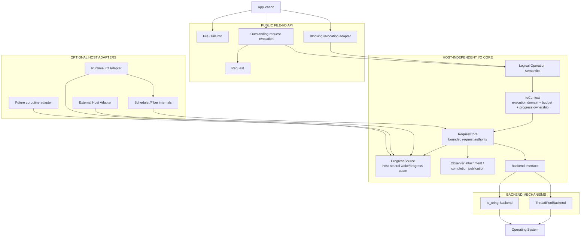

## Normative dependency direction

```text
File / logical semantics
        ↓
explicit execution domain
        ↓
request core
        ↓
backend mechanism

observer/host adapters attach from the side.
Scheduler/Fiber is never below the request core.
```

---

# 5. Public architecture

The target public concepts are fixed even if final spelling changes cosmetically.

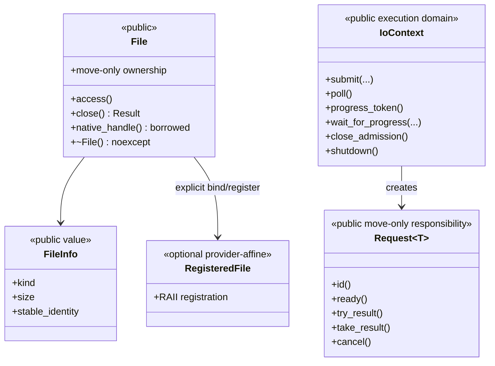

## 5.1 `File`

`File` owns the native resource and logical access contract.

Target properties:

```text
move-only
no hidden provider ownership
no Scheduler/Fiber state
explicit close for observable close failure
noexcept destructor as deterministic cleanup backstop
native handle exposure is a borrow/interop boundary
```

`File` is execution-neutral where the platform permits.

Provider-specific registration is represented separately (`RegisteredFile` is the conceptual name), not by mutating ordinary `File` semantics.

## 5.2 `FileInfo`

v1 canonical metadata is intentionally small:

```text
kind
size
stable identity sufficient for same-file checks where supported
```

It is not a wrapper around every field of POSIX `stat`.

## 5.3 `IoContext`

`IoContext` is the v1 owning execution domain.

It owns:

```text
one backend implementation
one bounded RequestCore
one progress source
context identity
the admission state
execution/resource budget configuration
```

It does **not** own application task semantics.

Exactly one active **progress owner** drives a given `IoContext` at a time. Multiple request observers may exist, but multiple unrelated drivers may not concurrently poll/reap the same context unless a later architecture amendment defines such a mode.

## 5.4 `Request<T>`

`Request<T>` is the public representation of an accepted operation whose responsibility escapes the initiating call.

Target rules:

- move-only;
- context-bound identity `{context, slot, generation}` or equivalent;
- typed observation over an internal terminal result;
- can query readiness;
- can request best-effort cancellation;
- result consumption releases the public request binding/storage when safe;
- stale identities cannot affect reused storage;
- no `detach()` for borrowed buffers in v1.

A `Request<T>` destroyed while still outstanding is a **contract violation** in the low-level API because arbitrary-host destruction cannot safely auto-wait without changing the invocation contract. Debug/fail-fast enforcement is acceptable. High-level scoped adapters MUST prevent this state from escaping.

A ready-but-unconsumed `Request<T>` may release/discard its result during destruction once backend/observer references are already retired.

---

# 6. Logical operation set for v1

The canonical operation vocabulary is fixed as follows.

| Operation | Blocking completed-return | Outstanding request | v1 status |
|---|---:|---:|---|
| open | YES | NO | required |
| close | YES / explicit | NO | required + RAII fallback |
| read_at | YES | YES | required |
| write_at | YES | YES | required |
| read shared cursor | YES | NO | required blocking convenience |
| write shared cursor | YES | NO | required blocking convenience |
| sync_data | YES | YES | required |
| sync_all | YES | YES | required |
| file_info / size | YES | YES | required |
| resize | YES | NO | required blocking; async deferred |
| async open | — | NO | deferred |
| async close | — | NO | deferred |
| async shared-cursor read/write | — | NO | deferred pending ordering semantics |

This table is a v1 implementation decision, not a claim that every operation must be symmetric.

## 6.1 Shared semantic rules

All invocation forms share:

- access legality;
- closed-resource behavior;
- zero-length behavior;
- offset/range validity;
- short I/O meaning;
- EOF meaning;
- partial-effect reporting rules;
- durability meaning;
- native error classification;
- capability/admission distinction.

Backend queue timing must not redefine these semantics.

---

# 7. Invocation forms

The architecture fixes three invocation forms.

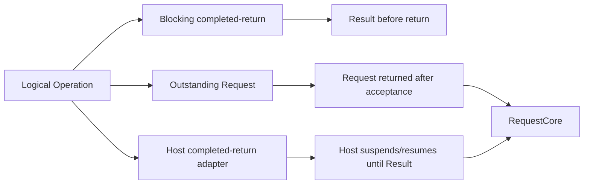

## 7.1 Blocking completed-return

Examples remain in a blocking adapter namespace/module.

Contract:

```text
return => operation terminal
return => no internal borrow remains
current caller thread may block
```

Blocking is an invocation choice, not a separate file-semantic world.

## 7.2 Outstanding-request invocation

Canonical low-level asynchronous form:

```text
submit
  ├─ rejected: returns error, no borrow, no background effect
  └─ accepted: returns Request<T>, operation may still be in flight
```

No accepted operation may be hidden behind a returned ordinary error without returning the outstanding responsibility.

## 7.3 Host completed-return adapter

A supported host may turn submit + observe + settle into sequential-looking completed-return code.

Examples:

- Sluice stackful I/O runtime adapter;
- future coroutine adapter.

Contract:

```text
host is explicit
suspension mechanism is explicit in the host model
return => request terminal and hidden borrow ended
```

A plain provider parameter alone does not make arbitrary ordinary C++ call stacks suspendable.

---

# 8. RequestCore: concrete implementation authority

`RequestCore` is the only authority for accepted-request identity, lifecycle, terminal winner, result storage, reclaim eligibility, and per-request observer attachment state.

The target public API no longer requires caller-owned `Completion<T>` as the canonical result authority.

`Completion<T>` may remain temporarily as a migration adapter but is not part of the final v1 architecture.

## 8.1 Slot storage

The v1 implementation uses a bounded slot table.

Each slot contains conceptually:

```text
generation
request key/context identity
operation kind
borrow metadata
request lifecycle state
backend/control reference accounting
terminal result storage
public publication state
optional observer attachment metadata
reclaim state
```

Result storage lives with the bounded request slot, not in a caller-owned completion object.

This removes the requirement that every result type be default-constructible/copyable merely because completion storage is caller-owned.

## 8.2 Request identity

```text
RequestId = { context_identity, slot_index, generation }
```

Equivalent compact representation is allowed.

Required properties:

- slot reuse increments generation;
- stale generation cannot cancel/query/consume a new request;
- context identity prevents cross-context confusion;
- identity remains valid through terminal publication until public release/reclaim.

## 8.3 Request lifecycle

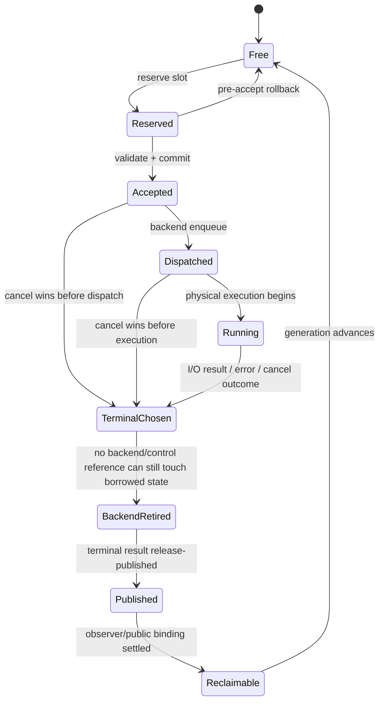

Not every request must physically visit `Dispatched` or `Running`. The required contract is the partial order, not exact enum count.

## 8.4 Terminal authority

Exactly one terminal outcome wins.

Safety obligation:

```text
accepted request -> at most one terminal winner
```

Liveness obligation, conditional on explicit environment assumptions:

```text
accepted request + continued progress + OS/backend eventual response
    -> eventually a public terminal becomes observable
```

These are separate proof obligations.

---

# 9. Observation is a separate protocol

Observer state is orthogonal to request state.

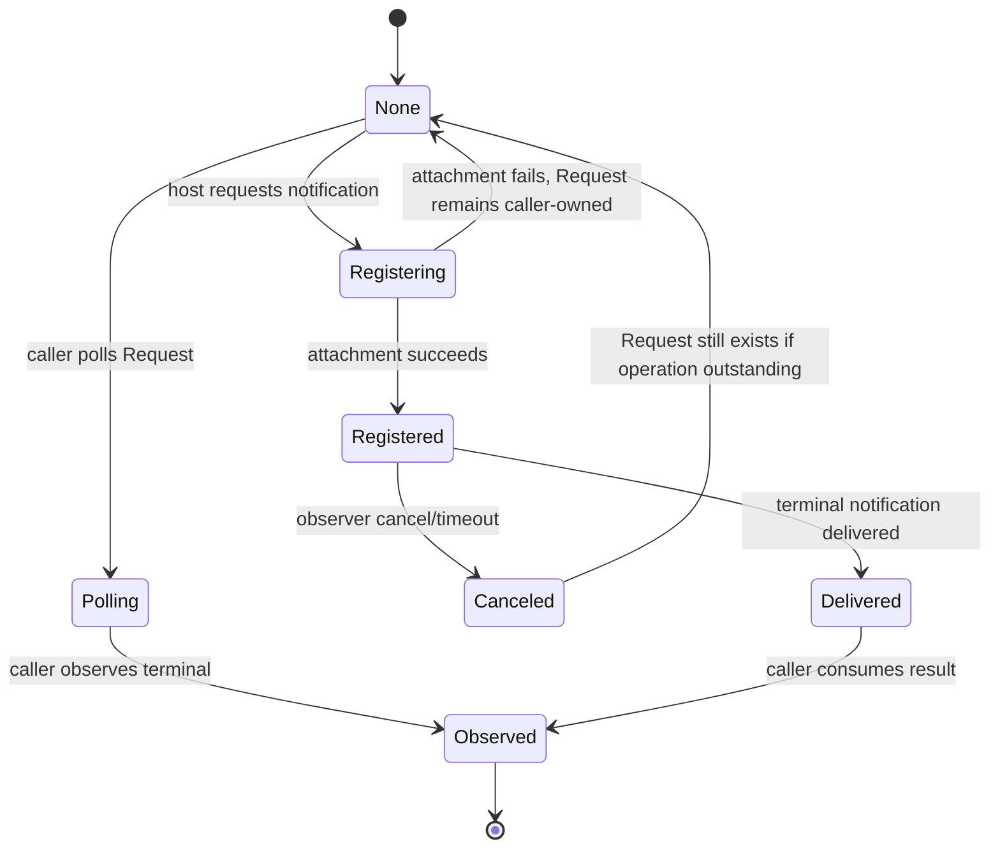

Required cross-invariants:

1. observer registration failure does not revoke an accepted request;
2. observer timeout/cancel does not end File/buffer borrow;
3. terminal may occur before, during, or after observer registration;
4. observer setup failure must never orphan an accepted request;
5. reclaim waits for all references capable of publication/delivery to retire;
6. notification may be delivered at most once for a specific registration generation;
7. public result observation must see all writes covered by terminal publication.

## 9.1 Eliminate the current post-accept hidden-wait failure class

A scoped host adapter MUST satisfy one of these two patterns:

```text
A. reserve required observation resources before request acceptance

or

B. if observation attachment fails after acceptance,
   retain and settle the Request internally before returning
```

It may not return an ordinary wait error while hiding an outstanding request and its active borrow.

---

# 10. Progress ownership and host-neutral notification seam

A context has one active progress owner.

The core distinguishes:

```text
PROGRESS AVAILABLE
    the progress owner should wake and poll/reap

PUBLIC TERMINAL
    a specific Request is now observable as terminal
```

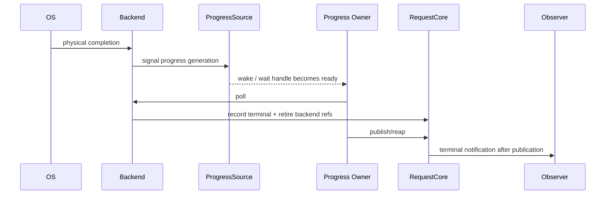

## 10.1 `ProgressSource`

Target responsibilities:

- monotonic progress generation/token;
- blocking wait for change for owned-driver mode;
- bounded wait where platform supports it;
- explicit interrupt/control wake;
- optional native wait handle for external-host integration.

For the Linux-first v1 external-host path, a pollable notification primitive such as `eventfd` is the preferred implementation direction. ThreadPool and io_uring adapters may signal it differently; the public semantic contract is the same.

A condition variable may remain an internal owned-driver optimization but is not sufficient by itself to satisfy W3 external event-loop integration.

---

# 11. Backend contract

The backend is a mechanism implementation behind the request core.

Backends MUST NOT know about `Scheduler`, `Fiber`, `WaiterToken`, `RoutingLease`, task groups, or host-specific continuation identities.

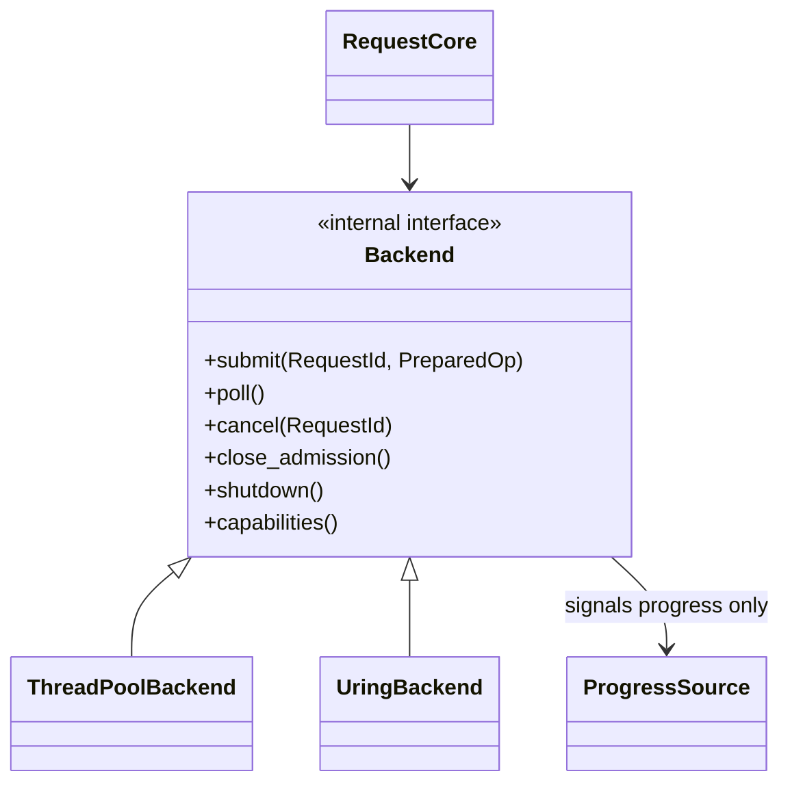

## 11.1 Backend responsibilities

A backend owns:

- physical dispatch/execution;
- backend-private queues/rings/workers;
- OS/kernel reference retirement;
- translation of physical outcomes into the shared terminal-result domain;
- best-effort physical cancellation capability;
- progress signaling.

A backend does not own:

- logical File access semantics;
- public Request identity authority;
- public observer identities;
- Scheduler routing;
- final public API error precedence beyond declared backend capabilities.

## 11.2 Backend capabilities

Capabilities are queryable/configurable and include at least:

```text
supported operation kinds
max accepted length/range restrictions
cancellation strength
bounded/native wait integration
registered-resource support
backend availability
```

Different permitted physical traces are acceptable if both backends refine the same observable contract.

---

# 12. Cancellation and timeout

Operation cancellation and observation cancellation are separate.

## 12.1 Operation cancellation

`Request<T>::cancel()` targets the operation.

Semantic outcomes must distinguish at least:

```text
cancel won before terminal
cancel requested / physical interruption best-effort
already terminal
request not found/stale
backend does not support stronger physical cancellation
```

Exact enum spelling may be adjusted, but these semantic classes must remain expressible.

Cancellation does not imply rollback of partial file effects.

## 12.2 Wait timeout / observer cancellation

Timeout or observer cancellation means:

```text
stop waiting / stop this observer registration
```

It does not mean:

```text
operation canceled
request terminal
borrow ended
buffer reusable
```

A scoped API that promises to return without an outstanding responsibility must continue settlement internally after requesting cancellation.

---

# 13. RAII and lifetime model

RAII is a hard architectural requirement.

## 13.1 File RAII

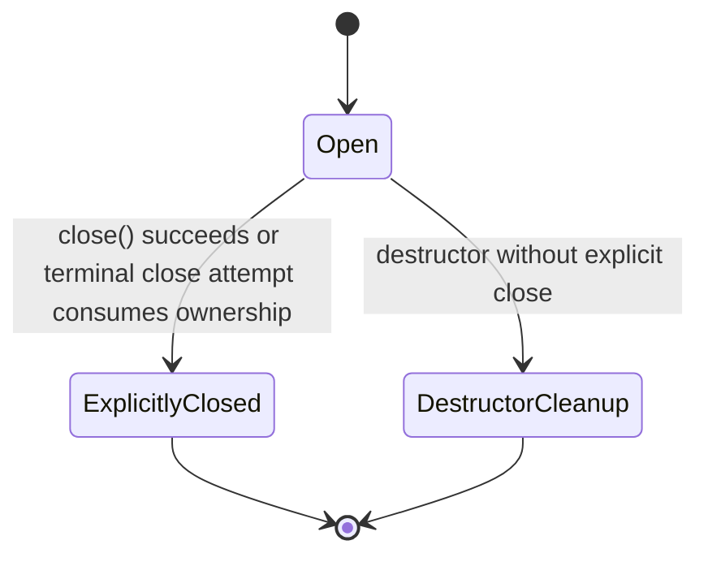

Rules:

1. `File` is move-only ownership.
2. `File::~File()` is `noexcept`.
3. Destruction releases the owned native resource.
4. Explicit `close()` exists so close failure can be observed/reported.
5. Durability is not implied by close; `sync_data/sync_all` are separate.
6. Provider lifetime is not a hidden prerequisite for ordinary File destruction.
7. No “Zig parity” argument may weaken these rules.

## 13.2 Borrow rules

On accepted operations:

```text
File/native resource remains valid
write source memory remains readable and unmodified
read destination memory remains exclusively writable by the operation
```

The borrow ends at **public terminal publication**, not at wait cancellation and not merely at backend physical completion.

Low-level outstanding APIs expose this obligation explicitly.

High-level completed-return adapters guarantee the borrow has ended before returning.

## 13.3 Provider-affine resources

Optimizations such as registered files/buffers use separate RAII binding objects.

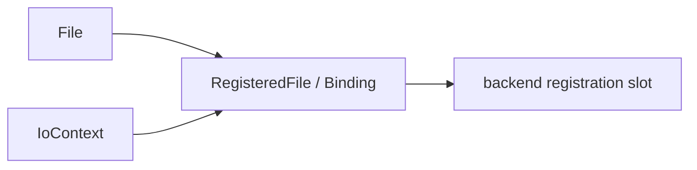

Destroying a binding settles/unregisters the provider-specific relation without changing ordinary File ownership semantics.

---

# 14. Error model

The implementation MUST keep these error domains conceptually distinct:

```text
1. validation / semantic rejection
2. admission/resource exhaustion
3. operation terminal error
4. observation/wait outcome
5. context/backend health error
6. setup/construction failure
```

An API may encode some domains in related types, but must not erase the distinction.

Examples:

```text
invalid access       = semantic rejection
request table full   = admission failure
EIO / short read     = operation outcome
wait timed out       = observation outcome
backend poisoned     = context/backend health
worker spawn failure = setup failure
```

---

# 15. Resource-budget model

Sluice v1 is bounded by design.

## 15.1 Public execution budget

`IoContext` configuration exposes at least:

```text
request_capacity
backend worker/ring configuration
progress/wait integration policy
```

The target design avoids an unrelated hidden waiter-capacity failure after request acceptance for the canonical Request API.

If a host adapter needs separate observer storage, that budget belongs to the adapter and must be reserved before acceptance or safely recoverable as described in §9.1.

## 15.2 Backend queues

Backend dispatch capacity must be compatible with request admission.

The preferred invariant is:

```text
accepted request => backend has a defined path to terminal
```

A request may not be committed into semantic acceptance and then become permanently unserviceable because an unmodeled second queue has no capacity.

## 15.3 Runtime/task budget

The optional runtime adapter has its own task/stack budget. It is not allowed to hide unbounded growth behind the bounded I/O request contract.

---

# 16. Threading and synchronization model

## 16.1 RequestCore synchronization

Correctness-first v1 target:

- one core mutex (or equivalent serialized authority) protects structural request-slot transitions, generation, observer attachment metadata, reclaim state, and terminal-winner bookkeeping;
- result publication uses a release/acquire visibility boundary where observation occurs lock-free;
- backend-private queues/rings use backend-private synchronization;
- host callbacks/notifications are not invoked while holding the RequestCore structural mutex;
- backend locks must not call host/Scheduler code;
- lock ordering is documented before any multi-lock path is introduced.

This intentionally favors a simple authority model before lock-splitting optimization.

## 16.2 Progress owner

At most one progress owner actively polls/reaps an `IoContext` at a time.

Possible owners:

```text
external host loop
owned blocking driver
Sluice runtime adapter
future coroutine integration driver
```

Ownership transfer, if supported later, must be explicit and quiescent.

## 16.3 Multi-worker task scheduling

Multi-worker Scheduler/Fiber execution is **not a v1 core requirement**.

I/O concurrency comes from multiple outstanding requests plus backend concurrency.

The v1 runtime adapter may use a single scheduler/progress owner. Existing multi-worker `run_live` code may remain during migration but has no permanent product authority until separately accepted and verified.

---

# 17. Optional runtime adapter: final v1 position

The current D2/ApplicationRuntime path is not the core architecture.

The v1 target is a **narrow file-I/O control-flow adapter**:

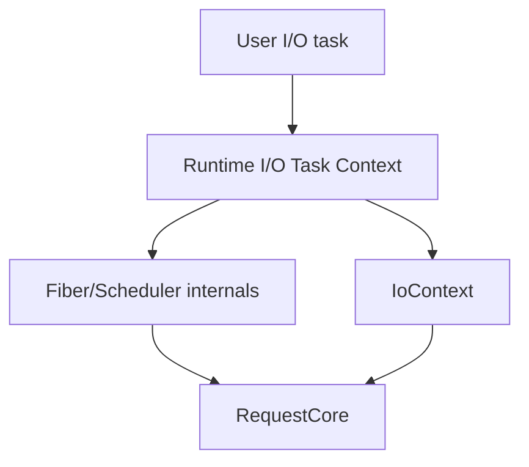

The adapter may provide completed-return file operations by:

```text
submit request
attach/reserve host observation
suspend fiber
resume after public terminal
consume result
return Result<T>
```

For v1 it does not claim to be a general-purpose task runtime product.

Therefore:

- public Event/Semaphore/AsyncMutex/Condition/RwLock/Queue/select are not part of the file-I/O v1 target;
- `Group/Future` may be internalized or reduced to the minimum structured lifetime mechanism required by the adapter;
- if a future release promotes a general task runtime to product status, runtime-aware synchronization becomes a separate architecture project.

---

# 18. Shutdown and teardown protocol

Shutdown is a first-class protocol, not destructor trivia.

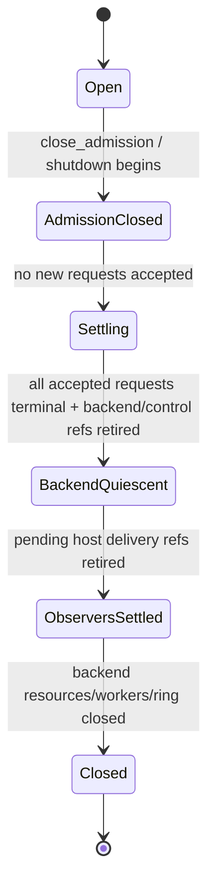

## 18.1 Required order

1. close new admission;
2. establish cancellation/shutdown policy for accepted work;
3. continue progress until accepted requests reach public terminal;
4. retire backend/control references;
5. retire observer-delivery references;
6. reclaim request storage;
7. stop/join backend workers or close ring resources;
8. close progress source;
9. mark context closed.

## 18.2 Explicit shutdown and destructor

`IoContext::shutdown()` is the observable shutdown path and may return an error/health result.

`IoContext::~IoContext()` is `noexcept` and performs a best-effort deterministic cleanup fallback. It may block to join owned execution resources, analogous to other owning C++ concurrency objects; it may not leak worker/ring/native resources merely because explicit shutdown was omitted.

Destroying a context while caller-owned outstanding `Request<T>` objects still exist is a contract violation unless the implementation has already settled them as part of shutdown and invalidated them safely.

---

# 19. Backend refinement contract

ThreadPool and io_uring are tested against the same logical contract.

Conformance is based on:

```text
same validation semantics
same acceptance/rejection categories
same borrow rules
same at-most-once terminal rule
same public publication rule
same request identity/reuse safety
same shutdown/settlement obligations
same partial-effect semantics
explicitly declared capability differences
```

Conformance does **not** require:

```text
identical completion timing
identical cancel winner
identical short-I/O byte count
identical internal queue trace
identical kernel interaction
```

---

# 20. Reliability and formalization plan

Evidence follows risk, not file count.

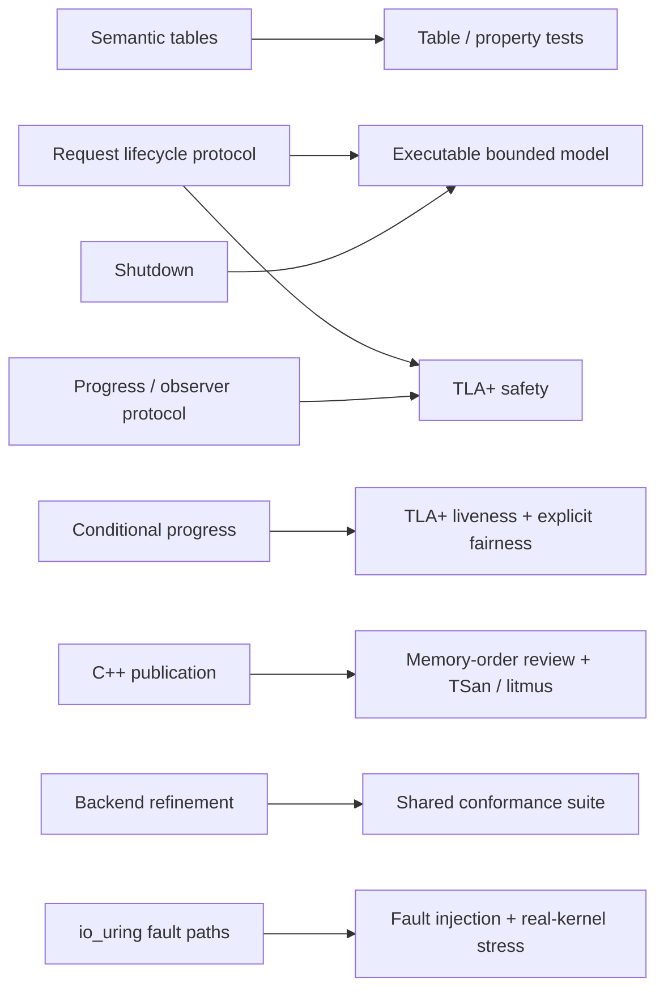

## 20.1 Formal target protocol

The central model is not `Event` or `Semaphore`; it is the product protocol:

```text
admission/rejection
borrow activation
request identity/generation
operation-vs-cancel terminal winner
backend/control-reference retirement
public terminal publication
observer attach/cancel/deliver
result consumption
storage reclaim
admission close/shutdown
```

## 20.2 Safety properties

At minimum:

```text
S1 rejected request has no background effect
S2 accepted request has at most one terminal winner
S3 stale identity cannot affect reused slot
S4 public terminal is not visible before required backend writes/results are visible
S5 borrow cannot end before public terminal
S6 reclaim cannot occur while backend/control/observer references remain live
S7 observer failure cannot orphan an accepted request
S8 shutdown never destroys an owner still referenced by backend/observer state
```

## 20.3 Liveness properties

Under explicit assumptions:

```text
L1 continued progress + eventual backend response => accepted request eventually public-terminal
L2 runnable progress owner + wake obligation => progress owner eventually observes work
L3 admission closed + finite accepted set + backend eventual response => shutdown converges
```

Fairness/environment assumptions are written explicitly; they are not smuggled in as the conclusion.

---

# 21. Current-to-target migration map

| Current component | Target disposition |
|---|---|
| `sluice::File` | KEEP as canonical resource; strengthen/document RAII/interop contract |
| `blocking::*` | KEEP as completed-return invocation adapter; centralize semantics |
| `NativeFileRef` | INTERNAL mechanism/borrow representation; no ownership authority |
| `AsyncIoContext` | CONVERGE into target `IoContext` execution domain |
| caller-owned `Completion<T>` | MIGRATE OUT of canonical public architecture; temporary compatibility adapter only |
| `RequestArena` | CONVERGE into `RequestCore`; preserve proven lifecycle obligations, not exact enum layout |
| `RequestHandle` | CONVERGE into public typed `Request<T>` / internal `RequestId` split |
| backend waiter registration using `WaiterToken/RoutingLease` | REMOVE from backend contract; move host observation above RequestCore |
| `BackendWaitSource` | CONVERGE into host-neutral `ProgressSource` |
| `ThreadPoolBackend` | KEEP mechanism; remove Scheduler vocabulary; conform to shared contract |
| `UringAsyncBackend` | KEEP mechanism; same refinement contract + real-kernel fault evidence |
| `op_helpers` busy polling | REPLACE by canonical Request API + progress seam |
| `await_op_helpers` | CONVERGE into runtime host adapter; must guarantee settlement on every return path |
| `ApplicationRuntime` | REDUCE/CONVERGE into optional narrow I/O runtime adapter |
| `Scheduler/Fiber` | INTERNAL to optional runtime adapter; not I/O-core authority |
| `Group/Future/WaitPolicy` | INTERNALIZE/REDUCE to adapter lifetime needs; no automatic public product status |
| Event/Semaphore/AsyncMutex/Condition/RwLock/Queue/select | OUTSIDE v1 file-I/O target; preserve only implementation substrate actually required |
| legacy Reader/Writer/FileReader/FileWriter/IoContext | RETIRE from canonical architecture after compatibility/migration audit |
| `src/experimental` public headers without build | resolve delivery boundary: supported experiment or remove from public install surface |

---

# 22. Implementation sequence

The code repair phase MUST follow this order.

## Phase A — Semantic authority extraction

1. centralize File operation validation and shared semantic rules;
2. freeze `FileInfo` minimal semantics;
3. establish shared backend conformance tables;
4. no Scheduler refactor yet.

**Exit:** blocking and async paths consume one semantic authority.

## Phase B — RequestCore introduction

1. introduce bounded `RequestCore` with context/slot/generation identity;
2. move terminal result authority into request slots;
3. introduce move-only `Request<T>`;
4. adapt one backend first, then the second;
5. preserve old Completion APIs only through compatibility shims.

**Exit:** canonical async operation no longer requires caller-owned Completion.

## Phase C — Host-neutral progress/observation seam

1. remove Scheduler-specific waiter types from Backend interface;
2. introduce `ProgressSource`;
3. move observer registration/delivery above backend;
4. provide non-busy external-host path for Linux-first v1;
5. model request × observer races.

**Exit:** RequestCore/backend compile and operate without Scheduler/Fiber dependency.

## Phase D — Runtime adapter convergence

1. rewrite `RuntimeTaskContext` completed-return helpers over Request API;
2. reserve observation resources before acceptance or retain Request until settlement;
3. reduce ApplicationRuntime/Group/Scheduler to narrow I/O-host responsibilities;
4. single progress owner is the v1 supported runtime configuration;
5. multi-worker host becomes explicitly experimental/deferred.

**Exit:** sequential-looking I/O tasks work without redefining request semantics.

## Phase E — Capability closure

Implement the v1 operation matrix:

```text
async file_info/size
request cancellation disposition
explicit progress wait/interrupt
shutdown contract
resource budget observability
```

**Exit:** W1–W4 accepted workloads can be expressed without raw internal mechanisms.

## Phase F — Structural retirement

After replacement paths exist:

```text
retire legacy FileReader/FileWriter world
remove/publicly retire dormant primitive product surface from v1
resolve experimental include/build mismatch
remove duplicate routing/wait paths
remove compatibility Completion APIs when no retained consumer requires them
```

**Exit:** public tree reflects the target architecture.

## Phase G — Performance

Only after correctness architecture is stable:

```text
measure request-core lock contention
completion/reap batching
wake amplification
allocation
slot lookup
io_uring batching/registered resources
```

Optimization must preserve the protocol invariants above.

---

# 23. Rejected alternatives and rationale

## R1 — Permanent blocking-vs-async product split

Rejected because execution mechanism and observation contract are independent axes. The split may remain as API adapters, not semantic authority.

## R2 — Copy Zig `Io` API literally

Rejected because C++ ordinary functions cannot become transparently suspendable merely by receiving a provider, and C++ RAII/destructor rules differ materially.

## R3 — Make Scheduler/Fiber the I/O core

Rejected because W3 requires host-independent I/O and because backend/request correctness does not inherently require a task runtime.

## R4 — Put Scheduler waiter identity into backend protocol

Rejected because it couples physical execution mechanism to one host observation model.

## R5 — Keep caller-owned Completion as canonical result storage

Rejected as the final target because it leaks bookkeeping into ordinary use, complicates hidden/scoped calls, constrains result types, and duplicates bounded request/result authority.

Compatibility support may remain during migration.

## R6 — Make File permanently provider-bound

Rejected because ordinary POSIX-like resources are execution-neutral and optimized affinity is better represented as an explicit binding/registration relation.

## R7 — Promise any File works with any provider

Rejected because IOCP/registered-resource/platform affinity can impose real compatibility constraints.

## R8 — Auto-detach outstanding borrowed requests

Rejected because borrowed File/buffer lifetime cannot be made safe by forgetting the Request object.

## R9 — Make Request destructor silently block/cancel to completion in every host

Rejected because that would introduce hidden control-flow/blocking semantics and may deadlock arbitrary external hosts. Low-level outstanding responsibility remains explicit; scoped adapters provide safe automatic settlement.

## R10 — Use existing formal coverage as architecture retention authority

Rejected. Models migrate with architecture; they do not own product scope.

---

# 24. Paper-ready design claims

The architecture is deliberately organized around claims that can later be evaluated experimentally or formally.

## Claim C1 — Semantic decoupling

One logical File contract can be refined by multiple physical execution backends without giving each backend its own file semantics.

## Claim C2 — Host decoupling

A bounded request core can support both an external-host integration and a stackful convenience host without embedding Scheduler identity in the backend contract.

## Claim C3 — Lifecycle separation

Modeling request state and observer state as orthogonal protocols removes the hidden assumption that every accepted request must successfully allocate/register a waiter.

## Claim C4 — Explicit boundedness

Admission capacity, observer capacity, and task-host capacity are independently owned and failure-visible rather than collapsed into one ambiguous “async capacity”.

## Claim C5 — C++-native lifetime safety

Zig-inspired explicit execution can coexist with C++ RAII by keeping resource ownership deterministic while making outstanding borrow/settlement responsibility explicit.

## Claim C6 — Verification alignment

Formal effort is concentrated on load-bearing request/observer/shutdown protocols instead of public abstraction count.

These claims define natural evaluation sections for future technical reports or papers.

---

# 25. Evidence strategy for a future paper

A future paper/report can evaluate:

```text
Correctness
    mutation/model counterexamples caught
    request/observer interleaving coverage
    backend conformance

Architecture
    public/internal authority count before vs after
    Scheduler-specific dependencies removed from I/O core
    number of duplicate I/O semantic paths

Resource control
    peak request storage
    observer storage
    long-run task/runtime storage

Performance
    throughput/latency vs request depth
    ThreadPool vs io_uring
    wake amplification
    batching
    lock contention

Usability
    W1 ordinary utility code size
    W2 bounded pipeline code
    W3 external-host integration
    W4 sequential task adapter
```

Performance alone does not validate the architecture; preservation of lifetime and settlement invariants is mandatory.

---

# 26. External design references

These informed the architecture but are not normative dependencies.

- Zig 0.16.0 release notes — explicit `Io`, Threaded/Evented, Operation/Batch, Future/Group: https://ziglang.org/download/0.16.0/release-notes.html
- Zig 0.16.0 release source: https://ziglang.org/download/0.16.0/zig-0.16.0.tar.xz
- WG21 P2300R10, `std::execution`: https://www9.open-std.org/JTC1/SC22/WG21/docs/papers/2024/p2300r10.html
- WG21 P0443R14, Unified Executors: https://www.open-std.org/jtc1/sc22/wg21/docs/papers/2020/p0443r14.html
- WG21 P1322R2, Networking TS custom I/O executors: https://open-std.org/jtc1/sc22/wg21/docs/papers/2020/p1322r2.html
- WG21 P4003R3, A Minimal Coroutine Execution Model: https://www.open-std.org/jtc1/sc22/wg21/docs/papers/2026/p4003r3.pdf
- Boost.Asio asynchronous-operation model and associated executors: https://www.boost.org/latest/doc/html/boost_asio/reference/asynchronous_operations.html
- Windows I/O completion ports / handle association: https://learn.microsoft.com/en-us/windows/win32/fileio/createiocompletionport
- Linux `io_uring_register(2)` registered resources: https://man7.org/linux/man-pages/man2/io_uring_register.2.html
- C++ Core Guidelines, RAII/resource rules: https://isocpp.github.io/CppCoreGuidelines/CppCoreGuidelines
- WG21 N3679, async future destructors and lifetime safety: https://www.open-std.org/jtc1/sc22/wg21/docs/papers/2013/n3679.html
- WG21 P3149R6, `async_scope` and structured lifetime: https://www9.open-std.org/JTC1/SC22/WG21/docs/papers/2024/p3149r6.html

---

# 27. Final architecture statement

> **Sluice v1 is an explicit file-I/O C++ library built around one canonical `File` semantic authority, an explicit `IoContext` execution domain, a bounded generation-safe `RequestCore`, typed move-only `Request<T>` outstanding responsibility, a host-neutral progress/completion seam, replaceable ThreadPool/io_uring backends, and C++ RAII as a non-negotiable ownership rule. Blocking calls, outstanding requests, and host-suspended completed-return calls are invocation forms over the same logical semantics. Request lifecycle is separate from observer lifecycle; progress availability is separate from public terminal publication; the optional Scheduler/Fiber runtime consumes the I/O core rather than defining it. Formal verification targets the load-bearing request/observer/shutdown protocols and does not determine product ownership.**

This document is the implementation authority for the next code-repair phase.