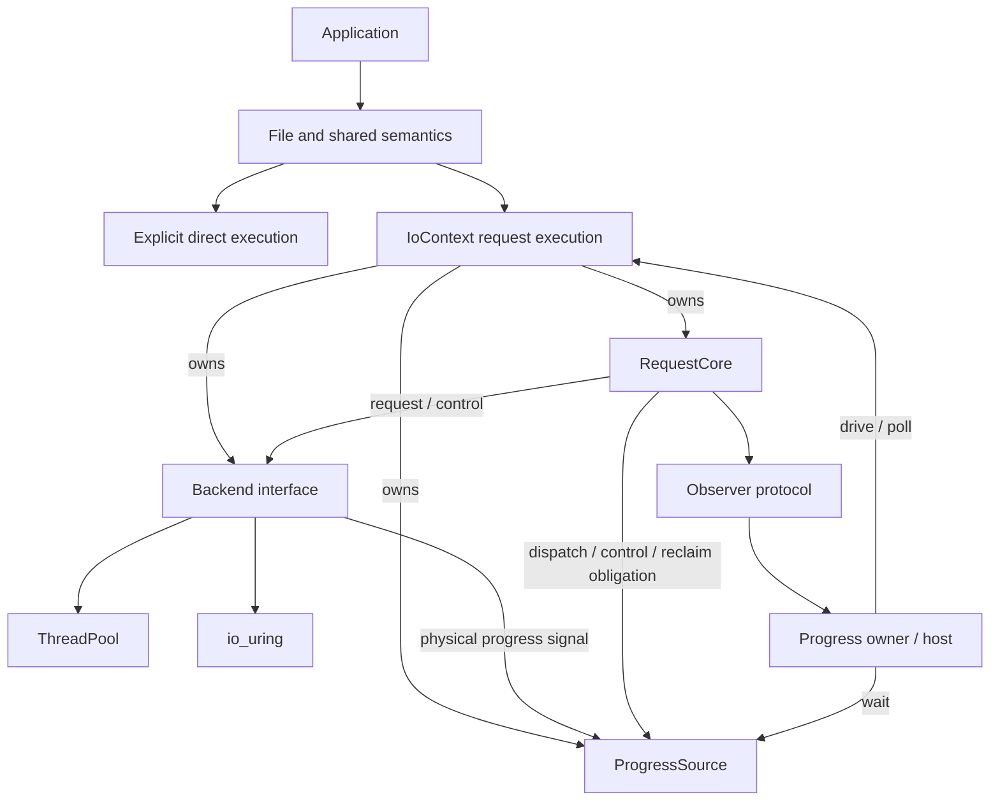
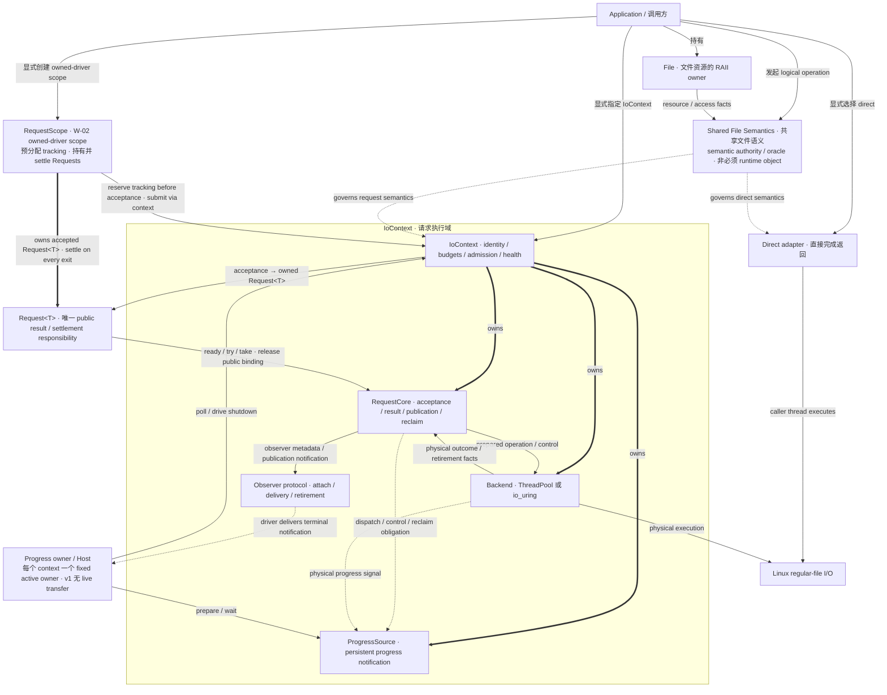
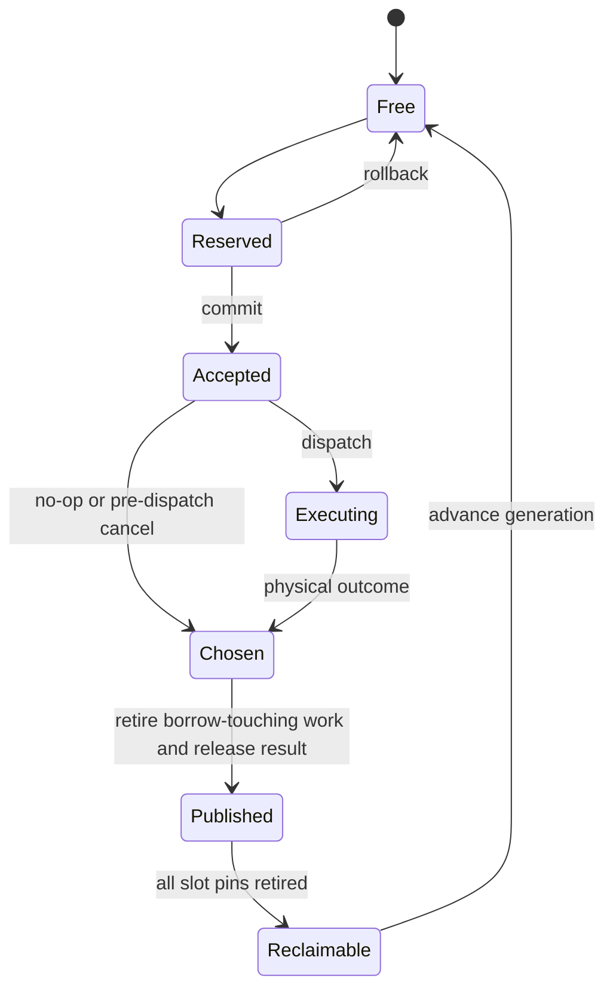
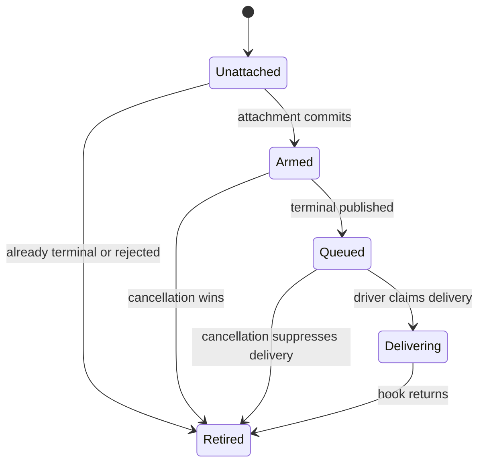
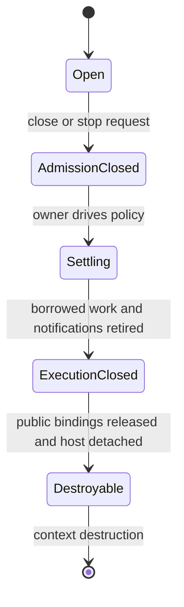

# Sluice v1 Architecture and Contract Reference

| Document field | Value |
|---|---|
| Revision | v1-r3 |
| Role | Sole normative root for the Sluice v1 convergence target |
| Canonical source | `jnhu76/Sluice` / `docs/explicit-io-v1-final-decision.md`; adopted repository revision under GOV-05 |
| Implementation baseline | `c64f005e6e59e791f26a7ab4a594c33954f096dd` |
| Adoption | Replaces the earlier PR #389 target; merging adopts this revision in the repository |
| Conformance | Not established by adoption; implementation and evidence belong in the [v1 conformance ledger](roadmap/v1-conformance.md) |

This document is the design scaffold, contract dictionary, and decision reference for subsequent ADRs, C++ changes, tests, and formal models. It specifies the target rather than claiming that current code already implements it. A production bug does not amend this specification; a specification defect is repaired explicitly, with its affected requirements and evidence identified.

## Reading and lookup

| Question | Start here | Requirement family |
|---|---|---|
| What wins when documents disagree? | [0. Authority](#0-authority-and-change-control) | GOV |
| What is the product and supported scope? | [1. Product](#1-product-and-release-scope), [3. Workloads](#3-reference-workloads) | PROD, W |
| What does a term mean? | [2. Dictionary](#2-contract-dictionary) | TERM |
| Who owns which responsibility? | [4. Architecture](#4-architecture-and-authorities) | ARCH |
| How are execution and waiting chosen? | [5. Invocation](#5-execution-and-invocation) | INV |
| What does each File operation mean? | [6. File semantics](#6-canonical-file-semantics) | SEM |
| What can fail, and with what effects? | [7. Results and errors](#7-results-errors-and-partial-effects) | ERR |
| When may a buffer, handle, or slot be released? | [8. Requests](#8-requestcore-and-admission), [9. Handles](#9-request-handles-and-raii), [12. Lifetime](#12-file-and-binding-lifetime) | REQ, HANDLE, LIFE |
| How do notification and progress work? | [10. Observation](#10-observation-protocol), [11. Progress](#11-progress-and-external-host-integration) | OBS, PROG |
| Which concurrent calls are legal? | [13. Threading](#13-threading-and-reentrancy) | THREAD |
| How do cancellation and shutdown finish safely? | [14. Cancellation](#14-cancellation-and-timeouts), [17. Shutdown](#17-shutdown-and-context-destruction) | CANCEL, SHUT |
| What do backends and optional hosts implement? | [15. Backends](#15-backend-refinement), [16. Hosts](#16-optional-host-and-scoped-adapters) | BACKEND, HOST |
| What evidence permits a phase or release to close? | [18. Bounds](#18-resource-bounds), [19. Evidence](#19-verification-and-acceptance), [20. Migration](#20-migration-sequence-and-disposition) | BOUND, VERIFY, MIG |
| What may an ADR still choose? | [21. Decision boundary](#21-delegated-decisions-and-rejected-alternatives) | ADR |

Function/type names below are conceptual unless a rule explicitly freezes an observable behavior. A renamed method must preserve that behavior. The numbered examples and pseudocode are not claims of existing C++ APIs.

# 0. Authority and change control

## GOV-01 Sole normative root

This file owns v1 product scope, public behavior, responsibility boundaries, lifetime rules, and acceptance obligations. MUST / MUST NOT denote requirements; MAY denotes a permitted choice. SHOULD denotes a default whose documented deviation must still satisfy every MUST. Sections 0–21 are normative unless text is labeled **Rationale** or **Example**. Section 22 is informative.

No omitted public contract may be invented by a backend, implementation PR, test, model, issue, or ADR. An omission that changes caller-visible behavior requires an amendment here before or in the same PR as its implementation. Local representation choices explicitly delegated by ADR-01 do not require amendments.

## GOV-02 Authority versus evidence

| Artifact | Authority and limits |
|---|---|
| This root specification | Defines the v1 target and resolves technical contract conflicts |
| New ADR | Derives an implementation decision from named requirements; cannot override the root |
| `AGENTS.md` | Gives repository working instructions consistent with this target |
| C++ headers and implementation | Establish what a particular commit actually does; discrepancies are conformance gaps |
| Tests, executable models, TLA+, Lean, measurements | Supply scoped evidence; neither select product scope nor amend semantics |
| `docs/roadmap/v1-conformance.md` | Tracks implementation/evidence by requirement and commit; cannot relax requirements |
| README and architecture views | Navigation or explicitly dated summaries |
| Issues, PR reports, external references | Discussion, rationale, or evidence; no independent normative force |

The root does not certify an implementation by describing it. An implementation ledger must distinguish `NOT_ASSESSED`, `GAP`, `IMPLEMENTED_UNVERIFIED`, `VERIFIED`, and `DEFERRED_OUT_OF_SCOPE`; a required v1 feature cannot use the last status.

## GOV-03 Supersession

| Earlier source | Status for v1 |
|---|---|
| `docs/archive/architecture/mission.md`<br>(formerly `docs/mission.md`) and ADR-0001 | Historical rationale; principles retained in PROD-01 and ARCH-01; no separate higher authority |
| ADR-0002 and its visual companion | Superseded as normative architecture; accepted File semantics are restated in sections 6–7 and 12 |
| `docs/archive/explicit-file-roadmap/explicit-file-conformance.md`<br>(formerly `docs/roadmap/explicit-file-conformance.md`) | Historical conformance to the previous architecture; its CLOSED/CONFORMANT labels do not establish v1 conformance |
| `docs/archive/architecture/architecture.md`<br>(formerly `docs/architecture.md`) | Dated implementation snapshot, not the target |
| Issues #387 / #388 | Baseline reconstruction / risk evidence respectively; claims require source and scope checks |
| Earlier revisions of this file | Replaced by the current committed revision; Git preserves decision history |

Historical documents keep their old text for traceability under an explicit supersession banner. No historical clause is silently incorporated by reference. If a rule must govern v1, it appears here.

## GOV-04 Amendment and traceability

Requirement IDs, such as `SEM-04` or `REQ-06`, are stable within v1 and MUST NOT be reassigned. A substantive change increments the revision and records changed IDs, reason, compatibility impact, migration, and required evidence in section 23. Editorial fixes that do not change an allowed behavior need no new architecture decision.

Every architecture-changing PR identifies: affected IDs; behavior before/after; implementing owner; workload; tests/model/fault evidence; remaining limitations; ledger update. A new ADR lists its parent IDs and delegated choices. Any new public guarantee first enters this root. Evidence references must name a commit/configuration; a green test run alone is not a claim of universal correctness.

## GOV-05 Canonical revisions and portable snapshots

The canonical source is this path in `jnhu76/Sluice`, under repository version control. The revision adopted on `master` governs current repository convergence; a published release remains interpretable against its recorded specification revision. An open PR is a proposed amendment until merged. Work reviewing or implementing a proposed amendment must identify that candidate explicitly rather than describe it as already adopted.

Local exports, uploaded Markdown/PDF files, chat quotations, issue copies and paper material are portable snapshots or derived explanations, not independently maintained authorities. Corrections return through a PR to the canonical file; redistribute a fresh export after adoption. A snapshot does not override a newer adopted revision, and its timestamp or filename alone does not establish provenance.

A distributed snapshot must identify the repository, source path, full source commit SHA, document revision, and whether that commit is adopted, released, or a PR candidate. Prefer a commit-pinned source link. Include an export timestamp when useful, but never substitute it for the commit. Put provenance in the accompanying message/sidecar when preserving exact source bytes; a rendered or annotated edition may put it on its cover. Label annotations and translations as derived material. Do not insert the current commit's own hash into the canonical file, which would create a self-reference problem.

The canonical Markdown is UTF-8. Exports preserve its Unicode text; byte-preserving copies can additionally record the source blob SHA or SHA-256. Apparent preview mojibake must first be checked against the source bytes and the exact committed version. Mis-decoding can produce valid UTF-8 containing wrong characters, so successful decoding alone is insufficient: compare content/digest and the affected text. A corrupted preview or lossy copy must not overwrite the canonical source. If the committed source is actually damaged, repair it in a reviewed change with an explicit before/after comparison.

**Example: portable-context provenance (metadata, not another specification)**

```text
Kind: non-authoritative snapshot
Repository: jnhu76/Sluice
Path: docs/explicit-io-v1-final-decision.md
Source commit: <full source SHA>
Document revision: <revision at that SHA>
Source status: <adopted | released | PR candidate, with PR number>
Permalink: <commit-pinned source URL>
```

# 1. Product and release scope

## PROD-01 Purpose

Sluice v1 is a C++20 explicit **file-I/O library** with optional control-flow adapters. It exposes the resource, operation, execution choice, observation contract, lifetime obligation, resource bound, and settlement responsibility needed for safe use.

Its enduring principles are: minimal necessary semantics; clear boundaries; explicit authority; named bounds; replaceable execution; minimum justified mechanism. Information does not grant permission to fuse, reorder, atomically admit, or optimize operations beyond their contract. Group membership is not group-admission authority. A backend capability is not a new File semantic.

Sluice adopts Zig's explicit execution dependency and distinction between operation concurrency and function/task concurrency. It does not copy a complete Zig `Io`, promise transparent suspension of arbitrary C++ call stacks, or retain two independent blocking/async semantic worlds. C++ resource ownership remains deterministic.

## PROD-02 Supported configurations

| Configuration | v1 status | Obligation |
|---|---|---|
| C++20, Linux, ordinary regular-file data I/O | Required release domain | File semantics and W-01–W-03 |
| Direct completed-return execution | Required | No runtime/request-core dependency |
| ThreadPool request execution | Required | Complete required operation set and progress integration |
| io_uring request execution | Required supported backend, conditional on runtime availability | Full shared contract when construction succeeds; explicit unavailable outcome otherwise |
| External Linux event-loop integration | Required | Non-busy, pollable progress source for each usable request backend |
| Single-owner stackful I/O adapter | Optional build profile; required to pass W-04 if shipped as supported | HOST rules; no core dependency on it |
| Windows, macOS, multi-worker task host, coroutine adapter | Deferred | No portability or correctness claim inferred from Linux evidence |

A v1 release must list tested compiler, architecture, kernel/liburing and filesystem configurations in its release evidence. This document does not invent unmeasured minimum versions. A configuration outside that matrix is unverified. Selection of a named backend must fail explicitly if unavailable; trying alternatives is permitted only under an explicit application-selected fallback policy, with the selected backend observable.

Regular-file guarantees do not extend to sockets, devices, FIFOs, directory data I/O, or special pseudo-files. `file_info` may identify other kinds; it grants no promise that ordinary-file data operations work on them. Setup must validate any kind restriction it claims to enforce without hiding blocking metadata calls in nonblocking submission.

## PROD-03 Scope limits

No general task-runtime product, public synchronization primitive suite, networking, process management, global resource registry, universal provider affinity, stable plugin ABI, or global optimization planner is required. Registered resources, vectored I/O, direct I/O, preallocation, zero-copy, and arbitrary callbacks are not automatically admitted because a platform supports them.

A capability enters v1 through an accepted workload or a named correctness/resource obligation, with its cost and evidence. Existing usage, formalization, or zero consumers alone neither preserves nor deletes a feature.

# 2. Contract dictionary

## TERM-01 Distinct concepts

| Term | Meaning | Does not imply |
|---|---|---|
| Logical operation | File effect/result governed by SEM rules | A backend or invocation spelling |
| Execution capability | Explicitly selected direct provider or request domain | A task scheduler or security sandbox |
| Invocation | How initiation returns or suspends | Physical backend choice |
| Acceptance | Commit point transferring settlement responsibility to the request core | Dispatch, execution, success, or immediate return |
| Rejection | Initiation did not accept work | A failed operation after acceptance |
| Borrow | Permission to use caller-owned resource/storage for an accepted operation | Ownership transfer or automatic pinning |
| Terminal chosen | Immutable logical outcome selected once | Borrow ended or public visibility |
| Borrow-touching reference | Work/reference capable of accessing File/buffer or changing the result | Every bookkeeping reference |
| Control reference | Internal completion/cancel bookkeeping which may retain a slot | Permission to access caller memory after publication |
| Public terminal / publication | Result immutable and release-published after borrow-touching work retires | Notification delivered or slot reusable |
| Observed terminal | Caller has acquired publication, directly or through documented synchronization | Result consumed |
| Public binding | Move-only ownership of the right to consume/discard the stored result | An OS handle or observer subscription |
| Observer attachment | A generation-identified subscription for a terminal notification | Request ownership or operation cancellation |
| Delivery retirement | No pending or executing delivery can access its callback/host state | Operation terminal unless separately established |
| Result consumption | Move the result out and release the public binding | Immediate slot reclamation |
| Settlement | Public terminal acquired and relevant cleanup obligations discharged for the stated scope | A fixed deadline or successful I/O |
| Reclaim | Reuse slot storage after all pinning references/bindings retire | Merely observing `ready()` |
| Progress available | Driver has work or control state to inspect | Any particular request terminal |
| Progress owner | Exclusive active driver of one context | The only thread allowed to submit |
| Shutdown complete | Execution resources quiescent/closed, accepted operations settled | All public results discarded or context destroyed |
| Context destruction | Release context and slot storage after all external bindings end | Safe survival of stale handle objects |
| Deadline | Time bound on waiting, unless another contract explicitly says otherwise | Bound on physical cancellation/settlement |

# 3. Reference workloads

## W-01 Ordinary utility

Open a regular file; inspect minimal metadata; read/write; explicitly synchronize durability when needed; report close errors if important; use RAII otherwise. This must work using direct execution without allocating an `IoContext`, worker, request table, or progress source.

## W-02 Bounded pipeline

Submit up to a chosen bound of positional operations, tolerate short I/O and admission failure, observe independent results, cancel best-effort, and settle every accepted operation on success, early return, and exception. The example must cover failure of the second submission while the first remains outstanding, plus result retention exhausting slots.

## W-03 External event loop

The application owns its loop and progress owner. It integrates a pollable progress source, submits and reaps bounded work, handles interruption, and shuts down without adopting Scheduler/Fiber or periodic busy polling. An external-host example must run with ThreadPool and with a successfully constructed io_uring backend. A condition variable alone is insufficient.

## W-04 Sequential I/O host

When the optional host is shipped, sequential-looking tasks perform admitted request operations by suspending/resuming through that host. Tasks can handle error/exception cleanup without abandoning borrows. Open/close/resize remain explicit blocking operations: the host must either document blocking at those calls or require callers to perform them outside the nonblocking task region. It must not advertise transparent asynchronous support for deferred operations.

# 4. Architecture and authorities

## ARCH-01 Dependency structure



The `owns` edges denote IoContext lifetime ownership, consistent with ARCH-02. Backend signals and core dispatch/control/reclaim obligations feed the context-owned ProgressSource; the progress owner drives the context and waits through that source under PROG.

Direct operations share semantic rules but do not traverse RequestCore. Request execution depends on the core and a backend; host adapters attach above this boundary. No backend interface may mention Scheduler, Fiber, WaiterToken, RoutingLease, task-group identity, or host-specific continuation identity.

**Example: expanded ownership and invocation view.** This diagram is a derived explanation of ARCH/INV/HOST/PROG and adds no new requirement. `Shared File Semantics` denotes semantic authority/oracle rather than a required runtime object. `RequestScope` is the owned-driver W-02 scope from HOST-02; external-loop retained state remains governed by W-03/HOST-02 instead of being implied by this scope node.



## ARCH-02 Responsibility table

| Owner | Owns | Must not own |
|---|---|---|
| `File` | Native resource ownership, access facts, explicit close | Backend selection, progress, hidden shared ownership |
| Shared semantic layer | Validation, operation meaning, result/error and durability rules | Worker counts, scheduling, host routing |
| Direct provider | Immediate execution of validated operations on caller thread | Request-core admission or task semantics |
| `IoContext` | One backend, RequestCore, ProgressSource, identity, budgets, admission/health | Arbitrary user-task lifetime |
| `RequestCore` | Acceptance, IDs, terminal arbitration, result storage/publication, observer metadata, reclaim | OS dispatch or task scheduling |
| Backend | Physical execution, internal queues, physical cancellation, reference retirement, progress events | File legality, public identity allocation, observer delivery |
| Host adapter | Wait/suspend/resume policy, observer and task resources, scoped cleanup | Additional File semantics |
| Public `Request<T>` | Unique result/settlement responsibility binding | Ownership of borrowed File/buffer |

A logical layer is an authority boundary, not a requirement for another vtable or generic class. An initial core mutex is permitted; proof obligations belong to the protocol, not a specific enum or lock count.

# 5. Execution and invocation

## INV-01 Explicit selection

A direct adapter call explicitly selects the direct provider, by named API/module or an explicit lightweight capability value. It does not create or consult a hidden global context. The canonical direct provider is allowed to be stateless; a heap-owned provider interface is not required.

A request submission explicitly names an `IoContext`. A host-completed call names or explicitly binds a host/context. File objects never store a blocking/async mode. API names may change without changing these selection rules.

| Invocation | Uses request slot | Progress owner | Return guarantee | Caller-thread blocking |
|---|---:|---|---|---|
| Direct completed-return | No | Caller executes operation | Final result; no internal borrow | Permitted and explicit |
| Outstanding submission | Yes, including logical no-op | Chosen context driver | Rejection or owned `Request<T>` | No wait for I/O/slot capacity; bounded local synchronization permitted |
| Host completed-return | Yes | Explicit host driver | Final result; hidden borrow ended | Host-defined suspension; no silent direct fallback |
| Owned-driver scoped wait | Uses existing requests | Caller owns driver role | Selected requests settled | Explicit blocking wait permitted |

## INV-02 Initiation and fallback

Submitting may perform finite bookkeeping, acquire internal locks, and arrange dispatch. It MUST NOT wait for request capacity, execute the requested blocking filesystem call on the submitter, or wait for its result. It is not a hard real-time or lock-free guarantee.

The same restriction applies to request-path metadata and cancellation initiation. A blocking backend path must use offload or fail explicitly; unavailable asynchronous capability cannot silently call a filesystem syscall on an event-loop owner. io_uring configurations whose submission path can block must be audited and constrained/offloaded as necessary before claiming this profile.

An operation may complete before submission returns, but acceptance still returns its responsibility. Post-accept failure cannot escape as an ordinary initiation error without the Request. Completion speed does not change the API contract.

# 6. Canonical File semantics

## SEM-01 Operation matrix

| Operation | Direct | Request | Basis |
|---|---:|---:|---|
| open / explicit close | Required | Deferred | W-01 resource lifetime |
| positional read / write | Required | Required | W-01, W-02, W-03 |
| shared-cursor read / write | Required | Deferred | W-01; request ordering not admitted |
| sync_data / sync_all | Required | Required | Explicit durability for W-01/W-02 |
| file_info / size | Required | Required | Runtime metadata without blocking W-03 owner |
| resize | Required | Deferred | W-01 observable state |
| read_exact / write_all composition | Required direct and supported host conveniences | No new compound low-level request in v1 | Safe repeated primitive use; SEM-05 |

`size` may be a projection of `file_info`; no duplicate metadata operation is required. Same-file comparison uses the bounded identity in SEM-07 and does not authorize a registry. Namespaces, rename, directory synchronization and transactional copy are outside this matrix.

## SEM-02 Open and close

Open has three independent choices: access (`read_only`, `write_only`, `read_write`); existence (`open_existing`, `create_if_missing`, `create_new`); initial contents (`preserve`, `truncate`). Defaults are read-only/open-existing/preserve. All enum values are validated before OS effects.

| Access / contents | Existing | Create if missing | Create new |
|---|---|---|---|
| read_only + preserve | Legal | Legal | Legal |
| read_only + truncate | invalid_argument | invalid_argument | invalid_argument |
| writable + preserve | Legal | Legal | Legal |
| writable + truncate | Legal | Legal | Legal; truncation redundant on a new file |

`create_new` fails if the target exists; `open_existing` fails if absent. Merely requesting write access does not truncate. A failed OS open is an operation failure, not a claim that no namespace effects could have occurred. Embedded NUL in a path is rejected rather than silently truncating the name.

The Linux baseline uses close-on-exec descriptors and creation mode 0644 filtered by the process umask; this is an explicit platform default, not a permissions-management API. A later configurable permission surface needs an amendment. Appendix-like mechanism details in an ADR must preserve these observable defaults.

Explicit close consumes ownership on the first native close attempt, including an error. The File becomes closed and MUST NOT retry that same native descriptor, including after EINTR on the Linux profile. Closing an already closed or moved-from File succeeds as a no-op. Destruction is `noexcept` best-effort close and cannot report durability or close success. Closing a resource still borrowed violates LIFE-01.

## SEM-03 Legality and validation precedence

| Operation | read_only | write_only | read_write |
|---|---|---|---|
| read / read_at | Legal | invalid_argument | Legal |
| write / write_at | invalid_argument | Legal | Legal |
| file_info / size | Legal | Legal | Legal |
| resize | invalid_argument | Legal | Legal |
| sync_data / sync_all | Legal | Legal | Legal |

For data/state operations, validation follows the following precedence. Close and open use SEM-02. Caller preconditions such as valid memory, race freedom, and supported resource kind are not generally dynamically detectable.

1. Closed File: `invalid_state`.
2. Access illegality: `invalid_argument`.
3. Identify a zero-length data operation as a logical no-op; skip data offset/range checks for it.
4. For other operations, reject invalid offset/size/range as `invalid_argument`.
5. On request paths, check context admission/health and context-specific resource compatibility.
6. Check execution support/restrictions, then reserve request capacity if needed.
7. Commit acceptance or execute direct operation.

A direct no-op returns successful zero after steps 1–3, without an OS call. An explicit request no-op still requires an open healthy context, compatible resource provenance, support for that operation kind, and one slot: once accepted, it is immediately published and returned ready. It never dispatches a data syscall. Request capacity full therefore rejects even a no-op. This is an invocation-level resource rule, not a different meaning of zero bytes.

Internal reservation may occur earlier for implementation reasons only if rollback and caller-visible precedence are equivalent. A race with admission close is resolved at the acceptance linearization point. Invalid File/access/range retains the precedence above; for an otherwise valid request, context closure/poison wins over capacity.

## SEM-04 Offset, length and position

A positional operation does not read or modify the shared file cursor. Hidden seek-plus-read/write is not a conforming lowering. Offsets and resize sizes are nonnegative integers; their native representation and checked arithmetic must not overflow. For nonempty requests, validate the starting offset and the last addressed byte without overflowing; supported length/range restrictions are disclosed by the selected execution.

Exceeding a mathematically/native-invalid range is `invalid_argument`; a stricter declared execution limit is `not_supported`, before acceptance. A primitive may return a short count due to an execution transfer limit but must not wrap/truncate the requested range or secretly promise all-or-nothing transfer.

Shared-cursor operations use the native open-file-description cursor on Linux, including its sharing through native duplication. Sluice promises no cross-call serialization order. Callers needing an order must establish it. Overlapping file writes and concurrent resize have no additional atomicity/snapshot guarantee; disjoint memory buffers do not establish file-effect ordering.

## SEM-05 Short I/O, EOF and composition

| Primitive outcome | Meaning |
|---|---|
| Empty data request | Success, 0; no EOF observation |
| Nonempty read returns 0 | EOF at the observed position; primitive success |
| Read/write returns 0 < n <= requested | Successful progress of n bytes; short count is allowed |
| Nonempty write returns 0 without error | Successful zero progress at primitive level; composition must stop with no-progress failure |
| OS error | Terminal failure; retain native detail and effect uncertainty under ERR-02 |

A primitive does not loop to satisfy an exact/all promise. It may retry EINTR only when the underlying attempt reports interruption without a successful byte count; it must not replay known completed bytes. Cancellation checks may end such retry loops. No finite latency guarantee is inferred from repeated interruption.

`read_exact` stops on full success, EOF before full, error, or cancellation. `write_all` stops on full success, zero progress, error, or cancellation. Each reports accumulated confirmed bytes on failure, separately from the failure reason; EOF-before-full and write-no-progress are distinguishable. Compositions advance buffer/offset by confirmed bytes, check arithmetic, never spin on zero progress, and do not grant atomicity or rollback. They settle each internally accepted request before returning or throwing.

## SEM-06 Durability

`sync_data` success guarantees durability of the confirmed bytes of writes whose successful direct completion or acquired public terminal completion happens-before the sync initiation, plus file state necessary to retrieve those bytes (including necessary file length). It does not guarantee writes merely submitted before sync. For request sync, initiation is its acceptance point; for direct sync, it is the call's operation initiation after validation.

For the Linux regular-file profile, `sync_data` also covers a successfully completed file-size mutation from `resize`/`ftruncate` whose completion happens-before sync initiation, even without a covered write. Both shrinking and extending the file are included. Linux `fdatasync` synchronizes changed file length as metadata required for subsequent data retrieval; see [fsync(2)](https://man7.org/linux/man-pages/man2/fsync.2.html) and [ftruncate(2)](https://man7.org/linux/man-pages/man2/truncate.2.html). Successful resize alone does not establish durability.

`sync_all` includes all `sync_data` coverage, including those completed resize/file-size changes, and adds the file's broader metadata, such as supported permissions/ownership/timestamps, whose completed mutation happens-before sync initiation. Caller-observed external operations may contribute to this ordering; Sluice creates no global order across processes, descriptors, or filesystems.

Coverage is not a snapshot. A later conflicting write, resize, or metadata mutation can supersede an earlier covered state before synchronization establishes durability. Callers needing exact recoverable bytes/state must prevent such supersession. Neither sync operation guarantees directory entries, rename results, or new-file name reachability.

Success relies on documented OS/filesystem/storage guarantees, not independent proof of hardware power-loss behavior. Failure means the requested guarantee was not established or cannot be confirmed; it does not mean nothing reached storage. Cancellation grants no positive or negative durability fact. A backend must never fabricate successful synchronization.

## SEM-07 Minimal metadata and identity

`FileInfo` contains kind, current size where meaningful for the kind, and an explicitly available/unavailable same-file identity. `size` is the regular-file length in bytes at observation, not a reservation or immutable snapshot. Separate fields/calls need not form a transaction against concurrent external mutations. Growing regular files exposes zero-valued extended bytes under the supported filesystem contract; shrinking discards the removed region. Resize does not set the shared cursor.

Identity comparison is valid for concurrently live resources within the documented platform domain; Linux device/inode identity is a permitted representation. A retained value does not prove identity after all relevant handles close and identifiers can be reused. Paths are not identity. Unknown identity returns an explicit unknown/unsupported outcome, never a fabricated same/different answer. `file_info` and positional I/O do not move the cursor.

# 7. Results, errors and partial effects

## ERR-01 Error domains

| Domain | Examples | Responsibility after return |
|---|---|---|
| Semantic rejection | closed File, illegal access, invalid range | No accepted request |
| Admission rejection | admission closed, capacity exhausted, unsupported execution | No accepted request, no retained borrow/background effect |
| Operation result | short success, EOF, EIO, canceled | Request accepted; terminal/publication obligations still apply |
| Observation outcome | pending, timeout, interrupted, registration unavailable | Does not dispose of the Request |
| Context health | poisoned backend, progress failure | Does not by itself publish outstanding requests |
| Construction/setup | worker/ring/progress-source creation failure | Roll back partially owned setup resources |

Public types must preserve these distinctions even if they share an error payload. `pending` is not an I/O failure. Capacity exhaustion is distinct from filesystem no-space. Unsupported capability is distinct from transient capacity. Context health is separate from the per-request outcome.

Canonical categories include `invalid_state`, `invalid_argument`, `not_supported`, `not_found`, `permission_denied`, `no_space`, `would_block`, `interrupted`, `canceled`, and `backend_error`; admission/observer dispositions are separately tagged. Numeric enum layout is delegated. On Linux preserve the native errno when present; ENOENT/ENOTDIR map to not_found, EACCES/EPERM to permission_denied, ENOSPC/EDQUOT to no_space, EINTR to interrupted, and EAGAIN/EWOULDBLOCK to would_block. Errors not given a canonical mapping retain backend_error plus native detail. A later public mapping change amends this rule.

## ERR-02 Progress and effects

Data results must distinguish confirmed byte progress from an error/cancel reason. A successful primitive count is exact progress for that operation; composition failure retains the confirmed prefix from successful steps. If a failed/canceled physical attempt may have modified data but supplies no trustworthy count, report effects as **unknown**, not zero. A known lower bound from earlier completed steps may coexist with an unknown remainder.

No error implies rollback. Retrying an uncertain write as if it had no effects is an application policy, not a library guarantee. A cancel request racing a completed successful byte count must not erase that count into an unqualified canceled result. A pre-execution cancel which proves no dispatch/effect may report canceled with known zero effects.

For scalar/void operations, the result similarly distinguishes success from error without inventing a byte count. Concrete outcome types may differ; all required distinctions must be observable. v1 result payloads are bounded value types and can be moved/destroyed without throwing. No requirement for default construction or copying follows from result storage location.

# 8. RequestCore and admission

## REQ-01 Identity and storage

The bounded core owns a slot table containing generation, operation description, borrow facts, lifecycle, backend/control references, terminal result, publication state, public binding, observer attachment, and reclaim eligibility. These are conceptual responsibilities, not mandatory field names.

`RequestId = {context identity, slot index, generation}` or an equivalent representation. Context identities and live generation values must not alias within their valid domain. Reuse advances generation; counter exhaustion retires the slot/context or fails explicitly before wrap can make an old identity valid. Large counters alone are not a proof of non-aliasing.

A copied ID is a lookup/cancel token while its context lives, not ownership of storage and not permission to consume a result. An ID after public release reports stale/not-found for public lookup/cancel even if internal control references still pin the old slot. A raw context address alone is not sufficient identity across destruction/recreation.

## REQ-02 Acceptance transaction

Submission has one linearization point at which it commits acceptance and establishes the public binding plus a guaranteed path to settlement. Validation, resource reservation, backend capacity accounting and construction of the movable return value must be arranged so that no throwing allocation or recoverable initiation error can hide work after this point.

Before acceptance, rollback restores slot/backend reservations and retains no caller borrow after return. Preparing a descriptor must not initiate data I/O. Backend dispatch cannot make an irreversible effect and then classify the operation as rejected. A backend dispatch failure after acceptance becomes a terminal operation/health result on the returned Request.

The initiating operation descriptor itself may be temporary. Acceptance copies/moves all needed scalar and resource-provenance facts into core/backend-owned bounded storage; it does not retain a pointer to a caller's temporary descriptor or original File object. Only the explicitly declared File/native-resource and buffer borrows escape initiation.

Admission close races with acceptance under the same serialized authority: either the request joins the finite accepted set or returns admission-closed with no effect. A pending slot reservation is not acceptance. Accepted-but-not-dispatched requests remain discoverable to progress/shutdown and cannot be stranded by a second queue becoming full.

## REQ-03 Lifecycle as constrained dimensions



A backend may not expose a distinct executing state. Cancellation/control completions, observer state, and public binding are separate dimensions. The diagram constrains semantic order, not the number of enums.

A request has at most one immutable terminal result. A cancel acknowledgment is not necessarily that result. Publication follows terminal selection and retirement of every reference capable of accessing borrowed state or mutating the result. Internal control records may outlive publication only if incapable of both; they still pin storage until retired.

## REQ-04 Publication and borrow boundary

Public terminal publication is a release boundary. `ready() == true`, successful terminal lookup, and terminal notification observation use acquire semantics or an equivalent synchronized path. The backend-to-core handoff must also establish visibility of its writes; a release store by an unrelated thread without a preceding handoff is insufficient.

Borrow logically ends at publication. A caller may reuse memory/close the File only after acquiring that publication, or receiving a documented synchronized handoff from someone who acquired it. Physical completion or a cancel response alone is insufficient.

After publication, neither backend, cancel control, core cleanup nor observer delivery may access borrowed buffers/File or revise the result. A notification carries identity/readiness, not a license to keep touching operation buffers.

## REQ-05 Reclaim predicate

A slot may be reused only when all of these hold:

- it is public-terminal;
- its public result binding has been consumed/discarded;
- no backend or internal control reference can access the slot;
- no queued/executing observer delivery can access the slot;
- result payload destruction is complete.

Handle release may occur before internal references retire. In that case the slot remains pinned; reclamation is deferred without blocking the releasing caller. Capacity therefore measures retained responsibility/storage, not only physical in-flight I/O. Slot reuse must reinitialize the publication state under the generation discipline.

## REQ-06 Settlement liveness

Under continued driver service, terminating internal delivery hooks, and eventual completion or documented retirement of each physical/control operation, accepted requests eventually publish. Every control record retained beyond publication needs its own retirement path. These assumptions do not guarantee that a kernel operation on a stalled filesystem responds in bounded time.

Neither fail-fast nor finite state exploration proves progress. No timeout, backend poison flag, or teardown request may be treated as evidence that borrowed memory is safe to free.

# 9. Request handles and RAII

## HANDLE-01 Handle state and operations

| State | `ready` / result probe | Cancel | Move / consume / destruction |
|---|---|---|---|
| Empty or moved-from | Empty/invalid disposition, no context dereference | invalid_state | No-op destruction; movable |
| Accepted, not published | Not ready / pending | CANCEL-01 disposition | Movable; destruction is a contract violation |
| Published, bound | Acquire terminal; immutable result available | already-terminal | Consume/discard releases public binding without waiting for other pins |
| Consumed/discarded | Empty | invalid_state | No-op destruction |

`try_result` may return an immutable view valid only while this handle remains bound and no consume/move/destruction races it. It must distinguish pending from an operation error. `take_result` is nonblocking: pending leaves the handle unchanged; a terminal outcome moves out exactly once and empties the handle. The result's own operation failure still counts as successful consumption. Exact return-type spelling is delegated.

Move construction/assignment are `noexcept` and transfer responsibility. Overwriting a nonterminal destination is the same contract violation as destroying it; a terminal destination first discards its binding. Self-move must not abandon work. These rules do not make the same handle object concurrently mutable.

## HANDLE-02 Destruction policy

Low-level Request destruction MUST NOT silently detach borrowed work or wait for I/O. A valid bound Request can be destroyed once public terminal is established, even while internal control/delivery references still pin its slot. Destruction discards only the public binding and defers reclaim under REQ-05.

Destroying/overwriting a known nonterminal Request is an always-on fail-fast contract violation in v1, including release builds. A debug-only assertion followed by unsafe release is not conforming. This diagnostic does not claim safety for unrelated undetectable misuse such as a caller freeing a raw buffer early.

**Rationale:** a joinable low-level responsibility with an explicit precondition is compatible with C++ ownership rules. Arbitrary-host destructors cannot safely choose a blocking/suspending policy. Exception-safe ordinary use is supplied by HOST-02, not by silently changing low-level destruction behavior.

## HANDLE-03 Context and result lifetime

All Request objects and observer/registration bindings require their context to remain alive. Moving a Request across threads is allowed with external synchronization. Context shutdown does not invalidate ready Requests or discard their results. Context destruction while any public binding exists is forbidden, including ready-but-unconsumed handles.

There is no global registry, shared control block, or post-destruction safe-handle promise in v1. A context ID prevents cross-context identity confusion while contexts are valid; it does not make dereferencing destroyed context storage safe.

# 10. Observation protocol

## OBS-01 Attachment ownership

Polling `ready()` needs no observer allocation. v1 requires at most one active terminal-notification registration per request; polling may coexist with it subject to the handle threading rules. Multiple registrations on the same request return an explicit occupied disposition. Different requests may have different observers.

A registration has its own generation and a bounded slot pin. A public general callback framework is not required; the protocol supports host adapters, while an external loop may simply inspect its Requests after progress. A host-neutral registration never exposes Scheduler identity to a backend.

Attachment atomically resolves with publication: either it returns already-terminal with acquire visibility, or it installs a registration entitled to one future terminal event. It cannot miss publication between checking readiness and registering. Resource failure leaves the accepted request owned and observable by polling.

## OBS-02 Delivery and cancellation



Delivery is at most once per registration generation. The driver runs a bounded, nonthrowing adapter hook after publication and outside all core/backend locks. It is never invoked inline by submission or by a backend worker. The hook may enqueue a host wake but does not run an unbounded user task on the I/O driver.

Observer cancellation distinguishes **retired** (no future or running hook can access observer state) from **delivery in progress** (the caller must retain that state until retirement is acquired). A generic canceled acknowledgment is not proof of retirement. The registration's resources may be released only after retirement; a generation check cannot justify dereferencing freed observer state.

Once a delivery is copied into an external host queue, that host owns the queued wake's lifetime and stale-token validation. No raw pointer may outlive its owner merely because the core's hook returned. This ownership is part of the adapter's shutdown contract.

## OBS-03 Cross-invariants and delivery progress

- Registration failure, observer cancellation, and wait timeout do not cancel the operation or end its borrow.
- Releasing a terminal Request binding is legal while a delivery remains pinned. Delivery cannot consume a released result or touch operation buffers; a lookup using a released public ID may return stale.
- A host that wants to consume the result on notification must retain the Request independently until it consumes/cancels that path.
- An armed registration on an eventually published request is eventually delivered if not canceled, the driver continues service, and the hook terminates.
- A canceled/in-progress registration eventually retires under continued driver/hook progress.

## OBS-04 Post-accept adapter failure

A completed-return adapter either reserves all required observation/cleanup resources before acceptance or retains the accepted Request and uses a guaranteed settlement path when attachment fails. It cannot return a wait/allocation error or throw while hiding accepted borrowed work. Fallback settlement is an explicit property of the adapter's invocation contract; it cannot secretly block an external event loop.

# 11. Progress and external-host integration

## PROG-01 Driver contract

One fixed progress owner is selected when the context is attached to a driver. Only that owner calls poll, prepare/wait, and driving shutdown. v1 does not support live ownership transfer or nested polling. Other threads may submit, cancel, or request stop under THREAD-01.

`poll(budget)` performs bounded nonblocking progress work and reports whether immediate work remains, whether accepted work remains, and context health. It does not wait for I/O. It may dispatch queued work, reap physical results, publish terminal results, and deliver bounded hooks. Work needed to dispatch a newly accepted request is itself a progress obligation; the driver must not wait for a completion of an operation it has not dispatched.

Progress available and request public-terminal are different events. Waking the driver is not a completion guarantee. A health/control event also wakes the owner even if no data I/O completes.

## PROG-02 No-lost-wake contract

A progress token identifies a notification epoch, not the count of outstanding requests. Epoch reuse must not alias an active wait; reset is allowed only under a quiescent documented protocol, or exhaustion closes admission and wakes the owner before aliasing. Notifications may coalesce or be spurious. Every transition which creates actionable work/control state must either leave persistent observable readiness or race safely with the sleep handshake so the owner cannot miss it.

A wait may block only after the driver has established all of:

1. the notification mechanism is armed;
2. stale notification state is acknowledged before the final actionable-work check;
3. no actionable work remains after a bounded progress pass, or a further pass is explicitly scheduled;
4. no relevant notification/control transition occurred between the recorded token and the final check;
5. work arriving after that check will make the armed wait return.

An owned-driver wait condition must combine token/epoch checking with an atomic wait-registration or equivalent persistent readiness protocol. Sampling a fresh token *after* observing an empty queue and waiting for its next change is forbidden as a complete protocol.

**Example: conceptual owner loop, not a mandatory implementation**

```text
arm progress source
acknowledge stale readiness
record token
poll with budget
if actionable work remains: schedule/perform another pass
else if token changed or control is pending: repeat
else: wait_if_unchanged(token, deadline)
```

The backend adapter proves the last step for its source. It may use a condition variable with a protected predicate, or a persistent native readiness source with a final recheck. A token alone is not that proof. A kernel-driven source need not update a user-space counter on every completion, but its readiness and wait checks must implement the same no-lost-wake obligation.

## PROG-03 Linux external loop

Every usable v1 request backend supplies a pollable notification handle, normally an eventfd-based adapter. This is required for W-03, not optional merely because an owned-driver condition variable exists. The handle is borrowed from the context; the host may register it with its event loop but must not close, independently drain, or repurpose it. Draining/rearming is owned by the documented adapter operation.

For edge-triggered integration, an adapter must drain/recheck until quiescent or arrange a persistent/self-scheduled continuation when its budget is exhausted. Draining an eventfd while leaving unadvertised queued work is invalid. Signal coalescing/saturation is allowed only when readiness remains asserted and no work obligation disappears. A failed notification path becomes an observable health event with a documented recovery/retirement path, not silent sleep.

Before context teardown closes the notification handle, the external host must detach its event-loop registration and retire callbacks that might use the context. File-descriptor integer reuse must not route an old event to a new context.

## PROG-04 Wait outcomes and control

Owned-driver waiting distinguishes progress, interrupted/control, deadline expired, and health failure. It uses a monotonic clock; an expired deadline does not cancel I/O. Interruption is sticky until the owner observes/acknowledges the control request, rather than a transient wake that can be cleared before inspection.

`request_stop(policy)` closes admission and signals the owner. `close_admission()` alone stops new acceptance and wakes a potentially sleeping owner so shutdown policy can be applied. Neither call assumes a driver will run without the caller's environment servicing it. No missed-wake claim may depend on periodic polling masking a protocol defect.

# 12. File and binding lifetime

## LIFE-01 Borrow contract

The File/native resource is valid during initiation and remains open through acquired public terminal for accepted work. A write source remains readable and unmodified; a read destination is exclusively available to the operation. Callers must prevent overlapping memory access by other operations/threads when it would race. Buffers need not be owned by Sluice.

Moving the File owner is permitted if the native resource remains continuously owned and valid and the move does not race initiation/access to the object. Closing, destroying, or move-assigning over a still-borrowed resource is forbidden. The core captures the required resource/access facts at initiation and must not depend on the address of the original File object remaining fixed.

No public terminal may be manufactured to allow early buffer/File destruction. For immediate no-op publication there is no retained borrow after initiation returns; normal handle/capacity rules still apply. After acquired terminal, result consumption is not a prerequisite for resource/buffer reuse.

## LIFE-02 Native interop

`native_handle()` returns a borrow, never transfers ownership or extends lifetime. Foreign code must not close it, mutate conflicting access/offset assumptions, or race operations contrary to the documented resource contract. Adopting foreign handles, if exposed later, must preserve access/provenance and ownership rules; raw-fd-only operations are explicitly noncanonical interop and cannot become the default path.

Provider compatibility is checked before acceptance when a binding is required. Ordinary Linux File is execution-neutral; this does not promise every future platform handle works with every provider.

## LIFE-03 Registered resources

Registered-file/buffer optimization is deferred from the required v1 surface. If retained experimentally, it uses a separate provider-affine RAII binding; ordinary File does not acquire provider ownership. Such bindings must not be described as v1 conforming without a root amendment defining their capacity, access, lifetime, retirement and shutdown rules.

A binding cannot unregister while physical work can use it, or outlive its context without a separately proven ownership mechanism. An asynchronous retirement need cannot be hidden behind a universally nonblocking destructor. This is a constraint on future design, not a mandate to implement registration now.

# 13. Threading and reentrancy

## THREAD-01 Public concurrency matrix

| Operation | Concurrent with other context operations? | Restrictions |
|---|---|---|
| submit from different threads | Yes | File/buffers valid and race-free; serialized acceptance |
| request cancel / ID cancel | Yes with submit, poll, admission close | Context alive; same mutable handle not raced with move/consume |
| readiness/result const probe | Yes with backend publication | No concurrent mutation/destruction of the same handle |
| consume/move/discard handle | Different handles: yes | Same handle requires caller exclusion; immutable views end before mutation |
| observer attach/cancel/retirement query | Yes via valid registration ownership | One attachment per request; registration object mutation externally serialized |
| close_admission / request_stop | Yes | Idempotent; linearized against acceptance |
| poll / prepare / driver wait | No concurrent or recursive calls | Fixed progress owner only |
| driving shutdown | Owner only | Not from inside poll/delivery; other threads request_stop |
| context destruction | No | Exclusive owner; no external bindings/calls/host registrations |
| File move/close/destruction | Caller serialization | No outstanding borrow of the native resource |

One progress owner does not mean only one producer. A single mutable handle is not automatically thread-safe because its context has a mutex. Copying an ID and using context-level cancel is allowed under REQ-01, with explicit context lifetime.

## THREAD-02 Locking and delivery

A simple serialized core authority initially protects slot structure, generations, acceptance, terminal arbitration, observer transitions and reclaim. Backend-private queues/rings have private synchronization. Host hooks never run under core/backend locks; backend locks never invoke Scheduler code. Multi-lock paths document ordering and no inversion before introduction.

Delivery hooks may enqueue a wake or use separately documented non-driving APIs; they may not recursively poll, drive shutdown, destroy the context, block waiting for the same driver, or throw across the core boundary. Arbitrary user work is scheduled after the hook. A lock-free readiness path must obey REQ-04 and protect against reuse, not merely read an atomic boolean.

# 14. Cancellation and timeouts

## CANCEL-01 Operation cancel

| Immediate cancel disposition | Meaning |
|---|---|
| won-before-execution | No execution/effect occurred; canceled outcome selected, publication still follows retirement |
| requested | Best-effort cancellation initiated/coalesced; operation may still succeed or fail normally |
| already-terminal | Terminal outcome already selected/published; no rewrite |
| stale/not-found | No live public request binding for that identity |
| physical interruption unsupported | Running operation continues; this is not a completed cancellation |

If required cancel-control capacity is temporarily unavailable, return an explicit retryable disposition without changing request ownership, or retain a bounded sticky intent guaranteed to be serviced. Never report `requested` and silently discard the intent. Repeated cancel is idempotent/coalesced and cannot allocate an unbounded number of control records.

Pre-dispatch cancellation may win only while it can prove no dispatch/effect. Once execution can have effects, the core waits for physical outcome/retirement; an intent alone cannot select a fictitious zero-effect canceled result. A successful physical count is preserved even when cancel raced it. Cancellation never rolls back partial writes or proves durability.

## CANCEL-02 Observation deadlines

Wait timeout/interruption ends that wait attempt. Observer cancellation ends only that registration under OBS-02. Operation cancellation is a separate explicit action. None alone authorizes buffer reuse.

A completed-return/scoped adapter which cannot return a Request must settle before exit even after its wait deadline expires. Such a deadline bounds initial waiting, not total return latency. If the application needs a prompt timeout return, it must retain the outstanding Request and its borrowed resources. v1 promises no hard operation-cancellation deadline on regular files.

# 15. Backend refinement

## BACKEND-01 Internal seam

The core provides validated prepared operations and internal request keys to the backend. The backend provides physical outcomes, reference-retirement facts, capability/health information and progress availability. The core owns public terminal arbitration/publication. Physical result production does not permit backend mutation of an already published result.

Backend submission, progress, cancellation and teardown are mechanism interfaces, not public operation semantics. File/access validation cannot be delegated to eventual OS failure. Backends may differ in completion order, short counts, cancellation strength and physical traces while refining the same allowed result/effect set.

## BACKEND-02 Required profiles and capability checks

Capabilities expose supported operation kinds, range/length restrictions, cancellation strength, progress integration, and availability. Successfully constructing a named v1 profile establishes its mechanism support for the required request set, including metadata and sync. Filesystem-specific runtime failure remains a terminal operation outcome.

ThreadPool offloads physical blocking operations to bounded workers. io_uring owns its ring/queues and may use an explicitly configured offload fallback for operations/configurations that cannot meet INV-02 directly. Such a hybrid is disclosed, bounded and tested; it cannot be marketed or measured as pure io_uring execution without that qualification. A missing required mechanism capability causes setup failure rather than silently weakening the profile.

Backend state which affects acceptance is reserved/checked in the core admission transaction. Later queue pressure is handled by a bounded core-owned pending set, a reserved queue slot, or a terminal failure on the accepted Request. It cannot orphan work or hide unbounded queues.

## BACKEND-03 Reference accounting and fault paths

Each backend must document which actions acquire/release borrow-touching references and which retain only control/slot references. A cancel completion is not proof that the original operation's buffer is no longer reachable. ThreadPool cancellation cannot interrupt an arbitrary running syscall merely by marking a flag.

io_uring evidence must cover partial submission, interrupted/no-progress submission, original versus cancel/control CQEs, delayed completions, overflow/lost-completion health paths, and shutdown/poison. A negative submit return must not be assumed to prove that every prepared operation is invisible to the kernel. Per-operation ownership must be resolved before reclaiming memory.

On backend poison, close admission, wake the owner and preserve the accepted set. Publish terminal errors only after backend-specific retirement proves borrowed memory inaccessible. If safe retirement cannot be established, keep the resources alive and report pending/failed health, or fail-fast as an unrecoverable invariant failure. Never return a falsely settled state to reclaim memory. These rules do not promise bounded recovery from every kernel/device failure.

# 16. Optional host and scoped adapters

## HOST-01 Narrow runtime identity

A shipped stackful host provides control flow for file-I/O tasks, one active context driver, bounded stacks/tasks and structured task lifetime. It is optional with respect to the core and is not an arbitrary general task-runtime product. Its required task API may launch/join I/O tasks, propagate task errors and request stop; names/representation belong in a derived ADR.

Runtime-aware public Event/Semaphore/Mutex/Condition/RwLock/Queue/select are outside v1. Internal scheduler primitives may remain where necessary. Blocking a host thread on an ordinary mutex held by a suspended task is not promised to work. Tasks must follow the adapter's cooperative rules; promoting general task concurrency requires a scope amendment including synchronization.

Function return, Future ready, fiber switch-out, driver exit and task-storage reclaim are distinct events. Reducing the runtime must preserve every still-required retirement obligation. Multi-worker execution has no supported-v1 status merely because current code contains it.

## HOST-02 Structured ownership for pipelines

v1 supplies a documented bounded scope for W-02, conceptually `RequestScope`, in an explicit owned-driver mode. It owns accepted Requests and a preallocated tracking budget; borrowing user buffers does not transfer their ownership. Buffer/File owners must outlive the scope, including exception unwinding. Scope initiation reserves tracking before acceptance, so storing an accepted Request cannot throw or fail afterward.

Normal exit explicitly finishes/consumes results. On early return or exception, the scope requests best-effort cancellation as policy permits, continues its owned driver until all scope requests are public-terminal, retires its observer state, discards remaining results and returns without throwing. Its cleanup may block without a finite bound; this policy is selected when constructing the scope, not hidden in low-level Request destruction. Cleanup I/O errors are recorded for explicit finish where possible and never replace an active exception.

The scope cannot steal a driver owned by an external loop. External-host W-02/W-03 uses an explicitly retained state object containing buffers, File ownership and Requests, with an asynchronous stop/settle phase before destruction. No ordinary C++ destructor is claimed to asynchronously wait in an arbitrary event loop. A supported stackful scope may suspend during cleanup only under an explicitly specified host unwind/driver contract.

**Example: ownership ordering, conceptual pseudocode**

```text
File and buffers are created first
owned-driver context is created
bounded scope is created last
try:
    scope submits A
    scope submits B or reports rejection
    process available results
    scope.finish()
on exit, including exception:
    scope settles accepted A/B before its resources disappear
    context is destroyed after scope bindings are gone
    File and buffers are destroyed last
```

## HOST-03 Completed-return and task failure

A helper submits, attaches or reserves observation, suspends, acquires publication, consumes the result and returns. Every error/exception path after acceptance follows the same settlement obligation. A task exception is caught at the host boundary only after task-local request scopes have cleaned up; scheduler teardown may not discard a suspended stack with active borrows.

W-04 acceptance requires task failure while another I/O task is outstanding, stop during suspension, observer setup failure, and cleanup after wait timeout. The optional runtime is not declared supported until these paths pass. A core-only build must compile/link without Scheduler/Fiber headers or objects.

# 17. Shutdown and context destruction

## SHUT-01 States and ownership



`ExecutionClosed` retains RequestCore storage for ready, unconsumed results. It accepts no new operations or observers. Existing terminal handles can query/consume/discard results; those actions may finish slot reclamation. Shutdown does not wait for arbitrary user result consumption. Here closing the context does not close the application-owned Files.

Only the progress owner drives shutdown. Cross-thread code calls `request_stop(policy)` and waits using its own synchronization for the owner's shutdown outcome. Calling driving shutdown from inside poll/delivery or destroying the context from a nonowner active host is a contract violation. No v1 ownership handoff is implicit.

## SHUT-02 Ordered obligations

1. Linearize admission close and retain every previously accepted request.
2. Apply the selected `drain` or `cancel_then_drain` policy; existing explicit close may be upgraded to cancellation by stop, never reopened.
3. Close new observer attachment. Existing registrations remain eligible for terminal delivery unless their owners explicitly cancel them under OBS-02. Do not suppress wakes needed by settling tasks. Notify the host control path that stop is underway; it continues servicing existing task/scoped cleanup.
4. Continue dispatch/cancel/reap until each request has a chosen terminal result and all borrow-touching references retire; then publish that result. Request/observer axes may interleave subject to their constraints.
5. Retire remaining backend/control slot references and all core delivery hooks. Coordinate the host so external queued wakes and wait-handle registrations no longer reference the context before their owners disappear.
6. Close/join remaining backend workers/ring resources. Backend retirement may require earlier resource-close actions, but each such action must establish its documented retirement guarantee before publication/storage destruction.
7. Detach external wait registrations, finish active driver waits, and close ProgressSource. Mark execution closed and report shutdown outcome.
8. Preserve slots with public result bindings; reclaim only those satisfying REQ-05. Context destruction follows only after the final public/host binding is released.

A narrow runtime must coordinate its task unwinding with these steps: it continues servicing tasks/scopes needing settlement before destroying stacks/host queues. Explicit cancellation of a notification is not permission to forget its owning Request.

## SHUT-03 Observable completion and failure

`shutdown(policy)` is idempotent on an already execution-closed context. Its result distinguishes shutdown completion from pending/failed health and from individual operation errors. Completion means physical execution and notification references are retired, even if some retained request results are errors. A report of health failure alone does not imply completion or permit File/buffer destruction.

The canonical driving shutdown has no finite timeout guarantee. A future bounded shutdown/polling helper may return pending with the context and requests still alive; it may not silently downgrade the obligations. Under a finite accepted set, continued progress, eventual physical/control retirement and terminating hooks/host cleanup, execution shutdown converges without requiring public result consumption. Context destruction additionally requires caller release of all bindings.

Driving shutdown is an explicitly potentially blocking lifecycle operation. W-03 guarantees nonblocking submission/progress during normal service, not arbitrary nonblocking construction/final teardown. A host that must keep servicing its loop requests stop, continues ordinary nonblocking progress while accepted work settles, and performs final driving shutdown at its designated teardown boundary; it must not call it recursively inside the progress callback. A fully asynchronous final teardown API would require its own contract and evidence.

## SHUT-04 Destructor

`IoContext::~IoContext()` is `noexcept`. Its preconditions are: no live public Request/observer/experimental binding, no external API calls or host registrations, and a valid exclusive owner teardown position. Violation of detectable live-binding/driver preconditions fails fast in all builds. It must not dereference live handles to "invalidate them safely" after freeing their slots.

With those preconditions met, the destructor performs remaining deterministic owned-resource cleanup and may block to join/retire internal execution resources. Explicit shutdown is the path for observing errors. Omitting it does not authorize leaking owned workers/rings/notification handles. A destructor cannot manufacture safe retirement when the environment has not supplied it.

# 18. Resource bounds

## BOUND-01 Named budgets

| Resource | Owner / bound | Exhaustion behavior |
|---|---|---|
| Request slots and terminal results | Context `request_capacity` | Pre-accept admission rejection; published retained results still occupy slots |
| Pending dispatch and backend queue/ring entries | Backend/core setup configuration | Reserved or bounded pending path; no orphaned accepted work |
| Cancel/control records | Backend/core, bound derived from capacity/config | Coalesced intent or explicit retryable cancel disposition |
| Observer metadata/delivery records | Core or host, separately disclosed bounded allocation | Attach failure; scope recovery under OBS-04 |
| Progress notification | Context, bounded persistent signal state | Coalescing without lost obligation; health handling on failure |
| Scope tracking | Scope capacity chosen before acceptance | Reject before submitting beyond tracking budget |
| Optional task stacks/tasks/wake queues | Host configuration | Explicit launch/queue limit; no hidden thread-per-task fallback |

Construction validates capacities and rolls back partial setup on failure. Invalid zero/overflowing capacities are setup errors. Setup allocation may fail normally; runtime allocation policy and worst-case retained storage must be documented. A claim of bounded requests is not a claim of bounded total memory unless all other retained queues are accounted for.

## BOUND-02 Capacity visibility and reclamation

Configuration exposes request capacity, backend worker/ring configuration and progress integration policy. It also exposes any independent budget whose exhaustion changes public behavior. Exact field spelling is delegated. Diagnostic counts may be snapshots, but acceptance/rejection and available capacity must obey the serialized contract.

Retaining all ready results can prevent further admission; this is documented behavior, not evidence that physical I/O remains outstanding. Consuming a result may not immediately free a slot if a control/delivery pin remains. Once all pins retire, the slot becomes reusable without requiring an unrelated future I/O. Deferred reclamation must itself be driven/signaled as progress when necessary.

# 19. Verification and acceptance

## VERIFY-01 Evidence rules

Semantic tables are the oracle. Both backends run the same public conformance cases while permitting the different traces declared in BACKEND-01. Exact byte counts, cancel winners and completion order need not match; allowed outcomes, borrow rules and publication must match. A backend-specific expected-output file must not redefine the common contract.

Tests and models are introduced with the slice they protect, before or together with the changed protocol. Current behavior can be captured as characterization evidence but must be labeled when it differs from this target. Current C++ does not become the oracle merely because a test reproduces it.

| Risk | Required evidence class |
|---|---|
| Open/access/closed/no-op/range/error precedence | Exhaustive semantic tables and consumer-facing tests |
| Short I/O, EOF, exact/all, partial effects | Reference byte model and property tests |
| Admission/rollback/generation/terminal/reclaim | Executable protocol model and deterministic interleavings |
| Observer attach/cancel/deliver and progress sleep | Executable race cases; safety and conditional-liveness model obligations |
| C++ memory publication | Handoff/memory-order review; race instrumentation and TSan where supported; litmus tests for disputed ordering |
| Backend physical ownership | Shared conformance plus backend fault injection |
| io_uring kernel interaction | Real-kernel stress plus partial-submit/control-completion fault evidence |
| Shutdown and scope exception cleanup | Deterministic failures and lifetime/teardown checks |
| Build/public boundary | Standalone consumer compile/link, including core-only build |

TLA+ is appropriate for protocol safety and explicitly conditional liveness; Lean may later establish parameterized invariants/refinement for stable protocols. Neither is required for every enum, header, or ordinary table. Finite TLC establishes only the explored instances. TSan passing is not a weak-memory proof, and assertions do not establish absence of their triggering paths.

## VERIFY-02 Safety obligations

| ID | Obligation |
|---|---|
| S1 | Rejected submissions retain no borrow and cause no background operation effect |
| S2 | Accepted work has at most one immutable terminal result |
| S3 | Stale generation/context/public IDs cannot affect reused slots |
| S4 | Public terminal is visible only after result/buffer handoff and borrow-touching retirement |
| S5 | Caller reuse follows acquired terminal; wait/cancel outcomes alone cannot release a borrow |
| S6 | Reclaim requires terminal, public release and retirement of all slot pins |
| S7 | Observer failure and exceptions cannot orphan accepted work |
| S8 | Shutdown cannot destroy any owner still referenced by backend/observer/host state |
| S9 | A completed poll/arm/wait cycle cannot sleep past an unadvertised actionable obligation |
| S10 | A reported successful durability operation meets SEM-06, without invented snapshot guarantees |

Safety model actions explicitly map to implementation transitions. Separate variables represent public binding, borrow-touching refs, control refs, observer generation/state, and progress readiness; collapsing them requires a proved refinement, not similar enum names.

## VERIFY-03 Conditional liveness

| ID | Property | Explicit assumptions |
|---|---|---|
| L1 | Accepted request eventually publishes | Driver services enabled work; physical/control paths eventually answer/retire; internal work terminates |
| L2 | Progress owner eventually observes an actionable event | Persistent/no-lost-wake protocol plus host schedules the runnable owner |
| L3 | Uncanceled registration eventually delivers; canceled one retires | Terminal eventually publishes, driver/hook service continues |
| L4 | Execution shutdown converges | Finite accepted set after closure; L1; finite hooks and host detachment/cleanup |
| L5 | Released terminal slot eventually reclaims | All remaining pin owners eventually retire and enabled reclaim is serviced |

Do not assume "request eventually completes" to prove L1. Environment assumptions identify physical events and scheduler obligations. L4 does not require consuming retained results; destruction requires the separate HANDLE-03 precondition.

## VERIFY-04 Mandatory counterexample suite

The following are named acceptance scenarios, not claims that tests already exist.

| Case | Schedule / condition | Required observation |
|---|---|---|
| V01 | Closed File plus zero buffer | invalid_state before admission |
| V02 | Illegal access plus zero buffer | invalid_argument, no effect |
| V03 | Zero request with full table | Admission rejection; same direct operation returns 0 |
| V04 | Acceptance races admission close | Exactly accepted-with-Request or rejected-without-effect |
| V05 | Dispatch fails after acceptance | Terminal error on the returned Request |
| V06 | Completion before/during observer attach | Already-terminal or one eventual notification; never lost |
| V07 | Cancel registration races queued/running delivery | Suppressed-and-retired or in-progress then retired; no use-after-free |
| V08 | Terminal handle consumed while delivery/control remains | Binding released; slot pinned; no buffer access after publication |
| V09 | Slot reused; old ID cancel/result query arrives | New operation unaffected; old ID stale |
| V10 | Completion between empty poll and sleep | Owner wakes/rechecks without another completion |
| V11 | Budget expires after native readiness drain | Remaining work has a scheduled/persistent progress obligation |
| V12 | Submit accepted on otherwise sleeping owner | Dispatch progresses without waiting for a nonexistent completion |
| V13 | Partial io_uring submit or cancel CQE before original retirement | No early borrow end or slot reclaim |
| V14 | Cancel races successful short write | Confirmed count preserved; no invented rollback |
| V15 | Unknown-effect write failure | Unknown effects exposed; no false zero-byte claim |
| V16 | Write submitted, then sync submitted before write observed | No guaranteed durability coverage for that outstanding write |
| V17 | Write or resize observed, then sync, with conflicting mutation | Coverage distinguished from exact-state preservation |
| V18 | Second pipeline submission fails / throws during surrounding work | Scope settles first request before buffers unwind |
| V19 | Wait timeout with I/O still running | Outstanding responsibility preserved or cleanup continues before return |
| V20 | Shutdown with ready unconsumed results | Execution closes; results remain consumable; no consumption deadlock |
| V21 | Context destruction with live binding | Always-on contract failure, not silent invalidation |
| V22 | Backend poison while buffers may still be accessed | No fabricated public terminal; safe retirement or explicit unresolved health |
| V23 | Host detaches notification fd and descriptor is later reused | Old events cannot access destroyed/new context |
| V24 | Generation/token exhaustion model boundary | No stale alias or sleep lost through unmodeled wrap |
| V25 | Core-only standalone consumer | No Scheduler/Fiber link or include dependency |
| V26 | Request handles released but final control pin retires later | Slot reclaim progresses without unrelated new I/O |
| V27 | Completed direct resize (shrink and grow), no covered write, then successful `sync_data` / `sync_all` without conflicting mutation | File-size change covered on direct and supported request sync paths; resize alone grants no durability |

# 20. Migration sequence and disposition

## MIG-01 Ordered slices and gates

The sequence fixes dependency order, not one giant refactor. Verification belongs to each slice. Preserve working consumers through explicit compatibility adapters; no production transition is declared conforming simply because a document or type name changed.

| Phase | Work | Exit evidence |
|---|---|---|
| A: semantic oracle | Shared validation/result/durability tables; direct path; FileInfo contract | SEM/ERR cases including V01–V03, V15–V17, V27; explicit baseline gaps classified |
| B: core and handle | Admission transaction, slot results, public binding, Request API | V04–V05, V08–V09, V14, V21, V24, V26; lifecycle executable model; publication review |
| C: host-neutral progress/observation | Remove backend Scheduler vocabulary; persistent progress seam | V06–V07, V10–V12, V23, V25; no-lost-wake and observer model obligations |
| D: scopes and optional host | Bounded W-02 ownership; exception cleanup; supported W-04 if shipped | V18–V19; unwind/stop paths; task/observer lifetime evidence |
| E: capability and shutdown closure | Full request matrix, cancel dispositions, poison/retirement, retained results | V13, V20, V22; both backend profiles; W-01/W-02/W-03 and optional W-04 |
| F: retirement | Remove compatibility/legacy surfaces after replacements and consumer audit | Installed-header/build audit; no second semantic authority; migration examples |
| G: measured optimization | Contention, batching, wake amplification, allocation, lookup | Representative workloads; invariant-preserving changes and revalidation of affected cases |

Shutdown skeleton/reference accounting must be designed in Phase B and exercised as each backend is migrated; Phase E completes coverage, it does not authorize postponing safe teardown. Modeling request/observer interactions starts when introduced, even if the full external integration closes in Phase C.

## MIG-02 Current-to-target map

| Current component | Disposition |
|---|---|
| canonical `sluice::File` | Keep ownership/access authority; conform to SEM/LIFE |
| `blocking::*` | Direct invocation adapter; share semantic oracle without RequestCore |
| `NativeFileRef` | Internal borrow/provenance representation; no second ownership model |
| `AsyncIoContext` | Converge to explicit owning `IoContext` |
| caller-owned `Completion<T>` | Compatibility only; remove as canonical result authority |
| `RequestArena` | Converge to bounded core; preserve obligations rather than exact state layout |
| `RequestHandle` | Separate public move-only responsibility from internal copied identity |
| backend `WaiterToken/RoutingLease` APIs | Remove host vocabulary from backend; adapter uses OBS protocol |
| `BackendWaitSource` | Converge to PROG contract and Linux pollable integration |
| ThreadPool / Uring backends | Retain mechanisms; demonstrate shared conformance and reference retirement |
| busy-poll helpers | Replace with explicit Request/progress/scoped paths |
| runtime completed-return helpers | Retain only with every-exit settlement guarantees |
| ApplicationRuntime/Scheduler/Fiber | Optional narrow adapter; single progress owner profile |
| Group/Future/WaitPolicy | Only bounded structured lifetime required by retained adapter |
| public dormant synchronization primitives | Outside v1; retain internal substrate only when needed |
| legacy Reader/Writer/FileReader/FileWriter/IoContext | Retire from canonical surface after consumer/migration audit |
| experimental public headers | Clearly isolated unsupported experiments or remove from install surface |

## MIG-03 Release gate

The ledger must identify implementing paths and exact evidence for all required requirement families and workloads. Required backend tests run on named usable environments; an unavailable io_uring runner is a skip, not a pass. At least one real-kernel io_uring configuration must pass before claiming that backend supported. Supported optional host builds pass W-04; otherwise label that profile experimental/deferred.

No required protocol property may be closed solely with an assertion, benchmark, model of another protocol, or an old architecture's CLOSED status. Unresolved known lifetime/publication/lost-wake defects block release. This rule does not require proving arbitrary operating-system progress or supporting every platform.

# 21. Delegated decisions and rejected alternatives

## ADR-01 What a derived ADR may choose

| Choice delegated to ADR/implementation | Boundary it must preserve |
|---|---|
| Namespace, function spelling, internal file layout | Explicit selection and same public outcomes |
| Templates, type erasure, concrete provider types | No mandatory generic vtable; ARCH responsibilities |
| Slot representation/result union/counter widths | Bounded storage, no aliasing, immutable publication |
| Mutex versus refined synchronization | THREAD rules and established memory ordering |
| Exact Linux notification adapter | PROG no-lost-wake and pollable W-03 behavior |
| Backend queue/ring lowering | Admission, nonblocking invocation profile, retirement |
| Narrow host scheduler representation | Optional dependency, bounded lifetime, supported cleanup paths |
| Test/model implementation | Named obligations, scope and source correspondence |

New operation kinds, public error meanings, blocking guarantees, cancellation semantics, ownership changes, accepted workloads, supported platforms, live driver transfer, and public general task runtime are root amendments. A practical implementation obstacle is evidence for an amendment, not permission to diverge silently.

## ADR-02 Rejected directions and rationale

| Direction | Reason |
|---|---|
| Permanent separate blocking/async File contracts | Invocation and mechanism are independent; semantic oracle is shared |
| Literal Zig API/runtime copy | C++ suspension and destruction need explicit host/lifetime rules |
| All direct calls routed through RequestCore | Adds request budget/driver dependencies to W-01 without necessity |
| Scheduler as backend dependency | Prevents W-03 and duplicates observation authority |
| Caller Completion as final canonical storage | Exposes duplicate lifetime/result authority; compatibility alone does not earn permanent status |
| File permanently bound to a provider | Ordinary Linux resource ownership is independent; special affinity is separate |
| Universal provider compatibility | Real platform and registration restrictions need explicit checks |
| Auto-detach borrowed Request | Abandons resource/buffer obligations |
| Every Request destructor blocks | Hidden invocation change; can deadlock an external host |
| Shutdown frees every slot unconditionally | Destroys retained results/public bindings |
| More formalized means keep; zero consumers means delete | Evidence is scoped and product value is separately decided |
| Automatic generic optimization/group admission | Information and grouping grant no additional transformation authority |

**Rationale:** moving results into slots does not mathematically make caller-owned completion incapable of move-only results. The choice here is unified bounded ownership and simpler public responsibility. Result-type constraints must be justified by the actual implementation, not storage location folklore.

# 22. Informative design references

These sources inform the design; none can override the requirements above. Sluice's scope and contracts remain its own decisions.

- [Zig 0.16 release notes](https://ziglang.org/download/0.16.0/release-notes.html) and [release source](https://ziglang.org/download/0.16.0/zig-0.16.0.tar.xz): explicit execution dependency and operation/task distinction. They do not establish Sluice implementation conformance.
- [WG21 P2300R10](https://www9.open-std.org/JTC1/SC22/WG21/docs/papers/2024/p2300r10.html): C++ execution/completion composition; not a v1 requirement to adopt senders/receivers.
- [WG21 P3149R6](https://www9.open-std.org/JTC1/SC22/WG21/docs/papers/2024/p3149r6.html) and [N3679](https://www.open-std.org/jtc1/sc22/wg21/docs/papers/2013/n3679.html): structured asynchronous lifetime and destructor tradeoffs.
- [Linux eventfd manual](https://man7.org/linux/man-pages/man2/eventfd.2.html): pollable counter notification; Sluice additionally requires PROG's race protocol.
- [Linux close manual](https://man7.org/linux/man-pages/man2/close.2.html): descriptor release/error behavior underlying the Linux close policy.
- [Linux fsync manual](https://man7.org/linux/man-pages/man2/fsync.2.html): file/data synchronization and separate directory persistence boundary.

Potential research claims are semantic/backend refinement, host independence, bounded responsibility and aligned verification. They become conclusions only after the relevant evidence exists; this root is not a paper claiming those results.

# 23. Revision record

| Revision | Change | Compatibility / evidence impact |
|---|---|---|
| v1-r1, PR #389 authority repair | Establish GOV hierarchy and stable IDs; restate File semantics; separate direct/request execution; close Request/observer/progress/shutdown contracts; add scopes, threading and acceptance cases | Normative target amendment, not production migration. Completion compatibility and existing APIs remain until MIG slices replace them. Old conformance statuses are historical; new ledger starts NOT_ASSESSED. |
| v1-r2, snapshot provenance clarification | Add GOV-05: canonical repository revision, candidate/adopted distinction, portable-copy provenance and UTF-8 integrity | Distribution/governance clarification only. v1-r1 operation, lifetime and execution contracts unchanged; implementation evidence status unchanged. Check source encoding/content, provenance fields and document links. |
| v1-r3, durability and ownership correction | Correct SEM-06 to cover completed Linux resize/file-size changes with `sync_data` and `sync_all`; clarify IoContext ownership of ProgressSource in ARCH-01; extend VERIFY-04 with V17 resize supersession and V27, referenced by MIG-01 | Strengthens the Linux durability target by removing the bare-resize exclusion. Coverage remains distinct from a snapshot; directory persistence remains outside the contract. The diagram matches ARCH-02/PROG; no ownership transfer or new execution capability. Implementation/evidence status remains unassessed; V27 requires subsequent evidence. |

Subsequent entries identify specific changed requirement IDs. The full before/after remains in Git; this table records decision impact without turning the specification into an execution diary.
