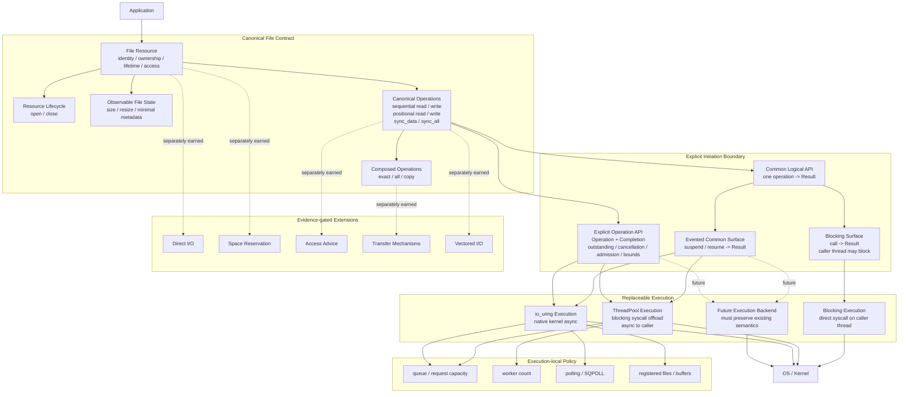
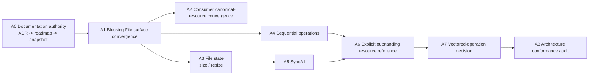

# Explicit File Architecture Conformance Roadmap

- **Authority**: [`docs/mission.md`](../mission.md) → [`ADR-0001`](../adr/0001-explicit-io-design-doctrine.md) → [`ADR-0002`](../adr/0002-explicit-file-api-architecture.md)
- **Baseline**: `master @ 26681e5bf3dd5cbea2fb2393fc8273698e872765`
- **Purpose**: 记录当前代码对已冻结 Explicit File 架构的符合程度，并把剩余差距拆成可独立关闭的工作项。
- **Non-authority rule**: 本文不重新定义架构；若本文与 ADR 冲突，以 ADR 为准。

---

## 1. 先固定一个关键答案：`File` 不选择 Blocking / Async

`File` 是 canonical resource semantic owner。它拥有的是：

```text
identity
ownership
lifetime
access contract
observable file state
legal file operations
```

它**不拥有**：

```text
blocking / async mode
ThreadPool / io_uring backend choice
worker count
queue depth
polling mode
registered-resource policy
```

因此不允许把 execution choice 固化进 `File` 状态，例如：

```text
File{ mode = async }
AsyncFile / BlockingFile 作为两套 canonical resource identity
file.set_backend(...)
file.set_execution_mode(...)
```

也不允许一个没有显式 execution boundary 的 `file.read(...)` 在运行时静默猜测 direct blocking、ThreadPool 或 io_uring，如果这种选择会改变 caller thread 是否阻塞、是否建立 outstanding request、cancellation、lifetime 或 bounded capacity。

冻结的责任关系是：

```text
same File
same operation semantics
explicit initiation / execution choice
```

概念上允许的形状可以是：

```text
blocking surface:
    read_at(file, ...)
        -> current caller may block
        -> Result<T>

common evented surface:
    await/read through an explicitly selected evented execution context
        -> task may suspend
        -> Result<T>

explicit outstanding surface:
    File semantic reference + Operation + Completion
        -> outstanding request
        -> explicit admission / cancellation / lifetime / bound
```

具体 C++ spelling 不在本文冻结；**责任边界**被冻结。

---

## 2. ADR-0002 的架构投影

下面的 Mermaid 是 ADR-0002 的 roadmap 视图，不是新的 ADR。图中 `Future Execution Backend`、`Blocking Surface` 与 `Evented Common Surface` 等细分是为了说明执行边界，不增加 ADR-0002 未授权的 normative 节点。



### 2.1 这张图必须长期保持的四条边界

1. **File semantic root 唯一**：Blocking / ThreadPool / io_uring 不能各自拥有一套 File identity / lifetime contract。
2. **Operation semantics 先于 backend**：backend 有 opcode 不等于 public API 必须存在。
3. **Execution choice 必须显式**：共享 semantics 不等于隐藏 blocking / outstanding / cancellation / resource cost。
4. **Future backend 只能向下接入**：新增 backend 必须实现已有 canonical semantics，不能反向定义 semantics。

---

## 3. 状态词汇

本文只使用以下 implementation-conformance 状态：

| 状态 | 含义 |
| --- | --- |
| `CONFORMING` | 当前 master 已满足 ADR responsibility boundary，并有代码/测试证据。 |
| `PARTIAL` | 方向正确，但 canonical surface、consumer 或 execution coverage 尚不完整。 |
| `CONVERGENCE_GAP` | 语义/机制已经存在，但仍属于历史分裂世界，需要迁到 canonical boundary。 |
| `GAP` | ADR 已授权该责任，但当前 canonical 实现缺失。 |
| `RESEARCH` | 不能仅凭“架构完整”实现；必须先获得语义或证据。 |
| `DEFERRED` | 合法但明确不在基础架构闭环阶段处理。 |
| `OUT_OF_SCOPE` | 不属于当前 Explicit File architecture completion。 |

`FROZEN` 不是 implementation 状态；它只描述 ADR authority。

这些状态是 roadmap 对实现覆盖度的跟踪标签，最终审计 verdict 仍必须使用 ADR-0002 §14 的 `KEEP / CONVERGE / ADD_MINIMAL / DELETE / RESEARCH / OUT_OF_SCOPE`。

---

## 4. Current master conformance ledger

基线：`26681e5b`（PR #338 已 merge）。

| Architecture node | Current code reality | Status | Closure direction |
| --- | --- | --- | --- |
| Canonical `File` resource | `sluice::File` 独立于 async runtime，持有 native handle、access、move-only ownership 与 close authority | `CONFORMING` | 保持 execution-agnostic；不得加入 blocking/async/backend mode |
| Open axes | `FileOpen` 显式 access / existence / initial contents | `CONFORMING` | 保持三轴语义 |
| Close lifecycle | `File::close` + destructor，resource identity 与 release authority 已集中 | `CONFORMING` | 不引入 shared/global handle authority |
| Positional Read — File-facing async | `await_read_at(File, RuntimeTaskContext, ..., Completion)` | `CONFORMING` | 保持 thin adapter |
| Positional Write — File-facing async | `await_write_at(File, RuntimeTaskContext, ..., Completion)` | `CONFORMING` | 保持 thin adapter |
| SyncData — File-facing async | `await_sync_data(File, RuntimeTaskContext, Completion)` | `CONFORMING` | 保持 durability contract 与 execution 解耦 |
| Blocking File resource surface | `FileReader` / `FileWriter` 仍各自持有 fd，并拥有自己的 open/close/read/write/sync surface | `CONVERGENCE_GAP` | 设计 canonical Blocking surface 围绕 `File`；不要创建第二个 File identity |
| Common logical API | 当前 canonical `File` 路径主要是显式 async `await_* + Completion`；blocking common File API 尚未收敛 | `GAP` | 先固定 blocking common surface，再判断 evented common surface 的最小 spelling |
| Explicit outstanding API resource reference | backend operation 仍以 raw fd 表达；File-facing `await_*` 已桥接 canonical File semantics | `PARTIAL` | 单独裁决低层 explicit operation 如何引用 File semantics；不得把 raw fd 提升回 semantic owner |
| Sequential Read / Write | legacy `FileReader` / `FileWriter` 已有 sequential behavior，但 canonical `File` surface 未收敛 | `CONVERGENCE_GAP` | 在 File + execution boundary 下重新表达；不得隐式共享 seek 语义 |
| Vectored Read / Write | ADR-0002 已将 vectored 标记为 evidence-gated operation shape；legacy blocking surface 已存在 vector methods，但 consumer/semantic 证据尚未使其成为 canonical operation | `RESEARCH` | 先做 consumer/semantic census，再决定最小 canonical surface；不因现有 API 自动扩张 |
| SyncAll | async backend transport 已有 `SyncAllOp`，legacy blocking writer 也有 `sync_all`，但 canonical File-facing operation 尚缺 | `GAP` | 在 SyncData 模式被证明稳定后独立 slice |
| `size` | ADR 已冻结为 observable File state；canonical `File` 当前未暴露 | `GAP` | 独立 File-state slice |
| `resize` | ADR 已冻结为 observable mutation；canonical `File` 当前未暴露 | `GAP` | 与 durability 边界分开，独立 slice |
| Minimal metadata | 只允许 correctness 所需字段进入 Core | `RESEARCH` | 按具体 correctness need 单项赚取 |
| Blocking execution | direct blocking syscalls 已存在于 legacy core | `PARTIAL` | mechanism 存在；缺的是 canonical File surface convergence，不是再造 blocking backend |
| ThreadPool execution | `ThreadPoolBackend` 为 honest execution；blocking syscall 在 worker 上执行，对 caller 是 async/outstanding | `CONFORMING` | 暂不做性能优化 |
| io_uring execution | `UringAsyncBackend` 有真实 liburing path；不可用构建诚实报错 | `PARTIAL` | 基础架构闭环前不做 activation/optimization campaign |
| Future execution backend | ADR 允许 replaceable execution，但未授权具体新增 backend | `DEFERRED` | architecture conformant 后再评估 IOCP/SPDK/其他机制 |
| App canonical-resource consumption | 已知 `sluice-copy` pipeline 仍持有 raw `src_fd/dst_fd` 并直接提交 `ReadOp/WriteOp/SyncDataOp/SyncAllOp` | `CONVERGENCE_GAP` | 做全 apps consumer census；逐个消除不必要的 canonical-boundary bypass |
| Synthetic backend success | repository-provided synthetic `SyncBackend` / `FakeAsyncBackend` 已删除 | `CONFORMING` | semantic success 只来自 honest execution |
| Runtime ignorance | Scheduler / Completion / RequestArena 不拥有 File semantics；Read/Write/SyncData File slices 均未要求新增 runtime authority | `CONFORMING` | 任何 File feature 若要求 Scheduler 学会 File，应默认视为 shape failure |
| Performance tuning | queue/worker/polling/registered resources 属 execution policy/capability | `DEFERRED` | architecture closure 后再 benchmark |
| New backend comparison | 不是 architecture completion prerequisite | `DEFERRED` | Phase B/C 才进入 |

---

## 5. 基础架构完成顺序

Roadmap 的目标不是“把所有 API 都做完”，而是先让 responsibility graph 成真。

### Phase A — Make the architecture true

推荐依赖顺序：



顺序可以因证据调整，但任何调整都不能改变 ADR authority。

### A1. Blocking File surface convergence

必须先回答：

> 如何让同一个 canonical `File` 承担 blocking operations，而不保留 `FileReader/FileWriter` 为第二套 resource identity？

成功标准不是删除 class；成功标准是：

```text
File owns resource semantics
Blocking invocation owns blocking execution semantics
```

禁止通过给 `File` 增加 `mode=blocking/async` 来“统一”。

### A2. Consumer convergence

对四个 app 做 code-only census：

```text
canonical File use
native_handle escape
raw fd ownership
raw Operation submission
POSIX lifecycle / metadata / namespace escape
```

每个 escape 必须分类为：

```text
REQUIRED INTEROP
TEMPORARY CONVERGENCE GAP
OUT_OF_SCOPE NAMESPACE WORK
```

一次只迁一个明确 consumer path。

### A3. File state

`size` 与 `resize` 是 ADR 已授权 semantic surface，但必须独立于 execution/backend 实现。

### A4. Sequential operations

必须显式决定 logical file position 的 owner 与 concurrency semantics；不能用隐藏 seek + positional operation 伪造。

### A5. SyncAll

复用已经冻结的 durability semantics；不得因为 backend transport 已存在就跳过 File semantic probe。

### A6. Explicit outstanding resource reference

低层 API 必须最终指向 canonical File semantics，同时保留其真正需要的 outstanding/admission/completion/cancellation authority。

这一步不得引入 universal handle manager 或自动 pinning，除非独立 evidence 赚到。

### A7. Vectored operation decision

先验证真实 consumer / semantic value，再决定 canonical shape。目标不是 API parity，而是消除“sync vector / async scalar 是两套语义世界”的长期漂移。

### A8. Architecture conformance audit

当 Phase A 节点全部关闭后，做一次只读审计：

```text
ADR responsibility
    ↔ public API
    ↔ implementation owner
    ↔ app consumers
    ↔ tests
```

成功标志：

```text
EXPLICIT_FILE_ARCHITECTURE_CONFORMANT
```

---

## 6. Phase B — Prove the architecture is good

只有 Phase A 基础架构闭环后，才系统比较：

```text
Blocking vs ThreadPool vs io_uring
latency / throughput
CPU cost
queue depth
worker count
small / large I/O
sequential / random I/O
contention
cancellation cost
```

Benchmark 只能改变 execution policy / implementation choice，不能反向改写 canonical semantics。

---

## 7. Phase C — Optimize / extend executions

Phase B 有证据后再讨论：

```text
io_uring activation / registered files / registered buffers
polling / SQPOLL
new backend
platform-specific execution
zero-copy / direct I/O / preallocation
```

新增 backend 的固定入口是：

```text
existing canonical operation
        -> explicit API boundary
        -> new execution
```

不是：

```text
new backend capability
        -> invent new File semantic
```

---

## 8. 每个 architecture PR 的约束

以后每个基础架构 PR 必须在本 roadmap 中指向**一行主要 ledger item**。

允许：

```text
one GAP / CONVERGENCE_GAP
    -> probe
    -> minimal implementation
    -> verification
    -> CONFORMING
```

默认不允许：

```text
Blocking convergence
+ SyncAll
+ vectored
+ app migration
+ backend optimization
```

塞进同一 PR。

### 8.1 PR gate

每个 PR 必须回答：

1. 改变的是 `SEMANTIC_CONTRACT`、`CORRECTNESS_AUTHORITY`、`RESOURCE_BOUND`、`EXECUTION` 还是单纯 mechanism？
2. canonical owner 是谁？
3. 是否给 runtime/backend 增加了本不属于它的 semantic authority？
4. 是否隐藏了 blocking/outstanding/cancellation/lifetime/resource cost？
5. 删除所有 backend/syscall 名后，public contract 是否仍成立？
6. 是否只关闭 roadmap 中一个主要 gap？

### 8.2 Stop rule

如果一个“补齐架构”的 slice 必须同时新增：

```text
runtime protocol
scheduler knowledge of File
new generic capability framework
global resource registry
automatic per-file serialization
```

默认停止，先证明为什么现有边界无法表达该 invariant。

---

## 9. 文档同步规则

文档权威固定为：

```text
mission
  ↓
ADR-0001 / ADR-0002
  ↓
this conformance roadmap
  ↓
docs/architecture.md current-code snapshot
  ↓
README summaries
```

规则：

- ADR 改变 responsibility boundary 才需要 ADR corrective。
- implementation PR 改变本表状态时，必须更新 roadmap ledger。
- `docs/architecture.md` 只描述当前代码，不得创造 normative authority。
- README 只做入口摘要，不复制新的 contract。
- issue / PR report 是执行记录，不是长期架构权威。

---

## 10. 当前 checkpoint

在 `26681e5b`：

```text
Canonical File resource       CONFORMING
Positional Read               CONFORMING (File-facing async)
Positional Write              CONFORMING (File-facing async)
SyncData                      CONFORMING (File-facing async)
Honest ThreadPool execution   CONFORMING
Runtime ignorance             CONFORMING

Blocking File convergence     OPEN
Consumer convergence          OPEN
File size / resize            OPEN
Sequential canonical surface  OPEN
SyncAll File surface          OPEN
Explicit low-level File ref   OPEN
Vectored decision             OPEN
```

当前阶段的目标是：

> **先把 ADR-0002 的 responsibility graph 变成真实代码结构，再讨论哪种 execution 更快、是否扩展 io_uring、是否接入新的 backend。**
