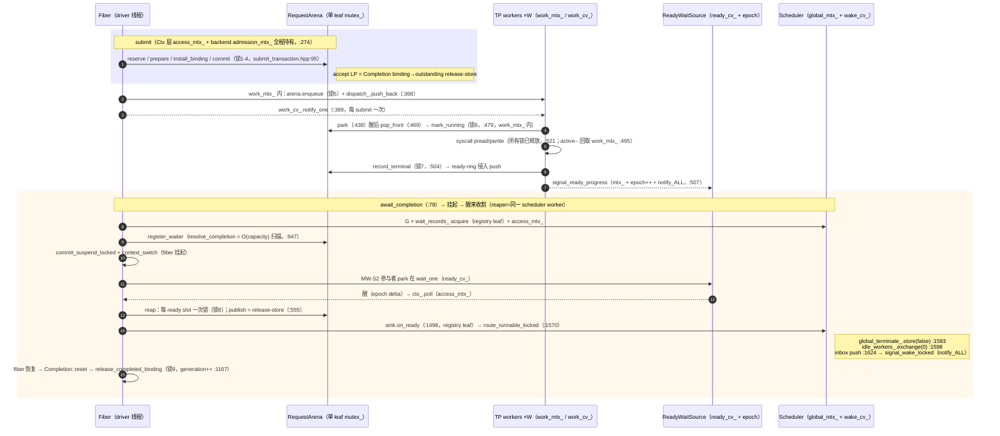
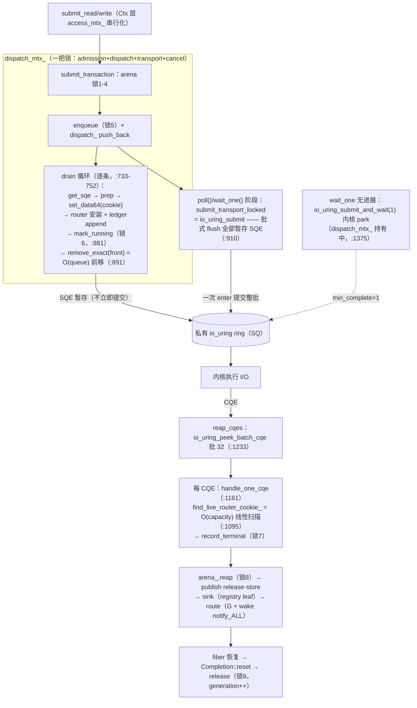
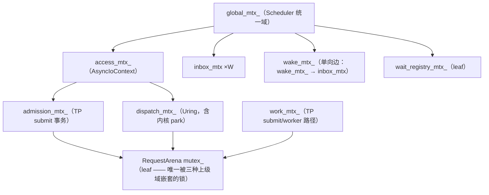
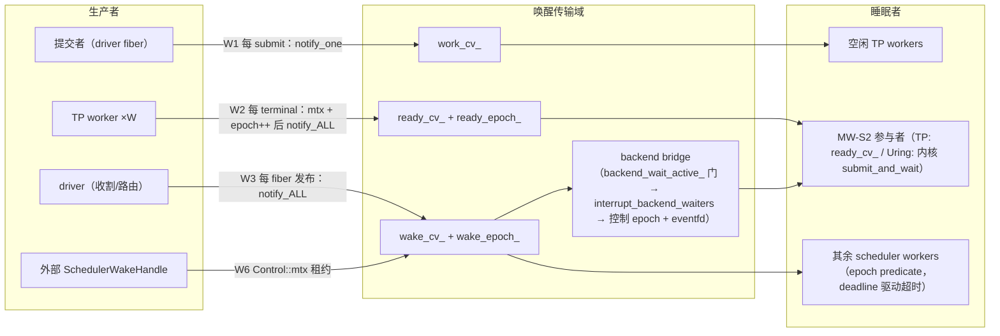

# TAX-0A — Hot-path data-structure / synchronization topology audit

Issues: #227 (sole execution roadmap) · #249 (paper ledger) · #250 (TAX-0 audit)
Machine-readable census: [`tax0a-hotpath-topology.json`](tax0a-hotpath-topology.json)（schema 1.1）
Freeze status: **ACCEPTED / FROZEN @ `5537187`（2026-08-30）**——冻结修正 FC-1..FC-7 在 #251 人类对抗性 review 后、任何 TAX-0B 实验前应用；见 §18。

---

# 1 Verdict

**TAX-0A COMPLETE — READY FOR CAUSAL MEASUREMENT**

四条端到端路径（ThreadPool、Uring、Scheduler runnable、wait/timer）已从实际代码恢复，全部事实绑定 `file:line` 与 baseline SHA。原生测量环境就绪度：Release 构建通过、real-liburing 路径在本机内核上真实可执行（无历史 WSL2 段错误）、perf 以 user-mode 限定可用。历史 4K high-depth w4 cliff 的候选映射完成，其中两项（arena 单锁、per-op wake cadence）与 workers 轴一致、两项明确保留 UNKNOWN。没有任何条目被定为 bottleneck——那是 TAX-0B/C 因果实验的工作。

```
FIRST MEASUREMENT TARGET:  EXP-0 — 容量不变性：固定 D=8，C∈{8,32,128,512}。
                           两条干净的 O(C) 正常路径：resolve_completion 每 await
                           全容量扫描 + find_live_router_cookie_ 每 CQE 扫描
SECOND MEASUREMENT TARGET: EXP-1 — 原生复现 4KiB d32/d64 w1-vs-w4 cliff
                           （新增 CPU placement 预注册：lscpu 拓扑/亲和/SMT/governor）
LADDER:                    EXP-0 → EXP-1 → EXP-U1（uring dispatch/backlog）
                           → EXP-2（归因剖面）→ EXP-3（raw-liburing matched ceiling）
DO-NOT-OPTIMIZE-YET:       arena 单锁、global_mtx_ 统一域、notify_all 选择、
                           idle-dance 原子协议、submit 阶梯分段加锁、
                           std::deque local_runnable（类型本身不是 finding）
```

# 2 Baseline

```
BASELINE:
HEAD:         5537187c3df4db51fac51cb8b75dc2e04e9cae34 (master)
ORIGIN_MASTER:5537187c3df4db51fac51cb8b75dc2e04e9cae34 (== HEAD)
WORKTREE:     tracked clean；审计时未跟踪产物 = research/tax0/{README.md,
              TAX0-A-HOTPATH-TOPOLOGY-AUDIT.md, tax0a-hotpath-topology.json}
DATE:         2026-08-30
```

本审计未修改任何 production C++、未改 issue。产物为 `research/tax0/` 三件（审计时未跟踪；由冻结提交 track——见 §18）。

**路径说明**：任务模板建议 `docs/results/performance-attribution/`，但该目录 README 明确限定为 runner-produced 证据（"Never hand-created"）且受 `perf-evidence-validate.py` 门禁约束；静态普查属研究材料，故按 `research/rx1/` 先例放入 `research/tax0/`。

# 3 Native environment

| 项 | 事实 |
|---|---|
| OS | Fedora 44 KDE，kernel 7.1.9-200.fc44.x86_64 PREEMPT_DYNAMIC |
| CPU | Xeon E5-2666 v3 @ 2.90GHz，1 socket / 10 cores / 20 threads，SMT on |
| NUMA | 1 node（CPU 0-19）；L1d 32KiB/core、L2 256KiB/core、L3 25MiB 共享 |
| governor | schedutil（intel_cpufreq），空闲采样 1.2GHz |
| 编译器 | clang 22.1.8 / gcc 16.2.1 |
| liburing | 系统 rpm 2.13；repo 构建固定 xrepo **2.14**（`xmake/experimental.lua:43`）——两者已在本机共存验证 |
| io_uring | 内核符号在 kallsyms（600 条，非特权地址清零）；real-path 测试通过（§14） |
| 存储 | repo 在 `/dev/sda3` SATA SSD（GS-480，ROTA=0）btrfs zstd:1；**NVMe 存在但为 NTFS（Windows 双系统），Linux 不可用** → `PERF_STORAGE_STATUS = OTHER_BLOCK_DEVICE`；/tmp 为 tmpfs |
| perf | 7.1.9；`perf_event_paranoid=2`、`kptr_restrict=0`、agent 无免密 sudo（FC-7 分层）。**AUTOMATED_UNPRIVILEGED = LIMITED**：user-mode 计数器 READY（cycles:u/instructions:u 实测可用）；context-switch/migration 内核计数、perf sched、perf c2c 非特权 BLOCKED；补偿法 `/proc/<pid>/task/*/status` + schedstat（RX-1）。**HOST_WITH_SUDO**：perf sched / c2c **潜在可用**——缺的是 agent 的免密 sudo，不是主机能力（升级路径 = 人工 sudo 运行并按独立 provenance 层记录） |

# 4 End-to-end ThreadPool topology（路径 3A）

全部 `file:line` 绑定 `5537187`。E1-L2 形态：1 个 Fiber、depth-D 流水线、scheduler workers=1、TP workers=W。



**每 op 锁获取（FACT，E1-L2 形态）**：arena leaf ×8-9、admission ×1、work ×3、ready 域 ×2、access ×2-3、G ≥2、registry ×2、inbox ×1、wake ×1（不含 park/wake futex 往返）。**跨线程边**：driver↔每个 TP worker（work_cv_、arena 锁、ready 域）。

关键结构事实：

- `dispatch_`：定长 SlotHandle 环（容量==request_capacity），O(1) push/pop；`remove_exact`（O(size) 前移）仅在 cancel 路径（`threadpool_backend.cpp:78-100`）。
- `prepared_ops_`/`slots_`/`free_slots_`：构建期定容；free-list LIFO 向量（`request_arena.hpp:1188`）。
- ready-ring：侵入式单链 FIFO，穿在 slot 的 `ready_next_ 上（`request_arena.hpp:1206-1208`），无 per-terminal 分配。
- `signal_ready_progress` 用 **notify_all**（理由：split-wait 允许并发 parker，notify_one 会搁浅第二个 parker——`ready_wait_source.hpp:29-33`）。

# 5 End-to-end Uring topology（路径 3B）

单驱动线程模型：`access_mtx_` 串行化一切驱动调用；`dispatch_mtx_` 单锁覆盖 admission+dispatch+transport+cancel。



专项回答：

- **SQE 是否批**：填充逐个（dispatch_mtx_ 内），内核提交批式（下一次 poll/wait_one 的 `io_uring_submit` flush 全部暂存 SQE）。FACT。
- **谁调 io_uring_enter/submit**：`submit_transport_locked`（:910，被 poll/wait_one/SQ-压力重试调用）与 `wait_one` 的 `submit_and_wait`（:1375）。FACT。
- **submit/reap 是否 one-by-one**：dispatch 的 ring 摘除是逐条 `remove_exact(front)`（每次 O(queue) 前移 → drain N 条 = O(N²) 次句柄搬移）；CQE 侧批 32 摘取但每 CQE 一次 O(capacity) router 扫描 + 一次 arena 锁。FACT（复杂度标志，非定罪）。
- **SQ/CQ ownership**：私有 ring（每 backend 一个，`io_uring_queue_init`，flags=0，:517）；ledger 容量取内核实际 `sq.ring_entries`。
- **partial submit**：TransportLedger 前缀消费记账（`account_transport_result_locked` :929），永久负返回触发 Class-A 毒化恢复（:977）。
- **cancel 控制 SQE**：running-cancel 只记 intent + 追加 tagged `IORING_OP_ASYNC_CANCEL`（:1637）；控制 CQE 仅作参考，terminal 由原 op CQE 决定。
- **io_worker fallback**：**UNKNOWN——未发现 code-level fallback 路径**（`uring_backend.cpp` 内）；内核 io-wq 的行为是另一层问题，本审计未测。SQ 满的后压力表达为"留在 dispatch ring，下次 poll 重试"。
- **谁处理 CQE / 谁 resume Fiber**：同一驱动线程（poll/wait_one 的调用者）完成 CQE 处理→reap→route→（若拥有该 fiber）context_switch 回去。FACT。

# 6 Scheduler runnable topology（路径 3C）

| 结构 | 物理 | 有界 | 生产者/消费者 | 锁 |
|---|---|---|---|---|
| `WorkerState::local_runnable`（scheduler.hpp:167） | **std::deque\<Fiber*\>**，push_back 可增块 | 否 | OWNER+THIEF；跨 worker route/spawn/steal/retire-rescue | 每 worker `inbox_mtx`（:178） |
| `Scheduler::fiber_owner_`（:1810） | std::unordered_map\<Fiber*,WorkerState*\>，每 fiber 一节点，可 rehash | 否（只增不减） | 每次发布 find；spawn/steal 写 | G |
| `pending_spawn_`（:1814） | std::deque\<Fiber*\> | 否 | run 前全局 FIFO | G |
| wait_records_ 池（:1765） | 预分配 unique_ptr 池 + 侵入 free/delivered 链 | 是（256 默认） | on_ready / drain | registry leaf |
| legacy 回退 map（:1737-1739） | unordered_map ×3 | 否 | 仅非 arena backend | G |

- **route_runnable_locked**（scheduler.cpp:1570-1640）：G 下 `global_terminate_.store(false)`、`idle_workers_.exchange(0)`（条件性 `dance_epoch_.fetch_add`，:1598-1604）、admission 降级、`fiber_owner_` find、目标 inbox push、`signal_wake_locked`。
- **steal**（:2036-2103）：G 持有 → 轮转 victim → victim inbox_mtx → victim deque **线性扫描** + 每 candidate 一次 map find + deque 中部 erase（O(n) 前移）→ `fiber_owner_` 转移 → thief inbox push。steal 不发 wake（thief 自己是醒的）。
- **park**（park_on_wake_source，scheduler_park_wake.cpp:178+）：arm-then-recheck——G 内做 unguarded-progress/idle-dance 复核后，嵌套 wake_mtx_ 记 baseline；cv wait 双锁释放；predicate = epoch 变化或 terminate；超时由 earliest deadline 驱动（无周期性轮询；2ms 有界观测仅限非 split-wait mixed-wake）。
- **idle dance**：`idle_workers_.fetch_add(1)/exchange(0)` + `dance_epoch_` 三处解锁擦除点（:610,:668,:1602）+ 每 worker 贡献身份位——#161 TLA+ 已证活性协议。FACT。
- **classify**（:1760-1772）：每次 idle 迭代 O(W) 个 inbox 锁 + `ctx_.outstanding()`（→access_mtx_→arena 锁）。scheduler workers=1 时便宜。
- **MW-S2**：两阶段 admission、lowest-id-alive 选举、**单参与者** park 进 `ctx_.wait_one`（Backend 域：TP=ready_cv_，Uring=内核）；`backend_wait_active_` 门 + `signal_wake_locked` 桥接中断。

# 7 Wait/timer topology（路径 3D）

（子代理普查已对 header 逐行核验；要点如下，全表见 JSON `paths[3D-wait-timer-sync]`。）

- **每个同步原语一个侵入式 WaitQueue**（双链 FIFO，节点为 caller 帧 WaitNode；零稳态分配）+ 各自一把 mutex；锁序 G → 原语 mtx（wait_queue.hpp:337-338）。
- **Fiber 等待注册链**（以 AsyncMutex 为例）：`AsyncMutex::lock` → `Scheduler::mutex_lock`（scheduler_mutex.cpp:58）→ G → `waiters.mtx()` → `register_wait_locked` → `++waiting_waitq_count_`（**全局计数器，无 per-waiter 调度器侧 map**）→ inline 重查 → `commit_suspend_locked` → 锁外 context_switch。
- **定时器**：`deadline_heap_`（vector 二叉小顶堆）+ `timer_pool_`/`select_timer_pool_`（std::list 指针稳定池）。插入 O(log n) + **每次 timed 等待一个堆节点分配**；`recompute_earliest_deadline_locked` 在**每次堆/池变更后做 O(pool) 线性扫描**（scheduler_timer.cpp:510-536）；`retire_timer_for_node_locked` 每次"带 timer 的等待被非 timer 唤醒"做 O(pool) 地址扫描（:438-473）。无 timer wheel。物理回收惰性（到点才清），池上限 = 活跃 + 未到期已退。
- **AsyncQueue**：定长 `new[]` 环 + 两个角色 WaitQueue；**每 item 一次 `new Node<T>`**（queue_port.hpp:219-232）；锁序 G → state_mtx_ → 恰一个角色锁。
- **Select**：调用者帧定长数组（≤8 臂）+ 侵入 SelectPort 链；`deferred_publications_` vector 中转（FE 实验性）。
- **RMW 清单**：WaitNode/TimerRegistration/Fiber/SelectGroup 状态机 CAS（acq_rel）、`idle_workers_`/`dance_epoch_` fetch_add/exchange、Event `set_` exchange、`earliest_active_deadline_` release-store、`wake_epoch_` 在 wake_mtx_ 下非原子自增。RwLock/Mutex 的资源状态是 G 保护的普通字段，非原子。

# 8 Container/allocator inventory（热路径）

完整 12 条目（含 owner/writers/topology/commutativity 字段）见 JSON `structures`。摘要：

| ID | 结构 | 稳态分配 | 有界 | 拓扑 | 冲突候选 |
|---|---|---|---|---|---|
| S1 | arena `slots_`+`free_slots_` | 无 | 是 | MPMC（单锁） | YES |
| S2 | ready-ring（侵入） | 无 | 是 | MPMC | UNKNOWN（与 S1 同锁） |
| S3 | TP `dispatch_` 定长环 | 无 | 是 | MPSC | YES（work_mtx_） |
| S4 | Uring dispatch/router/ledger/cookie | 无 | 是 | 单驱动 | NO（仅被 access 串行化） |
| S5 | `local_runnable` deque | 增块可能 | 否 | OWNER+THIEF | 跨队列路由共享 G（见 S6/L6） |
| S6 | `fiber_owner_` umap | 每 fiber 节点 | 否 | 全 worker 共享（G） | YES |
| S7 | wait_records_ 池 | 无 | 是 | leaf | UNKNOWN |
| S8 | timer 池+堆 | 每 timed 等待 1 节点 | 惰性 | 全部在 G 下 | YES（timed 负载） |
| S9 | access_mtx_ 域 | — | — | 全参与者 | YES |

**热路径零 per-op 堆分配成立**（除 deque/map 增长与 timed-wait 节点）：提交、terminal、reap、resume 全部落在建期定容结构上——与 ADR Decision 14 相符。allocator 因此是**低先验**候选（JSON 中保留 UNKNOWN 而非排除）。

# 9 Lock/atomic sharing map

核心锁清单（语义目的/写者/频率候选/嵌套/交换性；全表见 JSON `locks`）：

| 锁 | 每 op 次数候选 | 跨线程 | 语义需要 vs 物理集中 |
|---|---|---|---|
| `RequestArena::mutex_` | 8-9 | driver+W workers | 逻辑：每 slot 仲裁权威；物理：**全部容量槽一把锁**（分片兼容语义、收益未证） |
| `admission_mtx_`（TP）/`dispatch_mtx_`（uring） | 1 / 2-3 | 是 | 逻辑：accept LP 对 close 串行 + SQE no-fail 域；物理：整个阶梯在其下 |
| `work_mtx_`+`work_cv_`（TP） | 3 + park/wake | driver+W | 逻辑：dequeue+mark_running 单转移窗（ADR 10.4）；物理：整环一锁 |
| `ReadyWaitSource` mtx+cv | 2 + 每 terminal notify_all | W workers→parked reaper | 逻辑：进度可观测；物理：per-op epoch++ 是一种物化（批式聚合未证） |
| `access_mtx_` | 2-3 | 全参与者 | 逻辑：单驱动 backend 契约；物理：TP 也全局串行 |
| `global_mtx_` | ≥2/完成波 + 每 classify | 全 scheduler worker | 逻辑：MW 分类+owner 记录+wake epoch 权威；物理：**整个调度器一把锁——最大集中化候选** |
| wake 域（mtx+cv+epoch） | 每发布 notify_all | 是 | 逻辑：无丢醒；物理：单 cv 上的 per-publication notify_all |
| `inbox_mtx`×W | 1 push+1 pop/激活 | 路由者 vs owner | 逻辑：队列发布权威；物理：按 worker 已分片 |

锁序（FACT）：G → access →（admission/dispatch → arena）；G → inbox；G → wake；G → registry；wake_mtx_ → inbox_mtx（单向，park predicate）。arena leaf 是唯一被三种上级域嵌套的锁。



**LOGICAL vs PHYSICAL 问题**（任务 §5）：正确性对 arena 要求"每 slot 的转移有单一仲裁权威"；获得该答案**并不要求**所有参与者改写同一把物理锁——capacity 槽的状态转移在语义上两两独立（§12 C1-C4），单锁是实现选择。对 `global_mtx_` 同理但更强：多数成对操作（route×route、不同原语的 resolve、classify×classify）语义可换，但 MW 分类一致性 + idle-dance 收敛证明绑定在 G 统一域上——**改变它属于新 ADR 级决策，不是本审计范围**。

# 10 Wake topology

七条边（JSON `wake_edges` W1-W7）。ThreadPool E1-L2 形态每 op 的完整唤醒链：



- **per-op vs batch-capable**：work_cv_ 每 submit 一次（单播）；ready 域每 terminal 一次（广播）；wake 域每 route 一次（广播）；kernel 侧 submit_and_wait(min_complete=1) 天然批式。FACT。
- **可能冗余/聚合点**（均标 HYPOTHESIS，非结论）：H-W2——w4 下 4 核并发 epoch++/notify_all 到同一 cv 字；w1 下 terminal 串行、reaper 单次唤醒可摊销多个 ready op。H-W3——E1 形态 scheduler workers=1，该负载形态下不预期 wake_cv_ 上存在额外的 scheduler-worker 睡眠者；per-route notify_all+wake_mtx_ 的性能贡献未测。
- 谁睡在哪：TP workers 睡 work_cv_；MW-S2 参与者睡 ready_cv_（TP）或内核 ring（uring）；其余 scheduler workers 睡 wake_cv_（epoch predicate，deadline 驱动超时）。FACT。

# 11 Request semantic-cost map

每笔"税"买了什么（JSON `request_core_cost_map`，12 条）。分类摘要：

- **FUNDAMENTAL-SEMANTIC**：generation++（ABA 防护）、terminal-winner 仲裁（exactly-one）、reap-only 发布 + leaf 域 release-store（发布权威/线性化点）、enqueue pin（Scheme-B 竞态闭合）、有界容量+would_block（背压）、uring cookie 不复用计数器（stale CQE ABA 闭合）、Completion/Fiber 状态机 CAS、suspend_switch_pending（steal-vs-switch 闭合）、idle-dance 原子协议（TLA+ 已证活性）。
- **IMPLEMENTATION-DEPENDENT**：单把 arena 锁（语义=仲裁域；分片可保语义、收益未证）、submit_seq_（仅 fake backend 消费）、ready-ring 的侵入式物化（顺序是语义，链表是实现）。
- **POSSIBLY-AMORTIZABLE**（语义可保、合并未证）：submit 阶梯的 4 次独立 arena 加锁（分段回滚语义可能用一次临界段保住）、`resolve_completion` O(capacity) 扫描（指针键公共 API 是语义，索引结构是实现）、TP/Uring 统计 RMW（relaxed）。
- **UNKNOWN**：无。

**纪律**：以上没有一条被标记为 removable。correctness mechanism 不是优化目标。

# 12 Commutativity conflict candidates

12 对（JSON `commutativity_candidates` C1-C12），其中 8 对为 COMMUTATIVITY-CONFLICT-CANDIDATE。核心四对：

1. **C1 worker0.record_terminal(A) vs worker1.record_terminal(B)**：语义 COMMUTES（不相交 slot、独立 terminal）；物理共享 `RequestArena::mutex_`。证伪实验：w4 cliff 单元的 arena 锁持有时间/futex 计数；或（TAX-0C）分片 ablation。
2. **C2 mark_running ×2**：同上，共享 arena 锁 + work_mtx_。
3. **C3 driver submit 阶梯 vs worker record_terminal**：不同 slot 语义独立；admission/work 两条上级锁最终都落在同一 arena leaf 上串行。
4. **C5 route F1→W0 vs route F2→W1**：语义 COMMUTES；物理共享 G（整段 route）+ fiber_owner_ + wake 域 + `global_terminate_.store(false)` + `idle_workers_.exchange(0)`。

非候选但已记录：C7 push/pop 同环（PARTIAL——队列元数据语义共享）；C9 steal vs owner pop 同一 ticket（语义要求串行）；C10 uring dispatch vs reap（单驱动契约**有意**串行）。

# 13 Historical E1 cliff mapping

历史事实（WSL2/tmpfs，commit 9404df8；本轮不重算）：

- **4KiB d32 w4 write：L2−L1 = +1725.9ms（+266%）**；read d32 w4 +15%；d64 w4 write +600% / read +41%；**同深度 w1 cliff 消失**（write d64 w1 +7.5%）。
- bpftrace（**非 cliff 单元** d1 w4）：L1/L2 均 ~4.1 线程切换/op，L2 仅 +0.4%；migrate 相当。
- L1 自身在 4KiB d8 上 w4 比 w1 慢（朴素池自身有竞争形态）。
- E1b（cliff 分解）从未执行；根因登记 UNKNOWN。E1 定义 L0/L1/L2；L3/L4（uring）从未测。

映射（`historical_cliff_candidates`，每条带一致性论证）：

| 候选 | 类 | 与证据一致性 | 判定 |
|---|---|---|---|
| arena 单锁 5 线程串行（C1-C3） | REQUEST-CORE/LOCK-ATOMIC | 解释 w-only 轴 + depth 耦合（capacity==D）；不解释 write≫read | HYPOTHESIS |
| per-terminal notify_all + reaper 每 op 唤醒节奏（H-W2） | WAKE/TOPOLOGY | 解释 w4-only（并发 terminal vs 串行）；write 不对称 UNKNOWN | HYPOTHESIS |
| work_cv_ 每 submit 单播 + work_mtx_ 竞争 | BACKEND/SUBMIT | 弱：L1 也有单锁+cv，差值须来自 L2 的额外获取次数 | HYPOTHESIS（较弱） |
| 平坦控制面税（注册路径 + O(capacity) resolve 扫描 + fiber 切换） | REQUEST-CORE/SCHEDULER | 解释 d1 平坦底税（w 无关），不能解释 cliff 本身 | HYPOTHESIS（仅平坦分量） |
| TP 线程迁移 | UNKNOWN | d1 迁移数 L1≈L2；cliff 单元迁移数未测 | **UNKNOWN** |
| allocator/cache-line | ALLOCATOR/LIFETIME | 热路径零 per-op 堆分配 → 低先验；mutex/epoch 行弹跳未测 | **UNKNOWN** |
| tmpfs 写路径交互（write≫read） | UNKNOWN | 控制面代码读写同路，无拓扑差异可解释 17 倍不对称 | **UNKNOWN——显式保留** |

# 14 Measurement readiness

| 检查 | 结果 |
|---|---|
| Release 构建（clang 22） | **PASS**——`e1_abstraction_tax_bench` 干净构建 |
| E1 smoke（原生） | **PASS**——L0/L1/L2 write 4KiB d1 w1 64MiB×1rep 全部 `all_reps_ok=true`（readiness 检查，非基准结果。首次 read 失败仅因输入文件缺少 bench 的 splitmix64 模式——负载准备错误，非代码缺陷） |
| real-liburing 构建 | **PASS**——repo 固定的 xrepo liburing 2.14 编译安装成功 |
| real-liburing smoke | **PASS**——`uring_backend_test` 全过，`mode=real`，内核 7.1.9；**历史 WSL2 4-test 段错误在本机不复现** |
| 既有缺陷记录 | `bench/uring_write_bench` 引用已删除的 `experimental::UringIoContext`，编译失败——master 既存，与本审计无关，不可用作 uring 证据 |
| `REAL_URING` | **READY** |
| `PERF` | **分层（FC-7）**——AUTOMATED_UNPRIVILEGED: **LIMITED**（user-mode 计数器可用；kernel ctx-switch 计数 / perf sched / perf c2c 非特权 BLOCKED；RX-1 的 /proc 补偿法可用）；HOST_WITH_SUDO: perf sched / perf c2c **潜在可用**（主机能力未缺失，仅 agent 无免密 sudo；须按独立 provenance 层记录） |
| `NVME` | **NON_NVME**（repo=SATA SSD btrfs；/tmp=tmpfs；机器上 NVMe 为 NTFS 不可用）——设备级结论当前环境给不出 |

# 15 Ranked hypotheses

| Rank | Candidate | Current fact | Hypothesis | Why plausible | Falsifying experiment | Semantic risk |
|---|---|---|---|---|---|---|
| 1 | REQUEST-CORE/LOCK-ATOMIC：arena 单锁跨 driver+W worker 串行（C1/C2/C3） | 一把 mutex 管全部 slot 转移；8-9 次/op；TP submit/mark/reap/release 从 1+W 线程汇入 | w4 的 L2−L1 增量由跨核 arena mutex 转移（futex 流量）主导，w1（2 线程）塌缩 | 解释 workers 轴 + depth 耦合（capacity==D）；d1 平坦与互斥成本摊销形态吻合 | EXP-1 原生复现 + w{1,4}×d{8,32,64}；锁持有/争用遥测 | 测量零风险；后续任何分片须保 admission 事务+terminal-winner+reap 序 |
| 2 | WAKE/TOPOLOGY：per-terminal ready notify_all + reaper 每 op 唤醒节奏（H-W2/W2） | 每次 record_terminal：mtx+epoch+++notify_all，来自每 worker；reaper 每 wait_one park | w4 四核并发 bump/广播到同一 cv；w1 terminal 串行使一次唤醒摊销多个 ready op | 协议层批式可行、代码 per-op；reaper wake/park 循环放大切换 | 逐 op 统计 ready-epoch 推进数与 wait_one 返回尺寸（w1 vs w4）+ /proc ctxt | 测量零风险；将来聚合须保 split-phase predicate（AC-6） |
| 3 | BACKEND/SUBMIT：work_cv_ 每 submit 单播 + work_mtx_ driver/worker 竞争（W1） | notify_one 每 submit；driver 每 submit 取 work_mtx_；worker 每 pop/active-- 取 | D=32 的 admission 突发与 W 个 pop 在 work_mtx_ 相撞 | w4-only 形态成立；但 L1 有同构单锁 → 差值只能来自 L2 的额外获取，故较弱 | w{1,2,4} 扫描 + dispatch_occupancy/high_water（AC-1a 既有信号） | 无 |
| 4 | REQUEST-CORE/SCHEDULER：平坦每 op 税（G+registry+access+O(capacity) resolve 扫描+2 次 fiber 切换/await） | await_completion 固定开销清单；resolve 扫描随 capacity==D 增长 | 这是 w 无关的**平坦**分量（历史 ~1.3-2.0µs/op），设 cliff 底噪 | 匹配 d1 平坦税；不解释 w4 cliff | **EXP-0** 固定 D 变 C 容量扫描 + resolve 迭代计数遥测；固定总字节 depth 扫描 | 无 |
| 5 | UNKNOWN 残差：write≫read 不对称 + 存储层交互 | 控制面读写同代码路径；d32 write cliff 是 read 的 ~17 倍 | **UNKNOWN——显式保留** | tmpfs 写完成时机与唤醒节奏的交互未建模 | cliff 单元 read/write 成对 + tmpfs/btrfs 对照 + raw-liburing 对照臂（EXP-3） | 无 |

不凑数：第 5 位是显式 UNKNOWN，不是弱候选。

# 16 What NOT to optimize yet

1. **arena 单锁**——语义承重（仲裁域）；分片收益未证，且会触碰 admission 事务/Scheme-B/reap 序。
2. **global_mtx_ 统一域**——MW 分类、owner 记录、wake epoch、idle-dance（TLA+ 验证）绑定其上；改动属新 ADR。
3. **notify_all 选择**——并发 parker 正当性有文档论证（ready_wait_source.hpp:29-33）。
4. **idle-dance 原子协议**——#161 模型证明的活性；"看起来可简化"正是它防御的缺陷类。
5. **submit 阶梯分段加锁**——无残留回滚阶梯；合并未证且缩小失败表达力风险。
6. **std::deque local_runnable**——STL 类型不是 finding；无 bouncing 证据前不动。
7. **timer 池 O(pool) 重算/扫描**——E1 形态无 timer，不在 cliff 路径上。

# 17 TAX-0B/C recommended experiments（仅设计，不执行）

**预注册执行顺序（FC-5）**：EXP-0 → EXP-1 → EXP-U1 → EXP-2 → EXP-3。

**EXP-0 — 容量不变性（ladder 第 1 位）**

- QUESTION：固定活跃 depth D，闲置 request_capacity C 是否本身带来每 op 成本（UnusedCapacity → Tax）？
- MECHANISM（FACT 起点，两条干净的 O(C) 正常路径）：
  - `RequestArena::resolve_completion()`：每次 waiter 注册对全容量线性扫描（`request_arena.hpp:947-958`）；
  - Uring `find_live_router_cookie_()`：每个 CQE 对 router 数组 O(request_capacity) 扫描（`uring_backend.cpp:1095`）。
- VARIABLE：D=8 固定，C ∈ {8, 32, 128, 512}。
- ARMS：ThreadPool L2 与 Uring 各一臂（分别命中两条机制）；CONTROL：C==D 单元 + d1 低容量单元 + 同 session L1。
- EXPECTED（预注册方向）：若机制起作用，固定 D 下每 op 成本随 C 单调上升（扫描迭代 + slot 数组 cache 足迹）。
- FALSIFIER：双臂对 C 均平坦 → 两条 O(C) 路径在本几何降级，假设 4 的平坦分量重新归属。
- DOES NOT PROVE：不给出 wall-clock 占比归因（EXP-2 的事）；不涉 workers 轴。
- BENCH-SIDE CHANGE：e1 bench 现状构造 `ThreadPoolBackend(request_capacity == depth)`（`e1_abstraction_tax_bench.cpp:619-624`）；把 C 与 D 解耦是 bench 侧参数改动，非生产代码。
- ENV REQ：与 EXP-1 相同的 placement 预注册；SEMANTIC SAFETY：纯 bench 参数扫描。

**EXP-1 — 原生 cliff 复现（ladder 第 2 位）**

- QUESTION：历史 4K high-depth w4 cliff 是否在原生 Fedora/btrfs 复现？workers=1 vs 4 仍是决定性变量吗？
- HYPOTHESIS：H1（arena 锁）/H2（唤醒节奏）表现为 d32/d64 4KiB 的 w4-only L2−L1 膨胀。
- BASELINE：E1 ladder L0/L1/L2，commit `5537187`，Release clang，1GiB/cell，≥7 reps；文件在 btrfs `/home` + tmpfs `/tmp` 对照臂；每 session 含 L1 rung（同 session A/B，per `docs/verification/performance-engineering.md`）。
- VARIABLE：workers {1,4} × depth {8,32,64}，4KiB，write AND read；CONTROL：d1 单元；同 session L1。
- **CPU PLACEMENT 预注册（FC-6，正式跑 w1/w4 前必须完成）**：
  - `lscpu -e=CPU,CORE,SOCKET,NODE` 拓扑快照随 run 存档；
  - 进程亲和（taskset 集）逐单元显式声明：w1 = 单核；w4 = 4 个不同物理核**或**显式 SMT 兄弟策略——二选一并记录；
  - SMT 兄弟重叠情况记录，不留给调度器碰运气；
  - governor 记录（审计时为 schedutil）；
  - 迁移观测 = 每线程 `/proc/<pid>/task/*/status` Cpus_allowed + schedstat（perf kernel 计数非特权不可用）；
  - 理由：不做这些，测到的就是 worker 数 + placement + SMT + 迁移的混合体。
- METRICS：wall 中位数+原始样本；AsyncStats；每线程 /proc status voluntary/involuntary ctxt + schedstat。
- EXPECTED：若 H 真，d32 w4 ≫ d32 w1 且 ≫ d1 w4。
- FALSIFIER：原生无 cliff，或 w1 同样出现 → H1/H2 在此环境被拒。
- ENV REQ：Release 构建已就绪；空闲机器；记录 governor。
- SEMANTIC SAFETY：纯读负载+bench 调用，零生产改动。

**EXP-U1 — Uring dispatch/backlog 剖面（ladder 第 3 位）**

- QUESTION：单驱动串行化（`dispatch_mtx_` 覆盖内核 submit_and_wait park）+ 每 dispatch `remove_exact` O(queue) 前移（drain N = O(N²) 句柄搬移）+ 每 CQE router 扫描，在高 backlog 下是否主导 uring 每 op 成本？
- HYPOTHESIS：backlog 扫描非平坦——dispatch 批式 flush 分界与 O(N²) drain 塑形驱动循环。
- VARIABLE：depth/backlog {8,32,64} @ scheduler workers=1 单 Fiber，request_capacity 固定；CONTROL：TP 同几何 rung + d1 单元。
- METRICS：wall/op；`submit_flushes_`/`live_cookies_` 遥测；dispatch 队列高水位（test seam 只读）；驱动线程 user-mode perf。
- EXPECTED：成本随 backlog 非平坦，且与 flush 计数/队列高水位相关。
- FALSIFIER：backlog 平坦 + flush 计数恒定 → dispatch/backlog 假设降级，聚焦容量机制（EXP-0）。
- ENV REQ：real-liburing（READY）；placement 预注册同 EXP-1；SEMANTIC SAFETY：零生产改动、test seams 只读。

**EXP-2 — 归因剖面（ladder 第 4 位）**

- QUESTION：cliff 是否伴随上下文切换/迁移膨胀？user-mode 时间集中在哪？
- HYPOTHESIS：cliff 单元 switches/op 更高（reaper wake/park churn），user 帧集中于 mutex/epoch 函数。
- VARIABLE：cliff 单元（按 EXP-1 结果选定，运行前可改选）；CONTROL：d1 w4 与 d32 w1。
- METRICS：`perf record` user-mode（Release 无帧指针——需 dwarf，或先做一次性 diagnostic frame-pointer 构建，明确标注非证据构建）；`perf stat :u`；/proc 计数。
- FALSIFIER：无切换膨胀 + 剖面平坦 → 转向 syscall/设备层调查。
- ENV REQ：perf user-mode 已验证；frame-pointer 决策先行；HOST_WITH_SUDO 层（FC-7）可用时 perf sched/c2c 按独立 provenance 补充。
- SEMANTIC SAFETY：诊断构建不入证据库、不提交。

**EXP-3 — raw liburing matched ceiling（ladder 第 5 位，末位）**

- QUESTION：与 Sluice uring **完全同几何**的 raw liburing 阶梯是否给出无 cliff 的 matched ceiling？差值归因于哪一层（router O(capacity) 扫描 / remove_exact O(n²) drain / arena 串行）？
- POSITION：EXP-0/1/U1 之后运行，几何取已被证明敏感的单元；本实验原有的 capacity-sweep 维度已并入 EXP-0。
- HYPOTHESIS：Sluice uring 的每 CQE O(capacity) 扫描 + 每 dispatch O(queue) 前移 + arena 串行是差值来源。
- VARIABLE：matched geometry（由 EXP-0/1/U1 结果选定）；CONTROL：同几何 TP rung。
- METRICS：wall/op；`submit_flushes_`/`live_cookies_` 遥测；uring test seams 只读观察 SQ/CQ 水位。
- EXPECTED：若 S4 复杂度标志起作用，matched-geometry 对比能定位差值层。
- FALSIFIER：raw ≈ sluice @ matched geometry → S4 标志降级，差值另寻归属。
- ENV REQ：real-liburing 已就绪（READY）；raw ladder 臂需新 bench 侧代码（非生产代码）。
- SEMANTIC SAFETY：仅 bench 侧。

---

# 18 Freeze correction log（2026-08-30）

#251 人类对抗性 review 后、任何 TAX-0B 实验前应用的 7 处冻结修正（对应 JSON `freeze.corrections` FC-1..FC-7）：

| ID | 领域 | 修正 |
|---|---|---|
| FC-1 | evidence vocabulary | S1-S9 的 `measured_hotness=CURRENT` 拆分为 `path_frequency`（代码路径分类）+ `measured_hotness=NONE`——当前不存在任何 performance 测量 |
| FC-2 | baseline provenance | `worktree_clean` 拆分为 `tracked_worktree_clean=true` + `untracked_audit_artifacts`（三件 research/tax0 产物） |
| FC-3 | hypothesis wording | H-W3 的"pure overhead"改为"该负载形态下不预期额外 scheduler-worker 睡眠者；性能贡献未测" |
| FC-4 | unknown preservation | io_worker fallback 维持 UNKNOWN（"未发现 code-level 路径"）；报告措辞对齐 JSON——内核 io-wq 行为是另一层未测问题 |
| FC-5 | experiment ordering | 梯子重排为 EXP-0（容量不变性，新增）→ EXP-1（cliff 复现 + placement 预注册）→ EXP-U1（uring dispatch/backlog，新增）→ EXP-2（归因）→ EXP-3（raw-liburing matched ceiling）；瞄准两条干净 O(capacity) 路径 |
| FC-6 | measurement controls | EXP-1 增加 CPU placement 预注册：lscpu 拓扑快照、亲和/SMT 策略、governor、迁移观测 |
| FC-7 | perf capability | PERF 拆为 AUTOMATED_UNPRIVILEGED=LIMITED 与 HOST_WITH_SUDO=潜在可用（缺的是 agent 免密 sudo，不是主机能力） |

收口状态：

```
TAX-0A:            ACCEPTED / FROZEN
baseline:          5537187
production changes: NONE
scientific changes: NONE
freeze corrections: evidence vocabulary / experiment ordering / measurement controls
```

---

## 完成声明（AGENTS.md §23）

- **授权范围**：#250 TAX-0A 静态拓扑普查 + 原生测量就绪审计；只读审计，无生产修改授权。
- **Baseline**：master @ `5537187`（== origin/master，clean）。
- **产物**：`research/tax0/`（README + 本报告 + JSON census schema 1.1）；审计时未跟踪，由本冻结提交 track（§18）。
- **实际执行**：`xmake f -m release --toolchain=clang -y` + `xmake build e1_abstraction_tax_bench`（PASS）；`--with-liburing=true` + `xmake build sluice_async uring_backend_test`（PASS）；`xmake run uring_backend_test`（ALL TESTS PASSED, mode=real）；E1 L0/L1/L2 write smoke（all_reps_ok=true ×3）；perf stat :u 可用性验证。
- **SKIPPED**：perf kernel 计数 / perf c2c / perf sched（自动化非特权层 BLOCKED——已记录，未改系统参数；HOST_WITH_SUDO 层未动用）；TAX-0B 基准 sweep（本轮明令禁止）；NVMe 路径（硬件为 NTFS）。
- **剩余风险**：环境为 btrfs SATA SSD + tmpfs——设备级结论不可外推（历史同为 tmpfs 的 cliff 需先复现再归因）；perf 归因只能达 user-mode + /proc 补偿精度。
