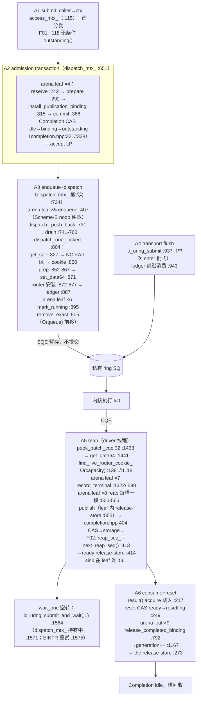
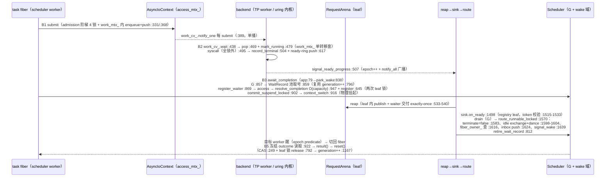

# TAX-0A2 — Control-plane topology re-baseline + semantic-floor preregistration

Issues: #250（execution truth）· #259（roadmap: Zero-Cost Control Plane + Explicit Data-Movement Boundary）
Round framing: **CONTROL PLANE — Zero-Cost Boundary Audit**（Bare I/O Floor → Capability Cost → Semantic Floor → Abstraction Tax）
Machine-readable census: [`tax0a2-control-plane-topology.json`](tax0a2-control-plane-topology.json)（schema 2.0，supersedes 冻结的 v1.1）
Prior round: [`TAX0-A-HOTPATH-TOPOLOGY-AUDIT.md`](TAX0-A-HOTPATH-TOPOLOGY-AUDIT.md)（v1.1 @ `5537187`，FC-1..FC-7 冻结，作为历史预注册保留，不改写）

---

# 1 Verdict

**TAX-0A2 COMPLETE — TOPOLOGY RE-BASELINED TO `9670224`, F01–F05 REGISTERED, Z-LADDER PREREGISTERED. READY FOR TAX-0B/C MEASUREMENT.**

- 两条目标路径（Path A standalone async I/O、Path B runtime continuation）已从当前 master 代码逐箭头恢复，全部事实绑定 `file:line` @ `9670224`；
- 五个新 suspected seams（F01–F05）的代码事实全部核验完毕：F01/F02 的代码链为 **FACT**（含一处此前未被记录的 comment/code 排序分歧），成本主张均为 **HYPOTHESIS**（无测量，不生产修改）；
- Z0–Z4 semantic-floor ladder 与 Z1b（Minimal Semantic-Equivalent Uring）语义清单完成预注册；
- **零生产修改、零测量、零 bottleneck 断言**——那是 TAX-0B/C/D 的工作。

```
本轮唯一授权的税量：  abstraction_tax = Sluice − Z1b（semantic floor）
明确禁止的伪税量：    Sluice − Z1（raw liburing）→ 把 capability cost 误记为 overhead
```

# 2 Baseline

```
BASELINE:
HEAD:          967022473d3a8882693cf019ccd11462fa2efda1 (master)
ORIGIN_MASTER: 同上 (== HEAD)
WORKTREE:      tracked clean
DATE:          2026-08-31
```

**相对 v1.1 冻结基线的 production 漂移（`5537187..9670224`）**：仅 uring 研究 seam 三件
（`uring_backend.hpp` +152、`uring_backend.cpp` +189、`uring_test_seams.hpp` +258，全部
`SLUICE_ASYNC_INTERNAL_TESTING` 保护，production 行为不变——EXP-U0/ROUTER 轮次的
scan-diagnostics 与 R3 候选 seam）。其余热路径文件（`async_io_context`、`completion.hpp`、
`request_arena.hpp`、`submit_transaction.hpp`、`threadpool_backend.cpp`、`scheduler*.cpp`、
`application_runtime.cpp`）与 v1.1 基线**逐字节一致**：其 v1.1 绑定经本轮 HEAD 抽查复核后
继续有效；`uring_backend.cpp` 全部条目按 HEAD 重读重绑。

**产物位置说明（沿用 v1.1 已裁决的分歧）**：任务模板建议 `docs/results/performance-attribution/tax0-hotpath-topology.json`，但该目录 README 明确限定为 runner-produced 证据（"Never hand-created"）且受 `perf-evidence-validate.py` 门禁约束；静态普查按 `research/rx1/` 先例置于 `research/tax0/`。此分歧在 v1.1 冻结报告中已登记并被接受，本轮沿用并再次显式登记。

# 3 Path A — standalone async I/O（UringAsyncBackend，单驱动）

全链（`file:line` @ `9670224`，逐箭头机制标注见 JSON `path_A_standalone_async_io`）：



**线程/权威域答案（Path A）**：submit/dispatch/reap/consume 全部在**调用者（driver）线程**；
execute 在**内核**；无 userspace wake 边（driver 直接 park 在内核或从 poll 返回）。锁层次
`access_mtx_ → dispatch_mtx_ → arena leaf`；accept LP = Completion `binding→outstanding`
release-store；publication LP = reap leaf 临界区内 `ready` release-store。

# 4 Path B — runtime continuation（ApplicationRuntime 形态）

TP 规范形态（E1-L2：1 Fiber/task、scheduler workers=W、TP workers=W），uring 差分逐条标注
（完整机制表见 JSON `path_B_runtime_continuation`）：



**线程/权威域答案（Path B）**：submit 在 task fiber；execute 跨线程交给 TP worker（或内核）；
complete 由 worker 记录 terminal（exactly-once）；reap 在 driver/participant（access 域）；
wake 有三条边（ready_cv_ 每 terminal 广播、wake_cv_ 每 route 广播、uring 参与者的内核 park
经 `signal_wake_locked→interrupt_backend_waiters` 桥接，async_io_context.cpp:384-403）；
resume 可能发生在**另一个** scheduler worker（fiber 迁移经 owner 路由）。

# 5 F01–F05 seam 登记（全部为假设，非授权优化）

| ID | 机制 | 代码事实（FACT） | 测量 | 因果消融（预注册） | 语义价值 | Verdict |
| -- | ---- | ---------------- | ---- | ------------------ | -------- | ------- |
| F01 | stats 关闭仍付 `outstanding()` | `async_io_context.cpp:118`（×8 site）实参无条件求值 → `uring_backend.cpp:1885` / `threadpool_backend.cpp:887` → `request_arena.hpp:201-204` **arena leaf 锁**。stats 关闭时每 submit 仍付 1 虚调用 + 1 次锁往返 | 未测 | R0 现状 vs R1 `if (stats_)` 门；stats 启用时语义恒同 | 可观测性（可选 capability） | HYPOTHESIS |
| F02 | 未使用 Batch 仍付进程级 reap 序号原子 | `completion.hpp:109-112` static atomic，`++` 为 **seq_cst**（邻注 :106-108 却称 relaxed 足够——分歧已记录）；`:413`/`:625` 每次 publication 无条件盖章；唯一消费者 `batch.cpp:141` | 未测 | R0 vs R1（普通 Completion 不生成序号，Batch 语义恒同；不可行则先做 research seam） | Batch::next() 重放真实 reap 序（ADR 6 O2） | HYPOTHESIS |
| F03 | arena 重复同步边界 | 每次 op 9 次 leaf 锁（阶梯 4 + enqueue + mark_running + record_terminal + reap 每槽 + release）；全部同一物理 mutex（:1189）；九转移的 invariant/LP/commutativity 表见 JSON `seams[F03]` | 未测 | 先 profile（锁持有/futex），若热再做保序消融；分片属新 ADR | 每 slot 单一仲裁权威（§4.1） | HYPOTHESIS（结构 FACT） |
| F04 | ctx vs backend 串行分层 | `access_mtx_` / `dispatch_mtx_`（uring wait_one **持锁内核 park** :1571，有意单驱动设计）/ arena leaf 是**三个不同权威域**；单驱动拓扑下全部无争用（N 次无竞争往返），多 worker 拓扑下 access+leaf 成为真跨线程串行点 | 未测 | TAX-0C 按层 profile（w1 vs w4） | ADR 9.2.5 序列化域 / 准入仲裁 / slot 生命周期 | UNKNOWN（regime-dependent） |
| F05 | Scheduler/waiter/Fiber continuation floor | 挂起→注册→路由→唤醒→恢复全链（§4）；八项 capability purchase 映射见 JSON `seams[F05]`（lost-wake 安全=TLA+ 已证协议、exactly-one waiter、stale 保护、cancel 竞态闭合、跨 worker wake） | 未测 | 实现 **Z1b** Minimal Semantic-Equivalent Uring（语义清单已冻结：bounded in-flight、永不复用身份、stale CQE 丢弃、exactly-once publication、借用 buffer 生命周期、单 continuation、零 per-op 堆分配）——**禁止删安全语义制造假 floor** | 全部 continuation 语义 | HYPOTHESIS（floor 未建） |

**与 anti-story 纪律的对齐**：F01/F02 看起来"简单"不构成选择理由；F03/F04 的锁数量不是
finding 本身；F05 的成本在 Z1b 存在之前不可称 overhead。任何"修复后 throughput 无变化但
instructions/op 下降"只能报告为 CPU/control-plane 改进。

# 6 Z-ladder 预注册（本轮不执行）

```text
Z0  raw pread/pwrite                          —— Bare I/O Floor
Z1  raw liburing minimal（无生命周期语义）
Z1b minimal semantic-equivalent uring         —— Semantic Floor（F05 清单）
Z2  AsyncIoContext + Uring，manual poll，无 Scheduler
Z3  ApplicationRuntime await_completion
Z4  representative application path（仅验 composition amplification）
```

- capability_cost = Z1b − Z1；abstraction_tax = Z2/Z3 − Z1b；
- same-work freeze 13 项约束、NOT-SEMANTICALLY-COMPARABLE 规则、矩阵最低规模
  （4KiB d{1,8,32,64} / 64KiB / 1MiB，read+write，workers{1,4}，历史 cliff 单元必测）、
  lifecycle/steady-state 分离、tax-stack 归因词表（MEASURED / INFERRED_BY_AB /
  STRUCTURAL_ONLY / UNKNOWN）——全部冻结在 JSON `z_ladder_preregistration`；
- 环境纪律：v1.1 §3 的原生 Fedora readiness 属于那台主机；任何测量 session 必须在其实际
  主机上重立 placement/版本/文件系统事实，WSL2/VM/tmpfs 结果一律标 **ENVIRONMENT-LIMITED**；
- 优先序：Z1 → Z1b → Z2 → Z3。

# 7 First optimization gate（空转保护）

本轮**不给出** first optimization 推荐：在 TAX-0B/C/D 证据存在前排序候选就是制造故事。
JSON `first_optimization_gate` 冻结了排序维度（measured magnitude → causal confidence →
semantic risk → size → breadth → gain → regression）、#255 fix-selection gate 触发条件、
以及"多个候选有收益也只做第一个"的规则。

# 8 实际执行的验证

- `git fetch` + `git status`：master == origin/master @ `9670224`，tracked clean；
- `git diff --stat 5537187..HEAD -- src/ include/ xmake/`：production 漂移仅 uring 研究 seam
  三件（§2），其余热路径文件逐字节一致；
- 全量重读并重绑：`async_io_context.cpp`（全文）、`completion.hpp`（全文）、
  `submit_transaction.hpp`(全文)、`request_arena.hpp`（ladder/reap/resolve/release 区段）、
  `uring_backend.cpp`（submit/dispatch/transport/reap/poll/wait_one/router/cookie 区段）、
  `application_runtime.cpp`（全文）、`scheduler.cpp`（on_ready/route 区段）、
  `scheduler_park_wake.cpp`（await/registry 区段）、`threadpool_backend.cpp`（抽查）；
- `git log --all -- research/tax0/`：确认 v1.1 census 为冻结预注册产物（2b1d0f7），按
  supersede 惯例出 schema 2.0 新文件而非改写；
- liburing 边界契约（`io_uring_submit` 批式 flush、`submit_and_wait`、`peek_batch_cqe`
  不推进 head、`sqe_set_data64` 整数身份）经 Context7 官方文档核对，与代码用法一致。

# SKIPPED

- TAX-0B/C/D 全部测量与 Z1b harness 构建（本轮范围=TAX-0A，明令不动 production hot path）；
- F01/F02 的 R0/R1 消融 bench（属 TAX-0D）；
- 原生 Fedora 环境事实重测（本轮无测量需求；已登记为测量 session 的前置义务）。

# 剩余风险 / UNKNOWN

- F04 的 regime 分类、F01/F02 的成本量级、F03 的 commutativity 收益——全部等待测量；
- v1.1 已登记的 io_worker fallback UNKNOWN 与 write≫read 不对称 UNKNOWN 原样保留；
- 本轮会话主机与 v1.1 审计主机不同：Z-ladder 执行时的环境指纹必须重新采集。

---

## 完成声明（AGENTS.md §23）

- **授权范围**：#250 TAX-0A（control-plane 轮）——拓扑恢复 + machine-readable census +
  F01–F05/Z-ladder 预注册；只读审计 + research 产物，无生产修改授权。
- **Baseline**：master @ `9670224`（== origin/master，clean）。
- **产物**：`research/tax0/{tax0a2-control-plane-topology.json, 本报告}` + README ledger 更新。
- **Governing**：AGENTS.md §4/§10/§13（所有权/生命周期/并发事实的记录边界）；`research/tax0/`
  先例（rx1 模式）；#259 框架。
- **SKIPPED**：见上节，均有本轮范围依据。
- **生产代码**：未修改。**语义**：未变更。
