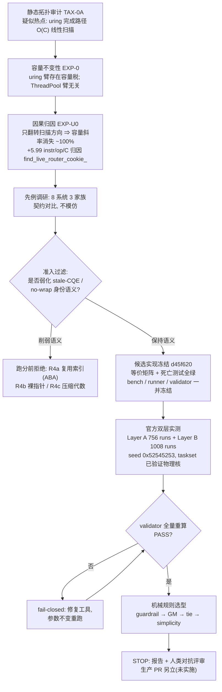
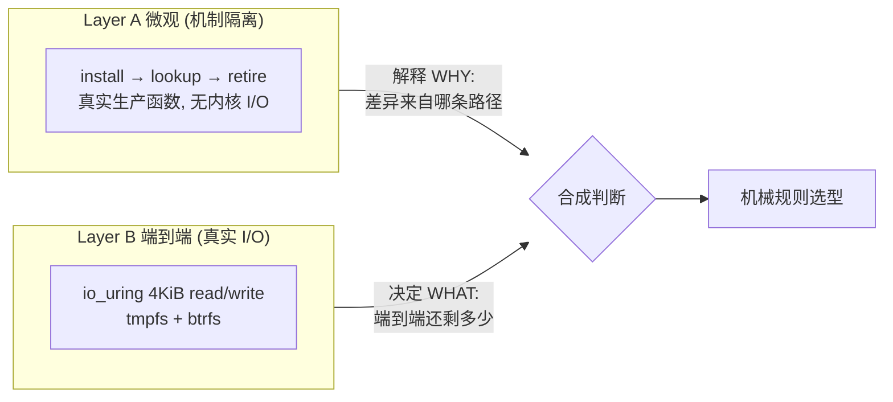
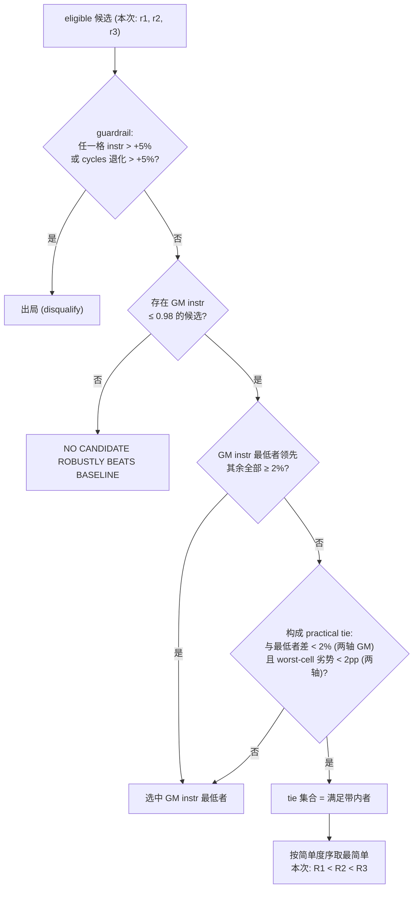
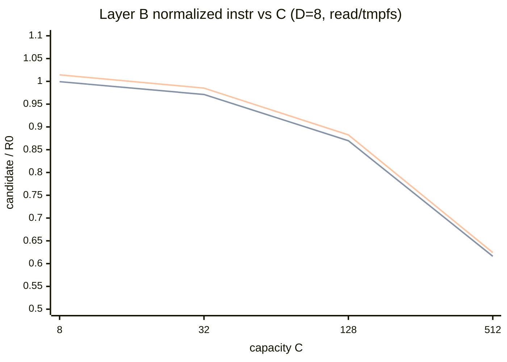
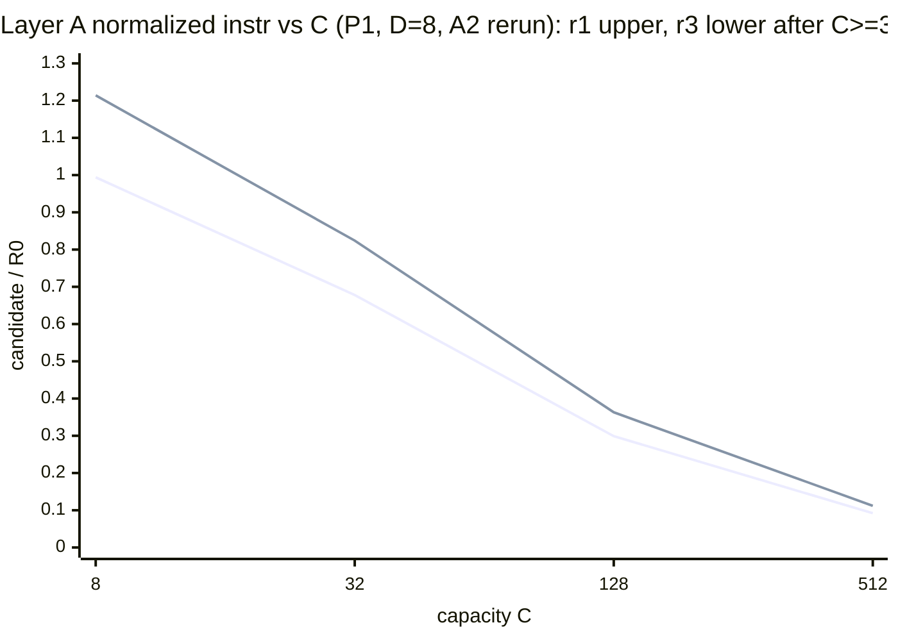
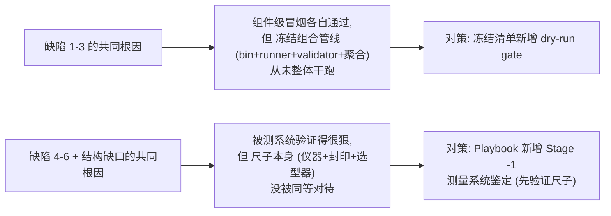
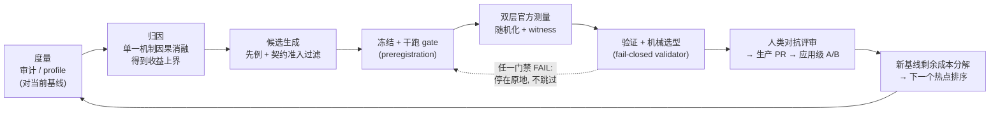

# TAX-0 / T0-U-ROUTER — 优化流程与结果复盘

面向 #227（roadmap）/ #250（TAX-0 战役）/ #255（fix-selection gate）。
本文回答六个问题：我们如何优化、如何定方案与设计 bench、结果如何统计
归一化并反哺代码、当前代码是否有提升、如何提高优化上限（含 SOTA
AI 优化方法）、流程本身有何疏漏与改进方向；§7 把整套方法沉淀为
可复用的 Playbook。

证据分级：本文所有数字均引用 runner 产出的官方工件与已验证报告，
不做无证据声明。原始报告：`TAX0-ROUTER-FIX-SELECTION.md`（selection
report）、`TAX0-EXP-U0-ROUTER-CAUSALITY.md`（归因实验）、
`TAX0-ROUTER-PRIOR-ART.md`（prior art）。

### 战役速查（campaign at a glance）

| 项 | 值 |
| --- | --- |
| 归因结论（EXP-U0） | 容量斜率 +5.99 instr/op/C，翻转扫描方向消除 ~100% ⇒ 归因 `find_live_router_cookie_`；给出的是**容量税部分的可回收上界**，不是整体优化上限（§5.1） |
| 候选集 | R0 基线 / R1 反向扫描 / R2 低位放置 / R3 有界表；R4 三形状跑分前拒绝 |
| Layer A 实测量 | 756 次 perf-stat（4 候选 ×（P0 9 格 + P1 9 格 + P2 3 方形格）× 9 reps，20 000 windows/次）；**RE-FREEZE A2 重测**（仪器修正后，见 §6.1） |
| Layer B 实测量 | 4 session × 252 rows = 1008 measured（+224 warmup），真实 io_uring，128 MiB/进程/格；**A2 未重测**（选型权威层，原始工件原样通过封印 validator） |
| 随机化 | blocked randomized rounds，seed `0x52545253`，验证器从种子重算 |
| 验证 | 封印 validator（冻结矩阵外部封印 + 双轴重算）PASS；18/18 变异拒收 + 4 类会话封印检查；perf-evidence 22/22 |
| VERDICT | ROUTER SHOOTOUT PASS — PRACTICAL TIE, SIMPLEST CANDIDATE SELECTED (R1)——A2 修正后由封印 validator 重算，结论不变 |
| 生产状态 | PRODUCTION FIX IMPLEMENTED: NO（待人类评审后另立 PR） |
| 本报告状态 | STRONG DRAFT → #256 corrective（RE-FREEZE A2 `adef692`）证据级修订完成；**待 R1 生产落地后补 Production landing 章**（§9） |

---

## 0. 背景：这次优化到底在优化什么（给没读过这段代码的读者）

### 0.1 问题是什么

Sluice 的异步文件 I/O 建立在 Linux 的 io_uring 之上。工作方式像餐厅
取餐牌：

1. 程序每向内核提交一个 I/O 请求，都塞进去一张 64 位"号码牌"
   （代码里叫 cookie，内核字段叫 user_data）；
2. 内核把 I/O 做完后，把号码牌**原样退回**；
3. 程序拿着退回的号码牌，要找回"这是哪个请求、结果该交给谁"。

第 3 步就是这次优化的一切。Sluice 的实现：所有请求的登记记录放在一个
固定数组里（好比一排储物柜），找回号码牌的办法是**从柜头到柜尾一个个
打开核对**——每收回一个 I/O 完成通知，都要这样扫一遍。

两个记号（全文通用）：

- **C（capacity，容量）**：储物柜总数，即后端允许的最大并发请求数，
  可配置为 8、32、128、512 等；
- **D（depth，深度）**：此刻**真正在飞**的请求数，日常远小于 C。

问题来了：**扫一遍的代价由 C 决定，但真正"有人的柜子"只有 D 个。**
C=512、D=8 时，每收回一个完成通知都要路过约 500 个空柜子。实测：
容量每加 1 格，每个 I/O 操作平均多花约 6 条指令（+5.99 instr/op/C）
——我们称之为"容量税"。

### 0.2 EXP-U0：先证明"就是它"，顺便知道能省多少

动手改之前，先做了一个对照实验（EXP-U0）：功能一个字不动，只把扫描
方向反过来（从柜尾扫向柜头）。为什么这样有用？这个系统发放柜子的
规律是"用完放回、再取优先拿最近放回的"（LIFO），后果是**在用的柜子
几乎总是集中在柜尾**——反向扫几乎立刻命中，扫过的柜子数就只跟 D
有关、跟 C 无关了。

实验结果：容量税消失约 100%。这证明"扫描"就是原因（因果归因）。
更重要的是它给出了**可回收上界**——注意作用域：这个上界只覆盖
"当前 router 容量相关扫描税"这一项（能省的钱 = 路过空柜子的路费），
**不是** Sluice 的整体优化上限（后者要分三层看，见 §5.1）。当 D==C
（柜子全满）时一个空柜子都没有，所以任何方案在那张表里都必然是
~0% 提升——后文数据表中 D==C 行全是 1.00 附近，正是这个预言的兑现。
为此花的时间，远比选错方向、完整实现一轮之后再发现省不了钱要便宜。

### 0.3 候选方案一句话版

| 编号 | 一句话 | 命门 |
| --- | --- | --- |
| R0 | 现状：从头扫到尾 | 空柜子都得路过 |
| R1 | 从尾往头扫 | 无——纯方向翻转（**最终胜出**） |
| R2 | 反过来发柜子，让在用柜子集中到柜头，仍从头扫 | 无——与 R1 等价的另一种改法 |
| R3 | 加一张"号码牌→柜号"查询表，一步到位 | 表要随每次提交/收回同步维护；容量小时维护费超过省下的扫描费 |
| R4（三种形状，已否决） | 把号码牌换成可复用的小编号 / 内存地址 / 编号+校验码打包 | 都会让"过期的旧回执"有机会冒领成新请求的结果（ABA），违背对使用者的硬承诺——跑分之前就否决，根本没进比赛 |

### 0.4 术语表

| 术语 | 人话 |
| --- | --- |
| cookie / user_data | 提交 I/O 时塞给内核的 64 位号码牌，完成时原样退回 |
| CQE / 完成通知 | 内核退回的一条"我做完了"记录（带号码牌和结果） |
| stale CQE | 过期回执：请求已被取消/退休之后才迟到的完成通知 |
| TAX-0 / EXP-0 / EXP-U0 | 本仓库优化战役的编号：TAX-0 = 热点审计战役总名；EXP-0 = 容量不变性实验（证明容量税只在 uring 臂）；EXP-U0 = 扫描方向对照实验（证明税来自扫描） |
| ABA | 旧号码牌被新请求冒用的经典并发错误 |
| reap（收割） | 处理完成通知、把结果交付出去的那段代码 |
| instr / cycles | CPU 指令条数 / 时钟周期，都是越少越快 |
| 归一化 | 除以同场次基线 R0：1.00=持平，0.84=省 16%，>1=更差 |
| GM（几何平均） | 把几十个格子的比值平均成一个数的方法（对百分比公平） |
| 冻结（freeze） | 正式测量前把参数和胜负规则写死并提交，防事后挑数据 |

## 1. 我们如何优化：先归因，再选型，最后才动手



三个承重原则（人话版，细节见 §0）：

1. **先搞清楚"钱在哪"，再动手省钱。** EXP-U0 用极小的代价证明：可省的
   只有"路过空柜子的路费"——由容量 C 与实际并发 D 之差决定的那部分。
   它在动手之前就预言了结果形态：柜子全满（D==C）时没有空柜子可省，
   任何方案都是 ~0% 提升；后文数据表 D==C 行全是 1.00 附近，正是预言
   的兑现。一次归因实验的成本，远小于朝错误方向完整实现一轮之后再
   发现省不了钱。
2. **"对使用者的承诺"是候选的准入条件，不是事后补丁。** 这个 I/O 子系统
   对使用者有硬承诺，例如：一条已经过期的完成回执（请求被取消后才
   迟到的通知），绝不允许被算成新请求的结果。R4 系列之所以快，恰恰
   因为把号码牌换成会复用的小编号——旧回执就有了冒领新请求的机会。
   所以它们在跑分之前就被否决，避免"先跑出好数字、再为坏语义找理由"。
3. **规则先冻结，再开测（预注册）。** 测多少格、每格跑几遍、怎么算
   胜负、谁来复核——全部在 commit d45f620 写死并推送之后，才跑正式
   数据，杜绝"跑完之后偷偷换参数挑好看结果"（与药物试验的
   preregistration 同一纪律）。

## 2. 如何确定方案、设计 bench、找到最优

### 2.1 方案确定：契约对比，而非模仿

对 liburing/fio/Tokio/tokio-uring/Monoio/Glommio/Seastar/Boost.Asio
逐一记录 user_data→completion 的解析契约，归纳出三个家族：

| 家族 | 代表 | O(1)? | 与 Sluice 契约的冲突 | 结论 |
| --- | --- | --- | --- | --- |
| 裸指针身份 | fio `io_u*`、Seastar | 是 | 内核 ABI 里塞堆地址；与 quiescent 析构、定长元数据、整数 API 冲突 | R4b 拒绝 |
| 回收式 slab 索引 | Tokio、tokio-uring、Monoio、Glommio | 是 | 释放即复用；reap 时序下 stale CQE 命中新请求（ABA） | R4a 拒绝 |
| 不回绕唯一 key | Sluice 独有 | 否（O(C) 扫描） | 无冲突——代价正是被归因的扫描 | 保留，作为 R1/R2/R3 的共同底座 |

关键事实：**没有任何被调研系统做线性扫描**；两个 O(1) 家族各自支付
Sluice 已明确拒绝的货币。由此自然产生第三种形态：保留不回绕 cookie、
加一张有界定长 cookie→index 表——这是 R3 的来源。

### 2.2 候选集与"每个候选验证一个假设"

| 候选 | 机制 | 改变量 | 隔离出的假设 |
| --- | --- | --- | --- |
| R0 | 前向扫描 + 高位 LIFO | —（比较基准） | — |
| R1 | 反向扫描 | 遍历方向 1 处 | 扫描方向 alone 值多少 |
| R2 | free list 降序播种 | 播种顺序 1 处 | 放置（布局）alone 值多少 |
| R3 | 有界开地址表 next-pow2(≥2C) | 新增派生索引 | O(1) 查找 − 维护成本 值多少 |

R1 与 R2 是**放置对偶**（等价的扫描长度，不同实现路径）；R3 刻意保留
R0 放置，使表自身的成本不被放置效应污染。

### 2.3 双层 bench 设计

打个比方：Layer A 是把零件拆下来在台架上单独测，Layer B 是整车上路
实测。只有台架，不知道装回车里还有没有用；只有路测，不知道差异来自
哪个零件。

| | Layer A 微观 | Layer B 端到端 |
| --- | --- | --- |
| 回答的问题 | 机制本身的成本差多少 | 端到端还剩多少收益 |
| 负载 | 纯 router 生命周期（install/lookup/retire），无内核 I/O | 真实 io_uring 4KiB read/write，tmpfs+btrfs，128 MiB/进程/格 |
| 公平性 | 逻辑 trace 是 (pattern, seed, D, C) 的纯函数，跨候选逐位一致 | WRITE 先填后发、事后校验、一律不 fsync；Q==D 固定主矩阵 |
| 模式 | P0 最坏序 / P1 种子随机序 / P2 满占（仅方格） | 9 reps、warmup 2、blocked randomized rounds |
| 行内证人（fail-closed） | hits==ops、misses==0、**实测**零稳态分配（全量 new/delete 计数，非零即失败） | 同左 + control/transport==0 + R3 表记账 |

> **A2 仪器修正（诚实记录）**：初版 Layer A 在每个 measured window
> 内构造 `order` vector（P1 置换还会再建一个），却把
> `steady_allocations_per_op` 硬编码为 0——"零稳态分配"当时是声明
> 而非实测，vector 分配/释放混进 perf 计数还把所有比值往 1.0 稀释。
> 对抗评审抓出后（RE-FREEZE A2 `adef692`）：缓冲外提 + 计数分配器 +
> 非零即失败，Layer A 按原参数重测；本文 Layer A 数字均为重测后
> 官方值。选型权威层 Layer B 不受影响、未重测。教训已固化进
> §6.2 #17 与 Playbook Stage -1。



设计的因果链：**Layer A 解释差异来源**（R1≡R2 逐位一致；R3 在大 C
赢、小 C 因 insert/erase 探测反而 1.21×），**Layer B 决定谁上线**
（差异被淹没，只剩容量项）。只有 Layer A 会得出"R3 最优"的错误结论；
只有 Layer B 无法解释"为什么"。

### 2.4 找到最优的机制：机械规则链



每条规则都可独立审计，禁止 opaque composite score（不可解释的综合
评分）。本次实际路径：guardrail 全过 → 无人领先 ≥2% → tie 集合
{r1,r2,r3} → 简单度选 **R1**。

> **A2 选型器修正（诚实记录）**： outright-winner 分支里"instruction
> 胜者的 cycles 不得差于 cycles 胜者 2% 以上"这条规则，代码曾写成
> `best.gm_cycles >= best_cycles.gm_cycles - 2%`——方向反了，几乎恒
> 真。A2 改为 `<= best_cycles + 2%`，并把 worst-cell 尾部检查扩到
> cycles 轴（tie 判定同样双轴化）。本次 verdict **没有**被该 bug
> 影响：无人领先 ≥2%，走的是 tie 分支；修正后由封印 validator 重算
> 官方工件，verdict 不变。教训见 §6.2 #19——**选型器代码与书面规则
> 之间需要 truth-table/property 测试**。

## 3. 结果如何统计与归一化；如何用 bench 结果指导代码优化

### 3.1 随机化与统计管线

| 方法 | 目的 | 防止的失败 |
| --- | --- | --- |
| blocked randomized rounds | 漂移落在轮间而非候选间 | 系统性时间偏差（温度/负载） |
| 顺序 = f(cells, reps, seed) | 可重算、可审计 | 事后挑顺序 |
| 验证器从种子重算并逐行比对 | 篡改即失败 | 证据造假 / 意外错位 |
| 同场次归一化 ratio=候选/R0 | 消环境漂移 | 跨 session/跨天比较 |
| 每格 9 reps 取中位数 | 稳健估计 | 离群值主导 |
| 几何平均聚合比值 | 百分比公平聚合 | 大格子主导算术平均 |
| split GM（按 fs / 按 op） | 普适性检查 | 结论只在单环境成立 |
| worst-cell 护栏 +5% | 局部退化可见 | 平均赢、局部输 |
| tie band 2% + 简单度序 | 承认测量极限 | 在噪声内编造排名 |
| 冻结矩阵外部封印（A2） | validator 内嵌冻结 manifest（候选×模式×格×sessions×reps×seed），artifact 自报 cell 集合必须与之**集合相等** | 删格/删候选/删整个 session 并同步改 derived 后静默通过 |
| 变异自测试（18/18 拒收 + 会话封印检查） | 验证器本身可信 | 验证器假绿 |

归一化的含义：**1.0000 = 与同场次 R0 完全一致；0.84 ≈ 比 R0 少 16%；
\>1 = 更差**。举个具体例子：read/tmpfs 的 D=8,C=512 格，R0 每完成一次
I/O 花约 7857 条指令，r1 为 7857 × 0.6161 ≈ 4841 条——省下的 ~3000
条正是"路过 ~500 个空柜子"的路费。

三个"越低越好"的量不是一回事，报告区分使用：

| 量 | 含义 | 用途 |
| --- | --- | --- |
| instructions/op | CPU 执行了多少条指令（逻辑工作量） | 选型的主判据（GM instr） |
| cycles/op | userspace 为这些指令花费的 CPU 周期（含 cache/分支代价） | 护栏项：不允许"指令减少但周期退化"的候选获胜 |
| wall_ns/op | 操作真实经过的时间（含内核往返与等待） | 记录在案（`wall_ns_total`）；**cycles:u 不是 wall latency** |

选拔以 GM instr 为准，cycles 作护栏——两条轴都由 validator 从原始行
独立重算并交叉核对（A2 起，微观层 cycles 亦同）。

> **A2 统计表述收窄（诚实记录）**：本文初版写过"9 reps 支撑 ±2% 级
> 分辨"——这句话与"未做功效分析"的疏漏记录自相矛盾，已删除。正确
> 说法是：**本次采用 9 reps；其对应的最小可分辨 effect size 尚未
> 通过 A/A 空转 + 功效分析标定**（rep 数 ↔ 最小可检测差异的换算要
> 等噪声底测出来才有出处，见 §6.2 #4/#6）。

### 3.2 数据曲线

Layer B（真实 io_uring，read/tmpfs，D=8 固定）：三条线几乎重合并随
容量塌缩——这正是 "practical tie" 的直观来源，也是"只剩容量项"的
直观来源（C=8 处贴着 1.0，C=512 处 ≈0.62）：



（三条线自上而下依次为 r3 / r1 / r2，肉眼不可分——即平局。）

Layer A（微观层，P1，D=8 固定；A2 重测值）：隔离层里扫描成本随 C 塌
缩得多更快，且 R3（下线）在小 C 处劣于 R1（上线）——1.21× vs 0.994：



（上线 = r1（r2 与之重合），下线 = r3。微观层 R3 在 C≥128 反超，
但 §3.4 说明这不迁移到端到端。）

### 3.3 Layer A 全量数据（normalized instr，括号内 cycles；A2 重测官方值）

| cell | P0 r1 | P0 r2 | P0 r3 | P1 r1 | P1 r2 | P1 r3 | P2 r1 | P2 r2 | P2 r3 |
| --- | --- | --- | --- | --- | --- | --- | --- | --- | --- |
| D=8,C=8 | 0.993 (1.021) | 0.993 (1.002) | 1.218 (1.139) | 0.994 (1.028) | 0.994 (0.999) | 1.214 (0.961) | 0.993 (1.016) | 0.993 (0.999) | 1.218 (1.127) |
| D=8,C=32 | 0.666 (0.794) | 0.666 (0.777) | 0.817 (0.873) | 0.678 (0.873) | 0.678 (0.844) | 0.824 (0.797) | — | — | — |
| D=8,C=128 | 0.287 (0.353) | 0.287 (0.346) | 0.352 (0.389) | 0.299 (0.447) | 0.299 (0.434) | 0.363 (0.411) | — | — | — |
| D=8,C=512 | 0.088 (0.149) | 0.088 (0.145) | 0.108 (0.164) | 0.092 (0.201) | 0.092 (0.195) | 0.112 (0.184) | — | — | — |
| D=32,C=32 | 0.994 (1.100) | 0.994 (1.002) | 0.917 (0.960) | 0.994 (1.025) | 0.994 (1.007) | 0.914 (0.831) | 0.994 (1.097) | 0.994 (1.004) | 0.917 (0.955) |
| D=32,C=128 | 0.359 (0.340) | 0.359 (0.310) | 0.325 (0.291) | 0.371 (0.391) | 0.371 (0.384) | 0.338 (0.315) | — | — | — |
| D=32,C=512 | 0.101 (0.148) | 0.101 (0.134) | 0.092 (0.125) | 0.106 (0.181) | 0.106 (0.177) | 0.096 (0.145) | — | — | — |
| D=128,C=128 | 0.997 (1.021) | 0.997 (1.010) | 0.400 (0.528) | 0.997 (1.007) | 0.997 (1.006) | 0.419 (0.566) | 0.997 (1.023) | 0.997 (1.004) | 0.400 (0.523) |
| D=128,C=512 | 0.231 (0.242) | 0.231 (0.238) | 0.093 (0.125) | 0.235 (0.262) | 0.235 (0.261) | 0.098 (0.147) | — | — | — |
| **GM (21 点)** | **0.4329** | **0.4329** | **0.3699** | | | | | | |
| **GM cycles** | 0.5184 | 0.5013 | 0.4242 | | | | | | |

读法：r1 ≡ r2 到小数第三位（放置对偶）；比值由活跃占比 D/C 决定
（D==C 无收益，C/D=64 时 ~11×）；R3 是平坦的 O(1)，大 C 最快、小 C
被表维护拖累（P2 D=8,C=8 = 1.218）。

与初版测量（PROVISIONAL 数字，已作废）相比整体略有下移
（r1 GM 0.4371 → 0.4329，r3 0.3723 → 0.3699）：A2 仪器去掉每 window
的 vector 分配后，原先混进两边的分配开销不再把比值往 1.0 稀释——
方向与评审预言一致，且不改变任何结论的形态（r1≡r2、r3 大 C 赢、
D==C 无收益）。

### 3.4 Layer B 全量数据（median instr/op 与 normalized instr）

| session | cell | R0 instr/op | r1 | r2 | r3 |
| --- | --- | --- | --- | --- | --- |
| read/tmpfs | D=8,C=8 | 4837.6 | 0.9999 | 0.9993 | 1.0143 |
| read/tmpfs | D=8,C=32 | 4979.0 | 0.9709 | 0.9712 | 0.9852 |
| read/tmpfs | D=8,C=128 | 5558.3 | 0.8702 | 0.8697 | 0.8825 |
| read/tmpfs | D=8,C=512 | 7856.6 | 0.6161 | 0.6162 | 0.6243 |
| read/tmpfs | D=32,C=32 | 4417.0 | 0.9995 | 0.9997 | 0.9945 |
| read/tmpfs | D=32,C=128 | 4993.4 | 0.8842 | 0.8842 | 0.8799 |
| read/tmpfs | D=32,C=512 | 7297.1 | 0.6052 | 0.6052 | 0.6022 |
| write/tmpfs | D=8,C=8 | 5257.7 | 0.9994 | 0.9996 | 1.0141 |
| write/tmpfs | D=8,C=32 | 5399.6 | 0.9757 | 0.9738 | 0.9868 |
| write/tmpfs | D=8,C=128 | 5977.2 | 0.8800 | 0.8789 | 0.8914 |
| write/tmpfs | D=8,C=512 | 8279.2 | 0.6346 | 0.6356 | 0.6433 |
| write/tmpfs | D=32,C=32 | 4840.4 | 0.9997 | 0.9996 | 0.9950 |
| write/tmpfs | D=32,C=128 | 5416.6 | 0.8932 | 0.8933 | 0.8892 |
| write/tmpfs | D=32,C=512 | 7721.1 | 0.6268 | 0.6267 | 0.6239 |
| read/btrfs | D=8,C=8 | 4454.0 | 0.9996 | 0.9996 | 1.0162 |
| read/btrfs | D=8,C=32 | 4598.0 | 0.9682 | 0.9682 | 0.9834 |
| read/btrfs | D=8,C=128 | 5174.2 | 0.8605 | 0.8605 | 0.8739 |
| read/btrfs | D=8,C=512 | 7478.8 | 0.5954 | 0.5954 | 0.6047 |
| read/btrfs | D=32,C=32 | 4295.3 | 0.9995 | 0.9995 | 0.9962 |
| read/btrfs | D=32,C=128 | 4871.5 | 0.8814 | 0.8814 | 0.8784 |
| read/btrfs | D=32,C=512 | 7176.1 | 0.5984 | 0.5984 | 0.5964 |
| write/btrfs | D=8,C=8 | 5749.2 | 1.0016 | 0.9972 | 1.0149 |
| write/btrfs | D=8,C=32 | 5910.0 | 0.9758 | 0.9693 | 0.9859 |
| write/btrfs | D=8,C=128 | 6465.1 | 0.8898 | 0.8896 | 0.8999 |
| write/btrfs | D=8,C=512 | 8700.1 | 0.6619 | 0.6620 | 0.6681 |
| write/btrfs | D=32,C=32 | 4909.2 | 1.0158 | 1.0046 | 1.0066 |
| write/btrfs | D=32,C=128 | 5446.6 | 0.9026 | 0.9022 | 0.9007 |
| write/btrfs | D=32,C=512 | 7724.4 | 0.6413 | 0.6352 | 0.6333 |

**战役包络（最终选型所依据的汇总数字；每个候选 28 个"格×场"比值；
Layer B 未重测——A2 之后由封印 validator 对原始工件原样重验通过）：**

| 候选 | GM instr | GM cycles | worst instr | worst cycles | guardrail | 简单度 |
| --- | --- | --- | --- | --- | --- | --- |
| r1 | 0.8397 | 0.9093 | +1.58% | +4.17% | PASS | **1（最简）** |
| r2 | 0.8387 | 0.9072 | +0.46% | +4.54% | PASS | 2 |
| r3 | 0.8443 | 0.9023 | +1.62% | +3.25% | PASS | 3 |

split GM（instr）：tmpfs 0.8385/0.8383/0.8432，btrfs 0.8409/0.8390/
0.8454；read 0.8293/0.8293/0.8349，write 0.8502/0.8482/0.8538——
同一方向在全部受测 READ/WRITE 与 tmpfs/btrfs 场次复现（不等于已证
明对任意 op/文件系统成立——受测范围之外是外推）。

### 3.5 bench 结果如何反哺代码优化（本次的实际决策链）

1. Layer B 三者 GM 差 < 1%（噪声带内）⇒ **把查找做到 O(1)（R3）并不能
   带来比"换个扫描方向"（R1/R2）更多的端到端收益**。原因：收回一个
   I/O 结果要做的事很多——与内核交互、校验、把数据交付给调用者……
   "查号码牌"只是其中一小步。这一小步已经只占几个百分点时，把它从
   "O(D) 的短扫"优化成"严格 O(1) 的查表"，整条流程几乎看不出差别。
2. 增益完全集中在容量项（D==C ≈ 0%，C=512 时 33–40% 总指令削减）
   ⇒ 任何修复的期望收益上界就是 EXP-U0 归因出的那部分——**这是
   "容量税"这一项的可回收上界，不是 Sluice 的整体优化上限**
   （上限分层见 §5.1）。
3. R3 的维护成本支付在 dispatch/reap 路径上（R1/R2 不碰）⇒ 结构
   复杂度在"片段占比小"的场景里是负资产。
4. 结论：**选能拿满全部可测收益的最简单结构** —— R1（生产实现将是
   `find_live_router_cookie_` 的一处遍历方向翻转 + 等价性测试）。
5. bench 数字同时给出生产 PR 的验收标准：落地后 uring 臂在同款矩阵上
   应复现 GM instr ≈ 0.84 / cycles ≈ 0.91 量级的包络（相对旧基线）。

## 4. 现在的代码有提升吗？

**生产代码还没有变。** PRODUCTION FIX IMPLEMENTED: NO——换句话说，
你现在检出本分支运行生产代码，行为与优化前逐字节一致；提升处于
"已证明、待上线"状态，不是"已上线"。技术上：R1 仍位于
`SLUICE_ASYNC_INTERNAL_TESTING` 编译开关之后（一个只在测试/研究构建
里打开的宏，生产构建根本不编译这些代码），生产默认路径与 master
`9bbe3a2` 逐字节一致，且有机械检测器强制"生产目标碰不到这些研究
代码"。这是任务纪律：选型结果必须先过人类对抗性评审，再另立生产 PR。

把"证明了什么"和"还没证明什么"分开说：

**已证明**（在本次 shootout 的真实 io_uring 矩阵上，相对同场次 R0）：

| 量 | 值 | 含义 |
| --- | --- | --- |
| GM instr（R1，28 格×4 场） | 0.8397 | 平均 instructions/op 减少约 **16%**（1 − 0.8397） |
| GM cycles（R1） | 0.9093 | userspace 周期减少约 **9%** |
| 高容量格（D=8, C=512） | ≈0.62 | 总指令削减约 **35–40%** |
| D==C 格 | ≈1.00 | 无收益（扫描长度本来就等于活跃数）——与 EXP-U0 上界预言一致 |
| 语义 | 等价矩阵 + 死亡测试全绿 | 可观察语义逐格不变 |

**尚未证明**：`master 生产代码 before → 真正修改 production → after`
这条路还没走。所以最终案例报告必须再有一章 **Production landing**：

```text
research winner (R1)
    ↓ production R1 PR
    ↓ canonical EXP-0 rerun（同机 before/after）
    ↓ shootout 关键格复测
    ↓ 应用级 A/B（copy pipeline 等）
    ↓ 之后才能说：Sluice 真的快了 X%
```

若 R1 生产化，在本次矩阵内可期待的验收标准：

| 场景 | 预期相对旧代码 |
| --- | --- |
| uring 臂端到端（4 fs/op session，28 格） | 指令 GM ≈ −16%，cycles GM ≈ −9% 量级复现 |
| 高容量格子（如 D=8, C=512） | 总指令 −33% ~ −40% |
| 深度==容量格子（D==C） | ≈ 0%（扫描长度本来就等于活跃数） |
| ThreadPool 臂 | 无影响（EXP-0 已证容量无关） |

## 5. 如何提高优化上限；SOTA 的 AI 优化方案与其它路线

### 5.1 上限在哪里：分三层，不要混着说

"收益上限"必须带作用域。EXP-U0 给出的只是**当前 router 容量相关
扫描税的可回收上限**——它是 Ceiling 1 里的一项，不是 Sluice 的整体
优化上限。完整的天花板至少三层：

```text
Ceiling 1（可避免税）：当前 Sluice
    → 去掉明显 avoidable 的 tax（本次容量税即此类）
    → optimized-current Sluice
       B3 − B4 = recovered avoidable tax（本次战役吃的正是这一段）

Ceiling 2（抽象税）：optimized Sluice
    → 与 competent raw io_uring（B2）对比
    → residual Sluice abstraction/runtime tax（B4 − B2）

Ceiling 3（架构税）：当前 workload architecture
    → batching / buffer strategy / 提交-完成通路重设计 /
       application-runtime co-design
    → 这一层往往最大，也最难，属于设计级而非实现级
```

对应的基线阶梯（TAX-0 系列后续实验的坐标系）：

```text
B0 blocking sync I/O
B1 raw io_uring naive
B2 competent raw io_uring   ← Ceiling 2 的参照点
B3 current Sluice           ← 本次战役起点
B4 optimized-current Sluice ← 本次战役终点（R1 落地后）
       ├── B3−B4 = 已回收的可避免税（本次：router 容量项）
       └── B4−B2 = 残余抽象税（下一战役的候选对象）
```

本次修复之后的剩余耗时去向（由 Layer B 的绝对数字可见）：syscall
提交/收割、内核态往返、数据拷贝、completion 发布路径。提高上限的
方法论与本次相同——**换一个对象，重跑同一管线**：

1. 对新基线重做 TAX-0 式拓扑审计（数字会变，热点会转移）；
2. 自顶向下（perf/flamegraph、off-CPU 分析）与自底向上（机制级
   microbench）互相验证；
3. 更大的赢面往往不是"把某操作做快"，而是"少做该操作"（例如 CQE
   批处理摊销解析成本、提交合并）——属于 Ceiling 3 而非实现级上限。

### 5.2 AI 驱动优化的 SOTA 路线（2026 分类法：按"AI 在环路里的位置"分层，不混装）

> 分类原则：把 AI、autotuning、causal profiling、PGO/layout、
> learned system policy 拆开——它们不是一回事。

**A. 最接近我们路线：LLM + evaluator + 进化/搜索闭环**

| 代表 | 是什么 | 对本战役的启示 |
| --- | --- | --- |
| **AlphaEvolve**（DeepMind） | LLM 生成候选 → 自动 evaluator 打分（正确性+性能）→ 保留优者 → 继续变异的进化闭环；已用于生产优化：Borg 调度、AI accelerator kernel、cache replacement policy、Spanner LSM compaction（写放大 −20%）、编译器/存储足迹优化 | **应排在 SOTA 第一位**。结构与我们已走完的流程同构（候选→评估→选择→下一代）；它证明该架构能出生产级收益 |
| AlphaDev（前作） | RL 发现更快的小排序例程，已进 libc++ | 适合被形式化规约包住的热点叶子函数 |

我们与 AlphaEvolve 最有趣的不同：它的 evaluator 更像 optimization
objective，而我们多一层 **semantic admission + lifecycle invariant
oracle**——候选先过语义准入（stale CQE/ABA/no-wrap 身份），再过
correctness oracle（等价矩阵/死亡测试），然后才轮到 benchmark 与
selection。跑分前拒绝 R4 三形状正是这一层的价值。

**B. 仓库级 AI 性能工程（benchmark 证据）**

| 代表 | 是什么 | 对本战役的启示 |
| --- | --- | --- |
| **PERFOPT-Bench**（2026, arXiv:2607.07744） | 把性能优化任务定义为 profile→诊断→改码→正确性→**verified speedup**→**trajectory audit** 的完整链；明确指出：只奖励 raw speedup 是危险的——agent 会利用 benchmark-specific shortcut 骗取大收益；同一 LLM 换 agent framework 结果差异显著 | 几乎逐条印证本战役的设计选择：preregistration + fail-closed validator + 语义证人 + 反 reward-hacking 门禁，不是仪式，是这类系统已被证明必需的部件 |
| **SWE-Perf**（arXiv:2507.12415） | 真实仓库性能优化任务的 benchmark；现有 LLM/agent 与 expert optimization 仍有明显差距 | AI 目前扩大的是候选空间，不是替代评审； expert-level 优化尚有距离 |

**C. Profile 引导的 LLM 优化器**

| 代表 | 是什么 | 差异 |
| --- | --- | --- |
| **SysLLMatic**（arXiv:2506.01249） | performance diagnostics + LLM + 迭代源码优化，在多个 benchmark 上做自动系统优化 | 我们不让 profiler 结果直接喂给 LLM 然后接受"更快"的 patch：中间隔着因果归因（EXP-U0 式消融）、candidate shootout 与语义权威门禁 |

**D. 编译器专用基座模型**

| 代表 | 是什么 | 作用域警告 |
| --- | --- | --- |
| **Meta LLM Compiler**（arXiv:2407.02524） | 在 LLVM IR + 汇编上训练的基础模型；code-size 优化的 fine-tune 达到 autotuning search 优化潜力的 ~77% | 这是 **code-size 任务**，不能偷换为 runtime speedup |

**E. ML 编译器策略**

| 代表 | 是什么 | 定位 |
| --- | --- | --- |
| **MLGO**（llvm.org/docs/MLGO.html） | LLVM 官方支持用 ML 模型替代启发式：inlining-for-size、register allocation eviction | "ML 替代编译器启发式"，不是 agent 改源码；与源码层优化正交、可叠加 |

**F. 非 AI，但应与 AI 串成一条链（不要叫它们 AI）**

Coz（因果剖析）、AutoFDO / Propeller / BOLT（PGO 与布局）、
OpenTuner / Bayesian optimization（参数搜索）、CompilerGym（编译器
搜索环境）、Souper / STOKE（superoptimization）、e-graph /
equality saturation（代数重写）。它们的价值是：**给 AI 搜索提供
evaluator、search space 与更底层的优化 backend**。

### 5.3 把整个战役形式化：受约束的程序搜索问题

AI 优化最清醒的表述不是"让 AI 优化代码"，而是：

```text
max  Performance(P')
s.t. Semantics(P')            = Semantics(P)
     LifecycleInvariants(P')  = true
     ResourceBounds(P')       ≤ Limit
     WorstRegression(P')      ≤ G   （预注册护栏）
```

在这个形式化里，**LLM 不是 judge，是 candidate generator**。裁判由
机械系统担任：formal/mechanical gates + tests + sanitizers +
same-work witnesses + benchmark validator + statistics。

```text
             AI
              │  hypothesis / candidate
              ▼
┌────────────────────────────────┐
│ Semantic admission（准入）      │ R4 在此被拒
│ correctness invariants /       │
│ lifecycle oracle               │
└────────────┬───────────────────┘
             │ PASS
             ▼
        benchmark（双层 + witness）
             │
             ▼
        statistics（归一化/GM/护栏/tie）
             │
             ▼
        survivor database
             │
             └──────→ AI 下一代（继续变异）
```

这正是本战役已经手工走通的环路；把它工具化（§6.3 迭代 3 的
"AI agent 闭环挂载"）就是下一步。**AI 可以大幅扩大候选搜索空间，
但不能拥有正确性和证据的裁决权**——最新性能优化 agent benchmark
（PERFOPT-Bench）对 verified speedup、trajectory audit、防 benchmark
shortcut 的强调，与本方向一致。

### 5.4 非 AI 的补充路线

持续基准化（PR 级 shadow bench）、A/A 噪声底测量、数据导向设计
（缓存布局/伪共享）、以及"删除工作"式审查（这次的结果正是例证：
最优解是把 O(C) 变成 O(D) 再到与 D 无关，而不是把扫描写得更快）。

## 6. 流程疏漏与改进方向

### 6.1 本次实际暴露的工具缺陷（6 项，全部修复；scope 见 selection report §11 与 RE-FREEZE-A2 记录）

| # | 缺陷 | 根因 | 教训 |
| --- | --- | --- | --- |
| 1 | runner 把 capacity 写进候选字段（`for c, p, d, c in cells` 遮蔽） | 变量遮蔽 + 无 schema 往返检查 | 冻结前做"runner 产出 → validator 解析"的端到端干跑 |
| 2 | validator 微观解析器无法解析任何 3 段 cell 串，且自测试从未执行过 `validate_micro` | 自测试只覆盖 shootout fixture | **每个 validate_* 路径都必须有 fixture + 变异自测试**，并把它列为冻结交付物 |
| 3 | campaign_aggregate 把"4 个 session 共享同一 (cand,D,C) 格"误判为重复 | 聚合器按单 session 心智写成 | 测试合成管线（多工件聚合），不只测单工件 |
| 4 | **Layer A 每个 measured window 都在分配内存**（order vector + P1 置换内部 vector），artifact 却硬编码 `steady_allocations_per_op: 0` | "无稳态分配"是声明不是测量；分配/释放混进 perf 计数，把所有比值往 1.0 稀释 | measured region 的 allocation=0 必须**实测**（计数分配器 + 非零即失败）；A2 重测 Layer A |
| 5 | bench `--seed` 解析遇到 `0x52545253` 在 `x` 处停止，P1 置换实际用 seed 0 | 录得的参数 ≠ 实际生效的参数（幸而所有候选共享同一流，公平性无损） | 参数要端到端验证到消费点；A2 修复并重测 |
| 6 | §25 selector 的 cycles 方向写反（`>= min − 2%` 几乎恒真）；微观 cycles derived 未从 raw 重算；tie 判定漏 cycles tail | 规则的代码实现与书面规则漂移 | 选型器需要 truth-table/property 测试；进入报告的每个指标必须 raw→derived 独立可重算 |

除缺陷外，对抗评审还发现一个**证据系统结构缺口**（比单个 bug 更
深）：validator 只对 artifact 自描述的 cell 集合做一致性校验，没有
对照外部冻结矩阵——理论上"删掉一个不漂亮的 cell/候选/整个 session
并同步改 derived"可以静默通过。A2 已修复：冻结 manifest 内嵌
validator，artifact 集合必须与之**集合相等**，并新增
删格/删候选/删会话三类 mutation 全部 fail-closed（§6.2 #18）。



### 6.2 疏漏总清单（按类盘点，含补救时机）

工具缺陷（6.1）之外，本次战役仍有以下疏漏。诚实清单的意义：
每一项都是下一次迭代的输入，而不是"结论的折扣"——它们决定的是
**结论的适用边界**与**下一步往哪走**。

| 类 | # | 疏漏 | 为什么是疏漏 | 补救时机 |
| --- | --- | --- | --- | --- |
| 覆盖 | 1 | 单机、单 CPU 架构（Haswell 世代 Xeon）、单内核、单 liburing、单编译器 | 结论的外推性未验证；另一架构上比例可能不同 | 生产 PR 前：第二环境抽样复测关键格 |
| 覆盖 | 2 | 负载谱窄：仅 4 KiB read/write；无 fsync/持久化臂、无混合块长、无多 context 并发 | 真实负载谱未覆盖；R1 在其它 op 混合下的占比可能不同 | 生产 PR 前 |
| 覆盖 | 3 | 应用级未测：copy pipeline 等真实上层负载没跑 A/B | "应用程序变快了吗"还没回答，只有 bench 层答案 | R1 生产 PR 的验收步骤 |
| 统计 | 4 | 无置信区间：GM 报到小数四位但无 CI（0.8397 ± ? 未知） | 无法定量回答"差异是否显著"，只能靠 tie band 兜底 | 下次战役前：validator 加 bootstrap CI |
| 统计 | 5 | 护栏 +5% / tie 2% 是工程判断，未经 A/A 噪声底标定 | 阈值可能过松（放过退化）或过紧（误杀真实差异） | 一次 A/A 空转实验即可标定 |
| 统计 | 6 | 无功效分析（分辨 X% 差异需要多少 reps） | reps=9 的分辨率是隐式的 | 下次战役前 |
| 统计 | 7 | 配对检验未用（同格内候选交错，配对天然可用） | 丢掉了控制格间方差的最强手段 | 随 #4 一起加 |
| 方法 | 8 | 微观层不含 cache 占驻差异（C=512 时 router 数组 vs 哈希表的驻留完全不同） | R3 的微观成绩可能被高估或低估，端到端才含此效应 | 若未来再评 R3 类候选：微观层加 cache 压力模型 |
| 方法 | 9 | "简单度"未完全机械化（R1<R2<R3 是声明的序，不是算出来的） | 平局裁决仍有主观残余（虽已预注册） | 可定义为可测量：新增状态字节数/分支数/LOC |
| 方法 | 10 | 剩余成本未分解：R1 落地后每 op ~4800 instr 去向无清单 | 下一个热点的入口目前靠"再审计一次"，起点无库存 | 生产 PR 合入后立即做（迭代 2 第一步） |
| 工具 | 11 | 管线人工步骤断续，无一条命令入口，无 CI shadow bench | 优化固定成本高，回归无哨兵 | 迭代 1 |
| 工具 | 12 | runner↔validator 无 schema 版本协商/往返校验 | cells 未解包 bug 类问题只能靠验证器兜底 | 迭代 1 |
| 工具 | 13 | R3 哈希表参数（load factor 50%、乘法移位哈希）未做参数扫描 | R3 可能被低估；但仅当 R3 类候选重现时才值得 | 条件触发 |
| 工程 | 14 | 环境/构建未容器化固定（有 env fingerprint，无 pinned toolchain 镜像） | 他人机器上的复现未证明 | 生产 PR 前 |
| 过程 | 15 | 人类对抗评审、生产 PR、#250 账本迁移都尚未发生 | 战役还没闭环；STOP 之后的事是设计内的，不是遗漏，但必须列出 | 立即 |
| 过程 | 16 | Playbook（§7）尚未入库为仓库模板/issue 模板 | 经验复用目前依赖有人读这份报告 | 随本报告入库；下个战役开 issue 时即用 |
| 证据 | 17 | measured region 本身可能包含 bench bookkeeping/分配（本次真的包含了） | 被测的不只是被测系统；"零分配"曾是写死不是实测 | **已修（A2）**：计数分配器 + 非零即失败 + 重测；固化为 Playbook Stage -1 检查项 |
| 证据 | 18 | validator 从 artifact 自描述 matrix 推 completeness，无外部权威 | 删格/删候选/删会话 + 同步改 derived 可静默通过 | **已修（A2）**：外部冻结 manifest 内嵌，集合相等 + 三类删除 mutation |
| 证据 | 19 | selector 代码与书面规则可能漂移（本次真的漂移了：cycles 方向反） | "机械选型"可能在未被测试的分支上不机械 | 迭代 1：selector truth-table/property tests 入 validator 自测 |
| 证据 | 20 | derived metric 并非所有轴都从 raw rows 重算（微观 cycles 原先漏掉） | 报告值与证据值的区别被抹掉 | **已修（A2）**：双轴全量重算 + cycles 篡改 mutation；原则——每个进报告/决策的指标必须 raw→derived 独立可重算 |
| 证据 | 21 | evidence artifact 的 git dirty/provenance 可能模糊（A2 工件记录的是 re-freeze SHA 而非原 freeze SHA） | 溯源链断了要靠口述补 | 迭代 1：binary hash + source/freeze SHA + runner SHA + validator SHA 分离记录；本次已把 supersede 链写全（§8） |

这五项（17–21）比"再多跑几台机器"更重要，因为它们属于
**证据系统本身的 correctness**——尺子不准，读数再多次也没用。

### 6.3 持续迭代路线图：把"一次优化"变成"一台飞轮"



飞轮的关键性质：每转一圈，**热点转移但流程不变**；§7 的 Playbook
就是这一圈的固定成本清单，迭代的目标是把固定成本持续降低。

**迭代 1 — 修流程自身（成本最低，下次战役前完成）**

| 任务 | 验收标准 |
| --- | --- |
| A/A 空转实验（同候选对打）测噪声底 | guardrail G、tie band T 有测量出处，替代工程判断 |
| validator 派生块加 bootstrap CI + 同格配对检验 | 报告能输出 "GM 0.8397 [CI]" 形式 |
| 冻结清单加入 dry-run gate（3.5 阶段） | 6.1 类缺陷在冻结前暴露（目标：冻结后缺陷 = 0） |
| 一条命令入口 + CI shadow 子集（关键格 × 1 候选对） | 下次战役人工步骤数减半；PR 级回归有哨兵 |
| runner↔validator schema 往返校验 + validator 覆盖率门禁 | validate_* 路径 100% 有 fixture + 变异 |

**迭代 2 — 验证 Playbook（下一次优化战役即第一次实战）**

| 任务 | 验收标准 |
| --- | --- |
| R1 生产 PR（人类评审后） | 验收标准直接引用本次包络：uring 臂 GM instr ≈0.84 量级复现 |
| 应用级 A/B（copy pipeline before/after） | 回答"应用变快了吗"，补疏漏 #3 |
| 新基线剩余成本分解表（~4800 instr/op 去向） | 疏漏 #10 清零；产出下一个热点排序 |
| 按路线图解冻下一实验（EXP-U1 / EXP-0 / EXP-2 / EXP-3） | 新战役以 §7 Playbook 开 issue |

**迭代 3 — 让迭代本身更便宜（基础设施）**

| 任务 | 验收标准 |
| --- | --- |
| 第二环境 bench 矩阵（另一台机/架构） | 关键结论双环境一致（疏漏 #1 清零） |
| 持续基准化 + 回归告警 | 趋势监控（非每 PR 门禁）长期运行 |
| 战役工具箱模板化（validator 模板、准入表模板、报告骨架生成器） | 新战役启动成本从"读历史报告模仿"降为"填模板" |
| AI agent 闭环挂载到管线上 | agent 只生成候选与假设，管线与门禁不变，人审 verdict——即 §5.2 第一行的落地 |

**流程自身的 KPI（让迭代可度量）：**

| KPI | 本次基线 | 目标 |
| --- | --- | --- |
| 冻结后工具缺陷数 | 6（§6.1：干跑前 3 + 对抗评审再抓 3——基线上修正是诚实的代价） | 0（dry-run gate + Stage -1 兜住） |
| 证据补救事件（手改/解释/supersede） | 2 次（Layer A 两次按声明链 supersede） | 0 |
| 归因→选型的人工小时 | ~1 人日级 | 迭代 1 后减半 |
| 生产 PR 验收标准来源 | 手工引用本次包络 | 每战役由 validator 自动派生 |
| 每圈飞轮的"结论→下一个热点"衔接 | 人工审计重启 | 剩余成本分解表自动产出热点清单 |

---

## 7. 可复用 Playbook：把这次优化变成模板

> 适用对象：任何"热点已定位或可定位、语义契约明确"的性能优化战役。
> 每个阶段有入口条件、产出、机械门禁与 fail-closed 条件；门禁不过
> 就停在原地，不许跳过。

### 7.1 阶段门禁清单

| # | 阶段 | 入口条件 | 产出 | 机械门禁 | fail-closed 条件 |
| --- | --- | --- | --- | --- | --- |
| -1 | **测量系统鉴定**（A2 后新增；先验证尺子，再验证被测系统） | 空的工作树 + 已知环境 | Stage -1 记录（噪声底/计数器/封印往返） | A/A 噪声底已知（或明确声明未标定）；perf counter 可用；CPU placement/governor 已记录；**bench bookkeeping 不污染 measured region（allocation 实测=0）**；runner→artifact→validator 往返 PASS；**冻结矩阵外部 manifest 存在且被 validator 内嵌** | 尺子未鉴定不许进入归因——#256 的教训正是"验证被测系统很狠，验证尺子不够" |
| 0 | 归因 | 疑似热点（审计/profile） | 因果实验报告（消融单一机制） | 消融后指标变化可复现 | 未归因不许进选型——禁止"直接改了试试" |
| 1 | 先例 | 归因完成 | 契约对比报告（每系统固定字段） | 字段齐全；对比而非模仿 | 禁止"X 这么做所以我们也" |
| 2 | 准入 | 先例冻结 | 准入表（含拒绝理由） | 拒绝必须给精确语义理由 | 弱化契约的候选 0 容忍，跑分前拒 |
| 3 | 冻结 | 准入表冻结 | 冻结 commit + DRAFT PR + 预注册参数 | correctness gates 全绿；参数/规则/工具全部入库 | 此后测量参数不可改；改了就 STOP-and-refreeze |
| 3.5 | **干跑** | 工具冻结 | smoke 全链路记录 | validator 自测全绿 **且** 端到端"产出→解析→聚合→选型"跑通 | 任何 parser/聚合 bug 阻断冻结 |
| 4 | 官方测量 | 冻结 SHA 已记录 | runner 产出工件 | 行级 witness fail-closed；随机化由种子决定 | 证据只许 runner 产出；禁止手改 JSON |
| 5 | 验证 | 工件齐全 | VALIDATION PASSED | 对照冻结 manifest 集合相等；全量重算（所有轴）与记录一致；变异自测试全拒 | 任何不一致 = FAIL，重跑不解释 |
| 6 | 选型 | 验证通过 | verdict（固定句式） | 规则链机械可审计且有 truth-table 测试 | 禁止 opaque composite；噪声内用简单度 |
| 7 | STOP | 报告完成 | handoff（SHA/PR/表/verdict） | issue 不关；生产不动 | 未过人类对抗评审不许生产化 |

### 7.2 bench 设计决策表

| 你想知道… | 用哪层 | 误用风险 |
| --- | --- | --- |
| 机制 A 是否真的是差异来源 | 归因消融（EXP-U0 式） | 不做归因直接优化 → 优化错对象 |
| 候选间机制差异有多大、为什么 | 微观层（隔离机制，固定 trace） | 只有微观层 → 隔离收益≠端到端收益（本次 R3 即例证） |
| 候选在真实负载下值多少 | 端到端层（真实 I/O、多环境格） | 只有端到端 → 无法解释差异、无法外推 |
| 结论是否跨环境稳健 | split GM（fs/op/机器） | 单环境结论上线即翻车 |
| 差异是真还是噪声 | tie band + （建议）A/A 噪声底 | 在噪声里强行排名 |

### 7.3 统计参数建议（本次取值可作起点）

| 参数 | 本次取值 | 说明 |
| --- | --- | --- |
| reps（每格重复） | 9，取中位数 | 中位数抗离群；**其最小可分辨 effect size 尚未经 A/A + 功效分析标定**（本次的 reps 数不构成任何分辨率声明） |
| warmup | 2 整轮（端到端） | 排除首跑效应；不参与统计 |
| guardrail G | +5%（instr 与 cycles 双轴） | 建议改由 A/A 噪声底标定 |
| tie band T | 2%（两轴 GM）+ 2pp worst-cell（双轴） | 低于噪声底的差异视为平局 |
| 简单度序 | 事先声明（R1<R2<R3） | 平局裁决必须预注册，防事后偏好 |
| 随机化 | blocked rounds + 固定 seed + 重算校验 | 可审计且防篡改 |
| 固定 CPU | taskset 已验证物理核 | SMT 兄弟核会互相污染 |

### 7.4 反模式对照表

| 反模式 | 本次遭遇/规避 | 对策 |
| --- | --- | --- |
| 未归因先优化 | 规避（EXP-U0 在前） | 阶段 0 门禁 |
| 用"别的系统都这么做"当理由 | 规避（契约对比） | 先例报告固定字段 |
| 跑分后发现"其实改了语义" | 规避（R4 跑分前拒绝） | 准入表 + 语义门禁 |
| 微观层成绩直接当端到端收益 | 数据在场（R3：微观 0.37 → 端到端 0.84） | 双层 bench 强制 |
| 跨 session/跨天比绝对值 | 规避（同场次归一化） | 统计管线 |
| 平均值好看、局部退化 | 护栏在位（worst ≤ +5%） | guardrail |
| 在噪声内强行排名 | 规避（2% tie → 简单度） | tie band 预注册 |
| 手改证据文件 | 规避（重跑 + supersede 声明） | runner-only 证据 |
| 验证器没测过就上岗 | **踩过**（validate_micro 零覆盖） | 3.5 干跑 gate + 变异自测试 |
| 验证通过后补调参数 | 规避（冻结先于测量） | preregistration |

### 7.5 下一次战役的最短启动清单

0. **Stage -1 测量系统鉴定**：A/A 空转测噪声底（或声明未标定）、
   allocation 实测门禁、runner→artifact→validator 往返、冻结矩阵
   外部 manifest——先验证尺子；
1. 对当前基线跑拓扑审计/profile，写下候选热点与**可证伪的归因假设**；
2. 设计单一机制消融实验，确认斜率/占比 → 得到该项成本的可回收上界
   （注意作用域，§5.1）；
3. 按阶段表 1–3 走：先例 → 准入 → 冻结（含 3.5 干跑）；
4. 按 §7.3 取统计参数（或以 A/A 噪声底重标定）；
5. 官方测量 → 验证 → 机械选型 → 报告 → STOP，等人类评审。

---

## 8. 证据索引

- 选型报告（数字出处）：`research/tax0/TAX0-ROUTER-FIX-SELECTION.md`
- RE-FREEZE A2 记录（Layer A 仪器修正 + validator 封印 + 选型器
  方向修复）：`research/tax0/TAX0-ROUTER-REFREEZE-A2.md`
- 归因实验：`research/tax0/TAX0-EXP-U0-ROUTER-CAUSALITY.md`
- 先例调研：`research/tax0/TAX0-ROUTER-PRIOR-ART.md`
- 官方工件：`docs/results/performance-attribution/tax0router-fix-micro.json`
  （Layer A，git sha = A2 `adef692`，supersede 链见 selection report
  §11）、`tax0router-fix-shootout-{read,write}-{tmpfs,btrfs}.json`
  （Layer B，未重测；kinds `tax0routermicro`/`tax0routershootout`）
- 验证器：`scripts/bench/tax0router-validate.py`（RE-FREEZE-A2 封印
  validator：冻结矩阵集合相等 + 双轴全量重算，PASS；18/18 变异拒收 +
  删格/删候选/删会话/重复/未知会话 fail-closed）、
  `scripts/bench/perf-evidence-validate.py`（22/22 结构通过）
- 分支/冻结链：`research/tax0-router-fix-shootout` @ freeze `d45f620`
  → results `aa8dff4` → RE-FREEZE A2 `adef692`（候选/后端实现自
  d45f620 起未变；其后提交只动证据工具、报告与本文件），Draft PR
  #256

## 9. 本报告的定位与下一步（结语）

**两份产出物，不要混成一个。** 本文件是仓库内部的 evidence
authority：全量表格、SHA、工件路径、validator 结果、失败史、
Playbook——它的价值是可审计。对外文章是另一份（待 R1 生产落地后
再写），骨架压缩为：①发现 +6 instr/op/C → ②怎么证明就是扫描 →
③为什么不直接改 reverse → ④为什么别人的 O(1) 不能照抄 → ⑤
R1/R2/R3 擂台 → ⑥为什么 O(1) 的 R3 在 micro 赢、production 却输 →
⑦normalization/GM/guardrail 怎么算 → ⑧R1 落地后的 before/after →
⑨我们踩坏了自己的 validator → ⑩AI 下一步如何自动化整个循环。
其中⑥和⑨最有复用价值。

**报告状态**：STRONG DRAFT → #256 corrective（RE-FREEZE A2）证据级
修订完成。数字已全部换为 A2 官方值；validator/选型器的声明已按修复
后事实重新盖章；统计表述已收窄（9 reps 不构成分辨率声明；cycles:u
不是 wall latency；EXP-U0 上界限定于容量税项）。剩余缺口 = §6.2
未清零项 + **Production landing 章**（R1 生产 PR → canonical
before/after → 应用级 A/B 之后补）。

收束成本报告的最终观点：

> **性能优化不是寻找"更快的代码"，而是一个连续缩小不确定性的过程：
> 先证明哪里值得优化，再证明谁造成成本，再过滤掉不合法的方案，再用
> 真实 workload 选择最值得采用的实现，最后重新测量剩余税。我们花了
> 很多力气验证被测系统——对抗评审提醒我们，还要先验证尺子。AI 可以
> 大幅扩大候选搜索空间，但不能拥有正确性和证据的裁决权。**
